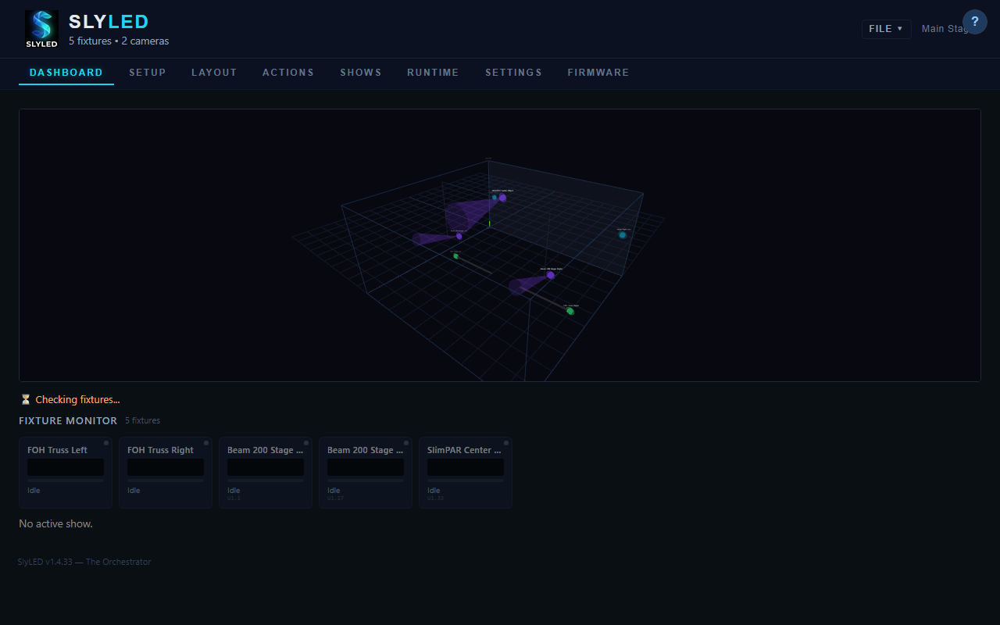

<div align="center">
  
  <h1>SlyLED</h1>
  <p><strong>Open, three-tier stage-lighting control with local-first AI calibration.</strong></p>
  <p>Design shows in 3D. Calibrate moving heads with a $30 webcam. Run everything from a browser, a phone, or a gyro puck — without the cloud.</p>
  <p>
    <a href="#quick-start"></a>
    <a href="https://github.com/SlyWombat/SlyLED/releases"></a>
    <a href="docs/USER_MANUAL.pdf"></a>
    <a href="https://github.com/SlyWombat/SlyLED/issues"></a>
  </p>
</div>

---

## What it is

A complete lighting-design and control stack that does the jobs grandMA3, Follow-Me, and Zactrack do — on consumer-price hardware that you can actually carry to a basement rig. It ships with:

- **3D show design** — arrange fixtures and cameras in a stage model, place spatial effects as objects in 3D space, and watch the preview in real time.
- **Moving-head calibration from a webcam** — no beacons, no pucks, no wands. Point a USB camera at the stage, hit Calibrate, and every mover knows where to aim within 100 mm at 3 m throw.
- **Local-first AI auto-tune** — camera exposure / gain / white balance tuned by a vision model running on your own machine via Ollama. No cloud, no API keys, no data leaves the operator.
- **Unified mover control** — one engine drives DMX from a web slider, a phone's gyroscope, or a wall-mounted ESP32 puck. Claim/release semantics so two operators never fight over the same beam.
- **Dynamic shows** — the built-in show generator adapts 14 themes to whatever fixtures you actually have, not to a pre-baked preset that demands specific gear.
- **Full bilingual documentation** — EN + FR user manual, pdf/docx/HTML, with calibration-pipeline appendices (A: cameras, B: moving heads) kept in sync with the code.

## How it looks

| Dashboard (3D runtime) | Timeline editor |
|---|---|
|  |  |

| Calibration wizard | Android operator |
|---|---|
|  |  |

## How it compares

| | SlyLED | grandMA3 | Follow-Me 3D | QLC+ |
|---|:---:|:---:|:---:|:---:|
| Approx. hardware cost (1 mover + cam) | **$250** | $60 k + | $15 k + | $50 |
| Camera-assisted mover calibration | **Yes** (auto) | Manual 3-point | Manual 3-point | None |
| Local vision AI auto-tune | **Yes** | — | — | — |
| Web UI + phone + gyro puck | **Yes** | Proprietary hw | Proprietary hw | Web only |
| 3D stage model | **Yes** | Yes | Yes | No |
| Dynamic show generator | **Yes** | No | No | No |
| Open source | **Yes** | No | No | Yes |
| Full bilingual manual | **EN + FR** | Multi | EN | Community |

## Hardware

| Role | Board | Purpose |
|---|---|---|
| Orchestrator | Windows 11 / macOS | Web UI + show design + CV pipeline |
| Orchestrator (alt) | Android (Kotlin/Compose) | Live-operator console |
| DMX bridge | Arduino Giga R1 WiFi | Art-Net → DMX512 output |
| LED performer | ESP32 / D1 Mini | WS2812B strips |
| Moving-head performer | Any Art-Net fixture | Driven through the DMX bridge |
| Camera node | Orange Pi / Raspberry Pi + USB cam | Stage vision (calibration + tracking) |

## Quick start

### Windows (recommended)

1. Download the [latest installer](https://github.com/SlyWombat/SlyLED/releases/latest) → run `SlyLED-Setup.exe`.
2. SlyLED opens in your browser at `http://localhost:8080`.
3. Go to **Setup → Discover** to pick up any performers + camera nodes already on the network.
4. Run through the 30-minute walkthrough in [the user manual](docs/USER_MANUAL.pdf) §2.

### From source

```powershell
# Windows
powershell -ExecutionPolicy Bypass -File desktop\windows\run.ps1

# macOS
bash desktop/mac/run.sh
```

### Android APK

```powershell
cd android
$env:JAVA_HOME = 'C:\Program Files\Microsoft\jdk-17.0.18.8-hotspot'
$env:ANDROID_SDK_ROOT = 'C:\Android\Sdk'
.\gradlew.bat assembleDebug --no-daemon
```

APK lands at `android/app/build/outputs/apk/debug/app-debug.apk`.

## Architecture

Three cooperating tiers, each a standalone process:

```
Orchestrator (Windows/Mac)          — design + control + CV + registry
    ├─ SPA (7 tabs, browser UI)
    ├─ Art-Net engine (40 Hz)
    └─ Vision engine (beam detect, depth, tracking)
          │
          │ UDP 4210 (binary v4 protocol)
          ▼
Performers  (ESP32 / D1 Mini / Giga Child)
    └─ LED execution, NTP-synchronised steps
          │
          │ Art-Net (UDP 6454)
          ▼
DMX Bridge  (Giga R1 WiFi) ──► DMX512 fixtures
          │
          │ HTTP/UDP
          ▼
Camera Nodes (Orange Pi / RPi) — Flask + Python CV
```

Full architecture overview in [`docs/ARCHITECTURE.md`](docs/ARCHITECTURE.md); calibration pipelines in [User Manual Appendix A](docs/src/en/appendix-a-camera-calibration.md) (cameras) and [Appendix B](docs/src/en/appendix-b-mover-calibration.md) (moving heads).

## Documentation

| | Format | Languages |
|---|---|---|
| **User manual** | [PDF](docs/USER_MANUAL.pdf) · [DOCX](docs/USER_MANUAL.docx) · [Markdown source](docs/src/en/) | EN + FR |
| **API reference** | [Markdown](docs/API.md) | EN |
| **Architecture deep-dive** | [Markdown](docs/ARCHITECTURE.md) | EN |
| **Calibration reliability review** | [Markdown](docs/mover-calibration-reliability-review.md) | EN |
| **Inline help (in-app)** | `/help` + side-panel | EN + FR (bilingual hover glossary) |

Every document is regenerated from the same markdown sources — `tools/docs/build.py --lang all --format all`. See `tools/docs/README.md` for the full build matrix.

## Development

- **Code map** — `CLAUDE.md` (project-wide conventions) + `docs/ARCHITECTURE.md`.
- **Calibration work** — active review series in `docs/mover-calibration-reliability-review.md` (appendices A/B in the user manual reference the code line-by-line).
- **Issues & roadmap** — [GitHub Issues](https://github.com/SlyWombat/SlyLED/issues). Tracker labels for in-flight epics: `mover-calibration-reliability-review-2026-04-23`, `docs-overhaul-2026-04-24`.
- **Tests** — 700+ assertions across 5 Python test suites + 5 Playwright regression suites. `python tests/regression/run_all.py` is the go-to for cross-surface coverage.

## Recognition

Submitted for **PLASA Innovation Award 2026** — the first consumer-price lighting stack with camera-assisted mover calibration and local vision AI.

## License

Private project, All rights reserved. Contact the maintainers for commercial or evaluation access.

---

<p align="center"><sub>Built with care on kitchen tables by <a href="https://electricrv.ca">ElectricRV Corporation</a>. Issues, ideas, pull requests welcome.</sub></p>
