# SlyLED User Manual — 3D Volumetric Lighting System (v1.0)

## Table of Contents
1. [Getting Started](#1-getting-started)
2. [Walkthrough: First Show in 30 Minutes](#2-walkthrough)
3. [Platform Guide](#3-platforms)
4. [Fixture Setup](#4-fixture-setup)
5. [Stage Layout](#5-layout)
6. [Stage Objects](#6-stage-objects)
7. [Creating Spatial Effects](#7-spatial-effects)
8. [Track Action](#8-track-action)
9. [Building a Timeline](#9-timeline)
10. [Baking & Playback](#10-baking)
11. [Show Preview Emulator](#11-show-preview)
12. [DMX Fixture Profiles](#12-dmx-profiles)
13. [Preset Shows](#13-presets)
14. [Camera Nodes](#14-cameras)
15. [Firmware & OTA Updates](#15-firmware)
16. [System Limits](#16-limits)
17. [Troubleshooting](#17-troubleshooting)
18. [Examples](#18-examples)
19. [API Quick Reference](#19-api)
20. [Glossary](#glossary)
21. [Appendix A — Camera Calibration Pipeline (DRAFT)](#appendix-a)
22. [Appendix B — Moving-Head Calibration Pipeline (DRAFT)](#appendix-b)
23. [Appendix C — Documentation Maintenance](#appendix-c)

---

## 1. Getting Started

SlyLED is a three-tier LED and DMX lighting control system:
- **Orchestrator** (Windows/Mac desktop app or Android app) — design shows and control playback
- **Performers** (ESP32/D1 Mini) — run LED effects on hardware
- **DMX Bridge** (Giga R1 WiFi) — output Art-Net/sACN to DMX fixtures

### Quick Start
1. Launch the desktop app: `powershell -File desktop\windows\run.ps1` (Windows) or `bash desktop/mac/run.sh` (Mac)
2. Open the browser at `http://localhost:8080`
3. Go to **Setup** tab, click **Discover** to find performers on your network
4. Go to **Layout** tab to position fixtures on the stage
5. Go to **Runtime** tab, load a **Preset Show**, click **Bake & Start**

---

## 2. Walkthrough: First Show in 30 Minutes

This walkthrough builds a complete DMX moving-head show from scratch — hardware discovery, fixture setup, layout, camera registration, actions, timeline, and playback. Every step was validated end-to-end during QA testing (issue #533). Follow in order; each step builds on the last.

**What you need:**
- SlyLED orchestrator running on Windows or Mac
- At least one DMX moving head connected via Art-Net/sACN bridge (e.g. Enttec ODE Mk3)
- At least one USB camera node on the network (Orange Pi or Raspberry Pi)
- All devices on the same LAN subnet as the orchestrator

---

### Step 1 — Launch and Create a New Project

Start the orchestrator:

```powershell
powershell -File desktop\windows\run.ps1
```

Open `http://localhost:8080` in Chrome or Edge. The SPA loads on the Dashboard tab.

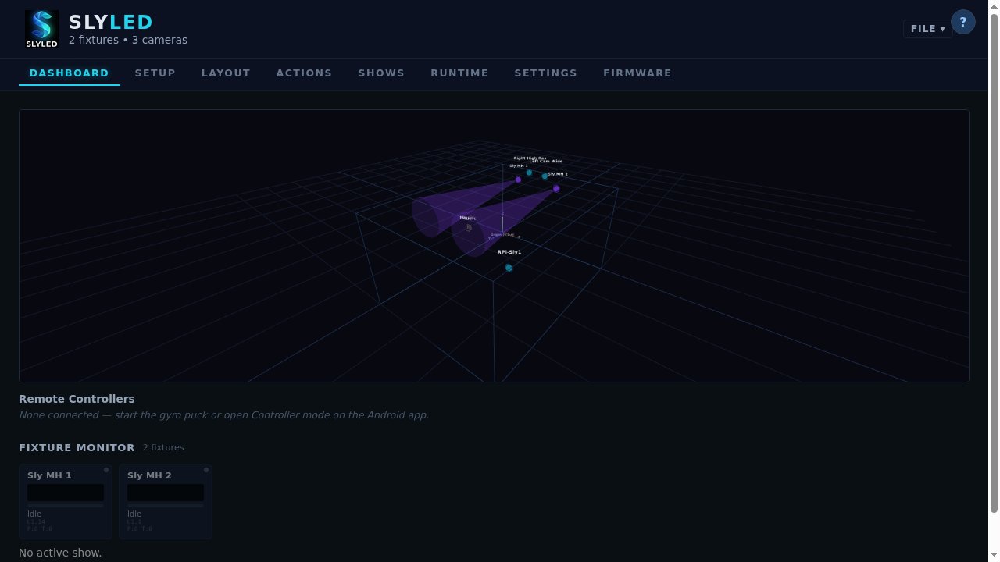

Go to **Settings** tab → **Project** → click **New Project**, then name it (e.g. "Walkthrough Show").

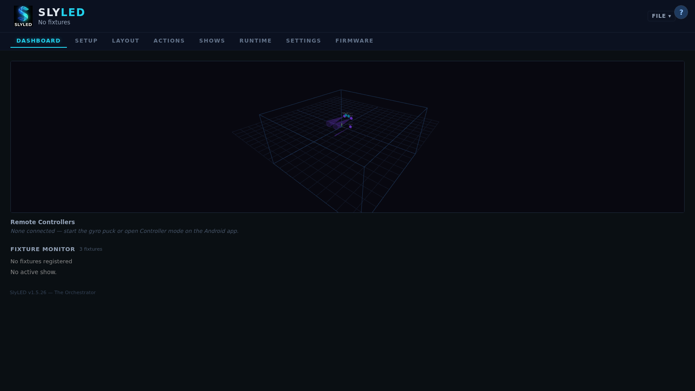

---

### Step 2 — Set Stage Dimensions

In **Settings** → **Stage**, enter the dimensions of your performance area:
- Width: 6000 mm (6 m)
- Height: 3000 mm (3 m)
- Depth: 4000 mm (4 m)

Click **Save**. The layout canvas will resize to match these dimensions.

---

### Step 3a — Discover DMX Hardware

Go to the **Setup** tab. In the **DMX Nodes** section, click **Discover Nodes**. SlyLED broadcasts an ArtPoll packet; Art-Net bridges on the network reply within 3 seconds.

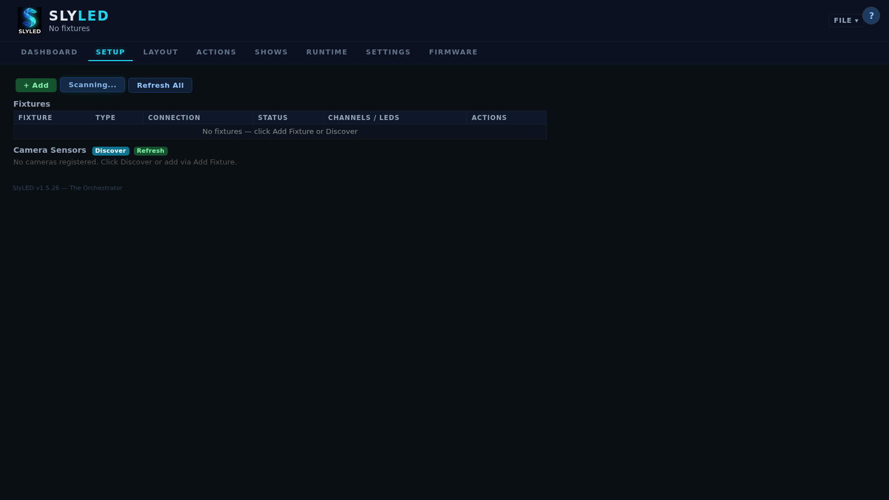

Any discovered nodes appear in the list with their IP, port, and universe count. If your bridge is not found:
- Confirm it is powered and on the same LAN subnet
- Check that UDP port 6454 is not blocked by a local firewall
- Some bridges require the Art-Net source IP to match their configured subnet

---

### Step 3b — Configure and Start the DMX Engine

Go to **Settings** → **DMX**:

1. **Universe Routing**: Set Universe 1 → your Art-Net node IP (or leave as broadcast `255.255.255.255` to reach all nodes on the subnet).
2. Click **Start Engine**. The status indicator turns green ("Running").

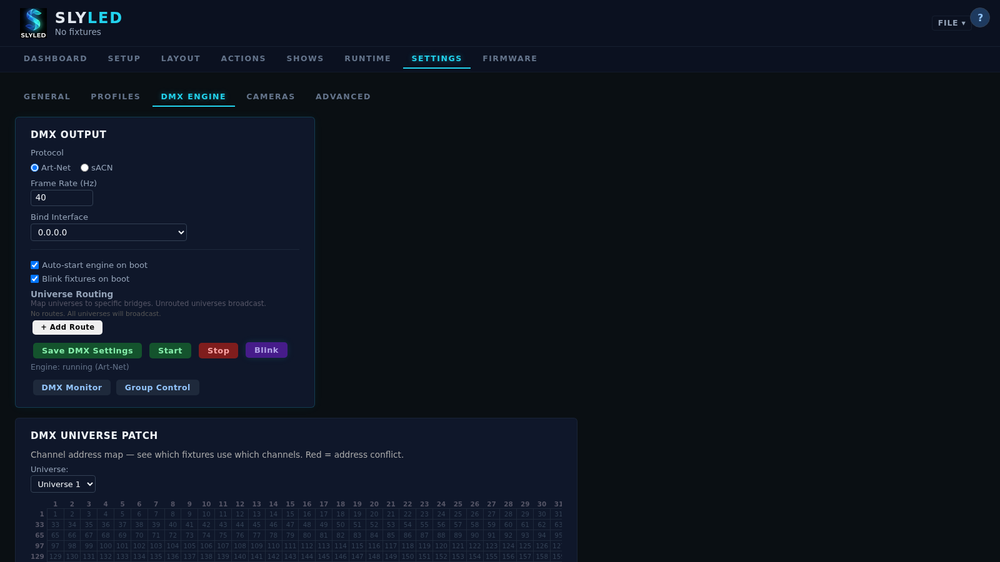
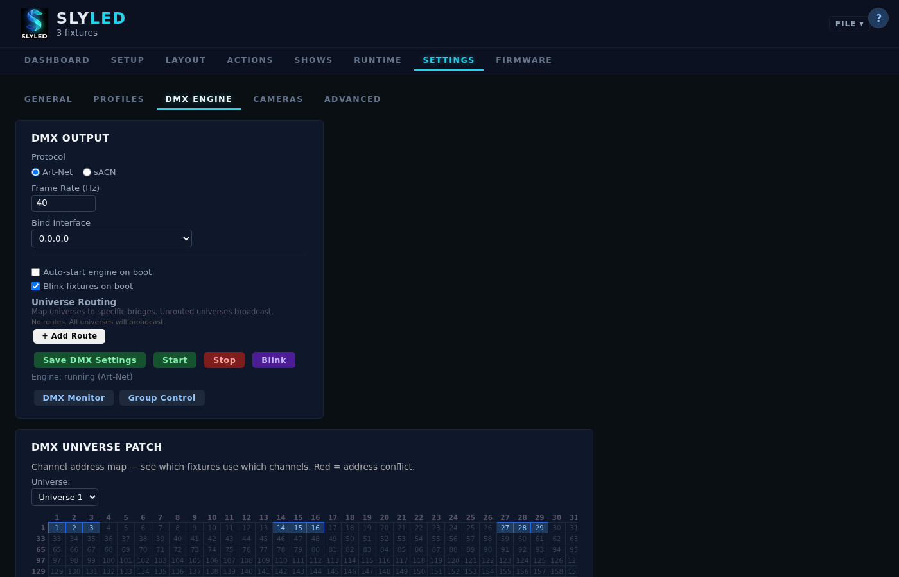

> **Important:** The engine must be running before adding DMX fixtures or running calibration. If you stop and restart the orchestrator, re-start the engine here.

---

### Step 4 — Add DMX Moving Head Fixtures

Go to the **Setup** tab → click **+ DMX Fixture**. The fixture wizard opens.

**Finding the right profile:**
1. In the **Search** box, type your fixture's name (e.g. "Sly Moving Head Super Mini")
2. Results show Local profiles first, then Community (from the shared library), then OFL (Open Fixture Library)
3. If a community profile download fails ("imported: 0"), it may contain unsupported channel types — fall back to a local generic profile or search OFL directly
4. For a generic 16-channel moving head with no exact match, search OFL for "moving head" and import the closest match

**Fixture 1 (stage left):**
- Name: `MH1 SL`
- Universe: 1, Start Address: 1
- Profile: your moving head profile
- Click **Create Fixture**

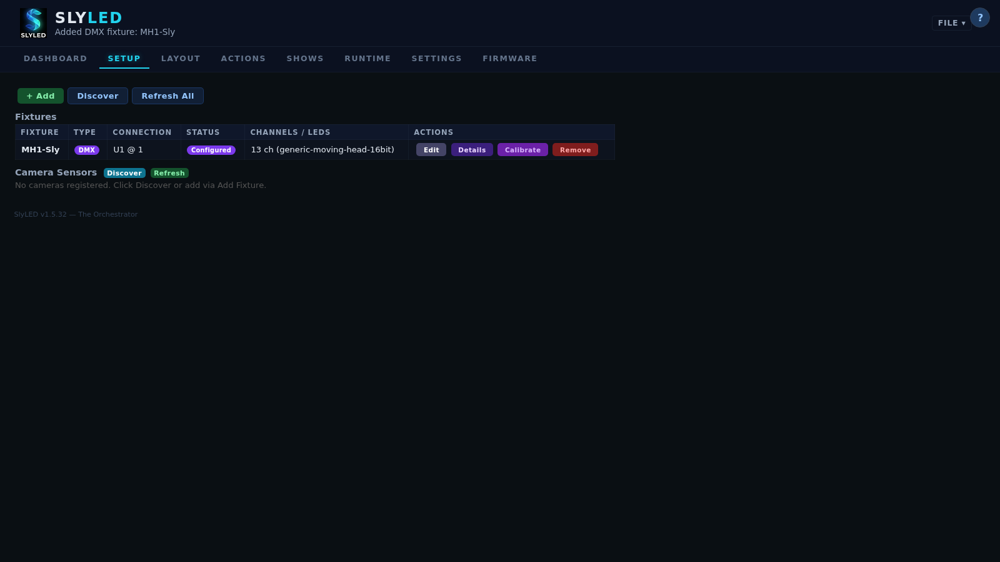

**Fixture 2 (stage right):**
- Name: `MH2 SR`
- Universe: 1, Start Address: 17
- Profile: same profile
- Click **Create Fixture**

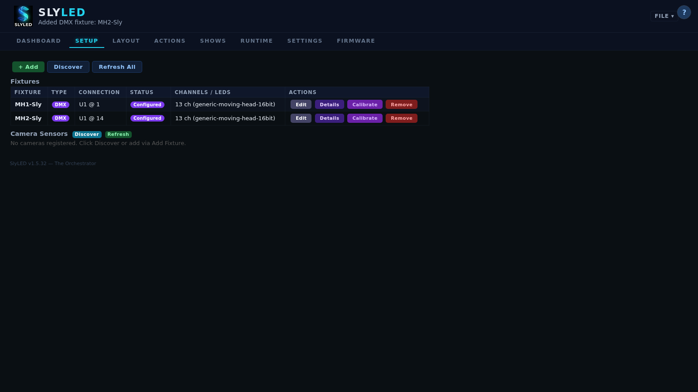

---

### Step 5 — Add a Wash or Spot Fixture

Add any additional fixtures (e.g. a 350W wash spot):
- Name: `Spot C`
- Universe: 1, Start Address: 33
- Profile: your spot/wash profile

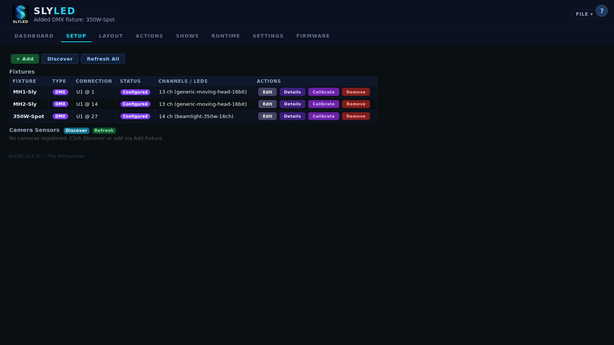

---

### Step 6 — Register Camera Nodes

Still on the **Setup** tab, scroll to the **Camera Nodes** section. Click **Discover Cameras**. Camera nodes running `slyled-cam` respond to the same UDP broadcast as performers.

Alternatively, enter the camera's IP manually and click **Add**.

**Camera 1 (left):**
- IP: your camera's IP (e.g. `192.168.10.50`)
- Name: `Cam Left`

**Camera 2 (right):**
- IP: your second camera's IP
- Name: `Cam Right`

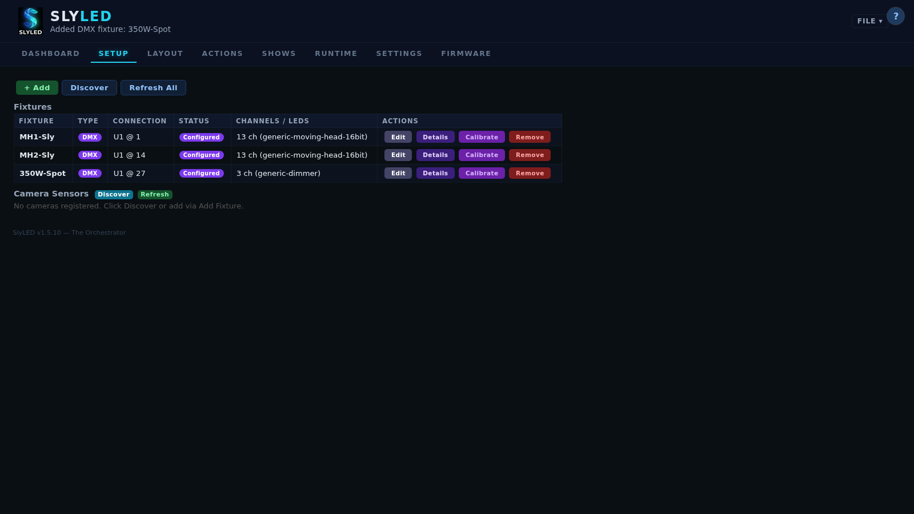

Each camera appears with online/offline status. Click **Snap** to verify the live feed.


> **Note:** Camera discover sometimes returns 0 nodes on the first broadcast due to UDP timing. If no cameras are found, wait 3 seconds and click **Discover** again. This is a known intermittency (#542) being addressed in a future release.

---

### Step 7 — Position All Fixtures on the Layout

Switch to the **Layout** tab. All added fixtures appear in the left sidebar as "unplaced."

**Place and position each fixture:**

1. Click a fixture in the sidebar to select it
2. Click on the canvas to place it, or drag from the sidebar
3. Double-click the placed fixture to open the edit dialog and enter exact coordinates

| Fixture | X (mm) | Y (mm) | Z (mm) |
|---------|--------|--------|--------|
| MH1 SL | 1500 | 3000 | 500 |
| MH2 SR | 4500 | 3000 | 500 |
| Spot C | 3000 | 3000 | 500 |
| Cam Left | 0 | 2500 | 0 |
| Cam Right | 6000 | 2500 | 0 |

Click **Save** after entering coordinates for each fixture.

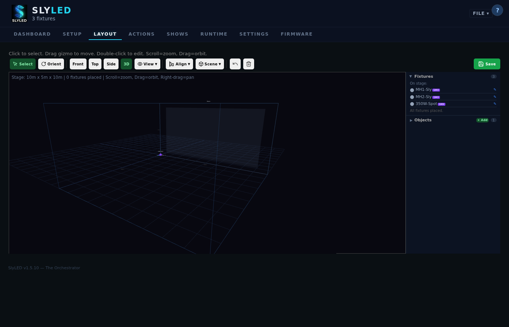


> **Tip:** Use 3D view (toggle in the layout toolbar) to visually verify that movers are elevated on the truss and aimed downward toward the stage floor.

---

### Step 8 — Add a Stage Object

Go to the **Layout** tab → click **+ Object** in the toolbar.

- **Name:** `Music Stand`
- **Type:** Prop (moving — trackable by movers)
- **Position:** X: 3000, Y: 0, Z: 2000 (center stage, at floor level, mid-depth)
- **Size:** 300 × 1200 × 300 mm

Click **Save**. The object appears as a labeled rectangle on the canvas.

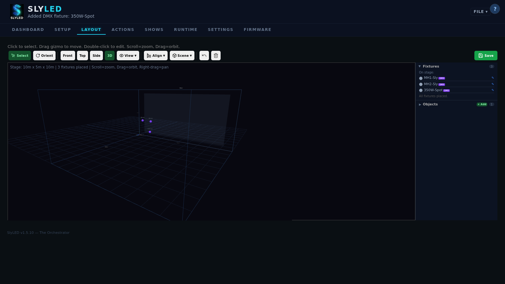

---

### Step 9 — Run Mover Calibration

Before the moving heads can accurately track positions, calibrate each one. This step requires the camera nodes to be positioned on the layout (Step 7) and the DMX engine running (Step 3b).

In the **Layout** tab, double-click `MH1 SL`. Click **Calibrate**.


- Select **Green** as the beam color (good contrast on dark floors)
- Click **Start Calibration**
- The wizard runs automatically through eight phases: warmup → discovery → blink-confirm → mapping/convergence → grid build → verification sweep → model fit → held-out parametric gate → save
- Repeat for `MH2 SR`

Calibration typically takes 2–4 minutes per head. For the complete phase-by-phase reference — what each phase does, how long it should take, what fallbacks exist, and what to check when a phase stalls — see [Appendix B — Moving-Head Calibration Pipeline](#appendix-b--moving-head-calibration-pipeline-draft).

---

### Step 10 — Create Actions

Go to the **Actions** tab. You'll create two actions: a static aim and a figure-eight sweep.

**Action 1: Aim Red (static spotlight)**
1. Click **+ New Action**
2. **Name:** `Aim Red`
3. **Type:** `DMX Scene`
4. **Colour:** Red (255, 0, 0)
5. **Dimmer:** 255
6. Click **Save Action**


**Action 2: Figure Eight (dynamic sweep)**
1. Click **+ New Action**
2. **Name:** `Figure Eight`
3. **Type:** `Track`
4. **Target Objects:** leave empty (track all moving objects)
5. **Cycle Time:** 4000 ms
6. Click **Save Action**

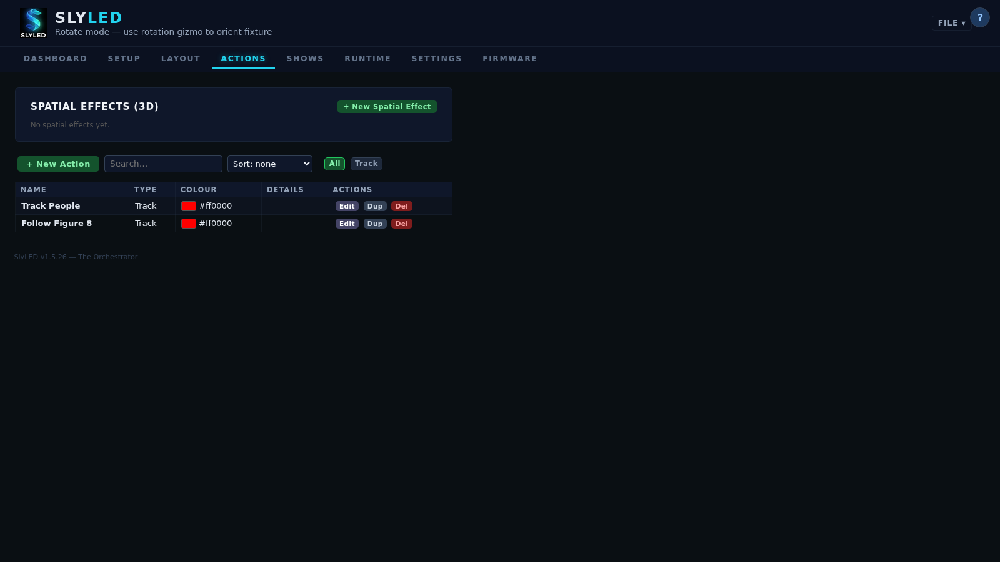

---

### Step 11 — Build a Timeline

Go to the **Runtime** tab (labeled **Shows** in some versions). Click **+ New Timeline**.

A dialog prompts for the name — enter `Walkthrough Show`. A second dialog prompts for duration — enter `120` (seconds). Click OK.

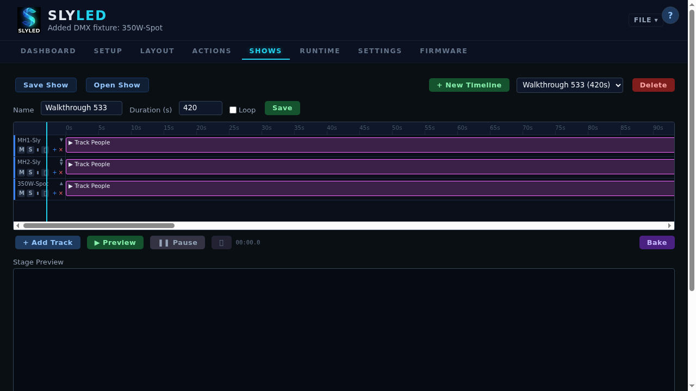

**Add tracks:**

For each fixture or group, click **+ Add Track**:
- Track for `MH1 SL` — add clip: `Aim Red` at 0s, duration 10s
- Track for `MH1 SL` — add clip: `Figure Eight` at 10s, duration 110s
- Track for `MH2 SR` — add clip: `Figure Eight` at 0s, duration 120s
- Track for `All Performers` — add clip with ambient wash color

> The Track action (type 18) evaluates in real-time during playback and doesn't need to be baked per-frame — it reads live object positions at 40 Hz.

---

### Step 12 — Bake and Start Playback

1. Click **Bake** — the engine compiles the timeline into per-fixture action sequences. Progress shows frame count.
2. Click **Start** — NTP-synchronized playback begins.

Watch the **Runtime** view:
- Beam cones animate in 3D as the timeline plays
- The figure-eight pattern moves through the stage space
- DMX output is sent via Art-Net to the physical fixtures

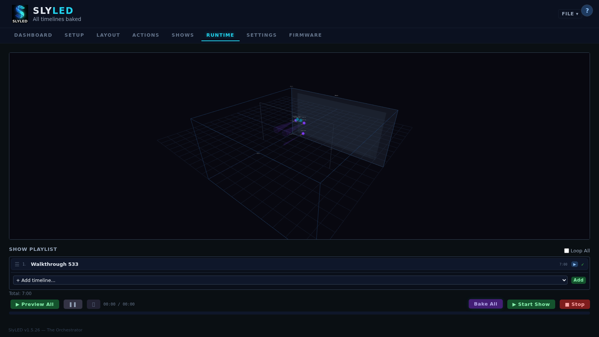

To test a blackout:
- Click **Stop**, then fire a **Blackout** action from the Settings → Group Control panel

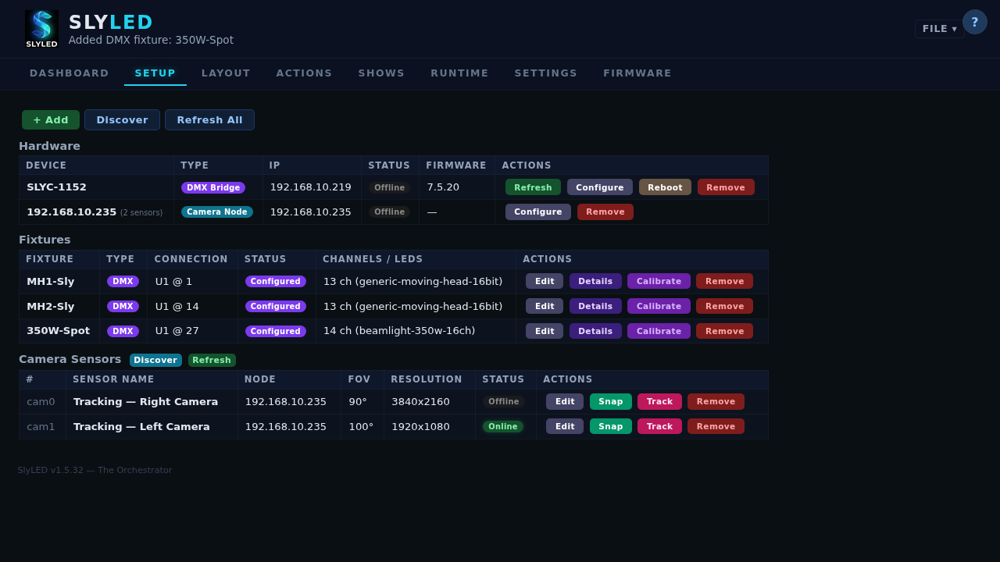

---

### Step 13 — Save the Project

Go to **Settings** → **Project** → click **Export**. A `.slyshow` file is downloaded containing all fixtures, layout positions, objects, camera registrations, calibration data, actions, and timelines.

To reload: Settings → Project → **Import** → select the `.slyshow` file.


---

### Walkthrough Troubleshooting

| Problem | Solution |
|---------|----------|
| **No Art-Net nodes discovered** | Confirm bridge is on the same subnet; UDP port 6454 not blocked |
| **DMX engine won't start** | Check Settings → DMX → verify universe routing is configured |
| **Community profile download fails** | Profile has unsupported channel types — use local or OFL profile instead |
| **Fixture position resets to 0,0,0** | Ensure `saveFixture()` completes before switching tabs; use the edit dialog Save button |
| **Camera discover returns 0** | Wait 3s and retry — first broadcast may arrive before socket is bound (#542) |
| **Calibration fails to detect beam** | Dim ambient light, verify beam color contrasts with floor, check camera can see the beam |
| **Figure Eight doesn't move heads** | Verify Track action has no `trackFixtureIds` restriction; confirm engine is running |
| **Timeline tracks missing after create** | Add tracks manually after timeline creation — they are not auto-created |

---

## 3. Platform Guide

### Windows Desktop (SPA)
The primary design and control interface. Full-featured 7-tab SPA with 2D/3D layout, timeline editor, spatial effects, DMX profiles, and firmware management.

**Launch:** `powershell -File desktop\windows\run.ps1` or run `SlyLED.exe`
**Install:** Run `SlyLED-Setup.exe` (includes system tray icon)

### Android App
Live operator tool for running shows from your phone. Connects to the desktop server over WiFi.

**Install:** Transfer `SlyLED-debug.apk` to your phone and install.
**Connect:** Scan the QR code on the desktop Settings tab, or enter the server IP and port manually.

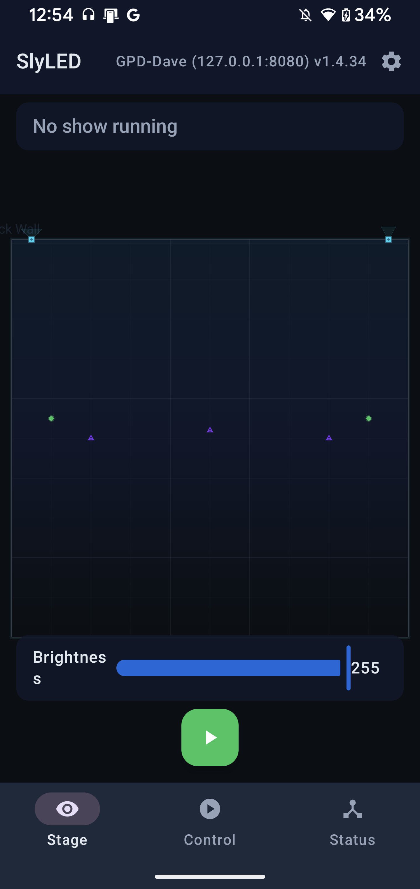

**Android Screens:**
- **Stage** — live viewport showing all fixtures (LED, DMX, cameras) with beam cones, tracked object markers, and grid floor. Pinch-to-zoom and drag-to-pan. HUD shows current show status. Play/Stop button and brightness slider at bottom.
- **Control** — one-tap timeline start, playlist with loop toggle, global brightness slider, and Pointer Mode for aiming DMX moving heads with your phone's gyroscope.
- **Status** — device monitoring (performers online/offline, RSSI, firmware), camera nodes with Track button to start/stop person tracking, and Art-Net/DMX engine status.
- **Settings** — server name, stage dimensions, dark mode, config export/import, disconnect.

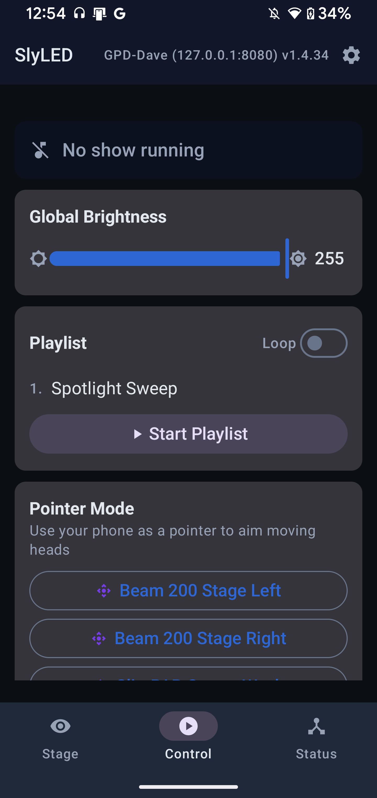
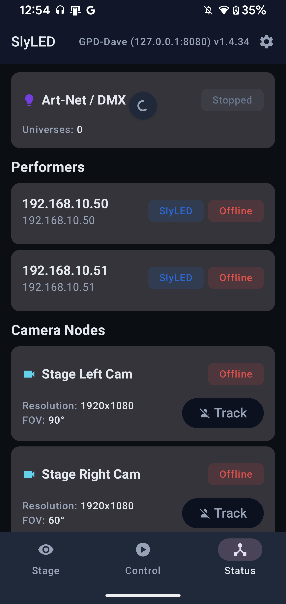

**Pointer Mode:** Select a DMX moving head on the Control tab and tap its name under Pointer Mode. Hold your phone and point where you want the light — the fixture's pan/tilt follows your phone orientation in real-time at 20 Hz. Tap Recenter to calibrate, X to exit.

### Firmware Config (ESP32/D1 Mini)
Each performer serves a 3-tab config page at `http://<device-ip>/config`:
- **Dashboard** — hostname, firmware version, active action status
- **Settings** — device name, description, string count
- **Config** — per-string LED count, length, direction, GPIO pin (ESP32)

---

## 4. Fixture Setup

### What Are Fixtures?
A fixture is the primary entity on the stage. It wraps physical hardware and adds stage-level attributes:
- **LED fixtures** — linked to a performer child, with LED strings
- **DMX fixtures** — linked to a DMX universe/address, with a profile and aim point

### Adding LED Fixtures
1. Go to **Setup** tab, click **Discover** to find performers
2. Click **Add Fixture** → select "LED" type
3. Link to a performer and configure strings (LED count, length, direction)

### Adding DMX Fixtures (Wizard)
Click **+ DMX Fixture** on the Setup tab to launch the 3-step wizard:
1. **Choose Fixture**: Search the Open Fixture Library (700+ fixtures) or create a custom fixture
2. **Set Address**: Universe, start address, and name — with real-time conflict detection
3. **Confirm**: Review all settings, click "Create Fixture"

### DMX Monitor
Settings → DMX → **DMX Monitor** opens a real-time 512-channel grid per universe. Click any cell to set a value. Color-coded by intensity.

### Fixture Group Control
Settings → DMX → **Group Control** opens a control panel for fixture groups. Master dimmer slider, R/G/B sliders, and quick color preset buttons (Warm, Cool, Red, Off).

### Testing DMX Channels
On the Setup tab, click **Details** on any DMX fixture to open the channel test panel:
- **Sliders** for every channel with live DMX output
- **Quick buttons**: All On, Blackout, White, Red, Green, Blue
- **Capability labels** show what each value range does (e.g., "Strobe slow→fast")
- Changes take effect immediately on the physical fixture via Art-Net/sACN

### Fixture Types
| Type | Description |
|------|-------------|
| **Linear** | LED strip. Pixels along a path. |
| **Point** | DMX light source with beam cone. |
| **Group** | Collection of fixtures targeted as one. |

---

## 5. Stage Layout

### 2D Canvas
The Layout tab shows a 2D front view of the stage. Stage dimensions (width × height) are set in Settings.

The layout toolbar provides: Save, 2D/3D mode toggle (shows current mode as text), Recenter, Top view, Front view, Auto-arrange DMX, Show/hide LED strings. Active toggles highlight in green.

Use the `?tab=` URL parameter for deep-linking directly to any tab (e.g., `?tab=layout`).

| Action | Desktop | Android |
|--------|---------|---------|
| **Place fixture** | Drag from sidebar | Tap fixture then tap canvas |
| **Move fixture** | Drag on canvas | Drag on canvas |
| **Remove fixture** | Double-click → Remove | Tap → Edit → Remove |
| **Zoom** | Scroll wheel | Pinch gesture |
| **Pan** | — | Two-finger drag |
| **Edit coordinates** | Double-click | Tap placed fixture |
| **Edit object** | Double-click | Tap object in list |

**What's rendered:**
- Grid lines at 1-meter spacing
- Stage dimension labels
- **LED fixtures**: Green nodes with colored string lines (direction arrows)
- **DMX fixtures**: Purple nodes with beam cone triangles toward aim point
- **Objects**: Semi-transparent rectangles with name labels (clipped to stage)
- **Aim dots**: Red circles at DMX aim points

### 3D Viewport (Desktop Only)
Toggle to 3D mode for an interactive Three.js scene:
- Orbit camera with mouse drag
- Beam cones as 3D geometry
- Draggable aim spheres for DMX fixtures
- Object planes/boxes with transparency

### Move / Rotate Mode

The layout canvas has two interaction modes, toggled with keyboard shortcuts or the toolbar button (which displays **M** or **R** to show the active mode):

| Key | Mode | Description |
|-----|------|-------------|
| **M** | Move | Drag any placed fixture to reposition it (default mode) |
| **R** | Rotate | Click a DMX fixture or camera fixture to show a compass ring; drag around the ring to aim the fixture |

**Rotate mode details:**
- A compass ring appears around the selected fixture when you enter Rotate mode
- Drag clockwise or counter-clockwise to set the horizontal aim direction
- The beam cone updates in real-time as you drag
- In 3D viewport, Rotate mode activates Three.js **TransformControls** in rotate mode — drag the colored arcs to rotate on any axis
- Press **Ctrl+Z** to undo the last move or rotation

**Typical workflow:** Place all fixtures in Move mode, then switch to Rotate mode to aim DMX moving heads and cameras toward their intended focus areas before running calibration.

### Coordinate System
- **aimPoint[0]** = X (horizontal position, mm)
- **aimPoint[1]** = Y (height from floor, mm) — used for 2D canvas vertical axis
- **aimPoint[2]** = Z (depth, mm) — used in 3D viewport only
- **canvasW** = stage width × 1000 (mm)
- **canvasH** = stage height × 1000 (mm)

---

## 6. Stage Objects

Objects represent physical elements on the stage — walls, floors, trusses, screens, and props/performers.

### Object Types
| Type | Default Mobility | Description |
|------|-----------------|-------------|
| **Wall** | Static | Back wall, stage-locked to stage width x height |
| **Floor** | Static | Stage floor, stage-locked to stage width x (depth + 1m) |
| **Truss** | Static | Lighting truss bar |
| **Screen** | Static | Projection surface |
| **Prop** | Moving | Performer, set piece, or mobile element |
| **Custom** | Moving | User-defined object |

### Stage-Locked Objects
Wall and floor objects can be locked to stage dimensions. When you change the stage size in Settings, locked objects automatically resize.

### Mobility
- **Static**: Fixed position. Cannot be tracked by moving heads.
- **Moving**: Position can change at runtime. Trackable by DMX moving heads via Track action.

### Patrol Motion
Moving objects can patrol (oscillate) back and forth during playback:
- **Axis**: Side-to-side (X), front-to-back (Z), or diagonal (X+Z)
- **Speed presets**: Slow (20s cycle), Medium (10s), Fast (5s), or Custom
- **Range**: Start/end percentage of stage dimension (default 10%--90%)
- **Easing**: Smooth (sine) or Linear

Patrol is evaluated at 40Hz in the DMX playback loop, before Track actions read object positions.

### Temporal Objects
External systems can create short-lived objects via `POST /api/objects/temporal`:
- Always in-memory (never saved to disk)
- Require `ttl` > 0 (time-to-live in seconds)
- Auto-expire when TTL elapses
- Position updates refresh the TTL
- Shown in runtime viewer with dashed outline and countdown badge
- Useful for camera tracking integration

---

## 7. Creating Spatial Effects

### Spatial Effects vs Classic Actions
- **Classic Actions** (Solid, Chase, Rainbow, etc.): Run locally on each performer. Pattern based on pixel index. When assigned to DMX fixtures, classic actions are automatically converted to DMX Scene segments with appropriate dimmer, pan/tilt defaults.
- **DMX Actions**: Control DMX-specific features directly:
  - **DMX Scene** — Set exact values for dimmer, pan, tilt, strobe, gobo, color wheel, prism
  - **Pan/Tilt Move** — Animate pan/tilt from start to end position over time
  - **Gobo Select** — Select a gobo wheel position
  - **Color Wheel** — Select a color wheel position
  - **Track** (Type 18) — Make moving heads follow moving objects in real-time (see [Track Action](#7-track-action))
- **Spatial Effects**: Operate in 3D space. A sphere of light sweeping across the stage illuminates different fixtures at different times.

SlyLED supports 19 action types in total: 14 classic LED actions plus 5 DMX/spatial actions (DMX Scene, Pan/Tilt Move, Gobo Select, Color Wheel, Track).

### Creating a Spatial Effect
Navigate to **Actions** tab → **+ New Spatial Effect**.

| Field | Description |
|-------|-------------|
| **Shape** | Sphere, Plane, or Box |
| **Color** | RGB color applied to pixels inside the field |
| **Size** | Radius (sphere), thickness (plane), or dimensions (box) |
| **Motion Start/End** | 3D positions in millimeters |
| **Duration** | Travel time from start to end |
| **Easing** | Linear, ease-in, ease-out, ease-in-out |
| **Blend** | Replace, Add, Multiply, Screen |

---

## 8. Track Action

### Track Action (Type 18)
Makes DMX moving heads follow moving objects in real-time during playback.

**How it works:**
1. Create moving objects (props/performers) on the Layout tab
2. Create a Track action on the Actions tab
3. Select target objects and configure assignment
4. During playback, the 40Hz loop computes pan/tilt for each head

**Assignment algorithm:**
- Equal heads and objects: 1:1 mapping
- More heads than objects: Spread evenly across objects
- More objects than heads (cycling mode): Cycle through objects (default 2s per target)
- More objects than heads (fixed mode): Each head locks to one target, extras ignored

**Fields:**
| Field | Description |
|-------|-------------|
| trackObjectIds | Target object IDs (empty = all moving objects, including camera-detected people) |
| trackCycleMs | Cycle time when cycling (default 2000ms) |
| trackOffset | Global [x,y,z] offset in mm |
| trackFixtureIds | Specific fixture IDs (empty = all moving heads) |
| trackFixtureOffsets | Per-fixture [x,y,z] overrides |
| trackAutoSpread | Spread multiple heads across object width |
| trackFixedAssignment | Fixed 1:1 assignment — each head gets one target, extra targets ignored |

---

## 9. Building a Timeline

1. Go to **Runtime** tab → **+ New Timeline**
2. Set name and duration
3. **+ Add Track** for each fixture (or "All Performers")
4. **+ Add Clip** to assign effects with start time and duration
5. Clips can overlap — they blend according to their effect's blend mode

---

## 10. Baking & Playback

### Bake
Compiles a timeline into minimal action instructions per performer:
1. Click **Bake** → progress shows frame count and segments
2. Click **Sync** to push instructions to performers via UDP
3. Click **Start** for synchronized NTP-timed playback

### Output
- **Action segments**: Sequences of the 19 action types (14 classic + 5 DMX/spatial)
- **LSQ files**: Raw per-pixel RGB data at 40Hz (downloadable as ZIP)
- **Preview data**: 1 color per string per second for emulator

---

## 11. Show Preview Emulator

Both desktop and Android include a real-time show preview:

### Dashboard Preview
When a show is running, the Dashboard tab shows a live stage preview canvas alongside the performer status table and playback progress bar.

### Desktop SPA
The emulator canvas appears on the Runtime tab below the timeline. Shows:
- **LED fixtures**: Colored dots along string paths with glow effects
- **DMX fixtures**: Beam cone triangles with preview-driven colors
- **Aim dots**: Red circles at aim points
- **Fixture labels**: Names below each node
- **Time counter**: MM:SS elapsed / total

### Android App
The `ShowEmulatorCanvas` card shows:
- Same LED string dots and DMX beam cones as desktop
- Objects rendered as background rectangles
- Preview colors update every second during playback

### Spatial Field Visualization
During show playback, the runtime emulator renders the active spatial effects moving across the stage:
- **Sphere**: translucent colored circle moving along the motion path
- **Plane**: translucent horizontal or vertical band sweeping across the stage
- **Box**: translucent rectangle at the effect's current position
- Effect names shown as labels at their current position
- Updates every frame, synced to playback elapsed time

### DMX-Only Rigs
The emulator correctly renders DMX-only setups (no LED performers). Static purple beam cones always visible, with live colors when a show is running.

---

## 12. DMX Fixture Profiles

### Built-in Profiles
| Profile | Channels | Features |
|---------|----------|----------|
| Generic RGB | 3 | Red, Green, Blue |
| Generic RGBW | 5 | Red, Green, Blue, White, Dimmer |
| Generic Dimmer | 1 | Intensity only |
| Moving Head 16-bit | 16 | Pan, Tilt, Dimmer, Color, Gobo, Prism |

### Profile Editor — Step-by-Step (#527)

The fixture profile editor maps a DMX channel to what it *does* — this
red channel here, that pan channel there — and records any behaviour
the fixture firmware expects on each channel (gobo slot ranges, strobe
rate curves, colour-wheel slots). Once a profile exists the whole
orchestrator can drive that fixture with semantic calls like "set
colour to red" or "aim at stage (1150, 2100)" instead of raw DMX.

#### 1. Where to find it

Settings tab → **Profiles** sub-section. The list view shows every
built-in and custom profile, filterable by category
(par / wash / spot / moving-head / laser / effect). Each row has:

- **Edit** — opens the editor on the selected profile (disabled for
  built-in profiles; clone first if you want to diverge from one).
- **Clone** — copy a built-in or community profile into your local
  library under a new id; the copy is editable.
- **Share** — upload a custom profile to the community server
  (requires an internet connection, rate-limited per IP).
- **Delete** — remove a custom profile (built-in profiles cannot be
  deleted).

Click **New Profile** to start a fresh editor on a blank profile. You
can also reach the editor from any DMX fixture card by clicking the
profile name under the fixture's **Edit Profile** button.

#### 2. Top-level fields

- **Name** — operator-visible label shown in fixture cards + the
  profile picker.
- **Manufacturer** — free text; used for grouping in the Community
  browser and for dedup matching.
- **Category** — `par`, `wash`, `spot`, `moving-head`, `laser`,
  `effect`, `other`. Drives the preset-show generator.
- **Channel count** — total DMX slots the fixture uses. Auto-updated
  as you add channels; can also be set explicitly.
- **Colour mode** — `rgb`, `cmy`, `rgbw`, `rgba`, `single` (monochrome
  dimmer), or `color-wheel-only`. Drives how the show engine resolves
  a requested colour.
- **Pan range** / **Tilt range** — maximum mechanical sweep in
  degrees. Used by mover calibration to normalise DMX→angle.
- **Beam width** — degrees of the beam cone. Used for 3D beam-cone
  rendering and for marker-coverage prediction.

#### 3. Channels

Every channel has:

- **Offset** — 0-based channel number within the fixture's address
  range (not the universe). A 16-channel fixture has offsets 0..15.
- **Name** — operator-facing label. Matches the fixture's
  documentation.
- **Type** — the *semantic* role. Common types:
  `pan`, `pan-fine`, `tilt`, `tilt-fine`, `dimmer`, `red`, `green`,
  `blue`, `white`, `amber`, `uv`, `color-wheel`, `gobo`, `prism`,
  `focus`, `zoom`, `frost`, `strobe`, `macro`, `reset`.
  The type is what downstream code reads when it wants to control
  "the dimmer" — you can rename the channel but the type is the
  contract.
- **Bits** — 8 (one DMX slot) or 16 (two slots, coarse at this
  offset + fine at offset+1). Use 16-bit for pan and tilt if the
  fixture supports it; everything else is typically 8-bit.
- **Default** — the value the engine writes when no effect is
  overriding the channel. Leave blank for "set to 0 at idle." Use a
  non-zero default for channels the fixture needs lit to function
  (e.g. a lamp-on macro, shutter-open slot).

#### 4. Capabilities

Each channel can carry a list of capabilities that describe what DMX
value ranges mean to the fixture:

- **WheelSlot** — colour or gobo wheel position. Range `[min, max]`,
  label (`"Red"`, `"Open"`, `"Pattern 3"`), and — for colour wheels —
  an optional **`color` hex** like `#FF0000`. The orchestrator's
  RGB→slot resolver (used by show bake and mover calibration) picks
  the closest-matching slot by Euclidean distance in RGB space, so
  every colour-labelled slot needs the hex filled in. Without the
  hex the RGB pipeline silently falls through to slot 0 (white/open),
  which is the #624 footgun.
- **WheelRotation** — rotating-wheel range for cycle effects
  (`"CW cycle fast-slow"`, `"CCW cycle slow-fast"`).
- **WheelShake** — jitter ranges on gobo wheels.
- **ShutterStrobe** — a range with a `shutterEffect` of `"Open"`,
  `"Closed"`, or `"Strobe"`. The orchestrator's "open the shutter
  during calibration" helper walks these caps to find the right DMX
  value.
- **Prism**, **PrismRotation**, **Effect**, **NoFunction** — same
  pattern: `range`, `label`, optional type-specific fields.

Each capability row lets you pick the type from a dropdown, set
`min`/`max`, add a label, and (for `WheelSlot` on colour wheels) a
colour hex swatch.

#### 5. Saving + sharing

- **Save** persists the profile to `desktop/shared/data/dmx_profiles/`
  (gitignored per-install) and updates the SPA list.
- **Share to Community** uploads the profile JSON to the electricrv.ca
  server. The server dedups by channel-hash, so submitting a profile
  someone else already uploaded produces a "this fixture is already
  covered" response with a link to the existing entry.
- **Export** downloads every custom profile as a single JSON bundle.
  Use this to transfer a profile library between installs without
  going through the community server.

#### 6. When to create your own vs import from OFL

- **Import from OFL** first — 700+ fixtures are already there, and
  importing is one click. The Open Fixture Library volunteers have
  spent years curating the capability lists.
- **Clone and edit** if the fixture is close to an OFL profile but a
  channel or two differs (firmware update, mode variant).
- **Create from scratch** only when the fixture is genuinely not in
  OFL and not in the community. When you're done, share it so nobody
  else has to.

### Legacy quick-reference

Settings tab → **Profiles** → **New Profile** or **Edit**:
- Define channels with name, type (red/green/blue/dimmer/pan/tilt/etc.), default value
- Set beam width, pan/tilt range for moving heads
- Import from Open Fixture Library (OFL) JSON format

### Browsing the Open Fixture Library
Click **Search OFL** in Settings → Profiles to access 700+ fixtures from the [Open Fixture Library](https://open-fixture-library.org):

**Search**: Type a fixture name, manufacturer, or keyword → results show with Import buttons.

**Browse by Manufacturer**: Click **Manufacturers** to see all brands with fixture counts. Click a manufacturer to see all their fixtures. Click **Import All** to import every fixture from that manufacturer at once.

**Bulk Import**: From search results, click **Import All** to import all matching fixtures. From a manufacturer page, click **Import All** for the entire brand catalog.

Multi-mode fixtures create one SlyLED profile per mode automatically.

### Community Fixture Library
Share and discover profiles with other SlyLED users:

1. **Browse**: Click **Community** in Settings > Profiles to search, view recent, or popular
2. **Download**: Click Download — imported to your local library immediately
3. **Share**: Click **Share** on any custom profile to upload to the community
4. **Dedup**: Server detects duplicates by channel fingerprint (same channels = same fixture)
5. **Unified search**: When adding a DMX fixture, search queries Local + Community + OFL at once

Community server: https://electricrv.ca/api/profiles/

### Import/Export
- **Community**: Share/download profiles with other users
- **Search OFL**: Browse, search, and bulk import from the Open Fixture Library
- **Paste OFL**: Paste raw OFL JSON for offline fixtures
- **Import Bundle**: Load previously exported profile pack
- **Export**: Download all custom profiles as JSON
- **Built-in profiles** cannot be edited or deleted

---

## 13. Preset Shows

14 pre-built shows available from Runtime tab → **Load Show** → **Presets**:

| Preset | Description |
|--------|-------------|
| Rainbow Up | Rainbow plane rising floor to ceiling |
| Rainbow Across | Rainbow sphere sweeping left to right |
| Slow Fire | Warm fire effect on all fixtures |
| Disco | Pastel twinkle sparkles |
| Ocean Wave | Blue wave sweep with teal wash |
| Sunset Glow | Warm breathe with golden sweep |
| Police Lights | Red strobe with blue flash sweep |
| Starfield | White sparkles on dark background |
| Aurora Borealis | Green curtain with purple shimmer |
| Spotlight Sweep | Warm orb — moving heads track it |
| Concert Wash | Magenta flood + amber tracking spot |
| Figure Eight | Crossing orbs — heads trace X paths |
| Thunderstorm | Lightning strikes — heads chase bolts |
| Dance Floor | Fast orbiting spots — rapid tracking |

---

## 14. Camera Nodes

Camera nodes are Orange Pi or Raspberry Pi single-board computers with **USB cameras**. They provide live snapshots and AI-powered object detection for stage setup.

> **Note:** Only USB cameras are supported. Pi CSI ribbon cameras (e.g. Pi Camera Module, Freenove FNK0056) are not supported in v1.x. Use USB webcams instead.

### Adding a Camera Node
1. Flash an Orange Pi with the supported OS image
2. Connect it to the same WiFi network as the orchestrator
3. In the **Firmware** tab, configure SSH credentials (default: `root` / `orangepi`)
4. Click **Scan for Boards** to find the device on the network
5. Click **Install** to deploy the camera firmware via SSH+SCP

### Camera Config Page
Each camera node serves a local web interface at `http://<camera-ip>:5000/config`:
- **Dashboard** — board info, per-camera cards with live capture and detection
- **Settings** — device name, reboot, factory reset

### Snapshots
Click **Capture Frame** on any camera card to take a JPEG snapshot. Uses OpenCV for fast capture with fswebcam fallback.

### Object Detection
Click **Detect Objects** (purple button) to run YOLOv8n AI detection on the current camera frame:
- Bounding boxes with labels and confidence percentages are drawn on a canvas overlay
- **Threshold slider** (0.1–0.9) — filter by detection confidence
- **Resolution** (320/640) — lower is faster, higher is more accurate
- **Auto checkbox** — continuously detect every 3 seconds
- Typical latency: ~500ms capture + ~500ms inference on Orange Pi 4A

Detection requires the YOLOv8n ONNX model (`models/yolov8n.onnx`, 12 MB), which is uploaded automatically during firmware deployment.

### Camera Deploy
The deploy process (from the **Firmware** tab) uploads all camera files via SCP:
- `camera_server.py`, `detector.py`, `requirements.txt`, `slyled-cam.service`
- `models/yolov8n.onnx` (detection model)
- Installs system packages (`python3-opencv`, `python3-numpy`, `v4l-utils`)
- Installs Python packages (`flask`, `zeroconf`, `onnxruntime`)
- Sets up the `slyled-cam` systemd service for auto-start on boot
- Shows version comparison and supports force-reinstall

### Multi-Camera Support
Each node can host multiple USB cameras. The firmware auto-detects connected cameras and filters out internal SoC video nodes. Each camera gets its own card in the config page with independent capture and detection controls.

### Environment Scanning
The **Scan Environment** button on the Layout toolbar captures a 3D point cloud of the physical space:
1. Each positioned camera captures a frame and runs depth estimation
2. Pixels are back-projected to 3D using camera FOV and depth
3. Point clouds from all cameras are merged into stage coordinates
4. **Surface analysis** identifies floor, walls, and obstacles (pillars, furniture)
5. Detected surfaces can be automatically created as named stage objects

The point cloud can be viewed as colored dots in the 3D viewport (toggle with the point cloud button). This gives a visual map of the physical environment that the lights will illuminate.

### Per-Camera Fixtures
Each USB camera sensor on a camera node registers as a **separate fixture** in the layout. A node with 2 cameras creates 2 fixtures, each with:
- Its own position on the stage (independently placeable)
- Its own FOV and resolution
- Its own rest direction vector (cyan arrow)

### Tracking Configuration

Each camera fixture has per-camera tracking settings accessible from the **Edit** dialog on the Setup tab. These control what the camera detects and how it behaves during live tracking.

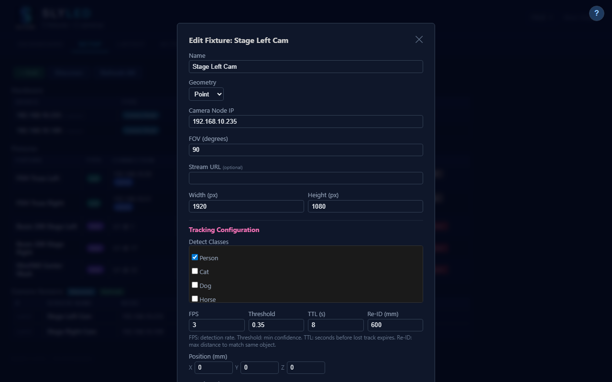

**Detect Classes** — Multi-select the object types to track. The YOLOv8n model supports 80 COCO classes; 16 stage-relevant classes are available:

| Category | Classes |
|----------|---------|
| People | Person |
| Animals | Cat, Dog, Horse |
| Props | Chair, Backpack, Suitcase, Sports Ball, Bottle, Cup, Umbrella, Teddy Bear |
| Vehicles | Bicycle, Skateboard, Car, Truck |

By default only **Person** is selected. Adding more classes has zero performance impact — YOLO always evaluates all classes in one pass and filters afterward.

**Parameters:**

| Parameter | Default | Range | Description |
|-----------|---------|-------|-------------|
| FPS | 2 | 0.5–10 | Detection frames per second. Higher = more responsive but more CPU on the camera node. |
| Threshold | 0.4 | 0.1–0.95 | Minimum confidence to accept a detection. Lower = more sensitive but more false positives. |
| TTL (s) | 5 | 1–60 | Seconds before a lost track expires and its stage marker is removed. |
| Re-ID (mm) | 500 | 50–5000 | Maximum distance to match a new detection to an existing tracked object. |

**Starting tracking:** Click the **Track** button on the Setup tab (next to Snap) or in the fixture edit modal on the Layout tab. The camera node begins continuous detection using your configured classes and parameters. Detected objects appear as labeled markers in the 3D viewport.

### Mover Calibration

The mover calibration wizard builds an interpolation grid that maps every stage position to the exact pan/tilt angles required for a DMX moving head. A positioned camera node is required.

**Prerequisites:**
- At least one camera node positioned on the Layout tab
- Art-Net engine running (`POST /api/dmx/start`)
- Moving head fixture placed on the layout with its profile configured

**Starting calibration:**
1. Go to the **Layout** tab and double-click a DMX moving head fixture
2. Click the **Calibrate** button in the fixture edit dialog
3. Choose a beam color — options are Green, Magenta, Red, Blue (pick one that contrasts with your stage)
4. Click **Start Calibration** — the wizard takes over automatically

**What happens automatically:**
1. **Discover** — the head sweeps through a coarse pan/tilt grid; the camera detects where the beam lands on the stage floor
2. **Map visible region** — the pan/tilt range that keeps the beam within the camera's field of view is identified
3. **Build interpolation grid** — the head systematically samples points across the visible region; at each point the camera records the exact stage coordinates

**Progress:** A real-time progress panel shows the current phase, percentage complete, and a live thumbnail from the camera.

**Result:** The interpolation grid is saved to the fixture and used automatically by the Track action and any Pan/Tilt Move actions to convert stage-space coordinates into hardware pan/tilt values.

> **Tip:** Run calibration in dim ambient lighting so the beam is clearly visible to the camera. Use the **Beam Color** option that gives the highest contrast against your floor surface.

### Fixture Orientation Test

Before running full calibration, use the orientation test to confirm pan and tilt are wired in the expected directions. Incorrect orientation causes calibration to converge on wrong positions.

**Running the test:**
1. Double-click a DMX moving head on the Layout tab to open the fixture edit dialog
2. Click **Orientation Test** (below the channel map)
3. The fixture moves through four probe positions: pan left, pan right, tilt up, tilt down
4. Watch the physical beam and compare with the on-screen arrows showing expected direction

**Interpreting results:**
| Observation | Action |
|-------------|--------|
| Beam matches arrows | Orientation is correct — proceed to calibration |
| Pan moves opposite direction | Enable **Invert Pan** in the fixture settings |
| Tilt moves opposite direction | Enable **Invert Tilt** in the fixture settings |
| Pan and tilt axes are swapped | Enable **Swap Pan/Tilt** in the fixture settings |

**Saving:** After adjusting orientation flags, click **Save** in the fixture edit dialog. The flags are stored with the fixture and applied automatically during all subsequent calibration and playback.

---

## 15. Firmware & OTA Updates

### USB Flash
1. Go to **Firmware** tab
2. Select COM port and firmware binary
3. Click **Flash** — progress shows percentage

### OTA (Over-the-Air)
1. Set WiFi credentials on the Firmware tab
2. Click **Check for Updates** — shows per-device version comparison
3. Click **Update** on any outdated performer
4. Device reboots automatically after flash

### Firmware Registry
`firmware/registry.json` lists available binaries with board type and version. The OTA system compares the registry version against each performer's reported firmware.

---

## 16. System Limits

| Resource | Tested | Recommended Max |
|----------|--------|-----------------|
| DMX fixtures | 120 | 500+ |
| LED performers | 12 | 50 |
| Total fixtures | 132 | 500+ |
| Universes | 4 | 32,768 (Art-Net) |
| LEDs per string | 65535 | uint16 addressing |
| Strings per child | 8 | Protocol constant |
| Timeline clips | 50 | 200+ |
| Preset shows | 14 | Built-in (expandable) |
| API response (132 fixtures) | < 1ms | Sub-millisecond |
| Memory (132 fixtures) | 46 MB | Flat scaling |
| Network (132 fixtures) | 221 KB | Per test cycle |

See `docs/STRESS_TEST.md` for full benchmark data.

---

## 17. Troubleshooting

| Problem | Solution |
|---------|----------|
| **Runtime view empty** | Check fixtures are positioned in Layout. DMX-only rigs now render (v8.1 fix). |
| **Beam cone wrong direction** | aimPoint[1] is height (Y), not depth (Z). Check aim point values. |
| **Android JSON crash** | Update to v8.1 — aimPoint changed from Int to Double. Factory reset: now requires confirm header. |
| **Save Show error** | Update to v8.1 — `/api/show/export` endpoint was missing. |
| **Firmware check fails** | Update to v8.1 — registry.json UTF-8 BOM and dict iteration bugs fixed. |
| **3D viewport not rendering** | Use Chrome/Firefox/Edge with WebGL support. |
| **Performers not syncing** | Check all devices on same WiFi network. Refresh in Setup tab. |
| **Canvas wrong size** | Stage dimensions (Settings) drive canvas size: canvasW = stage.w × 1000. |

---

## 18. Examples

### Example A: Camera Tracking — Moving Heads Follow a Person (#376)

Make DMX moving heads automatically follow people detected by a camera.

**Prerequisites:**
- At least one camera node online (Firmware tab → deploy + verify)
- At least one DMX moving head fixture placed on the Layout tab
- Moving head profile configured with pan/tilt range
- Art-Net/sACN engine running (Settings → DMX → Start)
- Mover calibration completed (see Example C) for accurate aiming

**Steps:**

1. **Verify hardware** — Open the Setup tab. Confirm your movers show green status and camera nodes show online. If cameras are offline, check WiFi and deploy firmware from the Firmware tab.

2. **Start camera tracking** — Click the **Track** button on the Setup tab (next to Snap), or go to the Layout tab, click a camera fixture, and click the **Track** button in the edit modal. The camera node begins running YOLO detection using the classes and parameters configured in the camera's tracking settings (see [Tracking Configuration](#tracking-configuration)). Detected objects appear as labeled markers in the 3D viewport.

3. **Create a Track action** — Go to the Actions tab. Click **+ New Action**.
   - **Name:** `Person Follow`
   - **Type:** `Track` (last option in the dropdown)
   - **Colour:** Pick the beam color (e.g. red for a spotlight)
   - Leave **Target Objects** empty — this means "follow ALL detected people"
   - **Cycle Time:** 2000 ms (how fast heads switch if cycling)
   - Check **Fixed assignment** if you want strict 1:1 (head 1 = person 1, extras ignored)
   - Click **Save Action**

4. **Create a timeline** — Go to the Shows tab. Click **+ New Timeline**, name it "Person Tracking", set duration to 600s, enable **Loop**. The timeline can be empty — Track actions evaluate globally during any playback.

5. **Start playback** — Click **Bake**, then **Start**. The 40 Hz DMX playback loop begins. The Track action reads all moving temporal objects (detected people), computes pan/tilt for each head, sets dimmer and color, and sends Art-Net packets to the bridge.

6. **Test** — Walk in front of the camera. Within 2 seconds a pink person marker appears in the 3D viewport. The moving heads should light up in your chosen color and aim at you.

**Assignment behavior:**

| People in view | With 2 moving heads |
|----------------|---------------------|
| 1 person | Both heads aim at the same person |
| 2 people | One head per person (1:1) |
| 3+ people (cycling) | Heads cycle through people every 2s |
| 3+ people (fixed) | First 2 tracked, 3rd ignored |

**Troubleshooting:**

| Problem | Solution |
|---------|----------|
| No person markers in 3D | Check camera node status — is tracking running? Try a manual Scan to verify detection works. |
| Person detected but heads don't move | Check Art-Net engine is running. Check mover calibration. Verify timeline playback is active. |
| Heads light up but aim at wrong position | Run mover calibration (Example C). Without calibration, the system uses geometric estimates which may be inaccurate. |
| Heads respond with delay | Normal — detection runs at 2 fps with ~1s capture latency. Temporal objects have 5s TTL. |

---

### Example B: Mover Tracking with Spatial Effects (#379)

Make moving heads follow a virtual object sweeping across the stage — no camera required. This example walks through the complete workflow from stage setup to live 3D preview with animated beam cones.

**Prerequisites:**
- SlyLED orchestrator running (Windows or Mac)
- No physical hardware required — this example runs entirely in the emulator

**Part 1 — Stage and Fixture Setup**

1. **Set stage dimensions** — Open the Settings tab. Under **Stage**, enter the dimensions of your performance area:
   - Width: 6000 mm (6 m)
   - Height: 3000 mm (3 m)
   - Depth: 4000 mm (4 m)
   - Click **Save**. The 3D viewport will resize to match these dimensions.

2. **Create a DMX profile** — Go to Settings → **Profiles** → click **New Profile**. This defines the channel layout of your moving head:
   - **Name:** `Narrow Spot`
   - **Beam Width:** 8 (degrees — narrow beam for visible tracking)
   - **Pan Range:** 540, **Tilt Range:** 270
   - **Channels:** Add 6 channels in this order:
     - Ch 0: Pan (16-bit) — pan coarse
     - Ch 1: Pan Fine — pan fine (auto-linked)
     - Ch 2: Tilt (16-bit) — tilt coarse
     - Ch 3: Tilt Fine — tilt fine (auto-linked)
     - Ch 4: Dimmer
     - Ch 5: Red, Ch 6: Green, Ch 7: Blue
   - Click **Save Profile**

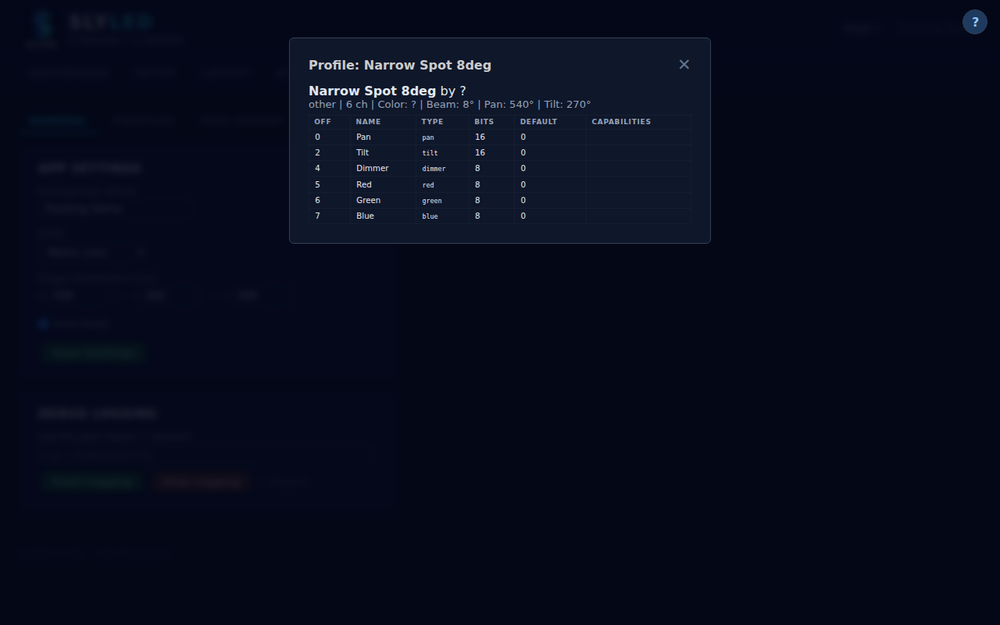

3. **Add two movers** — Go to the Setup tab. Click **+ Add Fixture** twice to create two DMX moving heads:
   - **Fixture 1:** Name: `Mover SL` (Stage Left), Universe: 1, Start Address: 1, Profile: `Narrow Spot`
   - **Fixture 2:** Name: `Mover SR` (Stage Right), Universe: 1, Start Address: 14, Profile: `Narrow Spot`

   Both fixtures appear in the Setup table with purple "DMX" badges and the profile name.

**Part 2 — 3D Layout and Spatial Effect**

4. **Position movers on the truss** — Switch to the Layout tab. In the sidebar, you'll see both movers listed as "unplaced." Drag each one into the 3D viewport:
   - **Mover SL:** Position at X: 1500, Y: 0, Z: 2800 (stage left, on truss). Set rotation to tilt: -30, pan: -15.
   - **Mover SR:** Position at X: 4500, Y: 0, Z: 2800 (stage right, on truss). Set rotation to tilt: -30, pan: 15.

   Switch to 3D view to confirm both movers are elevated on the truss and aimed downward toward the stage floor. The beam cones should be visible as translucent triangles.

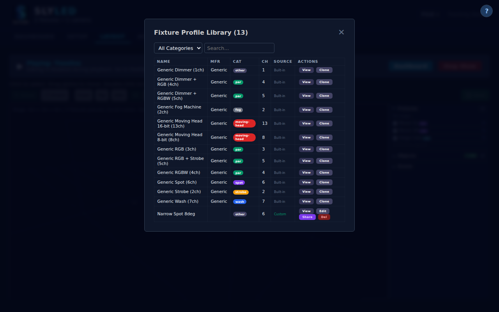

5. **Create a spatial effect** — Go to the Actions tab. Click **+ New Action**:
   - **Name:** `Sweep Green`
   - **Type:** Spatial Effect
   - **Shape:** Sphere
   - **Radius:** 800 mm
   - **Color:** Green (0, 255, 0)
   - **Motion Start:** X: 1000, Y: 2000, Z: 0 (stage left, mid-depth, floor level)
   - **Motion End:** X: 5000, Y: 2000, Z: 0 (stage right, same depth and height)
   - **Duration:** 8 seconds
   - **Easing:** Linear
   - Click **Save Action**

   This creates a green sphere of light that sweeps from stage left to stage right over 8 seconds. When applied to moving heads, they will track the sphere's center position.

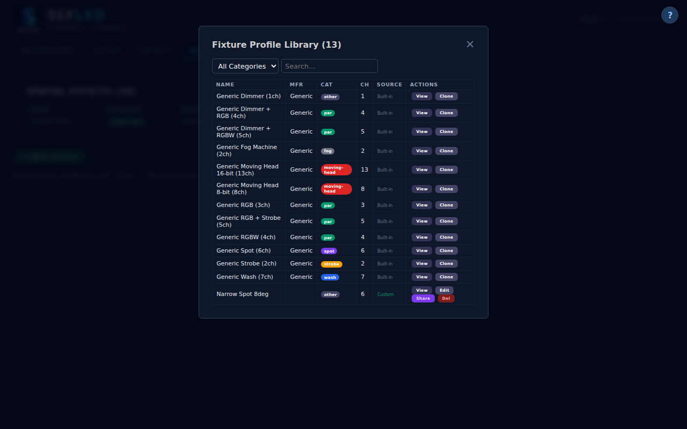

**Part 3 — Timeline, Bake, and Playback**

6. **Create a timeline** — Go to the Shows tab. Click **+ New Timeline**:
   - **Name:** `Mover Tracking Demo`
   - **Duration:** 20 seconds
   - **Loop:** Enabled
   - Add a track targeting **All Performers**
   - Add a clip referencing the `Sweep Green` effect, starting at 0s with 8s duration

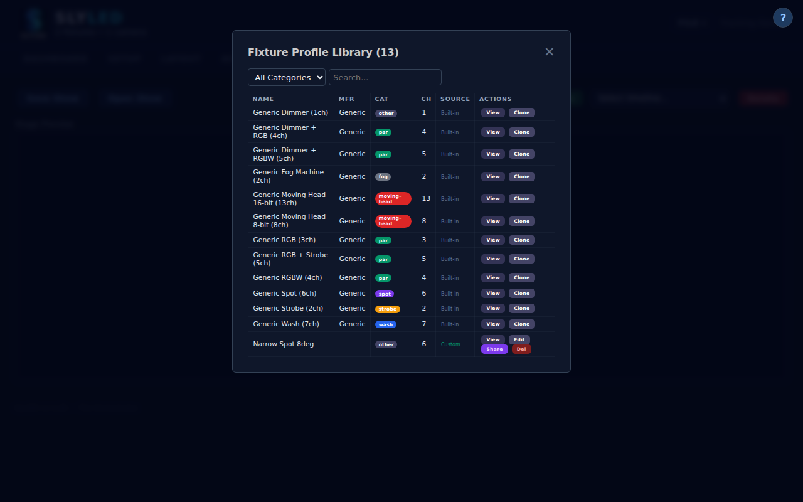

7. **Bake the timeline** — Click the **Bake** button. The bake engine computes per-fixture pan/tilt angles for each time slice:
   - For each 25ms frame, it calculates the sphere's position along the motion path
   - For each mover, it computes the pan/tilt angles needed to aim at that position
   - Dimmer is set to 255 and color channels are set to green
   - Wait for "Bake complete" confirmation (typically < 1 second)

8. **Start playback and verify** — Switch to the Runtime tab. Click **Start**:
   - The 3D viewport shows both beam cones animated in real-time
   - At T=0s, both beams aim at the starting position (stage left)
   - As the effect sweeps, the beams track the green sphere across the stage
   - At T=8s, both beams have followed the sphere to stage right
   - The timeline loops, and the sweep restarts


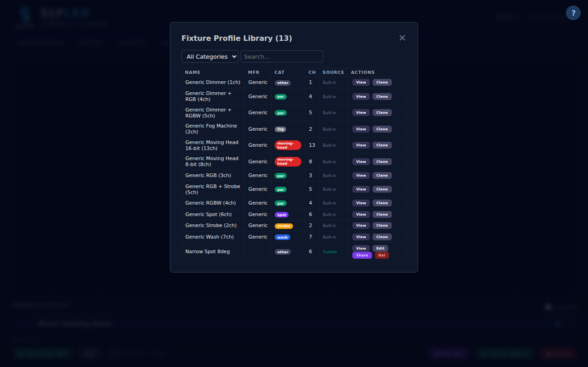

**What to look for:**
- Both beam cones should be green (matching the effect color)
- The cones should move smoothly from left to right
- The beam intensity (opacity) should be > 0 during the sweep, indicating active output
- If beam cones don't appear, ensure fixtures are positioned in the Layout tab and the timeline is baked

**Variations:**
- Change the spatial effect shape to **Plane** for a wall of light sweeping across
- Add a second effect on a separate track with different timing for crossing patterns
- Try the **Figure Eight** preset show (Runtime → Load Show) for a ready-made crossing pattern

---

### Example C: Manual Mover Calibration (#381)

Calibrate a moving head so the system knows exactly where its beam lands for any pan/tilt position. This two-part process first discovers the beam's visible range (pan/tilt grid) and then builds a light map that maps every pan/tilt position to real stage coordinates.

**Prerequisites:**
- At least one camera node online and positioned on the Layout tab
- Camera calibration complete — the camera must have a valid stage map (see Example D)
- Moving head fixture added in Setup and positioned on the Layout tab
- Art-Net/sACN engine running (Settings → DMX → Start)
- Dim ambient lighting — the beam must be clearly visible to the camera against the floor
- The beam should be aimed at the floor within the camera's field of view, not directly at the camera

**Part 1 — Pan/Tilt Discovery and Grid Calibration**

1. **Open the calibration panel** — Go to the Layout tab. Double-click the moving head fixture you want to calibrate. In the edit dialog, click the **Calibrate** button. The calibration wizard opens showing the fixture name, current calibration status (if any), and available calibration modes.

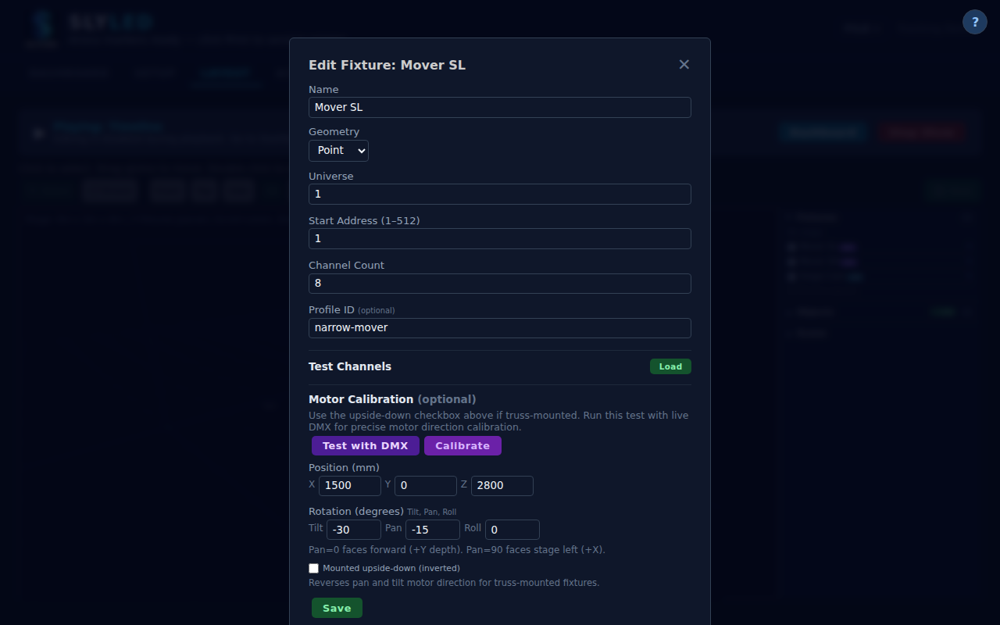

2. **Choose beam color** — Select a color that contrasts well with your floor surface:
   - **Green** works best on dark floors (wood, dark carpet)
   - **Magenta** works best on light floors (white, concrete)
   - **Red** or **Blue** are alternatives if the default choices blend with your environment
   - The color matters because the camera uses color filtering to isolate the beam from ambient light

3. **Run discovery** — Click **Start Calibration**. The system runs an automatic discovery sequence:
   - **Phase 1 — Coarse grid scan:** The fixture sweeps through ~40 pan/tilt positions (8 columns x 5 rows) across its full range. The camera watches for the beam appearing on the floor after each move.
   - **Phase 2 — Fine refinement:** Once the beam is found, the system spirals outward from that position to refine the exact center of the visible region.
   - Discovery typically completes in 30-60 seconds. The progress indicator shows "Discovering..." with the current scan position.


4. **BFS mapping** — After discovery, the system automatically maps the full visible region:
   - Starting from the discovered beam position, it steps in 4 directions (up/down/left/right in pan/tilt space)
   - At each position, the camera captures a frame and detects the beam centroid
   - The system records the beam's pixel position and converts it to stage millimeters using the camera's homography
   - Mapping stops at boundaries where the beam leaves the camera's field of view or falls off the stage
   - Collects up to 60 sample positions, typically completing in 2-3 minutes
   - The system uses adaptive settle times (0.8-2.5s) per move and double-capture verification to ensure the beam has stopped before recording

5. **Grid build and review** — The collected samples are compiled into a bilinear interpolation grid:
   - The calibration summary displays:
     - **Sample count:** Number of successfully detected positions (aim for 30+)
     - **Pan range:** Normalized range (e.g., 0.15-0.85 means the beam is visible across 70% of pan range)
     - **Tilt range:** Normalized range
     - **Grid density:** How finely the grid was sampled
   - The grid enables fast forward lookup: given a (pan, tilt) value, compute the stage (X, Y) where the beam lands


**Part 2 — Light Map Calibration (stage coordinates to pan/tilt lookup)**

6. **Build the light map** — Click **Build Light Map**. This extends the calibration by sweeping a systematic 20x15 grid across the discovered visible region:
   - For each grid position, the fixture moves to the pan/tilt value
   - The camera detects the beam and records the exact stage X/Y/Z where it lands
   - This builds a comprehensive (pan, tilt) → (stageX, stageY, stageZ) lookup table
   - Progress shows as "Building light map... N/300" with real-time updates
   - Typical completion time: 5-10 minutes for a full 20x15 grid


7. **Verify inverse lookup** — After the light map is built, use the **Aim** button to test the inverse mapping:
   - Enter a target stage position (e.g., center stage: X=3000, Y=2000, Z=0)
   - Click **Aim** — the system uses inverse-distance weighted interpolation of the 4 nearest light map samples to compute the exact pan/tilt values
   - The fixture moves to the computed position
   - Verify visually that the beam lands on (or very near) the target point on stage
   - Try 3-4 different targets across the stage to confirm accuracy
   - Good calibration should place the beam within 100-200mm of the target at typical stage distances


8. **Save calibration** — Calibration data is automatically saved with the fixture. The light map and grid data persist across sessions and are included in project file exports (.slyshow).
   - Track actions use the light map to aim at detected people
   - Pan/Tilt Move actions use it for smooth interpolated sweeps
   - The 3D viewport uses it to render accurate beam cone directions

**Manual calibration (alternative — no camera required):**

If automated calibration isn't available (no camera, or camera can't see the beam), use the manual calibration wizard:

1. Layout tab → double-click mover → click **Manual Calibrate**
2. **Define marker positions** — Add 4-6 physical markers at known stage positions. Enter each marker's X, Y, Z coordinates (in mm). Spread markers across the stage: front-left, front-right, back-center at minimum.
3. **Jog to each marker** — For each marker, use the pan/tilt sliders to manually aim the beam until it lands exactly on the physical marker. Click **Record** to save the (pan, tilt) → (stageX, stageY, stageZ) sample.
4. **Add at least 4 samples** spread across the stage for a good affine fit. More samples (6+) improve accuracy, especially at stage edges.
5. Click **Compute** — the system fits a 3D affine transform from your samples:
   - `pan = a1*stageX + b1*stageY + c1*stageZ + d1`
   - `tilt = a2*stageX + b2*stageY + c2*stageZ + d2`
   - The affine transform extrapolates beyond calibrated points for full-stage coverage

**When to re-calibrate:**
- Fixture physically moved to a new position or angle
- Venue change (different stage dimensions or floor surface)
- After firmware update that changes pan/tilt range or motor behavior
- If aim accuracy degrades over time (motor drift)
- After changing the fixture's mounting orientation (upright vs. inverted)

---

### Example D: Camera Calibration with ArUco Markers (#380)

Calibrate a camera so pixel coordinates can be mapped to real stage positions. This is a prerequisite for beam detection, person tracking, and mover calibration — without it, the system cannot convert what the camera sees into real-world stage millimeters.

**Prerequisites:**
- Camera node online and reachable on the network (deploy firmware from the Firmware tab if needed)
- Camera fixture registered in the system (Setup tab → Discover, or Settings → Cameras → add manually)
- Camera fixture placed on the Layout tab at its physical position
- A printer to print the ArUco marker sheet (standard A4/Letter paper)
- A tape measure to record marker positions on stage
- The camera must have a clear view of the stage floor where markers will be placed

**Part 1 — Prepare and Place ArUco Markers**

1. **Print ArUco markers** — Go to Settings → Cameras. Click the **Print ArUco Markers** button. A modal opens with 6 printable ArUco 4x4 markers (IDs 0-5), each 150mm x 150mm:
   - Click **Download** or use the browser's print dialog to print the marker sheet
   - Print at 100% scale (no scaling/fit-to-page) — the physical size must match the expected 150mm for accurate calibration
   - Markers can be printed on regular white paper, but card stock is more durable

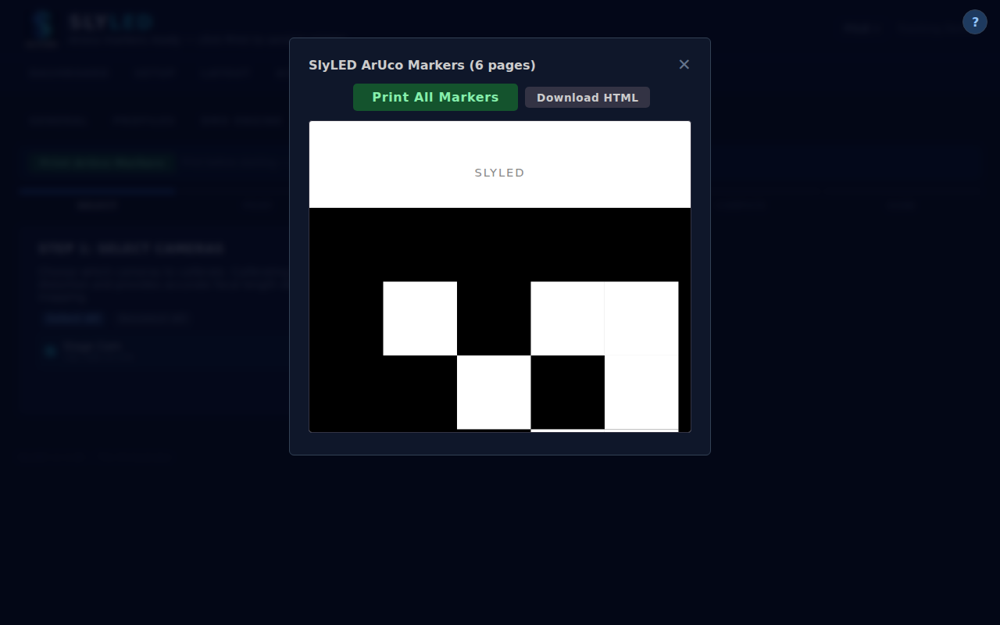

2. **Place markers on the stage floor** — Position the printed markers at known locations on the stage:
   - **Minimum:** 3 markers (enough for a basic homography)
   - **Recommended:** 4-6 markers for better accuracy
   - **Placement strategy:**
     - Spread markers across the entire camera's field of view
     - Place at least one marker near each corner of the visible area
     - Place markers flat on the floor — tilted markers reduce accuracy
     - Measure each marker's position from the stage origin (back-right corner at floor level):
       - X = distance from stage right (mm)
       - Y = distance from back wall (mm)
       - Z = 0 (floor level)
   - Record the marker ID and its (X, Y) coordinates — you'll enter these in step 5

**Part 2 — Register and Position the Camera**

3. **Register the camera** — If the camera node is not already registered:
   - Go to the Setup tab and click **Discover** — camera nodes respond to UDP broadcast
   - Or go to Settings → Cameras → enter the camera's IP address manually
   - Each USB camera sensor on the node appears as a separate fixture
   - Verify the camera is online: its status should show "Online" with a green indicator

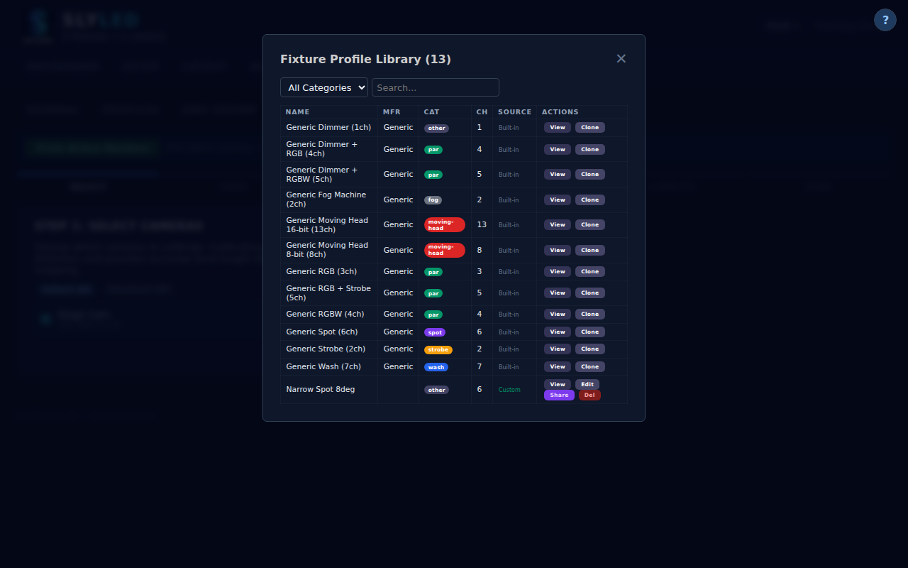

4. **Position the camera in 3D** — Switch to the Layout tab:
   - Find the camera fixture in the sidebar (listed as "unplaced" if new)
   - Drag it into the 3D viewport at the camera's real physical position
   - Set the rotation to match the camera's actual aim direction:
     - A camera mounted on a wall at 2m height, aimed down at 30 degrees would have rotation Z=2000, tilt=-30
   - In 3D view, the camera appears as a frustum (pyramid) showing its field of view
   - Verify the frustum covers the area where you placed the ArUco markers

**Part 3 — Run Calibration and Verify**

5. **Run ArUco calibration** — In the Layout tab, click on the camera fixture to select it. Click the **Calibrate** button:
   - The wizard opens and fetches a live snapshot from the camera
   - The system automatically detects all visible ArUco markers and highlights them with green overlays
   - **For each detected marker:**
     - The marker ID is shown on the overlay
     - Enter the marker's real-world stage coordinates (X, Y in mm) that you measured in step 2
     - Click **Record** to save the pixel-to-stage mapping for this marker
   - After recording all markers, click **Compute** — the system builds a homography matrix that maps any pixel coordinate to stage floor coordinates


6. **Review calibration results** — The calibration summary shows:
   - **Reprojection error:** How accurately the computed homography matches the recorded points. Lower is better:
     - < 10mm: Excellent — suitable for precision tracking
     - 10-20mm: Good — adequate for most use cases
     - 20-50mm: Fair — consider adding more markers or re-measuring positions
     - > 50mm: Poor — re-check marker measurements and try again
   - **Reference points:** Number of markers used (should match what you recorded)
   - **Coverage area:** The stage area covered by the calibration (larger is better)


7. **Save and apply** — Click **Save** to persist the calibration:
   - The camera fixture badge updates to show a green "Cal" checkmark
   - All features that depend on pixel-to-stage conversion now use this calibration:
     - **Person tracking:** Detected bounding boxes are converted to stage positions
     - **Beam detection:** Beam centroids become stage coordinates for mover calibration
     - **Mover calibration:** The entire mover calibration wizard (Example C) requires this
   - Calibration data is included in project file exports (.slyshow) for portability

**Tips for accurate calibration:**
- **Marker size matters:** Use the 150mm markers at standard print size. Smaller markers are harder to detect at distance.
- **Flat placement is critical:** Even a slight tilt (marker on a crumpled surface) can shift the detected center by 10-20mm.
- **Cover the edges:** The homography is most accurate within the convex hull of your reference markers. Place markers at the extremes of the camera's view, not just the center.
- **Lighting conditions:** ArUco detection works in most lighting, but avoid direct glare on the printed markers (glossy paper under bright lights).
- **Re-calibrate when:**
  - The camera is physically moved (even slightly)
  - The camera lens is changed or zoom is adjusted
  - Stage dimensions change (markers would be at different positions)
  - Accuracy of tracking or beam detection degrades

---

### Example E: Spotlight Follow Person — Live Tracking Preset (#382)

Use the built-in **Spotlight: Follow Person** preset to make moving heads automatically follow people detected by a camera in real-time.

**Prerequisites:**
- At least one camera node online with person detection working (verify with a manual Scan first)
- At least one DMX moving head fixture placed on the Layout tab
- Camera calibration complete (see Example D) for accurate stage positioning
- Mover calibration complete (see Example C) for accurate pan/tilt aiming
- Art-Net/sACN engine running

**Steps:**

1. **Load the preset** — Go to the Runtime tab. Click **Load Show** (or the preset dropdown). Select **Spotlight: Follow Person** from the preset list.
   - If no camera node is registered, a warning appears: "No camera node registered — person detection will not work"
   - If no moving heads are configured, a warning appears about missing movers
   - The preset loads even with warnings — you can add the missing hardware later

2. **What it creates** — The preset automatically configures:
   - A **Track action** (type 18) on every available moving head, targeting `objectType: "person"`
   - A warm spotlight color (255, 240, 200) at full dimmer for the beam
   - A dim blue ambient wash (10, 5, 30) on all LED fixtures for atmospheric framing
   - A 10-minute looping timeline that keeps the DMX playback loop running

3. **Start camera tracking** — Click the **Track** button on the Setup tab or in the camera fixture edit modal. The camera node begins running detection using the configured tracking classes and parameters (see [Tracking Configuration](#tracking-configuration)). Detected objects appear as labeled markers in the 3D viewport.

4. **Start playback** — Click **Bake**, then **Start**. The 40 Hz DMX playback loop begins. The Track action reads all temporal person objects and computes pan/tilt for each head in real-time.

5. **Walk on stage** — Within 2 seconds of entering the camera's view, a pink person marker appears. Moving heads light up with the warm spotlight color and aim at you. As you move, the beams follow.

**Behavior with multiple people:**
- 1 person, 2 heads: Both heads aim at the same person
- 2 people, 2 heads: One head per person (auto-spread)
- 3+ people, 2 heads: Heads cycle through people every 2 seconds

**When no one is detected:**
- Heads dim to 0 (blackout) and hold their last position
- As soon as a person is detected again, heads immediately re-aim and light up

**Tips:**
- Use a narrow beam profile (8-15 degrees) for a dramatic spotlight effect
- Ensure the room is dim enough for the camera to distinguish the beam from ambient light
- If tracking seems jittery, increase the camera's capture FPS or reduce the confidence threshold
- The Track action works alongside other timeline effects — you can add spatial color washes on lower-priority tracks

---

## 19. API Quick Reference

### Stage & Layout
| Method | Endpoint | Description |
|--------|----------|-------------|
| GET/POST | `/api/layout` | Layout with fixtures and positions |
| GET/POST | `/api/stage` | Stage dimensions (w, h, d meters) |
| GET/POST | `/api/objects` | Stage objects (walls, floors, trusses, props) |
| POST | `/api/objects/temporal` | Create temporal objects (TTL-based) |

### Fixtures
| Method | Endpoint | Description |
|--------|----------|-------------|
| GET/POST | `/api/fixtures` | List / create |
| GET/PUT/DELETE | `/api/fixtures/:id` | CRUD |
| PUT | `/api/fixtures/:id/aim` | Set aim point |

### Shows & Timelines
| Method | Endpoint | Description |
|--------|----------|-------------|
| GET/POST | `/api/timelines` | List / create |
| POST | `/api/timelines/:id/bake` | Start baking |
| POST | `/api/timelines/:id/start` | Start playback |
| GET | `/api/show/presets` | List preset shows |
| GET/POST | `/api/show/export`, `/api/show/import` | Save/load show file |

### DMX
| Method | Endpoint | Description |
|--------|----------|-------------|
| GET | `/api/dmx-profiles` | List profiles |
| GET | `/api/dmx/patch` | Universe address map |
| POST | `/api/dmx/start`, `/api/dmx/stop` | Engine control |

### Cameras
| Method | Endpoint | Description |
|--------|----------|-------------|
| GET | `/api/cameras` | List registered camera fixtures |
| POST | `/api/cameras` | Register a camera node as fixture |
| DELETE | `/api/cameras/:id` | Remove camera fixture |
| GET | `/api/cameras/:id/snapshot` | Proxy JPEG snapshot |
| GET | `/api/cameras/:id/status` | Live status from camera node |
| POST | `/api/cameras/:id/scan` | Object detection (proxy to node `/scan`) |
| GET | `/api/cameras/discover` | Find camera nodes on network |
| GET/POST | `/api/cameras/ssh` | SSH credentials for deployment |
| POST | `/api/cameras/deploy` | Deploy firmware to camera node via SSH+SCP |
| GET | `/api/cameras/deploy/status` | Poll deploy progress |

### Camera Node Local API (port 5000)
| Method | Endpoint | Description |
|--------|----------|-------------|
| GET | `/status` | Node status, capabilities, camera list |
| GET | `/config` | HTML config page with detection UI |
| GET | `/snapshot?cam=N` | JPEG snapshot from camera N |
| POST | `/scan` | Object detection (JSON: cam, threshold, resolution, classes) |
| GET | `/health` | Health check |

---

<a id="glossary"></a>

## 20. Glossary

SlyLED touches lighting, networking, computer vision, and embedded firmware — which means a lot of acronyms and jargon. This section expands every acronym used elsewhere in the manual and defines the domain terms that don't have a literal expansion ("baking", "universe", "blink-confirm", etc.).

Entries are alphabetised on the **Term** column. For acronyms that cluster around a common concept (e.g. `RX` / `RY` / `RZ`) the cluster appears under the first member.

| Term | Expansion | Plain-language definition | Where it shows up |
|------|-----------|---------------------------|-------------------|
| **API** | Application Programming Interface | The set of HTTP endpoints a program exposes for other programs to call. | §19 API Quick Reference; `/api/*` routes throughout. |
| **ARM** | Advanced RISC Machine | CPU architecture used by the Giga R1, Raspberry Pi, and Orange Pi. "Slow on ARM" in the manual means these boards. | §14 Camera Nodes (depth-estimation runtimes). |
| **Art-Net** | — | DMX-over-Ethernet protocol by Artistic Licence. The orchestrator sends `ArtDMX` packets to an Art-Net bridge, which relays them to DMX fixtures. | §2 Walkthrough Step 3b; §12 DMX Profiles. |
| **ArtDMX** | Art-Net DMX packet | One 512-channel Art-Net data packet. | §2 Walkthrough Step 3b. |
| **ArtPoll** | Art-Net discovery packet | The Art-Net discovery broadcast used to find bridges. | §2 Walkthrough Step 3a. |
| **baking** | — | Compiling a timeline into a pre-computed DMX scene stream so playback doesn't need to recompute effects on every frame. | §10 Baking & Playback. |
| **battleship search** | — | Calibration-discovery strategy that probes a coarse grid across the full pan/tilt range before refining — faster than a dense scan when the beam's reachable region is small. | Appendix B §B.3 Discovery. |
| **BFS** | Breadth-First Search | Graph-traversal algorithm that explores outward from a seed point one ring at a time. Used in mover calibration to map the visible-region boundary from a first detected beam position. | Appendix B §B.3 Mapping. |
| **blink-confirm** | — | Reflection-rejection check: after detecting a candidate beam pixel, nudge pan and tilt slightly and verify the detected pixel actually moves. A reflection stays put; a real beam moves. | Appendix B §B.3; issue #658. |
| **CPU** | Central Processing Unit | The main processor. | §14 Camera Nodes. |
| **CRGB** | Color RGB | FastLED's C++ struct for a single RGB pixel. | Firmware modules (`GigaLED.h`). |
| **CRUD** | Create, Read, Update, Delete | Shorthand for "all four basic database-style operations." | §4 Fixture Setup; §12 DMX Profiles. |
| **CSI** | Camera Serial Interface | Raspberry Pi's native ribbon-cable camera port (not supported in SlyLED v1.x — use USB cameras). | §14 Camera Nodes. |
| **dark reference** | — | Snapshot captured with all calibration beams off, subtracted from subsequent frames so beam detection isn't fooled by ambient lighting. | Appendix A §A.5; issue #651. |
| **DHCP** | Dynamic Host Configuration Protocol | How devices on a network get an IP address. The board's hostname shows up in DHCP so routers list it by name. | §14 Camera Nodes deployment. |
| **DMX** | Digital Multiplex | Industry-standard lighting-control protocol — 512 channels per universe, carried over a twisted-pair cable or over Ethernet (Art-Net / sACN). | §2 Walkthrough; §12 DMX Profiles; Appendix B. |
| **DOF** | Degrees of Freedom | Independent axes a system can move along. SlyLED's parametric mover model has 6 DOF (yaw, pitch, roll, pan offset, tilt offset, plus scale). | Appendix B §B.3 Model fit. |
| **ESP32** | — | Espressif microcontroller family used for LED-performer nodes (WiFi + dual-core, up to 8 LED strings). | §4 Fixture Setup; §15 Firmware. |
| **extrinsic** | — | A camera's pose (position + rotation) in stage/world space. The solvePnP output. Pair with **intrinsic**. | Appendix A §A.4. |
| **FastLED** | — | Arduino library for driving WS2812B-style addressable LED strips. Used on ESP32 and D1 Mini; **not** reliable on the Giga R1 (custom PWM path instead). | §15 Firmware; CLAUDE.md hardware quirks. |
| **fixture** | — | Any addressable lighting device — an LED strip, a DMX wash, a moving head, or a camera (which registers as a placeable "fixture" so it has a layout position). | §4 Fixture Setup; throughout. |
| **FOV** | Field of View | The angular width a camera or lens sees. Stored as `fovDeg` + `fovType` (horizontal/vertical/diagonal). Used as an intrinsic fallback when true calibrated intrinsics aren't available. | Appendix A §A.3. |
| **FPS** | Frames Per Second | Update rate for live playback or emulation. | §11 Show Preview Emulator. |
| **FQBN** | Fully Qualified Board Name | The arduino-cli identifier for a board target, e.g. `arduino:mbed_giga:giga`. | §15 Firmware. |
| **GET / POST / PUT / DELETE** | — | HTTP methods. GET reads, POST creates/triggers, PUT updates, DELETE removes. | §19 API Quick Reference. |
| **GPIO** | General-Purpose Input/Output | A configurable pin on a microcontroller — used for LED data lines on the ESP32. | §4 Fixture Setup (ESP32 only). |
| **homography** | — | A 3×3 matrix that maps points on one plane to points on another via projective transform. SlyLED uses a pixel↔floor homography as a fast alternative to full 3D extrinsics during calibration. | Appendix A §A.4. |
| **HSV** | Hue, Saturation, Value | A colour representation used for colour-filter beam detection (hue bands identify "the green beam" regardless of brightness). | Appendix A §A.8 Beam detection. |
| **HTML** | HyperText Markup Language | The markup the SPA is built from. | §3 Platform Guide. |
| **HUD** | Heads-Up Display | An overlay showing live state (used in the 3D viewport). | §5 Stage Layout. |
| **ID** | Identifier | Any short key that uniquely names something (fixture ID, ArUco marker ID, etc.). | Throughout. |
| **IK** | Inverse Kinematics | Given a target point, compute the pan/tilt values that aim the beam there. The parametric mover model provides IK once calibration completes. | Appendix B §B.3 Model fit. |
| **intrinsic** | — | A camera's internal optical parameters: focal length (`fx`, `fy`), principal point (`cx`, `cy`), and lens distortion. Independent of where the camera is — that's the **extrinsic**. | Appendix A §A.3. |
| **IP** | Internet Protocol | Addressing scheme for networked devices (`192.168.x.y`). | §14 Camera Nodes. |
| **JPEG** | Joint Photographic Experts Group | Compressed image format used for camera snapshots. | §14 Camera Nodes. |
| **JSON** | JavaScript Object Notation | The text format used for API request/response bodies and persisted data files. | §19 API Quick Reference. |
| **kinematic model** | — | Mathematical model that describes how a fixture's motors translate pan/tilt DMX values into an aim direction in stage space. SlyLED fits a 6-DOF kinematic model per calibrated moving head. | Appendix B §B.3. |
| **LAN** | Local Area Network | The physical/WiFi network the orchestrator and performers share. | §2 Walkthrough. |
| **LED** | Light-Emitting Diode | Addressable RGB LEDs (WS2812B and similar) are the primary fixture type. | §4 Fixture Setup. |
| **LM** | Levenberg–Marquardt | Nonlinear least-squares solver used to fit the parametric mover model to calibration samples. | Appendix B §B.3 Model fit. |
| **LSQ** | Least-Squares | The fitting technique LM refines. When calibration falls back to "median-based" fitting, it's because LSQ wouldn't converge. | Appendix A §A.6. |
| **Mbed OS** | — | The real-time operating system running on the Arduino Giga R1. Explains why `analogWrite()` and some libraries behave differently on the Giga. | CLAUDE.md hardware quirks. |
| **mDNS** | Multicast DNS | Zero-config DNS over multicast — how "SLYC-1234.local" resolves on the LAN without a DNS server. | §14 Camera Nodes deployment. |
| **NTP** | Network Time Protocol | How performers sync their clocks so runner start times are coordinated. | Protocol (`Globals.cpp`). |
| **NVS** | Non-Volatile Storage | ESP32 flash-backed key/value store. SlyLED uses the `"slyled"` namespace. Equivalent to EEPROM on the D1 Mini. | §4 Fixture Setup. |
| **ONNX** | Open Neural Network Exchange | Portable neural-network file format. YOLOv8n and Depth-Anything-V2 ship as ONNX files so they run via `onnxruntime` on ARM. | §14 Camera Nodes. |
| **OFL** | Open Fixture Library | Community-maintained DMX-fixture profile database. SlyLED can import OFL JSON. | §12 DMX Profiles. |
| **orchestrator** | — | The desktop (Windows/Mac) or Giga-parent Flask server that hosts the SPA, designs shows, and drives performers and cameras. One of the three tiers. | §1 Getting Started. |
| **OS** | Operating System | — | CLAUDE.md hardware. |
| **OTA** | Over-the-Air | Firmware update pushed over WiFi instead of via USB. | §15 Firmware & OTA Updates. |
| **PDF** | Portable Document Format | The packaged manual format. Generated by `tests/build_manual.py`. | Appendix C. |
| **performer** | — | An ESP32, D1 Mini, or Giga-child LED execution node. One of the three tiers. | §1 Getting Started. |
| **PnP / solvePnP** | Perspective-n-Point | OpenCV algorithm that computes a camera's 3D pose from ≥3 known 2D↔3D point correspondences. `SOLVEPNP_SQPNP` is the preferred solver; `SOLVEPNP_ITERATIVE` is the fallback. | Appendix A §A.4. |
| **PNG** | Portable Network Graphics | Lossless image format used for screenshots. | §2 Walkthrough. |
| **PR** | Pull Request | Git/GitHub workflow — a proposed change on a branch, reviewed before merge. | Appendix C §C.4. |
| **PWM** | Pulse-Width Modulation | Dimming technique where the LED is switched on and off fast. On the Giga R1 this is implemented in software because `analogWrite()` is banned on the onboard RGB pins. | CLAUDE.md hardware quirks. |
| **QA** | Quality Assurance | Testing role — in SlyLED's workflow, QA runs the Playwright + test suites and files issues rather than patching source. | Appendix C. |
| **QR** | Quick Response (code) | 2D barcode. Not the same as an ArUco marker — ArUco is designed for solvePnP, QR for data payloads. | — |
| **RANSAC** | Random Sample Consensus | Robust plane-fitting algorithm — samples random small subsets, finds the model with the most inliers. SlyLED uses it to detect floor and wall planes in noisy point clouds. | Appendix A §A.7. |
| **reprojection RMS** | — | After solvePnP, project the 3D points back through the solved pose and measure the pixel distance to the detected corners. Reported as root-mean-square across all points. <2 px is excellent, 2–5 px is usable, >5 px means something is wrong. | Appendix A §A.4. |
| **RGB / RGBW** | Red, Green, Blue [, White] | Standard LED colour models. RGBW adds a dedicated white LED for purer whites. | §4 Fixture Setup. |
| **RMS** | Root-Mean-Square | Quadratic-mean aggregation of errors (`sqrt(mean(x²))`). More sensitive to outliers than a plain mean — which is why it's used as a calibration quality metric. | Appendix A §A.4. |
| **Rodrigues** | — | Mathematical conversion between a rotation vector (`rvec` from solvePnP) and a 3×3 rotation matrix. `cv2.Rodrigues()`. | Appendix A §A.4. |
| **RSSI** | Received Signal Strength Indicator | How strong a WiFi signal a performer is hearing. Reported in dBm; the orchestrator stores it as an unsigned magnitude so "69" means "−69 dBm". | UDP protocol PONG payload. |
| **RTOS** | Real-Time Operating System | An OS with deterministic timing guarantees. Mbed OS on the Giga is an RTOS. | CLAUDE.md hardware. |
| **runner** | — | A step sequencer loaded into a performer. Each step is an action (colour, pattern, LED range) with a duration; the runner loops the step list in sync with the orchestrator. | §4 Fixture Setup; §13 Preset Shows. |
| **RX / RY / RZ** | — | Rotations about the X, Y, Z axes of the stage frame, in degrees. In schema v2: `rx` = pitch, `ry` = roll, `rz` = yaw/pan. Never read `rotation[1]` or `rotation[2]` directly — always go through `rotation_from_layout()`. | Appendix A §A.9. |
| **sACN** | Streaming ACN | DMX-over-Ethernet alternative to Art-Net, defined by RFC 7724. SlyLED speaks both. | §12 DMX Profiles. |
| **SCP** | Secure Copy Protocol | File transfer over SSH. How camera firmware reaches the Orange Pi / Raspberry Pi. | §15 Firmware → Camera deploy. |
| **solvePnP** | — | See **PnP**. | Appendix A §A.4. |
| **SPA** | Single-Page Application | The desktop orchestrator UI is one HTML page that loads JavaScript modules instead of navigating between pages. | §3 Platform Guide. |
| **SQPNP** | — | A specific solvePnP algorithm variant (`cv2.SOLVEPNP_SQPNP`) chosen because it tolerates fewer correspondences than the iterative solver. | Appendix A §A.4. |
| **SRAM** | Static Random-Access Memory | The fast, volatile RAM on a microcontroller. Tight budget on the D1 Mini — the manual warns against String objects and heap allocation. | CLAUDE.md performance rules. |
| **SSH** | Secure Shell | Encrypted remote-login protocol. How the orchestrator reaches camera-node shells for firmware deployment. | §15 Firmware → Camera deploy. |
| **SVG** | Scalable Vector Graphics | Vector image format used by diagram exporters. | Appendix C. |
| **TCP** | Transmission Control Protocol | Reliable, connection-based networking. HTTP traffic (config pages, API calls) rides on TCP. | UDP protocol discussion. |
| **tiling** | — | Sliced-Aided Hyper-Inference (SAHI)-style detection: break a large image into overlapping patches, run the detector on each, stitch results. Improves small-object detection accuracy at the cost of runtime. Controlled by the `tile` option on `/scan`. | §14 Camera Nodes. |
| **TTL** | Time-To-Live | A timeout after which a resource (e.g. a mover claim) auto-expires. Mover-control claims have a 15 s TTL. | Appendix B §B.7. |
| **UDP** | User Datagram Protocol | Connectionless, best-effort networking. Used for all orchestrator↔performer traffic (discovery, actions, runner control) because it's low-latency and the wire protocol tolerates occasional packet loss. | Wire protocol; CLAUDE.md §UDP binary protocol. |
| **UI** | User Interface | — | Throughout. |
| **universe** | — | A DMX addressing space — 1–512 channels. A show typically spans multiple universes; Art-Net addresses them as `net.subnet.universe`. | §12 DMX Profiles. |
| **URL** | Uniform Resource Locator | Web address. | §14 Camera Nodes. |
| **USB** | Universal Serial Bus | — | §15 Firmware USB flash. |
| **V4L2** | Video for Linux 2 | The kernel video-capture API used by camera nodes (`cv2.VideoCapture` on Orange Pi / Raspberry Pi). SoC ISP video nodes like `sunxi-vin` and `bcm2835-isp` are filtered out — only regular USB cameras register. | §14 Camera Nodes. |
| **WiFi** | — | 802.11 wireless networking. Performers and camera nodes join the orchestrator's LAN over WiFi. | §2 Walkthrough. |
| **WLED** | — | Popular open-source firmware for ESP32/8266-based LED controllers. SlyLED includes a bridge so WLED devices can appear as performers. | §4 Fixture Setup; `desktop/shared/wled_bridge.py`. |
| **WS2812B** | — | Common addressable-RGB LED chip (aka "NeoPixel"). The ESP32 RMT peripheral drives it in hardware; the D1 Mini bit-bangs it in software. | §4 Fixture Setup. |
| **YOLO** | You Only Look Once | Single-pass object-detection neural network. SlyLED camera nodes run YOLOv8n via ONNX Runtime for person/object detection on `POST /scan`. | §14 Camera Nodes. |
| **ZIP** | — | Archive file format, used for the release bundle. | §15 Firmware Registry. |

> **Not sure what something means?** If a term appears in the manual but isn't in this table, that's a bug in the glossary — open an issue or PR against [#663](https://github.com/SlyWombat/SlyLED/issues/663).

---

<a id="appendix-a"></a>

## Appendix A — Camera Calibration Pipeline (DRAFT)

> ⚠ **DRAFT — assumes all in-flight work is merged.** This appendix describes the camera-calibration pipeline under the assumption that issues #610, #651–#661, and #357 are fully implemented. Some features documented below are **partially merged** today (notably full intrinsic calibration of every camera, dark-reference integration into the mover pipeline per #651, and the floor-view polygon target filter per #659). See `docs/DOCS_MAINTENANCE.md` for the current merge status and the criteria for removing this banner. Issue [#662](https://github.com/SlyWombat/SlyLED/issues/662).

Camera calibration runs as a one-time setup per camera node and must be repeated whenever a camera is physically moved or re-aimed. It produces, per camera: an [intrinsic](#glossary) matrix **K** (focal length + principal point + distortion), an [extrinsic](#glossary) pose (stage-space position + rotation), and — for stages that will run point-cloud scans — a depth-anchor fit that corrects monocular depth to stage metric.

### A.1 Pipeline overview

```mermaid
%%{init: {'theme':'neutral'}}%%
flowchart TD
    Start([Register camera node]) --> Deploy[Deploy firmware via SSH+SCP]
    Deploy --> Intrinsic{1 — Intrinsic calibration}
    Intrinsic -->|Checkerboard path| CBCap[Capture 15-30 checkerboard frames<br/>~500ms/frame]
    Intrinsic -->|ArUco path| ArCap[Capture 5-10 ArUco snapshots]
    CBCap --> CBCompute[cv2.calibrateCamera<br/>~2s for 3 frames]
    ArCap --> ArCompute[cv2.calibrateCamera<br/>a few seconds]
    CBCompute --> Saved[Save intrinsic_camN.json on camera]
    ArCompute --> Saved
    Intrinsic -.->|skip| FOV[Fall back to FOV-derived K<br/>intrinsic_source = fov-estimate]

    Saved --> Survey[2 — ArUco marker survey]
    FOV --> Survey
    Survey --> MarkerReg[POST /api/aruco/markers<br/>id, size, x/y/z, rx/ry/rz, label]
    MarkerReg --> Coverage[GET /api/aruco/markers/coverage]
    Coverage --> Enough{>= 3 markers<br/>visible per camera?}
    Enough -->|no| AddMarker[Add marker at<br/>recommendation pin]
    AddMarker --> Coverage
    Enough -->|yes| DarkRef[3 — Dark-reference capture<br/>~100ms/cam]

    DarkRef --> StageMap[4 — Extrinsic solve<br/>~5-10s multi-snapshot]
    StageMap --> PnP[cv2.solvePnP SQPNP<br/>best-per-ID corners]
    PnP --> StoreExt[Store rotation rx/ry/rz + position<br/>rotationSchemaVersion: 2]

    StoreExt --> Scan[5 — Optional: space scan]
    Scan --> PointCloud[/point-cloud per cam<br/>~6.5s/cam metric model]
    PointCloud --> Anchor[Depth anchor fit<br/>scale + offset]
    Anchor --> Merge[space_mapper<br/>cross-cam filter + floor normalize]
    Merge --> Surfaces[surface_analyzer RANSAC<br/>floor + walls + obstacles]
    Surfaces --> Done([Stage geometry ready])

    Scan -.->|skip| Done
    StageMap -.->|RMS > 5px or too few markers| Error[Calibration error]
    PnP -.->|no convergence| Error
    Error --> Retry[Add markers or increase snapshots]
    Retry --> Coverage
```

### A.2 ArUco marker surveying

Physical ArUco markers mounted on the stage floor, walls, or rigging define the ground-truth geometry that every subsequent camera-calibration step references.

**Registry schema** — each marker is stored with:

| Field | Type | Notes |
|-------|------|-------|
| `id` | int (0–49) | ID within the `CV2_DICT_4X4_50` dictionary |
| `size` | float mm (≥1) | Physical edge length; default 100 mm |
| `x`, `y`, `z` | float mm | Stage-space position; usually `z=0` for floor markers |
| `rx`, `ry`, `rz` | float deg | Marker orientation — see §A.9 for axis convention |
| `label` | string (≤60 chars) | Operator annotation, e.g. `north-entrance` |

**Endpoints**

| Method | Path | Purpose |
|--------|------|---------|
| GET | `/api/aruco/markers` | Full registry (`dictId`, `markers[]`) |
| POST | `/api/aruco/markers` | Upsert one or more markers by ID |
| DELETE | `/api/aruco/markers/<id>` | Remove a marker by ID |
| GET | `/api/aruco/markers/coverage` | Per-camera visible-ID report with a placement recommendation |

**Coverage pre-flight** — before starting the extrinsic solve, run `GET /api/aruco/markers/coverage`. The response lists which IDs each camera currently sees, the stage-space hull covered by the registered markers, and a `recommendation` object indicating which camera has the weakest coverage and where the operator should place the next marker.

**Expected timing** — marker registration is instant (JSON write). Coverage check takes one snapshot per registered camera, typically 50–200 ms per camera.

**Fallback** — none. Without surveyed markers there is no extrinsic solve; the camera defaults to identity rotation and `(0, 0, 0)` position.

### A.3 Intrinsic calibration

Intrinsic calibration produces the camera's **K** matrix (`fx`, `fy`, `cx`, `cy`) and distortion coefficients. It is a per-lens, per-resolution, one-time step. Two independent paths are supported:

**Path A — Checkerboard (camera-side)**

| Method | Path | Purpose |
|--------|------|---------|
| POST | `/calibrate/intrinsic/capture` | Grab one frame, find ≤10 checkerboards (4×9, 25 mm squares default), accumulate corners |
| POST | `/calibrate/intrinsic/compute` | Run `cv2.calibrateCamera` on accumulated frames; save to `/opt/slyled/calib/intrinsic_camN.json` |
| GET | `/calibrate/intrinsic?cam=N` | Retrieve the saved calibration |
| DELETE | `/calibrate/intrinsic` | Remove saved calibration |
| POST | `/calibrate/intrinsic/reset` | Clear accumulated frames (does not touch saved file) |

**Expected timing** — ~500 ms per frame capture, 2–5 s compute with the minimum three frames. Targets for a usable calibration: 15–30 frames, RMS < 0.3 pixels.

**Path B — ArUco (orchestrator-side)**

| Method | Path | Purpose |
|--------|------|---------|
| POST | `/api/cameras/<fid>/aruco/capture` | Snapshot + ArUco detection, accumulate per-fixture corners |
| POST | `/api/cameras/<fid>/aruco/compute` | Pool corners across frames, `cv2.calibrateCamera`, POST result to camera node for persistence |
| POST | `/api/cameras/<fid>/aruco/reset` | Clear accumulated frames |
| GET | `/api/cameras/<fid>/intrinsic` | Proxy GET to the camera node |
| DELETE | `/api/cameras/<fid>/intrinsic` | Proxy DELETE to the camera node |
| POST | `/api/cameras/<fid>/intrinsic/reset` | Proxy POST to the camera node |

**Expected timing** — 5–10 captures × a few hundred ms each, compute in a few seconds.

**Fallback** — if no calibration file is available, the orchestrator falls back to an FOV-derived K on the fly: `fx = (w/2) / tan(h_fov/2)`, `fy = fx`, `cx = w/2`, `cy = h/2`, distortion zero. The `/stage-map` response reports `intrinsic_source: "fov-estimate"` when this path is used. Accuracy drops to roughly ±15% of true focal length.

**Persistence** — saved to the camera node at `/opt/slyled/calib/intrinsic_camN.json`; survives reboots.

### A.4 Extrinsic solve (solvePnP)

Given surveyed markers in stage space and their detected pixel corners, the orchestrator computes each camera's pose via `cv2.solvePnP` (see [PnP](#glossary), [RANSAC](#glossary) is **not** used here — PnP is a direct algebraic solve, not a consensus method).

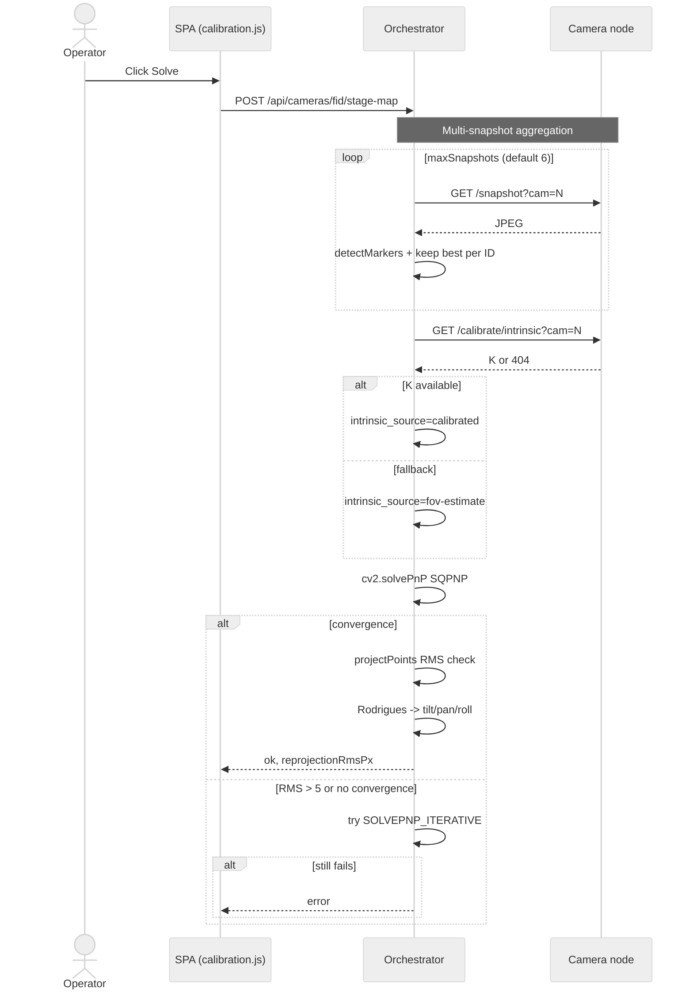
```mermaid
%%{init: {'theme':'neutral'}}%%
sequenceDiagram
    actor Op as Operator
    participant SPA as SPA (calibration.js)
    participant Orch as Orchestrator
    participant Cam as Camera node

    Op->>SPA: Click Solve
    SPA->>Orch: POST /api/cameras/fid/stage-map

    Note over Orch,Cam: Multi-snapshot aggregation
    loop maxSnapshots (default 6)
        Orch->>Cam: GET /snapshot?cam=N
        Cam-->>Orch: JPEG
        Orch->>Orch: detectMarkers + keep best per ID
    end

    Orch->>Cam: GET /calibrate/intrinsic?cam=N
    Cam-->>Orch: K or 404
    alt K available
        Orch->>Orch: intrinsic_source=calibrated
    else fallback
        Orch->>Orch: intrinsic_source=fov-estimate
    end

    Orch->>Orch: cv2.solvePnP SQPNP
    alt convergence
        Orch->>Orch: projectPoints RMS check
        Orch->>Orch: Rodrigues -> tilt/pan/roll
        Orch-->>SPA: ok, reprojectionRmsPx
    else RMS > 5 or no convergence
        Orch->>Orch: try SOLVEPNP_ITERATIVE
        alt still fails
            Orch-->>SPA: error
        end
    end
```

**Endpoint** — `POST /api/cameras/<fid>/stage-map` with `{cam, markers, markerSize, maxSnapshots}`.

**Preconditions** — ≥3 surveyed markers registered (or ≥2 if all floor-coplanar), each visible in at least one snapshot. Multi-snapshot aggregation handles frame-to-frame transients; six snapshots is a good default.

**Algorithm** — for each snapshot, the orchestrator detects markers and keeps the single detection with the largest perimeter per ID (largest = closest = best sub-pixel corners). Correspondences from each detected corner to the surveyed 3D point feed into `cv2.solvePnP(..., flags=SOLVEPNP_SQPNP)`, with `SOLVEPNP_ITERATIVE` as a fallback solver.

**Expected timing** — one multi-snapshot run: 5–10 s (dominated by snapshot capture).

**Output** — `tvec` (stage mm) → camera position; `rvec` → Rodrigues → tilt/pan/roll → stored in `camera.rotation` using schema v2 (§A.9). Also reports `reprojectionRmsPx`.

**Fallbacks**

| Failure | Behaviour | Operator action |
|---------|-----------|-----------------|
| Fewer than 3 markers matched across all snapshots | Error; pose not updated | Add markers or reposition camera |
| SQPNP does not converge | Retry with `SOLVEPNP_ITERATIVE` | None automatic |
| Reprojection RMS > 5 px | Pose stored but flagged | Verify surveyed marker positions and `markerSize`; recapture intrinsics |
| No intrinsics on camera | Fall back to FOV-derived K, report `intrinsic_source: "fov-estimate"` | Run §A.3 for better accuracy |

### A.5 Dark-reference capture (#651)

A dark-reference frame is a snapshot taken with all calibration beams off so that beam detection in subsequent calibration steps can subtract ambient lighting.

**Endpoint** — `POST /dark-reference` on the camera node, body `{cam: -1}` (all cameras) or `{cam: N}`.

**Behaviour** — captures one frame per camera, stores in the `BeamDetector` in-memory buffer (not persisted across reboots).

**Expected timing** — ~100 ms per camera (V4L2 frame grab).

**When it runs** — automatically at the start of each mover calibration run (see Appendix B §B.3). Can also be triggered manually before running beam-detect calls.

**Fallback** — if the beam detector module is not available on the node, the endpoint returns 503 and the caller proceeds without dark-reference subtraction. Beam detection still works but is more sensitive to ambient light.

### A.6 Point cloud + multi-camera merge

Point-cloud generation produces a 3D representation of the stage from monocular depth plus camera pose. It is optional — only needed for features that reason about stage surfaces (mover-calibration target filtering, tracking, spatial effects on arbitrary geometry).

**Camera-side endpoint** — `POST /point-cloud` with `{cam, maxPoints, maxDepthMm}`. Returns `{points: [[x,y,z,r,g,b], ...], pointCount, inferenceMs, calibrated, fovDeg}`.

**Depth models**

| Model | File | Output | Typical inference on ARM |
|-------|------|--------|--------------------------|
| Metric (Depth-Anything-V2 Metric Indoor Small) | `/opt/slyled/models/depth_anything_v2_metric_indoor.onnx` | Depth in mm directly | ~6.5 s / frame |
| Disparity (Depth-Anything-V2 Small, fallback) | `/opt/slyled/models/depth_anything_v2_small.onnx` | Normalized [0,1]; caller scales by `maxDepthMm` | ~6.5 s / frame |

The camera selects the metric model by default; the disparity model is a fallback when the metric file is absent. Preference file: `/opt/slyled/models/active_depth_model`.

**Multi-camera merge** — `POST /api/space/scan` on the orchestrator runs, in order:

1. Fetch per-camera point clouds (try `/point-cloud` on the node; orchestrator-side depth if camera path unavailable).
2. Per-camera depth anchor (#581) — two-parameter `scale + offset` least-squares fit so monocular depth agrees with stage geometry. Reject outliers >2σ, refit. If RMS > 2000 mm, fall back to a median-based coarse fit.
3. Transform to stage coordinates using the camera's stored rotation + position.
4. Cross-camera consistency filter (#582) — if ≥2 cameras are present, reject points that appear in only one camera's view where another camera should have seen them (filters monocular hallucinations).
5. Floor normalization — compute 5th-percentile Z per camera, shift cloud so the average floor lands at Z=0; fall back to RANSAC floor detection if the camera-anchored method fails.
6. Z-marker alignment (#599) — if any registered marker has `z < 50 mm` and zero rotation, treat it as ground truth and shift the cloud so those markers sit at Z=0.

**Expected timing** — 30–60 s end-to-end for a typical two-camera setup; dominated by per-camera depth inference.

**Anchor quality classification** in the response (`depthAnchor.quality`): `"ok"` (RMS ≤ 500 mm), `"degraded"` (500–2000 mm), `"fallback"` (>2000 mm, median fit used). Degraded or fallback quality means downstream features (surface fitting, tracking) may be inaccurate.

### A.7 Surface analysis (RANSAC)

After a merged point cloud is available, `desktop/shared/surface_analyzer.py` extracts structural surfaces so the orchestrator can reason about them (obstacle-aware target picking, beam-surface intersection for mover calibration).

| Surface | Algorithm | Expected runtime | Failure mode |
|---------|-----------|------------------|--------------|
| Floor | RANSAC up to 200 trials, sample 3 points, plane fit, require vertical normal (dot-z > 0.95), ≥5% inlier share | 100–500 ms | Too few inliers → no floor reported |
| Walls | RANSAC on non-floor points, 2-point vertical-plane fit, ≥50 inliers or ≥5%, max 4 walls | 500 ms–2 s total | Silent; fewer walls reported |
| Obstacles | 300 mm XY grid + flood-fill, cluster size ≥20 points, classify as `pillar` if tall+thin else `obstacle` | 100–500 ms | Silent; sparse clusters rejected |

**Ray-cast intersection** — `beam_surface_check()` answers "which surface does a beam ray hit first?" Used by mover calibration to interpret detected-beam pixels as stage points when the beam lands on a wall or pillar rather than the floor (see #585/#260). Typical runtime 10–50 ms.

### A.8 Beam detection (interface used by mover calibration)

Beam detection is documented here because it is *how the camera pipeline feeds moving-head calibration* (Appendix B). The endpoints live on the camera node.

| Method | Path | Purpose | Typical runtime |
|--------|------|---------|-----------------|
| POST | `/beam-detect` | Single-frame detection; color filter + brightness + saturation + compactness | <100 ms |
| POST | `/beam-detect/flash` | Capture ON frame → wait `offDelayMs` → capture OFF → diff; immune to ambient shifts | <100 ms + `offDelayMs` |
| POST | `/beam-detect/center` | Multi-beam fixture: detect N beams, return cluster centre | <150 ms |

Color filtering uses HSV hue ranges (`beam_detector.py`): red `[0,60] ∪ [168,180]`, green `[35,85]`, blue `[100,130]`, magenta `[140,170]`; white falls back to brightness only.

**Validation checks per contour**: mean-V ≥ 160 (brightness); mean-S ≥ 80 for colored beams (saturation); aspect ≤ 5 (compactness).

### A.9 Rotation schema v2 (axis convention)

Camera and DMX fixture rotations share a unified convention (issues #586, #600). `fixture.rotation` is a list `[rx, ry, rz]` in **degrees**, axis-letter-matched to the Z-up stage frame:

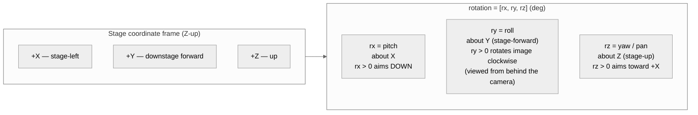
```mermaid
%%{init: {'theme':'neutral'}}%%
flowchart LR
    subgraph Stage["Stage coordinate frame (Z-up)"]
        X["+X — stage-left"]
        Y["+Y — downstage forward"]
        Z["+Z — up"]
    end

    subgraph Rotation["rotation = [rx, ry, rz] (deg)"]
        RX["rx = pitch<br/>about X<br/>rx > 0 aims DOWN"]
        RY["ry = roll<br/>about Y (stage-forward)<br/>ry > 0 rotates image clockwise<br/>(viewed from behind the camera)"]
        RZ["rz = yaw / pan<br/>about Z (stage-up)<br/>rz > 0 aims toward +X"]
    end

    Stage --> Rotation
```

**Canonical read path** — always route through:

- Python: `desktop/shared/camera_math.py::rotation_from_layout(rot) → (tilt, pan, roll)`, then `build_camera_to_stage(tilt, pan, roll)` for the 3×3 matrix.
- SPA: `rotationFromLayout(rot)` in `spa/js/app.js`.

**Never read `rotation[1]` or `rotation[2]` directly** — those indices swap between v1 and v2 files.

**Schema migration** — imported project files carrying `layout.rotationSchemaVersion < 2` (or missing) have `ry` and `rz` swapped on load (v1 used `ry=pan, rz=roll`; v2 uses `ry=roll, rz=pan`). Current exports always write `rotationSchemaVersion: 2`.

### A.10 Failure modes & operator expectations

| Phase | Symptom | Probable cause | Operator action |
|-------|---------|----------------|-----------------|
| Marker survey | Coverage recommendation persists after adding markers | Marker outside every camera's FOV | Move marker toward the recommended pin, or reposition camera |
| Intrinsic capture | "Board not found" | Lighting too low, angle too oblique, printout wavy | Flatten print, reposition, add light |
| Intrinsic compute | RMS > 1.0 px | Too few frames, poor angle variety | Capture 10+ more frames from diverse angles |
| Extrinsic solve | `markersMatched < 3` | Markers not visible in any snapshot | Increase `maxSnapshots`, reposition camera, add markers |
| Extrinsic solve | `reprojectionRmsPx > 5` | Bad intrinsics or wrong `markerSize` | Run §A.3; verify physical marker size matches registry |
| Extrinsic solve | `intrinsic_source: fov-estimate` | Camera has no saved intrinsic calibration | Optional: run §A.3 for ±2–5 px accuracy instead of ±10–20 px |
| Dark reference | 503 response | Beam detector module missing on camera | Redeploy firmware from the Firmware tab |
| Depth estimate | "model unavailable" | ONNX file not deployed | Deploy via Firmware → Camera tab |
| Anchor fit | `quality: fallback` | Monocular depth disagrees strongly with stage geometry | Verify stage bounds and camera pose; may be a solvePnP error upstream |
| Surface analysis | No floor reported | Cloud too sparse or noisy, camera aimed too high | Add cameras, aim lower, verify depth model |

### A.11 File locations & persistence

| Data | Location | Format | Notes |
|------|----------|--------|-------|
| ArUco registry | `desktop/shared/data/aruco_markers.json` | JSON list | Persisted on every marker POST/DELETE |
| Camera fixtures | `desktop/shared/data/fixtures.json` | JSON list | Includes stored pose + rotation |
| Layout positions | `desktop/shared/data/layout.json` | JSON | Must carry `rotationSchemaVersion: 2` |
| Intrinsic calibration (camera-side) | `/opt/slyled/calib/intrinsic_camN.json` | JSON | `fx, fy, cx, cy, distCoeffs, imageSize, rmsError, frameCount` |
| Point cloud cache | `desktop/shared/data/pointcloud.json` | JSON | From last `/api/space/scan` run |

---

<a id="appendix-b"></a>

## Appendix B — Moving-Head Calibration Pipeline (DRAFT)

> ⚠ **DRAFT — assumes all in-flight work is merged.** This appendix describes the moving-head-calibration pipeline as if issues #610, #651–#661, #653–#655, #658–#661, and #357 are fully implemented. Some features documented below are **partially merged** today (notably global per-phase time budgets per #653, full held-out parametric gating of the `moverCalibrated` flag per #654, adaptive battleship density scaling per #661, and the floor-view polygon target filter per #659). See `docs/DOCS_MAINTENANCE.md` for the current merge status and the criteria for removing this banner. Issue [#662](https://github.com/SlyWombat/SlyLED/issues/662).

Moving-head calibration runs per [DMX](#glossary) moving-head fixture after the camera(s) covering its reachable region have been calibrated (Appendix A). It produces a sample set + parametric 6-[DOF](#glossary) [kinematic model](#glossary) that lets the orchestrator translate stage-space targets into exact pan/tilt DMX values, enabling [IK](#glossary) (inverse kinematics) for the Track action and spatial effects.

### B.1 Pipeline overview

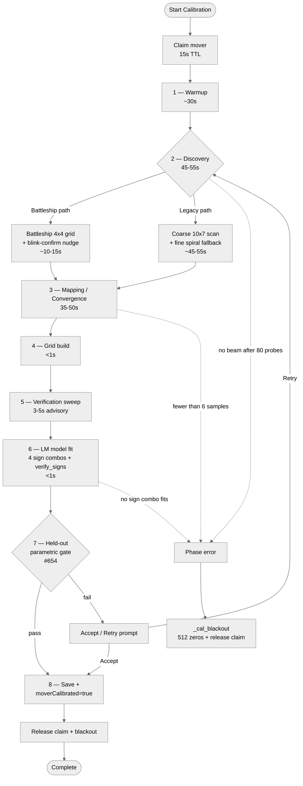
```mermaid
%%{init: {'theme':'neutral'}}%%
flowchart TD
    Start([Start Calibration]) --> Claim[Claim mover<br/>15s TTL]
    Claim --> Warmup[1 — Warmup<br/>~30s]
    Warmup --> Discovery{2 — Discovery<br/>45-55s}
    Discovery -->|Battleship path| BS[Battleship 4x4 grid<br/>+ blink-confirm nudge<br/>~10-15s]
    Discovery -->|Legacy path| Coarse[Coarse 10x7 scan<br/>+ fine spiral fallback<br/>~45-55s]
    BS --> MapConv[3 — Mapping / Convergence<br/>35-50s]
    Coarse --> MapConv
    MapConv --> Grid[4 — Grid build<br/>&lt;1s]
    Grid --> Verify[5 — Verification sweep<br/>3-5s advisory]
    Verify --> Fit[6 — LM model fit<br/>4 sign combos + verify_signs<br/>&lt;1s]
    Fit --> HoldOut{7 — Held-out<br/>parametric gate<br/>#654}
    HoldOut -->|pass| Save[8 — Save +<br/>moverCalibrated=true]
    HoldOut -->|fail| OperatorRetry[Accept / Retry prompt]
    OperatorRetry -->|Retry| Discovery
    OperatorRetry -->|Accept| Save
    Save --> Release[Release claim + blackout]
    Release --> Done([Complete])

    Discovery -.->|no beam after 80 probes| Error
    MapConv -.->|fewer than 6 samples| Error
    Fit -.->|no sign combo fits| Error
    Error[Phase error] --> Blackout[_cal_blackout<br/>512 zeros + release claim]
```

### B.2 Phase reference

| # | Phase | Status string | Typical duration | Progress % | Fallback on failure |
|---|-------|---------------|------------------|------------|---------------------|
| 1 | Warmup | `warmup` | 30 s (configurable via `warmupSeconds`) | 2–8 | Log warning, continue without warmup |
| 2 | Discovery (legacy) | `discovery` | 45–55 s | 10–30 | Abort with `error` status after 80 probes |
| 2′ | Discovery (battleship) | `battleship` → `confirming` | 10–15 s | 10–25 | Abort with `error`; can fall back to legacy discovery |
| 3 | Mapping (legacy BFS) | `mapping` | 35–50 s | 35–70 | Abort if <6 samples |
| 3′ | Convergence (v2) | `sampling` | 30–60 s (N targets × ~1 s each) | 30–70 | Abort if convergence fails on multiple targets |
| 4 | Grid build | `grid` | <1 s | ~80 | Abort if sample spread insufficient |
| 5 | Verification sweep | `verification` | 3–5 s (3 held-out points) | ~90 | **Advisory only** — does not block save |
| 6 | Model fit (LM) | `fitting` | <1 s | 85–95 | Abort if all 4 sign combos fail |
| 7 | Held-out parametric gate (#654) | `holdout` | 2–5 s (N unseen targets) | 95–98 | Surface Accept/Retry prompt |
| 8 | Save | `complete` | <1 s | 100 | Write error logged but does not affect moverCalibrated flag |

Additional top-level statuses: `cancelled`, `error`, `done`.

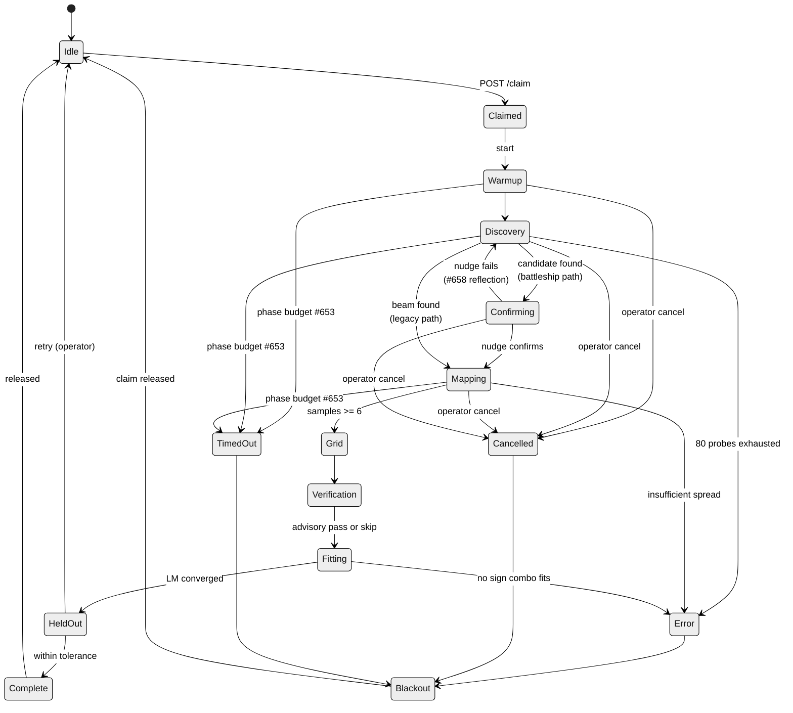
```mermaid
%%{init: {'theme':'neutral'}}%%
stateDiagram-v2
    [*] --> Idle
    Idle --> Claimed: POST /claim
    Claimed --> Warmup: start
    Warmup --> Discovery
    Discovery --> Confirming: candidate found<br/>(battleship path)
    Confirming --> Discovery: nudge fails<br/>(#658 reflection)
    Confirming --> Mapping: nudge confirms
    Discovery --> Mapping: beam found<br/>(legacy path)
    Mapping --> Grid: samples >= 6
    Grid --> Verification
    Verification --> Fitting: advisory pass or skip
    Fitting --> HeldOut: LM converged
    HeldOut --> Complete: within tolerance
    HeldOut --> Idle: retry (operator)
    Complete --> Idle: released

    Discovery --> Error: 80 probes exhausted
    Mapping --> Error: insufficient spread
    Fitting --> Error: no sign combo fits
    Error --> Blackout
    Warmup --> Cancelled: operator cancel
    Discovery --> Cancelled: operator cancel
    Mapping --> Cancelled: operator cancel
    Confirming --> Cancelled: operator cancel
    Cancelled --> Blackout

    Warmup --> TimedOut: phase budget #653
    Discovery --> TimedOut: phase budget #653
    Mapping --> TimedOut: phase budget #653
    TimedOut --> Blackout

    Blackout --> Idle: claim released
```

### B.3 Phase-by-phase detail

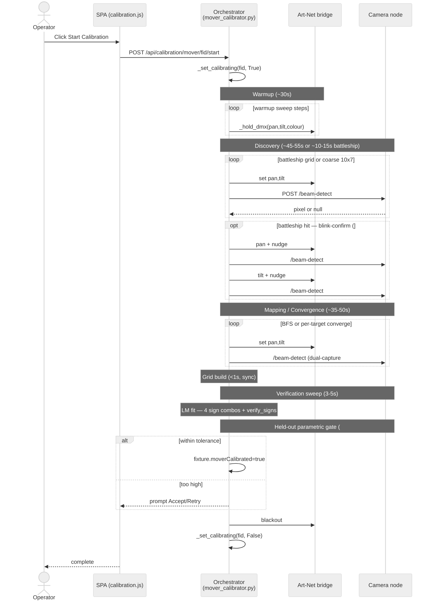
```mermaid
%%{init: {'theme':'neutral'}}%%
sequenceDiagram
    actor Op as Operator
    participant SPA as SPA (calibration.js)
    participant Orch as Orchestrator<br/>(mover_calibrator.py)
    participant DMX as Art-Net bridge
    participant Cam as Camera node

    Op->>SPA: Click Start Calibration
    SPA->>Orch: POST /api/calibration/mover/fid/start
    Orch->>Orch: _set_calibrating(fid, True)

    Note over Orch,DMX: Warmup (~30s)
    loop warmup sweep steps
        Orch->>DMX: _hold_dmx(pan,tilt,colour)
    end

    Note over Orch,Cam: Discovery (~45-55s or ~10-15s battleship)
    loop battleship grid or coarse 10x7
        Orch->>DMX: set pan,tilt
        Orch->>Cam: POST /beam-detect
        Cam-->>Orch: pixel or null
    end
    opt battleship hit — blink-confirm (#658)
        Orch->>DMX: pan + nudge
        Orch->>Cam: /beam-detect
        Orch->>DMX: tilt + nudge
        Orch->>Cam: /beam-detect
    end

    Note over Orch,Cam: Mapping / Convergence (~35-50s)
    loop BFS or per-target converge
        Orch->>DMX: set pan,tilt
        Orch->>Cam: /beam-detect (dual-capture #655)
    end

    Note over Orch: Grid build (<1s, sync)
    Note over Orch,Cam: Verification sweep (3-5s)
    Note over Orch: LM fit — 4 sign combos + verify_signs
    Note over Orch,Cam: Held-out parametric gate (#654)

    alt within tolerance
        Orch->>Orch: fixture.moverCalibrated=true
    else too high
        Orch-->>SPA: prompt Accept/Retry
    end

    Orch->>DMX: blackout
    Orch->>Orch: _set_calibrating(fid, False)
    SPA-->>Op: complete
```

#### 1. Warmup

- **Purpose** — cycle the fixture through full pan/tilt range so motor belts are thermally and mechanically settled before measurements start. Reduces backlash artifacts in early samples.
- **Preconditions** — valid DMX profile on fixture; Art-Net engine running; calibration lock engaged.
- **Expected duration** — 30 s by default (`warmupSeconds` parameter). Six sub-sweeps (pan±, tilt±, two diagonals) × 20 steps each, ~0.25 s per step.
- **Operator expectation** — beam sweeps visibly across the stage; progress bar creeps from 2% to 8%.
- **Fallback** — if warmup raises an exception, log warning and skip; calibration continues.
- **Cancel** — `_check_cancel()` inside each `_hold_dmx` loop raises `CalibrationAborted`.

#### 2. Discovery

Two code paths exist. The battleship path is preferred when camera homography is reliable; legacy path is the fallback when homography is unavailable (e.g. no surveyed markers visible).

**Battleship (preferred, `battleship` + `confirming` status):**

- Coarse 4×4 grid at pan/tilt bin centres `{0.125, 0.375, 0.625, 0.875}²` — 16 probes. Per #661, grid density scales with pan range and expected beam width; defaults to 4×4 but can reduce to 3×3 or expand to 5×5 for wide-pan fixtures.
- On the first detected pixel candidate, run the **blink-confirm** routine (#658): nudge pan by `confirm_nudge_delta` (≈ 0.02 of full range) and verify the detected pixel moves; nudge tilt likewise. If **both** pixel deltas exceed `min_delta`, the candidate is confirmed. Otherwise it was a reflection and is rejected — discovery resumes.
- **Expected duration** 10–15 s (16 probes × 0.6 s settle, plus 4 nudges × 0.6 s when a candidate hits).
- **Fallback on failure** — fall through to the legacy coarse+spiral path, or abort to `error`.

**Legacy (`discovery` status):**

- Initial probe at the warmstart aim (model prediction or geometric estimate from camera FOV).
- Coarse 10×7 grid: pan bins `0.02 + 0.96·i/9`, tilt bins `0.1 + 0.85·j/6` — 70 probes. Per-probe settle `SETTLE = 0.6 s` (legacy discovery uses the fixed constant; the #655 adaptive-settle machinery documented in the mapping phase does not apply here).
- If the coarse sweep misses, spiral outward from the warmstart aim in rectangular shells at `STEP = 0.05`, up to `MAX_PROBES = 80` total.
- **Expected duration** — 45–55 s worst-case.
- **Fallback on failure** — abort with `error`; call `_cal_blackout()`.

**Operator expectations** — beam sweeps through a visible grid of positions. If the beam is clearly landing where the camera can see it but detection fails, check §A.5 dark-reference and §A.8 color filter config.

#### 3. Mapping (legacy BFS) / Convergence (v2)

**Legacy BFS (`mapping` status):**

- BFS from the discovered `(pan, tilt, pixel)` seed. Each step detects the beam and, on success, enqueues four neighbours (up/down/left/right by `STEP`). Beam loss marks the current cell as a visible-region boundary; stale detections (where the pixel barely moves despite a large pan/tilt delta) are rejected as noise.
- Adaptive settle (#655) scales per-probe settle time by movement distance, with escalation levels `[0.4, 0.8, 1.5] s`. Dual-capture with a 0.2 s verify gap and a 30-pixel drift threshold filters mid-move frames; median filtering across the capture pair rejects outliers.
- **Targets** — `_map_target = 50` samples (hard minimum 6; bounded by `MAX_SAMPLES = 80`).
- **Expected duration** — 35–50 s.

**v2 Convergence (`sampling` status):**

- For each target from `pick_calibration_targets` (filtered through the camera floor-view polygon per #659), converge the beam on the target pixel via `converge_on_target_pixel`.
- **Bracket-and-retry refine (#660)** — initial `bracket_step = 0.08`. When the beam is lost, halve the step and walk back toward the best-known-good offset in the error direction. Bracket floor `BRACKET_FLOOR = 0.002`. Reset `bracket_step` to 0.08 on beam re-acquisition. Typical convergence: 5–10 iterations; max 25.
- **Expected duration** — 30–60 s (N targets × ~1 s each).

**Fallback** — if fewer than 6 samples are collected, abort with `error`.

#### 4. Grid build

- Pure compute: extract unique pan/tilt values from samples, sort, nearest-neighbour fill for missing cells.
- **Expected duration** — <100 ms, no I/O.
- **Fallback** — if sample spread insufficient to form a grid, abort with `error`.

#### 5. Verification sweep

- Pick 3 random targets inside the grid bounds, avoiding fit samples by ≥0.05 pan/tilt margin, with a 10% interior shrink to dodge weak-interpolation edges.
- For each: predict pixel via grid lookup, detect actual beam, compute pixel error.
- **Expected duration** — 3–5 s (3 × ~1 s settle+detect).
- **Advisory only** — logs a warning if any point fails; does **not** block the save.

#### 6. Model fit (parametric, Levenberg-Marquardt)

- Try all four sign combinations `(pan_sign, tilt_sign) ∈ {±1}²`. For each combo, run `scipy.optimize.least_squares` with `soft_l1` loss (`f_scale=0.05`) over five continuous parameters (mount yaw/pitch/roll + pan/tilt offsets); up to 120 iterations.
- Sort candidates by RMS error; pick the best. If the top two candidates agree to within 0.2°, log a mirror-ambiguity warning.
- **Sign verification (§8.1)** — after fit, nudge pan by +0.02 and detect the pixel shift; nudge tilt +0.02 and do the same. Compute the sign of `Δpx · pan_axis_sign_in_frame` (default +1) → pan_sign; and `Δpy · tilt_axis_sign_in_frame` (default -1) → tilt_sign. Re-fit with `force_signs=(pan_sign, tilt_sign)` to resolve the mirror.
- **Expected duration** — <1 s including verify_signs probes.
- **Fallback** — if all 4 combos fail to converge, raise `RuntimeError`; caller aborts with `error`.

#### 7. Held-out parametric gate (#654)

- After fit, drive the fixture to 2–3 **unseen** targets (not used in discovery, mapping, or verification) and measure pixel-level residual against model prediction.
- If residual is within tolerance, set `fixture["moverCalibrated"] = True`.
- If residual exceeds tolerance, return the result to the SPA as an Accept/Retry prompt: operator may accept (flag still set, marked as degraded) or retry calibration from discovery.
- **Expected duration** — 2–5 s.

#### 8. Save + release

- Persist `samples`, `model` dict, `fitQuality` metrics, and per-phase metadata to `desktop/shared/data/fixtures.json`.
- Set `fixture["moverCalibrated"] = True` (if not already).
- Release the calibration lock via `_set_calibrating(fid, False)` — the mover-follow engine resumes writing pan/tilt.
- Blackout the fixture.

### B.4 Time budget + blackout-on-timeout (#653)

Each phase has a per-phase wall-clock budget. If exceeded, the phase raises `PhaseTimeout`, caught by the top-level calibration thread, which then:

1. Calls `_cal_blackout()` — sends 512 zeros to the fixture's universe for 0.3 s.
2. Releases the calibration lock.
3. Sets `job["status"] = "error"`, `job["phase"] = "<phase>_timeout"`.
4. Flags `tier-2 handoff` in the status dict so the SPA can suggest the next diagnostic tier.

Default budgets (can be overridden per fixture via `calibrationBudgets` in settings):

| Phase | Default budget |
|-------|----------------|
| Warmup | 60 s |
| Discovery | 120 s |
| Mapping / Convergence | 180 s |
| Grid build | 10 s |
| Verification sweep | 30 s |
| Model fit | 15 s |
| Held-out gate | 30 s |

Total default budget: ~7.5 min, well above the typical 2–4 min runtime.

### B.5 Abort path

Cancellation can originate from three sources: operator (`POST /api/calibration/mover/<fid>/cancel`), phase timeout (§B.4), or an unhandled exception. All three converge on the same cleanup:

1. **Foreground immediate blackout** (operator-initiated only): on the `/cancel` request, the orchestrator zeroes the fixture's channel window on the running Art-Net engine buffer in the foreground, so the next 25 ms frame carries zeros to the bridge — the operator sees the light go off immediately.
2. **Background unwind**: the calibration thread sets `_cancel_event`, which `_check_cancel()` inside `_hold_dmx` picks up and raises `CalibrationAborted`. The exception propagates to `_mover_cal_thread`, which catches it, calls `_cal_blackout()` (512 zeros + release), sets `status = "cancelled"`, `phase = "cancelled"`.
3. **Lock release** — `_set_calibrating(fid, False)` is always called in the cleanup, regardless of which path triggered the cancel.

### B.6 Failure modes & operator diagnostics

| Symptom | Probable cause | What to check / try |
|---------|----------------|---------------------|
| Discovery completes 80 probes without finding beam | Beam too dim, camera can't see it, wrong colour, mover not actually on | Verify fixture is powered and responding; increase threshold; run Fixture Orientation Test (§14); check §A.8 colour configuration; dim room lights |
| Discovery finds beam immediately but blink-confirm always rejects | Reflective surface (mirror, glass, polished floor) being detected instead of beam | Add diffuse material over the reflector; pick a different beam colour; move the mover's warmstart aim away from the reflector |
| Mapping / convergence aborts with "fewer than 6 samples" | BFS boundary is too narrow — camera sees only a small slice of the pan/tilt range | Reposition camera to see more of the floor; increase camera count; verify mover's position in layout matches reality |
| `moverCalibrated` flag never sets | Held-out gate is failing | Check the Accept/Retry prompt; if residual is reported, an Accept keeps the flag but marks it degraded; a full Retry restarts from discovery |
| Sign verification logs mirror ambiguity | Fit sees two equally good sign combos | Check physical mover pan/tilt direction against §14 Fixture Orientation Test; may need to toggle Invert Pan/Tilt or Swap Pan/Tilt flags |
| Calibration "hangs" at a phase | Phase budget (#653) not yet triggered; or Art-Net engine stopped mid-run | Wait up to the phase budget; check engine is running (`POST /api/dmx/start` if not); if still stuck, cancel and check orchestrator log |
| Light flashes momentarily then stops, status stays `running` | Foreground cancel happened but background thread is still unwinding | Normal; background cleanup completes within 1–2 s |

### B.7 Tuning-parameter reference

Constants in `desktop/shared/mover_calibrator.py`:

| Constant | Default | Role |
|----------|---------|------|
| `SETTLE` (legacy) | 0.6 s | Per-probe settle before detection |
| `SETTLE_BASE` (#655) | 0.4 s | Adaptive-settle base before escalation |
| `SETTLE_ESCALATION` | `[0.4, 0.8, 1.5]` s | Escalation tiers on pixel-drift retry |
| `SETTLE_VERIFY_GAP` | 0.2 s | Dual-capture spacing for median filter |
| `SETTLE_PIXEL_THRESH` | 30 px | Inter-capture drift threshold for "settled" |
| `STEP` | 0.05 | Fine spiral step size (normalized pan/tilt) |
| `MAX_SAMPLES` | 80 | Hard cap on BFS samples |
| `COARSE_PAN` | 10 | Legacy coarse grid pan bins |
| `COARSE_TILT` | 7 | Legacy coarse grid tilt bins |
| `BRACKET_FLOOR` | 0.002 | Convergence refine floor (~1° on 540° pan) |

Constants in `desktop/shared/mover_control.py`:

| Constant | Default | Role |
|----------|---------|------|
| Claim TTL | 15 s | Auto-release if claim not refreshed |

### B.8 Related features

- **Unified mover control** — see CLAUDE.md §"Unified mover control (gyro + Android)". Calibration must complete and `moverCalibrated` must be set before manual mover-control (gyro/phone) will use the parametric model; without it, the control layer falls back to raw DMX pan/tilt passthrough.
- **Fixture Orientation Test** — §14 "Fixture Orientation Test". Run this first if the pan/tilt axes in the physical fixture don't match expectations.
- **Track Action** — §8 "Track Action". Consumes the interpolation grid + parametric model to aim at moving subjects.

---

<a id="appendix-c"></a>

## Appendix C — Documentation Maintenance

> This appendix describes the contract between the calibration appendices above and the source code that implements them. It exists for issue [#662](https://github.com/SlyWombat/SlyLED/issues/662) and is kept short — full details are in `docs/DOCS_MAINTENANCE.md`.

### C.1 Source-of-truth files

Any PR that changes calibration behaviour in one of these files is expected to include an Appendix A or B review in the same PR:

**Mover calibration:** `desktop/shared/mover_calibrator.py`, `mover_control.py`, `parametric_mover.py`, `desktop/shared/spa/js/calibration.js`, `desktop/shared/parent_server.py` (routes `/api/calibration/mover/*`).

**Camera calibration:** `firmware/orangepi/camera_server.py`, `beam_detector.py`, `depth_estimator.py`, `desktop/shared/space_mapper.py`, `surface_analyzer.py`, `camera_math.py`, `desktop/shared/parent_server.py` (routes `/api/aruco/markers*`, `/api/cameras/<fid>/stage-map`, `/api/cameras/<fid>/aruco/*`, `/api/cameras/<fid>/intrinsic*`, `/api/cameras/<fid>/beam-detect`, `/api/space/scan`).

### C.2 Reviewer checklist (short form)

On a calibration-touching PR, confirm:

- Phase names in `mover_calibrator.py` match the Appendix B §B.2 table
- Timeout constants in the §B.7 table still match code
- Endpoint paths + request/response shapes in Appendix A match Flask route signatures
- Rotation-schema v2 (§A.9) still matches `camera_math.py::rotation_from_layout`
- Status strings written to the calibration-status dict match the state machine diagram

The full checklist, including render verification for the Mermaid diagrams under `docs/diagrams/` and the DRAFT-banner removal criteria, is in `docs/DOCS_MAINTENANCE.md`.

### C.3 Regenerating the manual

- Canonical source: `docs/USER_MANUAL.md` (this file).
- `docs/SlyLED_User_Manual.docx` + `.pdf` are **built separately** by `tests/build_manual.py`, which constructs the document from scratch rather than parsing this markdown. The docx/PDF path does not yet include these appendices — follow-up work.
- Diagram sources live in `docs/diagrams/*.mmd`. Mermaid blocks are embedded inline in the markdown so GitHub renders them directly; external renderers like Kroki can generate SVG/PNG from the standalone files for PDF inclusion.

### C.4 Enforcement

No automatic drift-check is wired up yet. Proposed options, in order of cost:

1. PR-template checkbox (`.github/pull_request_template.md`)
2. GitHub Actions grep: fail PRs that touch the source-of-truth list without touching `docs/USER_MANUAL.md`, with a skip-override label
3. Scheduled drift agent (weekly)

These require `.github/` changes and are tracked as follow-ups under #662.

### C.5 DRAFT banner removal

The DRAFT banners on Appendix A and B should be removed once the in-flight items listed in `docs/DOCS_MAINTENANCE.md §"When to bump the DRAFT banner"` are all confirmed merged. At the time this appendix was drafted (2026-04-23), the following are known to be partial or not yet in code: #653 time budgets, #654 held-out parametric gate, #655 full median oversample, #658 blink-confirm on non-battleship path, #659 floor-view polygon target filter, #661 adaptive battleship density.
