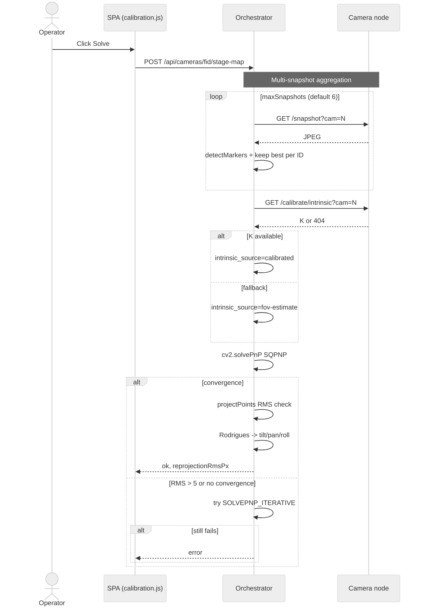
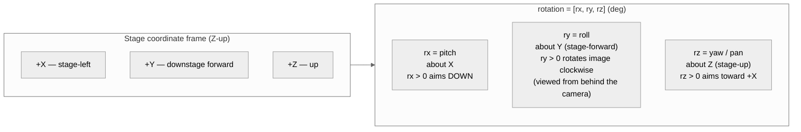
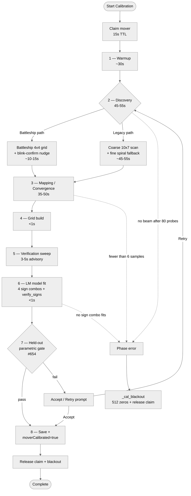
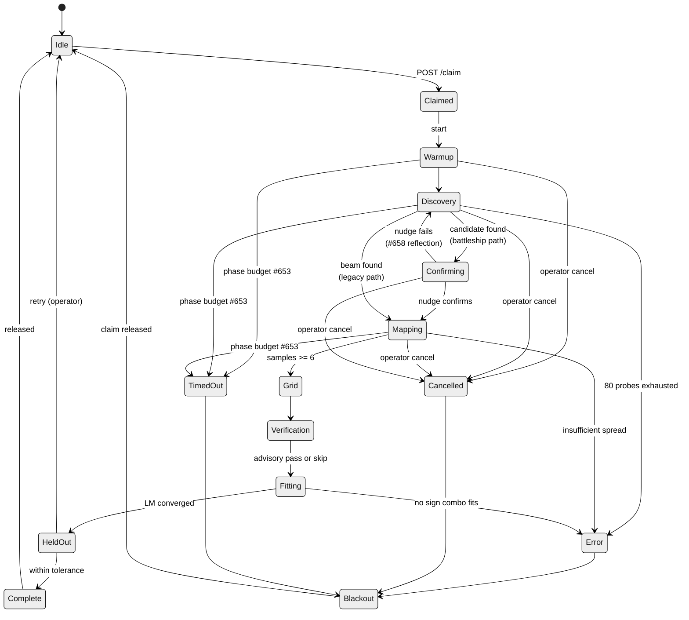
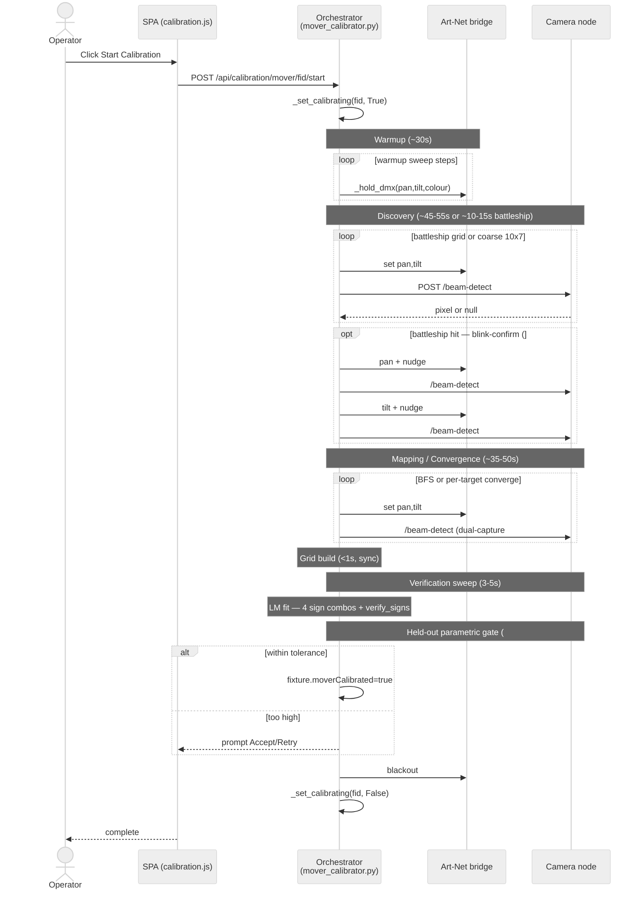

# Manuel d'utilisation SlyLED — Système d'éclairage volumétrique 3D (v1.0)

> **Licence.** SlyLED est distribué sous la licence [PolyForm Noncommercial 1.0.0](https://polyformproject.org/licenses/noncommercial/1.0.0/) — **gratuit pour un usage personnel, amateur, éducatif, de recherche et à but non lucratif**. Les engagements rémunérés auprès de clients, l'usage interne en entreprise à but lucratif, l'intégration dans des produits commerciaux et les services payants basés sur SlyLED nécessitent une licence commerciale distincte. Voir <https://electricrv.ca/slyled/licensing> ou écrire à <info@electricrv.ca>.

## Table des matières
1. [Premiers pas](#1-getting-started)
2. [Visite guidée : votre premier spectacle en 30 minutes](#2-walkthrough)
3. [Guide des plateformes](#3-platforms)
4. [Configuration des appareils](#4-fixture-setup)
5. [Disposition du plateau](#5-layout)
6. [Objets de scène](#6-stage-objects)
7. [Création d'effets spatiaux](#7-spatial-effects)
8. [Action de piste](#8-track-action)
9. [Construction d'une chronologie](#9-timeline)
10. [Précalcul et lecture](#10-baking)
11. [Émulateur de prévisualisation](#11-show-preview)
12. [Profils d'appareils DMX](#12-dmx-profiles)
13. [Spectacles préréglés](#13-presets)
14. [Nœuds caméra](#14-cameras)
15. [Firmware et mises à jour OTA](#15-firmware)
16. [Limites du système](#16-limits)
17. [Dépannage](#17-troubleshooting)
18. [Exemples](#18-examples)
19. [Référence rapide de l'API](#19-api)
20. [Glossaire](#glossary)
21. [Annexe A — Chaîne d'étalonnage des caméras (BROUILLON)](#appendix-a)
22. [Annexe B — Chaîne d'étalonnage des projecteurs motorisés (BROUILLON)](#appendix-b)
23. [Annexe C — Maintenance de la documentation](#appendix-c)

---

## 1. Premiers pas

SlyLED est un systeme de controle d'eclairage LED et DMX a trois niveaux :
- **Orchestrateur** (application de bureau Windows/Mac ou application Android) — concevoir des spectacles et controler la lecture
- **Performers** (ESP32/D1 Mini) — executer les effets LED sur le materiel
- **Pont DMX** (Giga R1 WiFi) — transmettre Art-Net/sACN vers les projecteurs DMX

### Demarrage rapide
1. Lancez l'application de bureau : `powershell -File desktop\windows\run.ps1` (Windows) ou `bash desktop/mac/run.sh` (Mac)
2. Ouvrez le navigateur a l'adresse `http://localhost:8080`
3. Allez dans l'onglet **Configuration**, cliquez sur **Decouvrir** pour trouver les Performers sur votre reseau
4. Allez dans l'onglet **Mise en page** pour positionner les projecteurs sur la scene
5. Allez dans l'onglet **Execution**, chargez un **Spectacle predefini**, cliquez sur **Compiler et demarrer**

---

## 2. Walkthrough : premier spectacle en 30 minutes

Ce walkthrough construit un spectacle complet de projecteurs motorisés DMX depuis zéro — découverte matérielle, configuration d'appareils, disposition, enregistrement de caméras, actions, chronologie et lecture. Chaque étape a été validée de bout en bout pendant les tests QA (issue #533). Suivez dans l'ordre ; chaque étape s'appuie sur la précédente.

**Ce dont vous avez besoin :**
- Orchestrateur SlyLED lancé sur Windows ou Mac
- Au moins un projecteur motorisé DMX connecté via un pont Art-Net/sACN (p. ex. Enttec ODE Mk3)
- Au moins un nœud caméra USB sur le réseau (Orange Pi ou Raspberry Pi)
- Tous les appareils sur le même sous-réseau LAN que l'orchestrateur

---

### Étape 1 — Lancer et créer un nouveau projet

Démarrez l'orchestrateur :

```powershell
powershell -File desktop\windows\run.ps1
```

Ouvrez `http://localhost:8080` dans Chrome ou Edge. Le SPA se charge sur l'onglet Tableau de bord.


Allez dans l'onglet **Paramètres** → **Projet** → cliquez sur **Nouveau projet**, puis nommez-le (p. ex. « Walkthrough Show »).


---

### Étape 2 — Définir les dimensions de la scène

Dans **Paramètres** → **Scène**, entrez les dimensions de votre zone de performance :
- Largeur : 6000 mm (6 m)
- Hauteur : 3000 mm (3 m)
- Profondeur : 4000 mm (4 m)

Cliquez sur **Enregistrer**. Le canevas de disposition se redimensionnera pour correspondre à ces dimensions.

---

### Étape 3a — Découvrir le matériel DMX

Allez dans l'onglet **Setup**. Dans la section **DMX Nodes**, cliquez sur **Discover Nodes**. SlyLED diffuse un paquet ArtPoll ; les ponts Art-Net du réseau répondent sous 3 secondes.


Tous les nœuds découverts apparaissent dans la liste avec leur IP, leur port et leur nombre d'univers. Si votre pont n'est pas trouvé :
- Confirmez qu'il est alimenté et sur le même sous-réseau LAN
- Vérifiez que le port UDP 6454 n'est pas bloqué par un pare-feu local
- Certains ponts exigent que l'IP source Art-Net corresponde à leur sous-réseau configuré

---

### Étape 3b — Configurer et démarrer le moteur DMX

Allez dans **Paramètres** → **DMX** :

1. **Routage des univers :** réglez l'univers 1 → votre IP de nœud Art-Net (ou laissez en diffusion `255.255.255.255` pour atteindre tous les nœuds du sous-réseau).
2. Cliquez sur **Start Engine**. L'indicateur d'état devient vert (« Running »).


> **Important :** le moteur doit être en marche avant d'ajouter des appareils DMX ou de lancer un étalonnage. Si vous arrêtez et redémarrez l'orchestrateur, redémarrez le moteur ici.

---

### Étape 4 — Ajouter des appareils projecteur motorisé DMX

Allez dans l'onglet **Setup** → cliquez sur **+ DMX Fixture**. L'assistant d'appareil s'ouvre.

**Trouver le bon profil :**
1. Dans le champ **Search**, tapez le nom de votre appareil (p. ex. « Sly Moving Head Super Mini »)
2. Les résultats affichent d'abord les profils locaux, puis communautaires (depuis la bibliothèque partagée), puis OFL (Open Fixture Library)
3. Si un téléchargement de profil communautaire échoue (« imported: 0 »), il peut contenir des types de canaux non pris en charge — repliez-vous sur un profil générique local ou cherchez directement dans OFL
4. Pour un projecteur motorisé 16 canaux générique sans correspondance exacte, cherchez « moving head » dans OFL et importez la correspondance la plus proche

**Appareil 1 (côté cour, stage left) :**
- Nom : `MH1 SL`
- Univers : 1, adresse de départ : 1
- Profil : votre profil de projecteur motorisé
- Cliquez sur **Create Fixture**


**Appareil 2 (côté jardin, stage right) :**
- Nom : `MH2 SR`
- Univers : 1, adresse de départ : 17
- Profil : même profil
- Cliquez sur **Create Fixture**


---

### Étape 5 — Ajouter un appareil wash ou spot

Ajoutez tout appareil supplémentaire (p. ex. un spot wash 350 W) :
- Nom : `Spot C`
- Univers : 1, adresse de départ : 33
- Profil : votre profil spot/wash


---

### Étape 6 — Enregistrer les nœuds caméra

Toujours sur l'onglet **Setup**, faites défiler jusqu'à la section **Camera Nodes**. Cliquez sur **Discover Cameras**. Les nœuds caméra exécutant `slyled-cam` répondent à la même diffusion UDP que les nœuds exécutants.

Sinon, entrez l'IP de la caméra manuellement et cliquez sur **Add**.

**Caméra 1 (gauche) :**
- IP : l'IP de votre caméra (p. ex. `192.168.10.50`)
- Nom : `Cam Left`

**Caméra 2 (droite) :**
- IP : l'IP de votre seconde caméra
- Nom : `Cam Right`


Chaque caméra apparaît avec un statut en ligne/hors ligne. Cliquez sur **Snap** pour vérifier le flux en direct.


> **Remarque :** la découverte caméra renvoie parfois 0 nœud à la première diffusion à cause du timing UDP. Si aucune caméra n'est trouvée, attendez 3 secondes et cliquez de nouveau sur **Discover**. C'est une intermittence connue (#542) en cours de correction dans une prochaine version.

---

### Étape 7 — Positionner tous les appareils sur la disposition

Passez à l'onglet **Layout**. Tous les appareils ajoutés apparaissent dans la barre latérale gauche comme « non placés ».

**Placer et positionner chaque appareil :**

1. Cliquez sur un appareil dans la barre latérale pour le sélectionner
2. Cliquez sur le canevas pour le placer, ou faites-le glisser depuis la barre latérale
3. Double-cliquez sur l'appareil placé pour ouvrir la boîte de dialogue d'édition et entrer des coordonnées exactes

| Appareil | X (mm) | Y (mm) | Z (mm) |
|----------|--------|--------|--------|
| MH1 SL | 1500 | 3000 | 500 |
| MH2 SR | 4500 | 3000 | 500 |
| Spot C | 3000 | 3000 | 500 |
| Cam Left | 0 | 2500 | 0 |
| Cam Right | 6000 | 2500 | 0 |

Cliquez sur **Enregistrer** après avoir entré les coordonnées de chaque appareil.


> **Astuce :** utilisez la vue 3D (bascule dans la barre d'outils de disposition) pour vérifier visuellement que les projecteurs motorisés sont élevés sur le pont et dirigés vers le sol de la scène.

---

### Étape 8 — Ajouter un objet de scène

Allez dans l'onglet **Layout** → cliquez sur **+ Object** dans la barre d'outils.

- **Nom :** `Music Stand`
- **Type :** Prop (mobile — peut être suivi par les projecteurs motorisés)
- **Position :** X : 3000, Y : 0, Z : 2000 (centre scène, au niveau du sol, mi-profondeur)
- **Taille :** 300 × 1200 × 300 mm

Cliquez sur **Enregistrer**. L'objet apparaît comme un rectangle étiqueté sur le canevas.


---

### Étape 9 — Lancer l'étalonnage des projecteurs motorisés

Avant que les projecteurs motorisés puissent suivre des positions avec précision, étalonnez chacun. Cette étape exige que les nœuds caméra soient positionnés dans la disposition (étape 7) et que le moteur DMX soit en marche (étape 3b).

Dans l'onglet **Layout**, double-cliquez sur `MH1 SL`. Cliquez sur **Calibrate**.


- Sélectionnez **Green** comme couleur de faisceau (bon contraste sur les sols sombres)
- Cliquez sur **Start Calibration**
- L'assistant s'exécute automatiquement à travers huit phases : warmup → découverte → blink-confirm → cartographie/convergence → construction de grille → balayage de vérification → ajustement du modèle → porte paramétrique tenue de côté → sauvegarde
- Répétez pour `MH2 SR`

L'étalonnage prend typiquement de 2 à 4 minutes par projecteur. Pour la référence phase par phase complète — ce que fait chaque phase, combien de temps elle devrait prendre, quels replis existent et quoi vérifier quand une phase cale — voir [Annexe B — Pipeline d'étalonnage de projecteur motorisé](#appendix-b--moving-head-calibration-pipeline-draft).

---

### Étape 10 — Créer des actions

Allez dans l'onglet **Actions**. Vous allez créer deux actions : une visée statique et un balayage en huit.

**Action 1 : Aim Red (spot statique)**
1. Cliquez sur **+ New Action**
2. **Nom :** `Aim Red`
3. **Type :** `DMX Scene`
4. **Couleur :** rouge (255, 0, 0)
5. **Dimmer :** 255
6. Cliquez sur **Save Action**


**Action 2 : Figure Eight (balayage dynamique)**
1. Cliquez sur **+ New Action**
2. **Nom :** `Figure Eight`
3. **Type :** `Track`
4. **Target Objects :** laisser vide (suivre tous les objets mobiles)
5. **Cycle Time :** 4000 ms
6. Cliquez sur **Save Action**


---

### Étape 11 — Construire une chronologie

Allez dans l'onglet **Runtime** (libellé **Shows** dans certaines versions). Cliquez sur **+ New Timeline**.

Une boîte de dialogue demande le nom — entrez `Walkthrough Show`. Une seconde boîte de dialogue demande la durée — entrez `120` (secondes). Cliquez sur OK.


**Ajouter des pistes :**

Pour chaque appareil ou groupe, cliquez sur **+ Add Track** :
- Piste pour `MH1 SL` — ajoutez un clip : `Aim Red` à 0 s, durée 10 s
- Piste pour `MH1 SL` — ajoutez un clip : `Figure Eight` à 10 s, durée 110 s
- Piste pour `MH2 SR` — ajoutez un clip : `Figure Eight` à 0 s, durée 120 s
- Piste pour `All Performers` — ajoutez un clip avec une couleur de wash ambiant

> L'action Track (type 18) s'évalue en temps réel pendant la lecture et n'a pas besoin d'être précalculée image par image — elle lit les positions des objets en direct à 40 Hz.

---

### Étape 12 — Précalculer et démarrer la lecture

1. Cliquez sur **Bake** — le moteur compile la chronologie en séquences d'actions par appareil. La progression affiche le nombre d'images.
2. Cliquez sur **Start** — la lecture synchronisée NTP commence.

Observez la vue **Runtime** :
- Les cônes de faisceau s'animent en 3D au fil de la chronologie
- Le motif en huit se déplace dans l'espace de la scène
- La sortie DMX est envoyée via Art-Net aux appareils physiques


Pour tester un blackout :
- Cliquez sur **Stop**, puis déclenchez une action **Blackout** depuis le panneau Paramètres → Contrôle de groupe


---

### Étape 13 — Enregistrer le projet

Allez dans **Paramètres** → **Projet** → cliquez sur **Export**. Un fichier `.slyshow` est téléchargé contenant tous les appareils, positions de disposition, objets, enregistrements de caméras, données d'étalonnage, actions et chronologies.

Pour recharger : Paramètres → Projet → **Import** → sélectionnez le fichier `.slyshow`.


---

### Dépannage du walkthrough

| Problème | Solution |
|----------|----------|
| **Aucun nœud Art-Net découvert** | Confirmez que le pont est sur le même sous-réseau ; port UDP 6454 non bloqué |
| **Le moteur DMX ne démarre pas** | Vérifiez Paramètres → DMX → vérifiez que le routage des univers est configuré |
| **Le téléchargement de profil communautaire échoue** | Le profil a des types de canaux non pris en charge — utilisez un profil local ou OFL à la place |
| **La position de l'appareil se réinitialise à 0,0,0** | Assurez-vous que `saveFixture()` se termine avant de changer d'onglet ; utilisez le bouton Enregistrer de la boîte de dialogue d'édition |
| **La découverte caméra renvoie 0** | Attendez 3 s et réessayez — la première diffusion peut arriver avant que le socket soit lié (#542) |
| **L'étalonnage n'arrive pas à détecter le faisceau** | Tamisez la lumière ambiante, vérifiez que la couleur du faisceau contraste avec le sol, vérifiez que la caméra peut voir le faisceau |
| **Figure Eight ne bouge pas les projecteurs motorisés** | Vérifiez que l'action Track n'a pas de restriction `trackFixtureIds` ; confirmez que le moteur est en marche |
| **Les pistes de chronologie manquent après création** | Ajoutez les pistes manuellement après la création de la chronologie — elles ne sont pas créées automatiquement |

---

## 2. Guide des plateformes

### Bureau Windows (SPA)
L'interface principale de conception et de controle. SPA complete a 7 onglets avec mise en page 2D/3D, editeur de Timeline, effets spatiaux, profils DMX et gestion du firmware.

**Lancement :** `powershell -File desktop\windows\run.ps1` ou executez `SlyLED.exe`
**Installation :** Executez `SlyLED-Setup.exe` (inclut l'icone de la barre systeme)

### Application Android
Compagnon mobile pour la surveillance et le controle de lecture. Disponible sur le meme reseau WiFi que le serveur de bureau.

**Installation :** Transferez `SlyLED.apk` sur votre telephone et installez-le.
**Connexion :** Entrez l'adresse IP du serveur et le port (affiches dans l'onglet Parametres du bureau).

**Fonctionnalites Android :**
- **Tableau de bord** — statut des Performers, indicateurs en ligne/hors ligne
- **Configuration** — visualiser les projecteurs, decouvrir les Performers
- **Mise en page** — canevas 2D avec zoom par pincement, repositionnement par glissement, placement par toucher, cones de faisceau DMX, visualisation des objets, boutons d'acces rapide a la mise en page, affichage de la patrouille pour les objets mobiles
- **Actions** — parcourir et creer des effets LED
- **Execution** — emulateur de spectacle avec points LED et cones de faisceau DMX, compilation/synchronisation/lecture de Timeline, spectacles predefinis
- **Parametres** — nom du serveur, luminosite, reinitialisation d'usine

### Configuration du firmware (ESP32/D1 Mini)
Chaque Performer propose une page de configuration a 3 onglets a l'adresse `http://<adresse-ip>/config` :
- **Tableau de bord** — nom d'hote, version du firmware, statut de l'action active
- **Parametres** — nom de l'appareil, description, nombre de chaines
- **Configuration** — nombre de LED par chaine, longueur, direction, broche GPIO (ESP32)

---

## 3. Configuration des projecteurs

### Que sont les projecteurs ?
Un projecteur est l'entite principale sur la scene. Il encapsule le materiel physique et ajoute des attributs au niveau de la scene :
- **Projecteurs LED** — lies a un Performer enfant, avec des chaines LED
- **Projecteurs DMX** — lies a un univers/adresse DMX, avec un profil et un point de visee

### Ajout de projecteurs LED
1. Allez dans l'onglet **Configuration**, cliquez sur **Decouvrir** pour trouver les Performers
2. Cliquez sur **Ajouter un projecteur** puis selectionnez le type "LED"
3. Liez a un Performer et configurez les chaines (nombre de LED, longueur, direction)

### Ajout de projecteurs DMX (assistant)
Cliquez sur **+ Projecteur DMX** dans l'onglet Configuration pour lancer l'assistant en 3 etapes :
1. **Choisir le projecteur** : Recherchez dans l'Open Fixture Library (700+ projecteurs) ou creez un projecteur personnalise
2. **Definir l'adresse** : Univers, adresse de depart et nom — avec detection de conflits en temps reel
3. **Confirmer** : Verifiez tous les parametres, cliquez sur "Creer le projecteur"

### Moniteur DMX
Parametres puis DMX puis **Moniteur DMX** ouvre une grille en temps reel de 512 canaux par univers. Cliquez sur n'importe quelle cellule pour definir une valeur. Code couleur par intensite.

### Controle de groupe de projecteurs
Parametres puis DMX puis **Controle de groupe** ouvre un panneau de controle pour les groupes de projecteurs. Curseur de variateur principal, curseurs R/V/B, et boutons de preselection rapide des couleurs (Chaud, Froid, Rouge, Eteint).

### Test des canaux DMX
Dans l'onglet Configuration, cliquez sur **Details** sur n'importe quel projecteur DMX pour ouvrir le panneau de test des canaux :
- **Curseurs** pour chaque canal avec sortie DMX en direct
- **Boutons rapides** : Tout allume, Noir, Blanc, Rouge, Vert, Bleu
- **Etiquettes de capacite** indiquant ce que fait chaque plage de valeurs (p. ex. "Stroboscope lent vers rapide")
- Les modifications prennent effet immediatement sur le projecteur physique via Art-Net/sACN

### Types de projecteurs
| Type | Description |
|------|-------------|
| **Lineaire** | Bande LED. Pixels le long d'un chemin. |
| **Point** | Source lumineuse DMX avec cone de faisceau. |
| **Groupe** | Collection de projecteurs cibles comme un seul. |

---

## 5. Disposition du plateau

### Canevas 2D
L'onglet Disposition affiche une vue frontale 2D du plateau. Les dimensions du plateau (largeur × hauteur) sont définies dans les Paramètres.

La barre d'outils de disposition fournit : Enregistrer, bascule 2D/3D (affiche le mode actuel en texte), Recentrer, Vue du dessus, Vue de face, Disposition DMX automatique, Afficher/masquer les chaînes LED. Les bascules actives sont surlignées en vert.

Utilisez le paramètre d'URL `?tab=` pour un lien direct vers n'importe quel onglet (par exemple `?tab=layout`).

| Action | Bureau | Android |
|--------|--------|---------|
| **Placer un appareil** | Glisser depuis la barre latérale | Toucher l'appareil puis toucher le canevas |
| **Déplacer un appareil** | Glisser sur le canevas | Glisser sur le canevas |
| **Retirer un appareil** | Double-clic → Retirer | Toucher → Modifier → Retirer |
| **Zoom** | Molette de la souris | Geste de pincement |
| **Panoramique** | — | Glissement à deux doigts |
| **Modifier les coordonnées** | Double-clic | Toucher l'appareil placé |
| **Modifier un objet** | Double-clic | Toucher l'objet dans la liste |

**Éléments affichés :**
- Lignes de grille à espacement de 1 mètre
- Étiquettes des dimensions du plateau
- **Appareils LED** : nœuds verts avec lignes de chaînes colorées (flèches de direction)
- **Appareils DMX** : nœuds violets avec triangles de cône de faisceau pointant vers le point de visée
- **Objets** : rectangles semi-transparents avec étiquettes de nom (rognés aux limites du plateau)
- **Points de visée** : cercles rouges aux points de visée DMX

### Fenêtre 3D (bureau uniquement)
Basculez en mode 3D pour une scène Three.js interactive :
- Caméra orbitale avec glissement de la souris
- Cônes de faisceau en géométrie 3D
- Sphères de visée déplaçables pour les appareils DMX
- Plans et boîtes d'objets avec transparence

### Mode Déplacer / Pivoter

Le canevas de disposition possède deux modes d'interaction, basculés avec des raccourcis clavier ou le bouton de la barre d'outils (qui affiche **M** ou **R** pour indiquer le mode actif) :

| Touche | Mode | Description |
|--------|------|-------------|
| **M** | Déplacer | Glissez n'importe quel appareil placé pour le repositionner (mode par défaut) |
| **R** | Pivoter | Cliquez sur un appareil DMX ou une caméra pour afficher un anneau-boussole ; glissez autour de l'anneau pour viser l'appareil |

**Détails du mode Pivoter :**
- Un anneau-boussole apparaît autour de l'appareil sélectionné dès que vous entrez en mode Pivoter
- Glissez dans le sens horaire ou anti-horaire pour définir la direction de visée horizontale
- Le cône de faisceau se met à jour en temps réel pendant le glissement
- Dans la fenêtre 3D, le mode Pivoter active les **TransformControls** Three.js en mode rotation — glissez les arcs colorés pour pivoter sur n'importe quel axe
- Appuyez sur **Ctrl+Z** pour annuler le dernier déplacement ou la dernière rotation

**Flux de travail typique :** placez tous les appareils en mode Déplacer, puis passez en mode Pivoter pour viser les projecteurs motorisés DMX et les caméras vers leurs zones de focalisation prévues avant de lancer l'étalonnage.

### Système de coordonnées
- **aimPoint[0]** = X (position horizontale, mm)
- **aimPoint[1]** = Y (hauteur depuis le sol, mm) — utilisé pour l'axe vertical du canevas 2D
- **aimPoint[2]** = Z (profondeur, mm) — utilisé uniquement dans la fenêtre 3D
- **canvasW** = largeur du plateau × 1000 (mm)
- **canvasH** = hauteur du plateau × 1000 (mm)

---

## 5. Objets de scene

Les objets representent des elements physiques sur la scene — murs, sols, ponts d'eclairage, ecrans et accessoires/artistes.

### Types d'objets
| Type | Mobilite par defaut | Description |
|------|---------------------|-------------|
| **Mur** | Statique | Mur de fond, verrouille aux dimensions de la scene (largeur x hauteur) |
| **Sol** | Statique | Sol de scene, verrouille aux dimensions de la scene (largeur x (profondeur + 1 m)) |
| **Pont** | Statique | Pont d'eclairage |
| **Ecran** | Statique | Surface de projection |
| **Accessoire** | Mobile | Artiste, element de decor ou element mobile |
| **Personnalise** | Mobile | Objet defini par l'utilisateur |

### Objets verrouilles a la scene
Les objets mur et sol peuvent etre verrouilles aux dimensions de la scene. Lorsque vous modifiez la taille de la scene dans les Parametres, les objets verrouilles se redimensionnent automatiquement.

### Mobilite
- **Statique** : Position fixe. Ne peut pas etre suivi par les lyres.
- **Mobile** : La position peut changer pendant la lecture. Peut etre suivi par les lyres DMX via l'action Track.

### Mouvement de patrouille
Les objets mobiles peuvent patrouiller (osciller) d'avant en arriere pendant la lecture :
- **Axe** : Gauche-droite (X), avant-arriere (Z), ou diagonal (X+Z)
- **Preselections de vitesse** : Lent (cycle de 20 s), Moyen (10 s), Rapide (5 s), ou Personnalise
- **Plage** : Pourcentage de debut/fin de la dimension de la scene (par defaut 10 %--90 %)
- **Lissage** : Sinusoidal ou Lineaire

La patrouille est evaluee a 40 Hz dans la boucle de lecture DMX, avant que les actions Track ne lisent les positions des objets.

### Objets temporels
Les systemes externes peuvent creer des objets ephemeres via `POST /api/objects/temporal` :
- Toujours en memoire (jamais enregistres sur disque)
- Necessitent `ttl` > 0 (duree de vie en secondes)
- Expirent automatiquement a la fin du TTL
- Les mises a jour de position actualisent le TTL
- Affiches dans le visualiseur d'execution avec contour en pointilles et badge de compte a rebours
- Utiles pour l'integration de suivi par camera

---

## 6. Effets spatiaux

### Effets spatiaux vs actions classiques
- **Actions classiques** (Solide, Chenillard, Arc-en-ciel, etc.) : S'executent localement sur chaque Performer. Motif base sur l'index des pixels. Lorsqu'elles sont assignees a des projecteurs DMX, les actions classiques sont automatiquement converties en segments de scene DMX avec les valeurs par defaut appropriees pour le variateur, le pan/tilt.
- **Actions DMX** : Controlent directement les fonctionnalites specifiques au DMX :
  - **Scene DMX** — Definir des valeurs exactes pour le variateur, pan, tilt, stroboscope, gobo, roue de couleurs, prisme
  - **Mouvement Pan/Tilt** — Animer le pan/tilt d'une position de depart a une position d'arrivee dans le temps
  - **Selection de gobo** — Selectionner une position de la roue de gobos
  - **Roue de couleurs** — Selectionner une position de la roue de couleurs
  - **Track** (Type 18) — Faire suivre les objets mobiles par les lyres en temps reel (voir [Action Track](#7-action-track))
- **Effets spatiaux** : Operent dans l'espace 3D. Une sphere de lumiere balayant la scene illumine differents projecteurs a differents moments.

SlyLED prend en charge 19 types d'actions au total : 14 actions classiques LED plus 5 actions DMX/spatiales (Scene DMX, Mouvement Pan/Tilt, Selection de gobo, Roue de couleurs, Track).

### Creation d'un effet spatial
Naviguez vers l'onglet **Actions** puis **+ Nouvel effet spatial**.

| Champ | Description |
|-------|-------------|
| **Forme** | Sphere, Plan ou Boite |
| **Couleur** | Couleur RGB appliquee aux pixels a l'interieur du champ |
| **Taille** | Rayon (sphere), epaisseur (plan) ou dimensions (boite) |
| **Debut/Fin du mouvement** | Positions 3D en millimetres |
| **Duree** | Temps de deplacement du debut a la fin |
| **Lissage** | Lineaire, acceleration, deceleration, acceleration-deceleration |
| **Melange** | Remplacer, Ajouter, Multiplier, Ecran |

---

## 7. Action Track

### Action Track (Type 18)
Fait suivre les objets mobiles par les lyres DMX en temps reel pendant la lecture.

**Fonctionnement :**
1. Creez des objets mobiles (accessoires/artistes) dans l'onglet Mise en page
2. Creez une action Track dans l'onglet Actions
3. Selectionnez les objets cibles et configurez l'assignation
4. Pendant la lecture, la boucle a 40 Hz calcule le pan/tilt pour chaque lyre

**Algorithme d'assignation :**
- Nombre egal de lyres et d'objets : correspondance 1:1
- Plus de lyres que d'objets : repartition uniforme entre les objets
- Plus d'objets que de lyres : cycle a travers les objets (2 s par cible par defaut)

**Champs :**
| Champ | Description |
|-------|-------------|
| trackObjectIds | ID des objets cibles (vide = tous les objets mobiles) |
| trackCycleMs | Temps de cycle lors du cyclage (par defaut 2000 ms) |
| trackOffset | Decalage global [x,y,z] en mm |
| trackFixtureIds | ID de projecteurs specifiques (vide = toutes les lyres) |
| trackFixtureOffsets | Surcharges [x,y,z] par projecteur |
| trackAutoSpread | Repartir plusieurs lyres sur la largeur de l'objet |

---

## 8. Construction d'une Timeline

1. Allez dans l'onglet **Execution** puis **+ Nouvelle Timeline**
2. Definissez le nom et la duree
3. **+ Ajouter un Track** pour chaque projecteur (ou "Tous les Performers")
4. **+ Ajouter un clip** pour assigner des effets avec une heure de debut et une duree
5. Les clips peuvent se chevaucher — ils se melangent selon le mode de melange de leur effet

---

## 9. Compilation et lecture

### Compiler
Compile une Timeline en instructions d'action minimales par Performer :
1. Cliquez sur **Compiler** — la progression affiche le nombre d'images et de segments
2. Cliquez sur **Synchroniser** pour envoyer les instructions aux Performers via UDP
3. Cliquez sur **Demarrer** pour une lecture synchronisee par NTP

### Sortie
- **Segments d'action** : Sequences des 19 types d'actions (14 classiques + 5 DMX/spatiales)
- **Fichiers LSQ** : Donnees RGB brutes par pixel a 40 Hz (telechargeables en ZIP)
- **Donnees de previsualisation** : 1 couleur par chaine par seconde pour l'emulateur

---

## 10. Emulateur de previsualisation

Le bureau et Android incluent une previsualisation en temps reel du spectacle :

### Previsualisation du tableau de bord
Lorsqu'un spectacle est en cours, l'onglet Tableau de bord affiche un canevas de previsualisation en direct de la scene a cote du tableau de statut des Performers et de la barre de progression de la lecture.

### SPA de bureau
Le canevas de l'emulateur apparait dans l'onglet Execution sous la Timeline. Affiche :
- **Projecteurs LED** : Points colores le long des chemins de chaines avec effets de halo
- **Projecteurs DMX** : Triangles de cone de faisceau avec couleurs pilotees par la previsualisation
- **Points de visee** : Cercles rouges aux points de visee
- **Etiquettes des projecteurs** : Noms sous chaque noeud
- **Compteur de temps** : MM:SS ecoule / total

### Application Android
La carte `ShowEmulatorCanvas` affiche :
- Les memes points de chaines LED et cones de faisceau DMX que sur le bureau
- Les objets affiches comme rectangles d'arriere-plan
- Les couleurs de previsualisation mises a jour chaque seconde pendant la lecture

### Visualisation des champs spatiaux
Pendant la lecture d'un spectacle, l'emulateur d'execution affiche les effets spatiaux actifs se deplacant a travers la scene :
- **Sphere** : cercle colore translucide se deplacant le long du chemin de mouvement
- **Plan** : bande translucide horizontale ou verticale balayant la scene
- **Boite** : rectangle translucide a la position actuelle de l'effet
- Noms des effets affiches comme etiquettes a leur position actuelle
- Mise a jour a chaque image, synchronisee avec le temps de lecture ecoule

### Installations DMX uniquement
L'emulateur affiche correctement les installations DMX uniquement (sans Performers LED). Les cones de faisceau violets statiques sont toujours visibles, avec des couleurs en direct lorsqu'un spectacle est en cours.

---

## 11. Profils de projecteurs DMX

### Profils integres
| Profil | Canaux | Fonctionnalites |
|--------|--------|-----------------|
| RGB generique | 3 | Rouge, Vert, Bleu |
| RGBW generique | 5 | Rouge, Vert, Bleu, Blanc, Variateur |
| Variateur generique | 1 | Intensite uniquement |
| Lyre 16 bits | 16 | Pan, Tilt, Variateur, Couleur, Gobo, Prisme |

### Editeur de profils — pas a pas (#527)

L'editeur de profils relie un canal DMX a ce qu'il *fait* — ce canal rouge
ici, ce canal pan la — et consigne tout comportement attendu par le
micrologiciel du projecteur sur chaque canal (plages de gobos, courbes
de stroboscope, emplacements de roue de couleurs). Une fois le profil
enregistre, tout l'orchestrateur peut piloter le projecteur par appels
semantiques tels que "regler la couleur sur rouge" ou "viser la scene
(1150, 2100)" au lieu de DMX brut.

#### 1. Ou le trouver

Onglet Parametres puis sous-section **Profils**. La liste affiche tous
les profils integres et personnalises, filtrables par categorie
(par / wash / spot / lyre / laser / effet). Chaque ligne comporte :

- **Modifier** — ouvre l'editeur sur le profil selectionne (desactive
  pour les profils integres ; clonez d'abord si vous voulez diverger).
- **Cloner** — copie un profil integre ou communautaire dans votre
  bibliotheque locale sous un nouvel id ; la copie est modifiable.
- **Partager** — televerse un profil personnalise vers le serveur
  communautaire (necessite Internet, debit limite par IP).
- **Supprimer** — retire un profil personnalise (les profils integres
  ne peuvent pas etre supprimes).

Cliquez sur **Nouveau profil** pour demarrer l'editeur sur un profil
vierge. Vous pouvez aussi atteindre l'editeur depuis la carte d'un
projecteur DMX en cliquant sur le nom du profil sous le bouton
**Modifier le profil**.

#### 2. Champs de haut niveau

- **Nom** — libelle visible par l'operateur affiche sur les cartes de
  projecteur et dans le selecteur de profils.
- **Fabricant** — texte libre ; utilise pour le regroupement dans le
  navigateur communautaire et pour la deduplication.
- **Categorie** — `par`, `wash`, `spot`, `moving-head`, `laser`,
  `effect`, `other`. Pilote le generateur de spectacles predefinis.
- **Nombre de canaux** — total des emplacements DMX utilises.
  Mis a jour automatiquement en ajoutant des canaux ; aussi reglable
  explicitement.
- **Mode couleur** — `rgb`, `cmy`, `rgbw`, `rgba`, `single` (variateur
  monochrome) ou `color-wheel-only`. Pilote la maniere dont le moteur
  de spectacles resout une couleur demandee.
- **Plage pan** / **Plage tilt** — balayage mecanique maximal en
  degres. Utilise par la calibration des lyres pour normaliser
  DMX vers angle.
- **Largeur du faisceau** — degres du cone de faisceau. Utilise pour
  le rendu 3D du cone et pour la prediction de couverture de
  marqueurs.

#### 3. Canaux

Chaque canal comporte :

- **Offset** — numero de canal 0-indexe au sein de la plage d'adresses
  du projecteur (pas de l'univers). Un projecteur 16 canaux a les
  offsets 0..15.
- **Nom** — libelle visible par l'operateur. Correspond a la
  documentation du projecteur.
- **Type** — le role *semantique*. Types courants :
  `pan`, `pan-fine`, `tilt`, `tilt-fine`, `dimmer`, `red`, `green`,
  `blue`, `white`, `amber`, `uv`, `color-wheel`, `gobo`, `prism`,
  `focus`, `zoom`, `frost`, `strobe`, `macro`, `reset`.
  Le type est ce que le code en aval lit quand il veut controler "le
  variateur" — vous pouvez renommer le canal mais le type est le
  contrat.
- **Bits** — 8 (un emplacement DMX) ou 16 (deux emplacements :
  grossier a cet offset + fin a offset+1). Utilisez 16 bits pour pan
  et tilt si le projecteur le supporte ; le reste est generalement
  8 bits.
- **Par defaut** — valeur que le moteur ecrit lorsqu'aucun effet ne
  remplace le canal. Laissez vide pour "mettre a 0 au repos".
  Utilisez une valeur non nulle pour les canaux que le projecteur
  doit avoir actifs pour fonctionner (par exemple une macro
  d'allumage de lampe, un emplacement shutter-ouvert).

#### 4. Capacites

Chaque canal peut porter une liste de capacites qui decrivent ce que
signifient les plages de valeurs DMX pour le projecteur :

- **WheelSlot** — position de roue de couleurs ou de gobos. Plage
  `[min, max]`, libelle (`"Rouge"`, `"Ouvert"`, `"Motif 3"`) et — pour
  les roues de couleurs — une **hex `color`** optionnelle comme
  `#FF0000`. Le resolveur RGB vers emplacement de l'orchestrateur
  (utilise par la compilation de spectacle et la calibration des
  lyres) choisit l'emplacement le plus proche par distance
  euclidienne en espace RGB ; chaque emplacement etiquete couleur a
  donc besoin que sa hex soit renseignee. Sans la hex, le pipeline
  RGB retombe silencieusement sur l'emplacement 0 (blanc/ouvert),
  ce qui est le piege du #624.
- **WheelRotation** — plage de roue rotative pour les effets de cycle
  (`"Cycle CW rapide-lent"`, `"Cycle CCW lent-rapide"`).
- **WheelShake** — plages de tremblement sur les roues de gobos.
- **ShutterStrobe** — plage avec un `shutterEffect` de `"Open"`,
  `"Closed"` ou `"Strobe"`. L'aide "ouvrir le shutter pendant la
  calibration" de l'orchestrateur parcourt ces capacites pour
  trouver la bonne valeur DMX.
- **Prism**, **PrismRotation**, **Effect**, **NoFunction** — meme
  modele : `range`, libelle, champs specifiques au type optionnels.

Chaque ligne de capacite vous laisse choisir le type dans une liste
deroulante, definir `min`/`max`, ajouter un libelle et (pour
`WheelSlot` sur les roues de couleurs) une pastille hex.

#### 5. Enregistrer et partager

- **Enregistrer** persiste le profil vers
  `desktop/shared/data/dmx_profiles/` (gitignore par installation)
  et met a jour la liste du SPA.
- **Partager avec la communaute** televerse le JSON du profil vers le
  serveur electricrv.ca. Le serveur deduplique par empreinte de
  canaux ; soumettre un profil deja televerse produit une reponse
  "ce projecteur est deja couvert" avec un lien vers l'entree
  existante.
- **Exporter** telecharge tous les profils personnalises en un seul
  bundle JSON. Utilisez ceci pour transferer une bibliotheque de
  profils entre installations sans passer par le serveur
  communautaire.

#### 6. Quand creer le sien vs importer depuis OFL

- **Importer depuis OFL** d'abord — plus de 700 projecteurs s'y
  trouvent deja, et importer est a un clic. Les benevoles de l'Open
  Fixture Library ont passe des annees a curer les listes de
  capacites.
- **Cloner et modifier** si le projecteur est proche d'un profil OFL
  mais qu'un canal ou deux different (mise a jour de micrologiciel,
  variante de mode).
- **Creer de zero** uniquement quand le projecteur n'est
  vraiment ni dans OFL ni dans la communaute. Quand vous avez
  termine, partagez-le pour que personne d'autre n'ait a le refaire.

### Reference rapide heritee

Onglet Parametres puis **Profils** puis **Nouveau profil** ou **Modifier** :
- Definir les canaux avec nom, type (rouge/vert/bleu/variateur/pan/tilt/etc.), valeur par defaut
- Definir la largeur du faisceau, la plage pan/tilt pour les lyres
- Importer depuis le format JSON Open Fixture Library (OFL)

### Parcourir l'Open Fixture Library
Cliquez sur **Rechercher OFL** dans Parametres puis Profils pour acceder a plus de 700 projecteurs de l'[Open Fixture Library](https://open-fixture-library.org) :

**Recherche** : Tapez un nom de projecteur, un fabricant ou un mot-cle puis les resultats s'affichent avec des boutons d'importation.

**Parcourir par fabricant** : Cliquez sur **Fabricants** pour voir toutes les marques avec le nombre de projecteurs. Cliquez sur un fabricant pour voir tous ses projecteurs. Cliquez sur **Tout importer** pour importer tous les projecteurs de ce fabricant d'un coup.

**Importation en masse** : Depuis les resultats de recherche, cliquez sur **Tout importer** pour importer tous les projecteurs correspondants. Depuis la page d'un fabricant, cliquez sur **Tout importer** pour l'ensemble du catalogue de la marque.

Les projecteurs multi-modes creent automatiquement un profil SlyLED par mode.

### Bibliotheque communautaire de projecteurs
Partagez et decouvrez des profils avec d'autres utilisateurs SlyLED :

1. **Parcourir** : Cliquez sur **Communaute** dans Parametres > Profils pour rechercher, voir les recents ou les populaires
2. **Telecharger** : Cliquez sur Telecharger — importe immediatement dans votre bibliotheque locale
3. **Partager** : Cliquez sur **Partager** sur n'importe quel profil personnalise pour le telecharger vers la communaute
4. **Deduplication** : Le serveur detecte les doublons par empreinte de canaux (memes canaux = meme projecteur)
5. **Recherche unifiee** : Lors de l'ajout d'un projecteur DMX, les requetes de recherche interrogent simultanement Local + Communaute + OFL

Serveur communautaire : https://electricrv.ca/api/profiles/

### Importation/Exportation
- **Communaute** : Partager/telecharger des profils avec d'autres utilisateurs
- **Rechercher OFL** : Parcourir, rechercher et importer en masse depuis l'Open Fixture Library
- **Coller OFL** : Coller du JSON OFL brut pour les projecteurs hors ligne
- **Importer un lot** : Charger un pack de profils precedemment exporte
- **Exporter** : Telecharger tous les profils personnalises en JSON
- **Les profils integres** ne peuvent pas etre modifies ou supprimes

---

## 12. Spectacles predefinis

14 spectacles preconstruits disponibles depuis l'onglet Execution puis **Charger un spectacle** puis **Predefinis** :

| Predefini | Description |
|-----------|-------------|
| Rainbow Up | Plan arc-en-ciel montant du sol au plafond |
| Rainbow Across | Sphere arc-en-ciel balayant de gauche a droite |
| Slow Fire | Effet de feu chaud sur tous les projecteurs |
| Disco | Etincelles pastel scintillantes |
| Ocean Wave | Vague bleue avec teinte sarcelle |
| Sunset Glow | Respiration chaude avec balayage dore |
| Police Lights | Stroboscope rouge avec flash bleu balayant |
| Starfield | Etincelles blanches sur fond sombre |
| Aurora Borealis | Rideau vert avec miroitement violet |
| Spotlight Sweep | Orbe chaud — les lyres le suivent |
| Concert Wash | Projecteur magenta + spot ambre suiveur |
| Figure Eight | Orbes croises — les lyres tracent des chemins en X |
| Thunderstorm | Eclairs — les lyres poursuivent les impacts |
| Dance Floor | Spots orbitaux rapides — suivi rapide |

---

## 13. Calibration des projecteurs motorises

**But.** La calibration apprend a SlyLED la realite mecanique de chaque projecteur motorise DMX : comment son support est oriente dans l'espace, ou se trouvent ses axes pan/tilt, et dans quel sens un DMX croissant entraine chaque axe. Une fois calibre, toute visee en coordonnees de scene (depuis une timeline, un puck gyro ou un telephone Android) atteint la bonne combinaison pan/tilt — sans essais-erreurs par projecteur.

### Avant de calibrer
- **Positionnez le projecteur** dans la fenetre 3D (X, Y, Z en mm) et activez `mountedInverted` s'il est suspendu.
- **Definissez le vecteur de visee de repos** en faisant glisser la sphere rouge dans la vue 3D. C'est la position par defaut a l'allumage.
- **Enregistrez une camera** qui voit le faisceau sur le sol. Le flux v2 par cible necessite une calibration par marqueurs ArUco (onglet Camera -> Calibrer).
- **Lancez le moteur Art-Net** — la calibration ecrit directement dans l'univers DMX.
- **Baissez la lumiere de salle.** La detection de faisceau se fait par contraste.

### Lancement de la calibration
Sur la ligne du projecteur DMX, cliquez sur **Calibrer**. L'assistant affiche trois blocs :

**Calibration existante** (si le projecteur est deja calibre) :
- Badge de qualite : **GOOD** (<1,5 deg RMS), **FAIR** (<3 deg RMS), **POOR** (>=3 deg RMS).
- Resume : RMS, maximum, nombre d'echantillons, nombre de conditionnement.
- Resultat du balayage de verification (le cas echeant) : RMS et erreur maximale en pixels sur des points non utilises pour l'ajustement.
- **Recalibrer (rapide, demarrage a chaud)** relance une calibration v2 qui demarre du modele existant — typiquement moins de 10 s contre ~120 s pour une premiere calibration.
- **Voir residus** ouvre le tableau par echantillon (voir "Reprise d'echantillon" plus bas).

**Options** :
- **Couleur de faisceau** — la couleur DMX emise pendant la decouverte et l'echantillonnage. Choisissez ce qui contraste le mieux avec le sol (le vert est generalement sur).
- **Methode** — *Legacy BFS (echantillonnage etendu)* est le flux v1 eprouve. *v2 par cibles* exige une calibration camera ArUco et converge point par point en utilisant le modele parametrique.
- **Chauffage** — balayage optionnel de 30 s a dimmer 0 avant l'echantillonnage. Recommande pour des projecteurs froids : les moteurs, courroies et modules LED derivent thermiquement dans la premiere minute, et calibrer a froid produit un modele qui derive pendant le spectacle.

En cliquant **Start Calibration**, l'assistant passe en vue d'execution :

- **Barre de progression** avec nom de phase (*Chauffage -> Decouverte -> Echantillonnage -> Ajustement -> Verification*).
- **Tableau par cible** (mode v2 uniquement) — chaque cible affiche un point d'etat : en attente (gris) -> convergence (orange) -> converge (vert) ou echoue (rouge). Avec nombre d'iterations et erreur finale en pixels.
- Compter 60 a 120 s pour une premiere calibration, moins de 10 s pour une recalibration a chaud.

### Que signifie un bon ajustement
A la fin vous obtenez le **resume de qualite** :
- **Erreur angulaire RMS** — sous 1 deg c'est excellent, sous 3 deg utilisable, au-dessus de 3 deg quelque chose va mal (mauvais echantillon, mauvaise orientation de support, jeu mecanique).
- **Erreur maximale sur un echantillon** — signale les valeurs aberrantes. Si le max est bien plus grand que le RMS, un seul mauvais echantillon fausse l'ajustement.
- **Nombre de conditionnement** — sous ~20 : sain ; au-dessus de 100 : echantillons geometriquement faibles (colineaires ou groupes). Ecartez les cibles.

Plus la **verification** sur 2-3 points tenus de cote (non vus par le solveur). Bordure verte : generalise bien ; orange/rouge : surajustement possible.

### Reprise d'un mauvais echantillon
Le tableau des residus liste chaque echantillon avec son erreur, colore. Cliquez sur la **X** a cote d'un echantillon pour l'exclure — le serveur reajuste a partir des echantillons restants et rafraichit les metriques. **Afficher les residus en 3D** visualise chaque echantillon comme une courte ligne coloree entre la cible voulue et le point predit au sol.

### Position de repos (#493)
Le vecteur de visee au repos (la sphere rouge en 3D) est maintenant la **position a l'allumage**. Au demarrage du moteur Art-Net, chaque projecteur amorce pan/tilt via `model.inverse(repos)` — les projecteurs s'allument pointes sur quelque chose d'utile, pas ecrases au minimum mecanique.

### Verrou de calibration (#511)
Pendant une calibration, le projecteur est verrouille : timelines, pucks gyro, telephones Android et le panneau de test DMX sont tous bloques. Un retour HTTP 423 *Locked* est renvoye. Le verrou se libere automatiquement en fin, annulation ou erreur, et ne peut jamais fuiter entre redemarrages du serveur.

### Depannage
- **"Beam not found"** — reorientez le projecteur vers la zone visible de la camera au sol et relancez.
- **"No camera homography"** (mode v2) — lancez d'abord la calibration ArUco de la camera.
- **"Only N of M targets converged"** — la camera ne voit pas certains angles. Deplacez-la ou utilisez le mode legacy BFS qui echantillonne toute la zone visible.
- **Badge POOR** — verifiez `mountedInverted`, serrez la mecanique (un etrier lache ajoute une erreur aleatoire), relancez avec chauffage active.

---

## 14. Nœuds caméra

Les nœuds caméra sont des ordinateurs monocartes Orange Pi ou Raspberry Pi équipés de **caméras USB**. Ils fournissent des captures d'image en direct et de la détection d'objets par IA pour la préparation de la scène.

> **Remarque :** seules les caméras USB sont prises en charge. Les caméras à nappe CSI du Pi (p. ex. Pi Camera Module, Freenove FNK0056) ne sont pas prises en charge en v1.x. Utilisez des webcams USB à la place.

### Ajouter un nœud caméra
1. Flashez un Orange Pi avec l'image OS prise en charge
2. Connectez-le au même réseau WiFi que l'orchestrateur
3. Dans l'onglet **Firmware**, configurez les identifiants SSH (par défaut : `root` / `orangepi`)
4. Cliquez sur **Scan for Boards** pour trouver l'appareil sur le réseau
5. Cliquez sur **Install** pour déployer le firmware caméra via SSH+SCP

### Page de configuration de la caméra
Chaque nœud caméra sert une interface web locale à `http://<camera-ip>:5000/config` :
- **Tableau de bord** — informations sur la carte, fiches par caméra avec capture en direct et détection
- **Paramètres** — nom de l'appareil, redémarrage, réinitialisation d'usine

### Captures
Cliquez sur **Capture Frame** sur n'importe quelle fiche caméra pour prendre une capture JPEG. Utilise OpenCV pour une capture rapide, avec fswebcam en solution de repli.

### Détection d'objets
Cliquez sur **Detect Objects** (bouton violet) pour exécuter la détection IA YOLOv8n sur l'image actuelle de la caméra :
- Des cadres englobants avec étiquettes et pourcentages de confiance sont dessinés sur une couche de canevas
- **Curseur de seuil** (0,1–0,9) — filtrer selon la confiance de détection
- **Résolution** (320/640) — plus bas est plus rapide, plus haut est plus précis
- **Case Auto** — détecter en continu toutes les 3 secondes
- Latence typique : ~500 ms de capture + ~500 ms d'inférence sur Orange Pi 4A

La détection nécessite le modèle ONNX YOLOv8n (`models/yolov8n.onnx`, 12 Mo), qui est téléversé automatiquement lors du déploiement du firmware.

### Déploiement caméra
Le processus de déploiement (depuis l'onglet **Firmware**) téléverse tous les fichiers caméra via SCP :
- `camera_server.py`, `detector.py`, `requirements.txt`, `slyled-cam.service`
- `models/yolov8n.onnx` (modèle de détection)
- Installe les paquets système (`python3-opencv`, `python3-numpy`, `v4l-utils`)
- Installe les paquets Python (`flask`, `zeroconf`, `onnxruntime`)
- Configure le service systemd `slyled-cam` pour le démarrage automatique au boot
- Affiche une comparaison de versions et prend en charge la réinstallation forcée

### Prise en charge multi-caméras
Chaque nœud peut héberger plusieurs caméras USB. Le firmware détecte automatiquement les caméras connectées et filtre les nœuds vidéo SoC internes. Chaque caméra obtient sa propre fiche dans la page de configuration avec des contrôles indépendants de capture et de détection.

### Analyse de l'environnement
Le bouton **Scan Environment** dans la barre d'outils Disposition capture un nuage de points 3D de l'espace physique :
1. Chaque caméra positionnée capture une image et exécute une estimation de profondeur
2. Les pixels sont rétroprojetés en 3D à l'aide du FOV de la caméra et de la profondeur
3. Les nuages de points de toutes les caméras sont fusionnés en coordonnées de plateau
4. **L'analyse de surface** identifie sol, murs et obstacles (piliers, mobilier)
5. Les surfaces détectées peuvent être automatiquement créées comme objets de plateau nommés

Le nuage de points peut être visualisé sous forme de points colorés dans la vue 3D (basculer avec le bouton nuage de points). Cela donne une carte visuelle de l'environnement physique que les lumières vont éclairer.

### Appareils par caméra
Chaque capteur de caméra USB sur un nœud caméra s'enregistre comme un **appareil distinct** dans la disposition. Un nœud avec 2 caméras crée 2 appareils, chacun avec :
- Sa propre position sur la scène (plaçable indépendamment)
- Son propre FOV et sa propre résolution
- Son propre vecteur de direction au repos (flèche cyan)

### Configuration du suivi

Chaque appareil caméra dispose de réglages de suivi par caméra accessibles depuis la boîte de dialogue **Edit** de l'onglet Setup. Ceux-ci contrôlent ce que la caméra détecte et comment elle se comporte pendant le suivi en direct.


**Detect Classes** — sélection multiple des types d'objets à suivre. Le modèle YOLOv8n prend en charge 80 classes COCO ; 16 classes pertinentes pour la scène sont disponibles :

| Catégorie | Classes |
|-----------|---------|
| Personnes | Person |
| Animaux | Cat, Dog, Horse |
| Accessoires | Chair, Backpack, Suitcase, Sports Ball, Bottle, Cup, Umbrella, Teddy Bear |
| Véhicules | Bicycle, Skateboard, Car, Truck |

Par défaut, seule **Person** est sélectionnée. Ajouter d'autres classes n'a aucun impact sur les performances — YOLO évalue toujours toutes les classes en un seul passage et filtre ensuite.

**Paramètres :**

| Paramètre | Défaut | Plage | Description |
|-----------|--------|-------|-------------|
| FPS | 2 | 0,5–10 | Images de détection par seconde. Plus haut = plus réactif mais plus de CPU sur le nœud caméra. |
| Seuil | 0,4 | 0,1–0,95 | Confiance minimale pour accepter une détection. Plus bas = plus sensible mais plus de faux positifs. |
| TTL (s) | 5 | 1–60 | Secondes avant qu'une piste perdue n'expire et que son marqueur de plateau soit retiré. |
| Re-ID (mm) | 500 | 50–5000 | Distance maximale pour apparier une nouvelle détection à un objet déjà suivi. |

**Démarrer le suivi :** cliquez sur le bouton **Track** dans l'onglet Setup (à côté de Snap) ou dans la boîte de dialogue d'édition d'appareil de l'onglet Layout. Le nœud caméra commence une détection continue selon vos classes et paramètres configurés. Les objets détectés apparaissent comme marqueurs étiquetés dans la vue 3D.

### Étalonnage des projecteurs motorisés

L'assistant d'étalonnage de projecteur motorisé construit une grille d'interpolation qui associe chaque position du plateau aux angles pan/tilt exacts requis pour un projecteur motorisé DMX. Un nœud caméra positionné est requis.

**Prérequis :**
- Au moins un nœud caméra positionné dans l'onglet Layout
- Moteur Art-Net en cours d'exécution (`POST /api/dmx/start`)
- Appareil projecteur motorisé placé sur la disposition avec son profil configuré

**Démarrer l'étalonnage :**
1. Allez dans l'onglet **Layout** et double-cliquez sur un appareil projecteur motorisé DMX
2. Cliquez sur le bouton **Calibrate** dans la boîte de dialogue d'édition d'appareil
3. Choisissez une couleur de faisceau — les options sont vert, magenta, rouge, bleu (choisissez-en une qui contraste avec votre plateau)
4. Cliquez sur **Start Calibration** — l'assistant prend le relais automatiquement

**Ce qui se passe automatiquement :**
1. **Découverte** — le projecteur balaie une grille pan/tilt grossière ; la caméra détecte où le faisceau atterrit sur le sol du plateau
2. **Cartographier la région visible** — la plage pan/tilt qui maintient le faisceau dans le champ de vision de la caméra est identifiée
3. **Construire la grille d'interpolation** — le projecteur échantillonne systématiquement des points à travers la région visible ; à chaque point, la caméra enregistre les coordonnées exactes du plateau

**Progression :** un panneau de progression en temps réel affiche la phase en cours, le pourcentage complet et une vignette en direct depuis la caméra.

**Résultat :** la grille d'interpolation est enregistrée avec l'appareil et utilisée automatiquement par l'action Track et toutes les actions Pan/Tilt Move pour convertir les coordonnées de l'espace scène en valeurs pan/tilt matérielles.

> **Astuce :** lancez l'étalonnage dans un éclairage ambiant tamisé afin que le faisceau soit clairement visible par la caméra. Utilisez l'option **Beam Color** qui donne le plus haut contraste sur la surface de votre sol.

### Test d'orientation d'appareil

Avant de lancer l'étalonnage complet, utilisez le test d'orientation pour confirmer que pan et tilt sont câblés dans les directions attendues. Une orientation incorrecte fait converger l'étalonnage sur de mauvaises positions.

**Lancer le test :**
1. Double-cliquez sur un projecteur motorisé DMX dans l'onglet Layout pour ouvrir la boîte de dialogue d'édition d'appareil
2. Cliquez sur **Orientation Test** (sous la carte des canaux)
3. L'appareil se déplace à travers quatre positions de sonde : pan gauche, pan droite, tilt haut, tilt bas
4. Observez le faisceau physique et comparez-le avec les flèches à l'écran indiquant la direction attendue

**Interpréter les résultats :**
| Observation | Action |
|-------------|--------|
| Le faisceau suit les flèches | L'orientation est correcte — passez à l'étalonnage |
| Pan se déplace dans la direction opposée | Activez **Invert Pan** dans les réglages de l'appareil |
| Tilt se déplace dans la direction opposée | Activez **Invert Tilt** dans les réglages de l'appareil |
| Les axes pan et tilt sont échangés | Activez **Swap Pan/Tilt** dans les réglages de l'appareil |

**Enregistrer :** après avoir ajusté les indicateurs d'orientation, cliquez sur **Save** dans la boîte de dialogue d'édition d'appareil. Les indicateurs sont stockés avec l'appareil et appliqués automatiquement lors de tous les étalonnages et lectures ultérieurs.

---

## 14. Firmware et mises a jour OTA

### Flash USB
1. Allez dans l'onglet **Firmware**
2. Selectionnez le port COM et le binaire du firmware
3. Cliquez sur **Flasher** — la progression affiche le pourcentage

### OTA (mise a jour sans fil)
1. Definissez les identifiants WiFi dans l'onglet Firmware
2. Cliquez sur **Verifier les mises a jour** — affiche la comparaison de version par appareil
3. Cliquez sur **Mettre a jour** sur tout Performer obsolete
4. L'appareil redemarre automatiquement apres le flash

### Registre du firmware
`firmware/registry.json` liste les binaires disponibles avec le type de carte et la version. Le systeme OTA compare la version du registre avec le firmware signale par chaque Performer.

---

## 15. Limites du systeme

| Ressource | Teste | Maximum recommande |
|-----------|-------|--------------------|
| Projecteurs DMX | 120 | 500+ |
| Performers LED | 12 | 50 |
| Total des projecteurs | 132 | 500+ |
| Univers | 4 | 32 768 (Art-Net) |
| LED par chaine | 65535 | Adressage uint16 |
| Chaines par enfant | 8 | Constante du protocole |
| Clips de Timeline | 50 | 200+ |
| Spectacles predefinis | 14 | Integres (extensibles) |
| Reponse API (132 projecteurs) | < 1 ms | Sous la milliseconde |
| Memoire (132 projecteurs) | 46 Mo | Mise a l'echelle lineaire |
| Reseau (132 projecteurs) | 221 Ko | Par cycle de test |

Voir `docs/STRESS_TEST.md` pour les donnees de benchmark completes.

---

## 16. Depannage

| Probleme | Solution |
|----------|----------|
| **Vue d'execution vide** | Verifiez que les projecteurs sont positionnes dans la Mise en page. Les installations DMX uniquement s'affichent desormais (correctif v8.1). |
| **Cone de faisceau dans la mauvaise direction** | aimPoint[1] est la hauteur (Y), pas la profondeur (Z). Verifiez les valeurs du point de visee. |
| **Crash JSON sur Android** | Mettez a jour vers la v8.1 — aimPoint est passe de Int a Double. Reinitialisation d'usine : necessite desormais un en-tete de confirmation. |
| **Erreur de sauvegarde de spectacle** | Mettez a jour vers la v8.1 — le point de terminaison `/api/show/export` etait manquant. |
| **Echec de la verification du firmware** | Mettez a jour vers la v8.1 — bugs corriges pour le BOM UTF-8 et l'iteration de dictionnaire dans registry.json. |
| **Fenetre 3D ne s'affiche pas** | Utilisez Chrome/Firefox/Edge avec le support WebGL. |
| **Performers non synchronises** | Verifiez que tous les appareils sont sur le meme reseau WiFi. Actualisez dans l'onglet Configuration. |
| **Taille du canevas incorrecte** | Les dimensions de la scene (Parametres) determinent la taille du canevas : canvasW = scene.w x 1000. |

---

## 18. Exemples

### Exemple A : suivi caméra — les projecteurs motorisés suivent une personne (#376)

Faites que des projecteurs motorisés DMX suivent automatiquement les personnes détectées par une caméra.

**Prérequis :**
- Au moins un nœud caméra en ligne (onglet Firmware → déployer + vérifier)
- Au moins un appareil projecteur motorisé DMX placé dans l'onglet Layout
- Profil de projecteur motorisé configuré avec plage pan/tilt
- Moteur Art-Net/sACN en marche (Settings → DMX → Start)
- Étalonnage de projecteur motorisé terminé (voir Exemple C) pour une visée précise

**Étapes :**

1. **Vérifier le matériel** — ouvrez l'onglet Setup. Confirmez que vos projecteurs motorisés affichent un statut vert et que les nœuds caméra sont en ligne. Si les caméras sont hors ligne, vérifiez le WiFi et déployez le firmware depuis l'onglet Firmware.

2. **Démarrer le suivi caméra** — cliquez sur le bouton **Track** dans l'onglet Setup (à côté de Snap), ou allez dans l'onglet Layout, cliquez sur un appareil caméra et cliquez sur le bouton **Track** dans la modale d'édition. Le nœud caméra commence à exécuter la détection YOLO selon les classes et paramètres configurés dans les réglages de suivi de la caméra (voir [Configuration du suivi](#tracking-configuration)). Les objets détectés apparaissent comme marqueurs étiquetés dans la vue 3D.

3. **Créer une action Track** — allez dans l'onglet Actions. Cliquez sur **+ New Action**.
   - **Nom :** `Person Follow`
   - **Type :** `Track` (dernière option du menu déroulant)
   - **Couleur :** choisissez la couleur du faisceau (p. ex. rouge pour un spot)
   - Laissez **Target Objects** vide — cela signifie « suivre TOUTES les personnes détectées »
   - **Cycle Time :** 2000 ms (à quelle vitesse les projecteurs changent s'il y a cyclage)
   - Cochez **Fixed assignment** si vous voulez un 1:1 strict (projecteur 1 = personne 1, extras ignorés)
   - Cliquez sur **Save Action**

4. **Créer une chronologie** — allez dans l'onglet Shows. Cliquez sur **+ New Timeline**, nommez-la « Person Tracking », définissez la durée à 600 s, activez **Loop**. La chronologie peut être vide — les actions Track s'évaluent globalement pendant toute lecture.

5. **Démarrer la lecture** — cliquez sur **Bake**, puis **Start**. La boucle de lecture DMX à 40 Hz commence. L'action Track lit tous les objets temporels mobiles (personnes détectées), calcule pan/tilt pour chaque projecteur, définit dimmer et couleur, et envoie des paquets Art-Net au pont.

6. **Tester** — marchez devant la caméra. Dans les 2 secondes, un marqueur personne rose apparaît dans la vue 3D. Les projecteurs motorisés devraient s'allumer dans la couleur choisie et viser vers vous.

**Comportement d'assignation :**

| Personnes en vue | Avec 2 projecteurs motorisés |
|------------------|------------------------------|
| 1 personne | Les deux projecteurs visent la même personne |
| 2 personnes | Un projecteur par personne (1:1) |
| 3+ personnes (cyclage) | Les projecteurs cyclent entre les personnes toutes les 2 s |
| 3+ personnes (fixe) | Les 2 premières sont suivies, la 3e est ignorée |

**Dépannage :**

| Problème | Solution |
|----------|----------|
| Aucun marqueur personne en 3D | Vérifiez le statut du nœud caméra — le suivi est-il en marche ? Essayez un Scan manuel pour vérifier que la détection fonctionne. |
| Personne détectée mais les projecteurs ne bougent pas | Vérifiez que le moteur Art-Net est en marche. Vérifiez l'étalonnage du projecteur motorisé. Vérifiez que la lecture de la chronologie est active. |
| Les projecteurs s'allument mais visent la mauvaise position | Exécutez l'étalonnage de projecteur motorisé (Exemple C). Sans étalonnage, le système utilise des estimations géométriques qui peuvent être imprécises. |
| Les projecteurs répondent avec délai | Normal — la détection tourne à 2 fps avec ~1 s de latence de capture. Les objets temporels ont un TTL de 5 s. |

---

### Exemple B : suivi par projecteur motorisé avec effets spatiaux (#379)

Faites que des projecteurs motorisés suivent un objet virtuel balayant la scène — aucune caméra requise. Cet exemple parcourt le flux de travail complet, de la configuration de la scène à l'aperçu 3D en direct avec cônes de faisceau animés.

**Prérequis :**
- Orchestrateur SlyLED en marche (Windows ou Mac)
- Aucun matériel physique requis — cet exemple s'exécute entièrement dans l'émulateur

**Partie 1 — Configuration de la scène et des appareils**

1. **Définir les dimensions de la scène** — ouvrez l'onglet Settings. Sous **Stage**, entrez les dimensions de votre zone de performance :
   - Largeur : 6000 mm (6 m)
   - Hauteur : 3000 mm (3 m)
   - Profondeur : 4000 mm (4 m)
   - Cliquez sur **Save**. La vue 3D se redimensionnera pour correspondre à ces dimensions.

2. **Créer un profil DMX** — allez dans Settings → **Profiles** → cliquez sur **New Profile**. Cela définit la disposition des canaux de votre projecteur motorisé :
   - **Nom :** `Narrow Spot`
   - **Beam Width :** 8 (degrés — faisceau étroit pour un suivi visible)
   - **Pan Range :** 540, **Tilt Range :** 270
   - **Channels :** ajoutez 6 canaux dans cet ordre :
     - Canal 0 : Pan (16 bits) — pan coarse
     - Canal 1 : Pan Fine — pan fine (auto-lié)
     - Canal 2 : Tilt (16 bits) — tilt coarse
     - Canal 3 : Tilt Fine — tilt fine (auto-lié)
     - Canal 4 : Dimmer
     - Canal 5 : Red, Canal 6 : Green, Canal 7 : Blue
   - Cliquez sur **Save Profile**


3. **Ajouter deux projecteurs motorisés** — allez dans l'onglet Setup. Cliquez deux fois sur **+ Add Fixture** pour créer deux projecteurs motorisés DMX :
   - **Appareil 1 :** nom : `Mover SL` (Stage Left), Universe : 1, Start Address : 1, Profile : `Narrow Spot`
   - **Appareil 2 :** nom : `Mover SR` (Stage Right), Universe : 1, Start Address : 14, Profile : `Narrow Spot`

   Les deux appareils apparaissent dans le tableau Setup avec des badges « DMX » violets et le nom du profil.

**Partie 2 — Disposition 3D et effet spatial**

4. **Positionner les projecteurs sur le pont** — passez à l'onglet Layout. Dans la barre latérale, vous verrez les deux projecteurs listés comme « non placés ». Faites glisser chacun dans la vue 3D :
   - **Mover SL :** position X : 1500, Y : 0, Z : 2800 (côté cour, sur le pont). Réglez la rotation à tilt : −30, pan : −15.
   - **Mover SR :** position X : 4500, Y : 0, Z : 2800 (côté jardin, sur le pont). Réglez la rotation à tilt : −30, pan : 15.

   Passez en vue 3D pour confirmer que les deux projecteurs sont élevés sur le pont et dirigés vers le sol de la scène. Les cônes de faisceau devraient être visibles comme des triangles translucides.


5. **Créer un effet spatial** — allez dans l'onglet Actions. Cliquez sur **+ New Action** :
   - **Nom :** `Sweep Green`
   - **Type :** Spatial Effect
   - **Shape :** Sphere
   - **Radius :** 800 mm
   - **Color :** vert (0, 255, 0)
   - **Motion Start :** X : 1000, Y : 2000, Z : 0 (côté cour, mi-profondeur, niveau du sol)
   - **Motion End :** X : 5000, Y : 2000, Z : 0 (côté jardin, même profondeur et hauteur)
   - **Duration :** 8 secondes
   - **Easing :** Linear
   - Cliquez sur **Save Action**

   Cela crée une sphère verte de lumière qui balaie du côté cour au côté jardin en 8 secondes. Appliquée aux projecteurs motorisés, ils suivront la position centrale de la sphère.


**Partie 3 — Chronologie, précalcul et lecture**

6. **Créer une chronologie** — allez dans l'onglet Shows. Cliquez sur **+ New Timeline** :
   - **Nom :** `Mover Tracking Demo`
   - **Duration :** 20 secondes
   - **Loop :** activé
   - Ajoutez une piste ciblant **All Performers**
   - Ajoutez un clip référençant l'effet `Sweep Green`, commençant à 0 s avec 8 s de durée


7. **Précalculer la chronologie** — cliquez sur le bouton **Bake**. Le moteur de précalcul calcule les angles pan/tilt par appareil pour chaque tranche de temps :
   - Pour chaque image de 25 ms, il calcule la position de la sphère le long du chemin de mouvement
   - Pour chaque projecteur, il calcule les angles pan/tilt nécessaires pour viser cette position
   - Le dimmer est réglé à 255 et les canaux de couleur sont réglés à vert
   - Attendez la confirmation « Bake complete » (typiquement <1 seconde)

8. **Démarrer la lecture et vérifier** — passez à l'onglet Runtime. Cliquez sur **Start** :
   - La vue 3D montre les deux cônes de faisceau animés en temps réel
   - À T=0 s, les deux faisceaux visent la position de départ (côté cour)
   - Au fur et à mesure que l'effet balaie, les faisceaux suivent la sphère verte à travers la scène
   - À T=8 s, les deux faisceaux ont suivi la sphère jusqu'au côté jardin
   - La chronologie boucle, et le balayage redémarre


**À quoi faire attention :**
- Les deux cônes de faisceau doivent être verts (correspondant à la couleur de l'effet)
- Les cônes doivent se déplacer en douceur de gauche à droite
- L'intensité du faisceau (opacité) doit être > 0 pendant le balayage, indiquant une sortie active
- Si les cônes de faisceau n'apparaissent pas, assurez-vous que les appareils sont positionnés dans l'onglet Layout et que la chronologie est précalculée

**Variantes :**
- Changez la forme de l'effet spatial en **Plane** pour un mur de lumière qui balaie
- Ajoutez un second effet sur une piste séparée avec un timing différent pour des motifs croisés
- Essayez le spectacle préréglé **Figure Eight** (Runtime → Load Show) pour un motif croisé prêt à l'emploi

---

### Exemple C : étalonnage manuel de projecteur motorisé (#381)

Étalonnez un projecteur motorisé afin que le système sache exactement où atterrit son faisceau pour toute position pan/tilt. Ce processus en deux parties découvre d'abord la plage visible du faisceau (grille pan/tilt) puis construit une carte de lumière qui associe chaque position pan/tilt à des coordonnées de scène réelles.

**Prérequis :**
- Au moins un nœud caméra en ligne et positionné dans l'onglet Layout
- Étalonnage caméra terminé — la caméra doit avoir une carte de scène valide (voir Exemple D)
- Appareil projecteur motorisé ajouté dans Setup et positionné dans l'onglet Layout
- Moteur Art-Net/sACN en marche (Settings → DMX → Start)
- Éclairage ambiant tamisé — le faisceau doit être clairement visible à la caméra sur le sol
- Le faisceau doit être visé sur le sol dans le champ de vision de la caméra, pas directement sur la caméra

**Partie 1 — Découverte pan/tilt et étalonnage de grille**

1. **Ouvrir le panneau d'étalonnage** — allez dans l'onglet Layout. Double-cliquez sur l'appareil projecteur motorisé que vous voulez étalonner. Dans la boîte de dialogue d'édition, cliquez sur le bouton **Calibrate**. L'assistant d'étalonnage s'ouvre en affichant le nom de l'appareil, le statut d'étalonnage actuel (le cas échéant) et les modes d'étalonnage disponibles.


2. **Choisir la couleur du faisceau** — sélectionnez une couleur qui contraste bien avec la surface de votre sol :
   - **Vert** fonctionne mieux sur sols sombres (bois, moquette foncée)
   - **Magenta** fonctionne mieux sur sols clairs (blanc, béton)
   - **Rouge** ou **Bleu** sont des alternatives si les choix par défaut se confondent avec votre environnement
   - La couleur importe parce que la caméra utilise un filtrage colorimétrique pour isoler le faisceau de la lumière ambiante

3. **Lancer la découverte** — cliquez sur **Start Calibration**. Le système exécute une séquence de découverte automatique :
   - **Phase 1 — Balayage de grille grossière :** l'appareil balaie ~40 positions pan/tilt (8 colonnes × 5 rangées) sur toute sa plage. La caméra guette l'apparition du faisceau sur le sol après chaque mouvement.
   - **Phase 2 — Raffinement fin :** une fois le faisceau trouvé, le système spiraler vers l'extérieur depuis cette position pour affiner le centre exact de la région visible.
   - La découverte se termine typiquement en 30–60 secondes. L'indicateur de progression affiche « Discovering... » avec la position de balayage courante.


4. **Cartographie BFS** — après la découverte, le système cartographie automatiquement toute la région visible :
   - Depuis la position de faisceau découverte, il avance dans 4 directions (haut/bas/gauche/droite dans l'espace pan/tilt)
   - À chaque position, la caméra capture une image et détecte le centroïde du faisceau
   - Le système enregistre la position pixel du faisceau et la convertit en millimètres scène à l'aide de l'homographie de la caméra
   - La cartographie s'arrête aux frontières où le faisceau quitte le champ de vision de la caméra ou tombe hors de la scène
   - Collecte jusqu'à 60 positions d'échantillon, typiquement en 2–3 minutes
   - Le système utilise des temps de settle adaptatifs (0,8–2,5 s) par mouvement et une double capture de vérification pour s'assurer que le faisceau s'est arrêté avant d'enregistrer

5. **Construction et revue de grille** — les échantillons collectés sont compilés en une grille d'interpolation bilinéaire :
   - Le résumé d'étalonnage affiche :
     - **Sample count :** nombre de positions détectées avec succès (visez 30+)
     - **Pan range :** plage normalisée (p. ex. 0,15–0,85 signifie que le faisceau est visible sur 70 % de la plage pan)
     - **Tilt range :** plage normalisée
     - **Grid density :** finesse d'échantillonnage de la grille
   - La grille permet une recherche directe rapide : étant donné une valeur (pan, tilt), calculer le (X, Y) scène où atterrit le faisceau


**Partie 2 — Étalonnage de carte de lumière (recherche coordonnées scène vers pan/tilt)**

6. **Construire la carte de lumière** — cliquez sur **Build Light Map**. Cela étend l'étalonnage en balayant une grille systématique 20×15 à travers la région visible découverte :
   - Pour chaque position de grille, l'appareil se déplace à la valeur pan/tilt
   - La caméra détecte le faisceau et enregistre les X/Y/Z scène exacts où il atterrit
   - Cela construit une table de correspondance complète (pan, tilt) → (stageX, stageY, stageZ)
   - La progression affiche « Building light map... N/300 » avec des mises à jour en temps réel
   - Temps de complétion typique : 5–10 minutes pour une grille complète 20×15


7. **Vérifier la recherche inverse** — une fois la carte de lumière construite, utilisez le bouton **Aim** pour tester la correspondance inverse :
   - Entrez une position cible scène (p. ex. centre scène : X=3000, Y=2000, Z=0)
   - Cliquez sur **Aim** — le système utilise une interpolation pondérée par l'inverse des distances des 4 échantillons les plus proches de la carte de lumière pour calculer les valeurs pan/tilt exactes
   - L'appareil se déplace à la position calculée
   - Vérifiez visuellement que le faisceau atterrit sur (ou très près de) le point cible sur la scène
   - Essayez 3–4 cibles différentes à travers la scène pour confirmer la précision
   - Un bon étalonnage devrait placer le faisceau dans les 100–200 mm de la cible à des distances de scène typiques


8. **Enregistrer l'étalonnage** — les données d'étalonnage sont automatiquement enregistrées avec l'appareil. La carte de lumière et les données de grille persistent entre les sessions et sont incluses dans les exports de fichier projet (.slyshow).
   - Les actions Track utilisent la carte de lumière pour viser les personnes détectées
   - Les actions Pan/Tilt Move l'utilisent pour des balayages interpolés fluides
   - La vue 3D l'utilise pour afficher des directions de cône de faisceau précises

**Étalonnage manuel (alternative — aucune caméra requise) :**

Si l'étalonnage automatisé n'est pas disponible (pas de caméra, ou la caméra ne peut pas voir le faisceau), utilisez l'assistant d'étalonnage manuel :

1. Onglet Layout → double-cliquez sur le projecteur motorisé → cliquez sur **Manual Calibrate**
2. **Définir les positions des marqueurs** — ajoutez 4–6 marqueurs physiques à des positions scène connues. Entrez les coordonnées X, Y, Z de chaque marqueur (en mm). Répartissez les marqueurs à travers la scène : avant-gauche, avant-droite, arrière-centre au minimum.
3. **Jog vers chaque marqueur** — pour chaque marqueur, utilisez les curseurs pan/tilt pour viser manuellement le faisceau jusqu'à ce qu'il atterrisse exactement sur le marqueur physique. Cliquez sur **Record** pour enregistrer l'échantillon (pan, tilt) → (stageX, stageY, stageZ).
4. **Ajoutez au moins 4 échantillons** répartis à travers la scène pour un bon ajustement affine. Plus d'échantillons (6+) améliorent la précision, en particulier aux bords de la scène.
5. Cliquez sur **Compute** — le système ajuste une transformation affine 3D à partir de vos échantillons :
   - `pan = a1*stageX + b1*stageY + c1*stageZ + d1`
   - `tilt = a2*stageX + b2*stageY + c2*stageZ + d2`
   - La transformation affine extrapole au-delà des points étalonnés pour une couverture de toute la scène

**Quand ré-étalonner :**
- Appareil physiquement déplacé vers une nouvelle position ou un nouvel angle
- Changement de lieu (différentes dimensions de scène ou surface de sol)
- Après une mise à jour firmware qui change la plage pan/tilt ou le comportement moteur
- Si la précision de visée se dégrade avec le temps (dérive moteur)
- Après changement de l'orientation de montage de l'appareil (droit vs. inversé)

---

### Exemple D : étalonnage caméra avec marqueurs ArUco (#380)

Étalonnez une caméra afin que les coordonnées pixel puissent être associées à des positions scène réelles. C'est un prérequis pour la détection de faisceau, le suivi de personne et l'étalonnage de projecteur motorisé — sans cela, le système ne peut pas convertir ce que la caméra voit en millimètres scène réels.

**Prérequis :**
- Nœud caméra en ligne et joignable sur le réseau (déployez le firmware depuis l'onglet Firmware si nécessaire)
- Appareil caméra enregistré dans le système (onglet Setup → Discover, ou Settings → Cameras → ajouter manuellement)
- Appareil caméra placé dans l'onglet Layout à sa position physique
- Une imprimante pour imprimer la feuille de marqueurs ArUco (papier A4/Letter standard)
- Un mètre ruban pour enregistrer les positions des marqueurs sur la scène
- La caméra doit avoir une vue dégagée du sol de la scène où les marqueurs seront placés

**Partie 1 — Préparer et placer les marqueurs ArUco**

1. **Imprimer les marqueurs ArUco** — allez dans Settings → Cameras. Cliquez sur le bouton **Print ArUco Markers**. Une modale s'ouvre avec 6 marqueurs ArUco 4×4 imprimables (ID 0–5), chacun de 150 mm × 150 mm :
   - Cliquez sur **Download** ou utilisez la boîte de dialogue d'impression du navigateur pour imprimer la feuille de marqueurs
   - Imprimez à 100 % d'échelle (pas de mise à l'échelle/ajustement à la page) — la taille physique doit correspondre aux 150 mm attendus pour un étalonnage précis
   - Les marqueurs peuvent être imprimés sur papier blanc ordinaire, mais le carton est plus durable


2. **Placer les marqueurs sur le sol de la scène** — positionnez les marqueurs imprimés à des emplacements connus sur la scène :
   - **Minimum :** 3 marqueurs (suffisant pour une homographie de base)
   - **Recommandé :** 4–6 marqueurs pour une meilleure précision
   - **Stratégie de placement :**
     - Répartissez les marqueurs sur tout le champ de vision de la caméra
     - Placez au moins un marqueur près de chaque coin de la zone visible
     - Placez les marqueurs à plat sur le sol — les marqueurs inclinés réduisent la précision
     - Mesurez la position de chaque marqueur depuis l'origine de la scène (coin arrière-droit au niveau du sol) :
       - X = distance depuis la droite de la scène (mm)
       - Y = distance depuis le mur du fond (mm)
       - Z = 0 (niveau du sol)
   - Enregistrez l'ID du marqueur et ses coordonnées (X, Y) — vous les entrerez à l'étape 5

**Partie 2 — Enregistrer et positionner la caméra**

3. **Enregistrer la caméra** — si le nœud caméra n'est pas déjà enregistré :
   - Allez dans l'onglet Setup et cliquez sur **Discover** — les nœuds caméra répondent à la diffusion UDP
   - Ou allez dans Settings → Cameras → entrez l'adresse IP de la caméra manuellement
   - Chaque capteur de caméra USB sur le nœud apparaît comme un appareil séparé
   - Vérifiez que la caméra est en ligne : son statut devrait afficher « Online » avec un indicateur vert


4. **Positionner la caméra en 3D** — passez à l'onglet Layout :
   - Trouvez l'appareil caméra dans la barre latérale (listé comme « non placé » s'il est nouveau)
   - Faites-le glisser dans la vue 3D à la position physique réelle de la caméra
   - Réglez la rotation pour correspondre à la direction de visée réelle de la caméra :
     - Une caméra montée sur un mur à 2 m de hauteur, visée à 30 degrés vers le bas aurait rotation Z=2000, tilt=−30
   - En vue 3D, la caméra apparaît comme un tronc de pyramide (pyramide) montrant son champ de vision
   - Vérifiez que le tronc couvre la zone où vous avez placé les marqueurs ArUco

**Partie 3 — Lancer l'étalonnage et vérifier**

5. **Lancer l'étalonnage ArUco** — dans l'onglet Layout, cliquez sur l'appareil caméra pour le sélectionner. Cliquez sur le bouton **Calibrate** :
   - L'assistant s'ouvre et récupère une capture en direct depuis la caméra
   - Le système détecte automatiquement tous les marqueurs ArUco visibles et les met en évidence avec des superpositions vertes
   - **Pour chaque marqueur détecté :**
     - L'ID du marqueur est affiché sur la superposition
     - Entrez les coordonnées scène réelles du marqueur (X, Y en mm) que vous avez mesurées à l'étape 2
     - Cliquez sur **Record** pour enregistrer la correspondance pixel-vers-scène de ce marqueur
   - Après enregistrement de tous les marqueurs, cliquez sur **Compute** — le système construit une matrice d'homographie qui associe toute coordonnée pixel aux coordonnées sol de la scène


6. **Revoir les résultats d'étalonnage** — le résumé d'étalonnage affiche :
   - **Reprojection error :** à quel point l'homographie calculée correspond aux points enregistrés. Plus bas est mieux :
     - <10 mm : excellent — adapté au suivi de précision
     - 10–20 mm : bon — adéquat pour la plupart des cas d'usage
     - 20–50 mm : correct — envisagez d'ajouter plus de marqueurs ou de re-mesurer les positions
     - >50 mm : médiocre — revérifiez les mesures de marqueurs et réessayez
   - **Reference points :** nombre de marqueurs utilisés (devrait correspondre à ce que vous avez enregistré)
   - **Coverage area :** la zone scène couverte par l'étalonnage (plus grand est mieux)


7. **Enregistrer et appliquer** — cliquez sur **Save** pour persister l'étalonnage :
   - Le badge de l'appareil caméra se met à jour pour afficher une coche verte « Cal »
   - Toutes les fonctionnalités qui dépendent de la conversion pixel-vers-scène utilisent maintenant cet étalonnage :
     - **Suivi de personne :** les cadres englobants détectés sont convertis en positions scène
     - **Détection de faisceau :** les centroïdes de faisceau deviennent des coordonnées scène pour l'étalonnage de projecteur motorisé
     - **Étalonnage de projecteur motorisé :** tout l'assistant d'étalonnage de projecteur motorisé (Exemple C) en dépend
   - Les données d'étalonnage sont incluses dans les exports de fichier projet (.slyshow) pour la portabilité

**Astuces pour un étalonnage précis :**
- **La taille des marqueurs compte :** utilisez les marqueurs de 150 mm à la taille d'impression standard. Les marqueurs plus petits sont plus difficiles à détecter à distance.
- **Le placement à plat est critique :** même une légère inclinaison (marqueur sur une surface froissée) peut décaler le centre détecté de 10–20 mm.
- **Couvrez les bords :** l'homographie est la plus précise à l'intérieur de l'enveloppe convexe de vos marqueurs de référence. Placez les marqueurs aux extrêmes de la vue de la caméra, pas seulement au centre.
- **Conditions d'éclairage :** la détection ArUco fonctionne dans la plupart des éclairages, mais évitez l'éblouissement direct sur les marqueurs imprimés (papier brillant sous des lumières vives).
- **Ré-étalonnez quand :**
  - La caméra est physiquement déplacée (même légèrement)
  - L'objectif de la caméra est changé ou le zoom est ajusté
  - Les dimensions de la scène changent (les marqueurs seraient à des positions différentes)
  - La précision du suivi ou de la détection de faisceau se dégrade

---

### Exemple E : spot suit la personne — préréglage de suivi en direct (#382)

Utilisez le préréglage intégré **Spotlight: Follow Person** pour faire que des projecteurs motorisés suivent automatiquement les personnes détectées par une caméra en temps réel.

**Prérequis :**
- Au moins un nœud caméra en ligne avec détection de personne fonctionnelle (vérifiez d'abord avec un Scan manuel)
- Au moins un appareil projecteur motorisé DMX placé dans l'onglet Layout
- Étalonnage caméra terminé (voir Exemple D) pour un positionnement scène précis
- Étalonnage de projecteur motorisé terminé (voir Exemple C) pour une visée pan/tilt précise
- Moteur Art-Net/sACN en marche

**Étapes :**

1. **Charger le préréglage** — allez dans l'onglet Runtime. Cliquez sur **Load Show** (ou le menu déroulant des préréglages). Sélectionnez **Spotlight: Follow Person** dans la liste des préréglages.
   - Si aucun nœud caméra n'est enregistré, un avertissement apparaît : « No camera node registered — person detection will not work »
   - Si aucun projecteur motorisé n'est configuré, un avertissement apparaît concernant les projecteurs motorisés manquants
   - Le préréglage se charge même avec des avertissements — vous pourrez ajouter le matériel manquant plus tard

2. **Ce qu'il crée** — le préréglage configure automatiquement :
   - Une **action Track** (type 18) sur chaque projecteur motorisé disponible, ciblant `objectType: "person"`
   - Une couleur de spot chaude (255, 240, 200) à dimmer plein pour le faisceau
   - Un wash ambiant bleu tamisé (10, 5, 30) sur tous les appareils LED pour un cadrage atmosphérique
   - Une chronologie bouclée de 10 minutes qui maintient la boucle de lecture DMX en marche

3. **Démarrer le suivi caméra** — cliquez sur le bouton **Track** dans l'onglet Setup ou dans la modale d'édition d'appareil caméra. Le nœud caméra commence à exécuter la détection selon les classes et paramètres de suivi configurés (voir [Configuration du suivi](#tracking-configuration)). Les objets détectés apparaissent comme marqueurs étiquetés dans la vue 3D.

4. **Démarrer la lecture** — cliquez sur **Bake**, puis **Start**. La boucle de lecture DMX à 40 Hz commence. L'action Track lit tous les objets temporels personne et calcule pan/tilt pour chaque projecteur en temps réel.

5. **Marcher sur scène** — dans les 2 secondes suivant votre entrée dans la vue de la caméra, un marqueur personne rose apparaît. Les projecteurs motorisés s'allument avec la couleur chaude de spot et visent vers vous. En vous déplaçant, les faisceaux suivent.

**Comportement avec plusieurs personnes :**
- 1 personne, 2 projecteurs : les deux projecteurs visent la même personne
- 2 personnes, 2 projecteurs : un projecteur par personne (auto-répartition)
- 3+ personnes, 2 projecteurs : les projecteurs cyclent entre les personnes toutes les 2 secondes

**Quand personne n'est détecté :**
- Les projecteurs s'estompent à 0 (blackout) et conservent leur dernière position
- Dès qu'une personne est détectée à nouveau, les projecteurs re-visent et s'allument immédiatement

**Astuces :**
- Utilisez un profil de faisceau étroit (8–15 degrés) pour un effet de spot dramatique
- Assurez-vous que la salle est assez sombre pour que la caméra distingue le faisceau de la lumière ambiante
- Si le suivi semble saccadé, augmentez le FPS de capture de la caméra ou réduisez le seuil de confiance
- L'action Track fonctionne aux côtés d'autres effets de chronologie — vous pouvez ajouter des washs de couleur spatiaux sur des pistes à priorité inférieure

---

## 19. Référence rapide de l'API

### Plateau et disposition
| Méthode | Point de terminaison | Description |
|---------|----------------------|-------------|
| GET/POST | `/api/layout` | Disposition avec appareils et positions |
| GET/POST | `/api/stage` | Dimensions de la scène (l, h, p en mètres) |
| GET/POST | `/api/objects` | Objets de scène (murs, sols, ponts, accessoires) |
| POST | `/api/objects/temporal` | Créer des objets temporels (basés sur TTL) |

### Appareils
| Méthode | Point de terminaison | Description |
|---------|----------------------|-------------|
| GET/POST | `/api/fixtures` | Lister / créer |
| GET/PUT/DELETE | `/api/fixtures/:id` | CRUD |
| PUT | `/api/fixtures/:id/aim` | Définir le point de visée |

### Spectacles et chronologies
| Méthode | Point de terminaison | Description |
|---------|----------------------|-------------|
| GET/POST | `/api/timelines` | Lister / créer |
| POST | `/api/timelines/:id/bake` | Démarrer le précalcul |
| POST | `/api/timelines/:id/start` | Démarrer la lecture |
| GET | `/api/show/presets` | Lister les spectacles préréglés |
| GET/POST | `/api/show/export`, `/api/show/import` | Sauvegarder / charger un fichier de spectacle |

### DMX
| Méthode | Point de terminaison | Description |
|---------|----------------------|-------------|
| GET | `/api/dmx-profiles` | Lister les profils |
| GET | `/api/dmx/patch` | Plan d'adresses des univers |
| POST | `/api/dmx/start`, `/api/dmx/stop` | Contrôle du moteur |

### Caméras
| Méthode | Point de terminaison | Description |
|---------|----------------------|-------------|
| GET | `/api/cameras` | Lister les caméras enregistrées |
| POST | `/api/cameras` | Enregistrer un nœud caméra comme appareil |
| DELETE | `/api/cameras/:id` | Retirer un appareil caméra |
| GET | `/api/cameras/:id/snapshot` | Capture JPEG en relais |
| GET | `/api/cameras/:id/status` | État en direct du nœud caméra |
| POST | `/api/cameras/:id/scan` | Détection d'objets (relais vers le `/scan` du nœud) |
| GET | `/api/cameras/discover` | Découvrir les nœuds caméra sur le réseau |
| GET/POST | `/api/cameras/ssh` | Identifiants SSH pour le déploiement |
| POST | `/api/cameras/deploy` | Déployer le firmware sur un nœud caméra via SSH+SCP |
| GET | `/api/cameras/deploy/status` | Suivre la progression du déploiement |

### API locale des nœuds caméra (port 5000)
| Méthode | Point de terminaison | Description |
|---------|----------------------|-------------|
| GET | `/status` | État du nœud, capacités, liste des caméras |
| GET | `/config` | Page de configuration HTML avec interface de détection |
| GET | `/snapshot?cam=N` | Capture JPEG depuis la caméra N |
| POST | `/scan` | Détection d'objets (JSON : cam, threshold, resolution, classes) |
| GET | `/health` | Vérification de l'état |

---

<a id="glossary"></a>

## 20. Glossaire

SlyLED touche à l'éclairage, au réseau, à la vision par ordinateur et au firmware embarqué — cela fait beaucoup d'acronymes et de jargon. Cette section développe chaque acronyme utilisé ailleurs dans le manuel et définit les termes du domaine qui n'ont pas de développement littéral (« précalcul », « univers », « blink-confirm », etc.).

Les entrées sont classées alphabétiquement sur la colonne **Terme**. Pour les acronymes qui se regroupent autour d'un concept commun (p. ex. `RX` / `RY` / `RZ`), le groupe apparaît sous le premier membre.

| Terme | Développement | Définition en langage clair | Où il apparaît |
|-------|---------------|------------------------------|----------------|
| **API** | Application Programming Interface | L'ensemble des points de terminaison HTTP qu'un programme expose pour que d'autres programmes les appellent. | §19 Référence API ; routes `/api/*` partout. |
| **ARM** | Advanced RISC Machine | Architecture CPU utilisée par la Giga R1, le Raspberry Pi et l'Orange Pi. « Lent sur ARM » dans le manuel désigne ces cartes. | §14 Nœuds caméra (environnements d'estimation de profondeur). |
| **Art-Net** | — | Protocole DMX-sur-Ethernet par Artistic Licence. L'orchestrateur envoie des paquets `ArtDMX` à un pont Art-Net, qui les relaie aux appareils DMX. | §2 Walkthrough étape 3b ; §12 Profils DMX. |
| **ArtDMX** | Paquet DMX Art-Net | Un paquet de données Art-Net de 512 canaux. | §2 Walkthrough étape 3b. |
| **ArtPoll** | Paquet de découverte Art-Net | La diffusion de découverte Art-Net utilisée pour trouver les ponts. | §2 Walkthrough étape 3a. |
| **baking** (précalcul) | — | Compilation d'une chronologie en un flux de scènes DMX pré-calculé afin que la lecture n'ait pas à recalculer les effets à chaque image. | §10 Précalcul et lecture. |
| **battleship search** | — | Stratégie de découverte lors de l'étalonnage qui sonde une grille grossière sur toute la plage pan/tilt avant de raffiner — plus rapide qu'un balayage dense quand la région atteignable du faisceau est petite. | Annexe B §B.3 Découverte. |
| **BFS** | Breadth-First Search | Algorithme de parcours de graphe qui explore vers l'extérieur depuis un point de départ, un anneau à la fois. Utilisé dans l'étalonnage de projecteur motorisé pour cartographier la frontière de la région visible à partir d'une première position de faisceau détectée. | Annexe B §B.3 Cartographie. |
| **blink-confirm** | — | Contrôle de rejet des reflets : après détection d'un pixel candidat de faisceau, nudger légèrement pan et tilt et vérifier que le pixel détecté bouge réellement. Un reflet reste en place ; un vrai faisceau bouge. | Annexe B §B.3 ; issue #658. |
| **CLI** | Command-Line Interface | Interface en ligne de commande (p. ex. `arduino-cli`, `gh`, PowerShell, bash). Le flux de compilation et de flash de l'orchestrateur passe par des outils CLI plutôt que par des IDE. | §15 Firmware ; commandes de compilation CLAUDE.md. |
| **CPU** | Central Processing Unit | Le processeur principal. CPU0 / CPU1 distinguent les deux cœurs sur l'ESP32 (WiFi épinglé sur l'un, FastLED épinglé sur l'autre). | §14 Nœuds caméra ; particularités matérielles CLAUDE.md. |
| **CRGB** | Color RGB | Structure C++ de FastLED pour un seul pixel RGB. | Modules firmware (`GigaLED.h`). |
| **CRUD** | Create, Read, Update, Delete | Raccourci pour « les quatre opérations de base de type base de données ». | §4 Configuration des appareils ; §12 Profils DMX. |
| **CSI** | Camera Serial Interface | Port natif de caméra à nappe du Raspberry Pi (non pris en charge dans SlyLED v1.x — utilisez des caméras USB). | §14 Nœuds caméra. |
| **CV** | Computer Vision | Compréhension algorithmique d'image — la famille qui couvre solvePnP, RANSAC, la détection de faisceau, l'estimation de profondeur et YOLO. L'évaluateur **analyzer** d'auto-tune est l'alternative purement CV à l'évaluateur AI. | Annexe A ; §14 Nœuds caméra ; Annexe D. |
| **dark reference** | — | Capture prise avec tous les faisceaux d'étalonnage éteints, soustraite des images suivantes afin que la détection de faisceau ne soit pas trompée par l'éclairage ambiant. | Annexe A §A.5 ; issue #651. |
| **DFU** | Device Firmware Update | Protocole USB pour flasher le firmware d'un microcontrôleur en mode bootloader. La Giga R1 (USB ID `2341:0366`) requiert l'installation unique du pilote WinUSB via Zadig avant que les uploads DFU ne fonctionnent. | §15 Firmware ; configuration initiale CLAUDE.md. |
| **DHCP** | Dynamic Host Configuration Protocol | Comment les appareils d'un réseau obtiennent une adresse IP. Le nom d'hôte de la carte apparaît dans DHCP afin que les routeurs la listent par nom. | §14 Déploiement des nœuds caméra. |
| **DMX** | Digital Multiplex | Protocole standard de l'industrie pour le contrôle d'éclairage — 512 canaux par univers, transporté sur câble à paire torsadée ou sur Ethernet (Art-Net / sACN). | §2 Walkthrough ; §12 Profils DMX ; annexe B. |
| **DNS** | Domain Name System | La couche de nommage qui résout un nom d'hôte en adresse IP. SlyLED s'appuie sur **mDNS** (DNS sans configuration sur multicast) pour la résolution de noms entre pairs sur le LAN. | §14 Déploiement des nœuds caméra. |
| **DOF** | Degrees of Freedom | Axes indépendants selon lesquels un système peut se déplacer. Le modèle paramétrique de projecteur motorisé de SlyLED a 6 DOF (yaw, pitch, roll, décalage pan, décalage tilt, plus échelle). | Annexe B §B.3 Ajustement du modèle. |
| **EEPROM** | Electrically Erasable Programmable Read-Only Memory | Stockage clé/valeur non volatile adossé à la flash sur le D1 Mini (l'ESP32 utilise NVS à la place). Chaque carte enfant y persiste son nom d'hôte, sa configuration de chaînes et le GPIO/longueur par chaîne. | §4 Configuration des appareils ; limites par carte CLAUDE.md. |
| **ESP32** | — | Famille de microcontrôleurs Espressif utilisée pour les nœuds exécutants LED (WiFi + double-cœur, jusqu'à 8 chaînes LED). | §4 Configuration des appareils ; §15 Firmware. |
| **extrinsic** | — | La pose d'une caméra (position + rotation) dans l'espace scène/monde. La sortie de solvePnP. À apparier avec **intrinsic**. | Annexe A §A.4. |
| **FastLED** | — | Bibliothèque Arduino pour piloter les rubans LED adressables de type WS2812B. Utilisée sur ESP32 et D1 Mini ; **non** fiable sur la Giga R1 (chemin PWM personnalisé à la place). | §15 Firmware ; particularités matérielles CLAUDE.md. |
| **fixture** (appareil) | — | Tout appareil d'éclairage adressable — une bande LED, un wash DMX, un projecteur motorisé ou une caméra (qui s'enregistre comme un « appareil » plaçable pour avoir une position dans la disposition). | §4 Configuration des appareils ; partout. |
| **FOV** | Field of View | La largeur angulaire qu'une caméra ou un objectif voit. Stocké comme `fovDeg` + `fovType` (horizontal/vertical/diagonal). Utilisé comme repli intrinsèque lorsque de vraies intrinsèques étalonnées ne sont pas disponibles. | Annexe A §A.3. |
| **FPS** | Frames Per Second | Fréquence de rafraîchissement pour la lecture en direct ou l'émulation. | §11 Émulateur d'aperçu de spectacle. |
| **FQBN** | Fully Qualified Board Name | L'identifiant arduino-cli pour une cible de carte, p. ex. `arduino:mbed_giga:giga`. | §15 Firmware. |
| **GET / POST / PUT / DELETE** | — | Méthodes HTTP. GET lit, POST crée/déclenche, PUT met à jour, DELETE supprime. | §19 Référence API. |
| **GPIO** | General-Purpose Input/Output | Broche configurable sur un microcontrôleur — utilisée pour les lignes de données LED sur l'ESP32. | §4 Configuration des appareils (ESP32 uniquement). |
| **homography** (homographie) | — | Matrice 3×3 qui associe des points d'un plan à des points d'un autre via transformation projective. SlyLED utilise une homographie pixel↔sol comme alternative rapide aux extrinsèques 3D complètes pendant l'étalonnage. | Annexe A §A.4. |
| **HSV** | Hue, Saturation, Value | Représentation colorimétrique utilisée pour la détection de faisceau par filtre colorimétrique (les bandes de teinte identifient « le faisceau vert » indépendamment de la luminosité). | Annexe A §A.8 Détection de faisceau. |
| **HTML** | HyperText Markup Language | Le balisage dont est fait le SPA. | §3 Guide des plateformes. |
| **HTTP** | HyperText Transfer Protocol | Protocole requête/réponse derrière chaque appel `/api/*` et chaque page de configuration servie par l'orchestrateur, les nœuds exécutants et les nœuds caméra. | §19 Référence API ; partout. |
| **HUD** | Heads-Up Display | Superposition affichant l'état en direct (utilisé dans la vue 3D). | §5 Disposition du plateau. |
| **ID** | Identifier | Toute clé courte qui nomme quelque chose de manière unique (ID d'appareil, ID de marqueur ArUco, etc.). | Partout. |
| **IK** | Inverse Kinematics | Étant donné un point cible, calculer les valeurs pan/tilt qui y visent le faisceau. Le modèle paramétrique de projecteur motorisé fournit l'IK une fois l'étalonnage terminé. | Annexe B §B.3 Ajustement du modèle. |
| **intrinsic** | — | Les paramètres optiques internes d'une caméra : distance focale (`fx`, `fy`), point principal (`cx`, `cy`) et distorsion de l'objectif. Indépendants de l'emplacement de la caméra — cela, c'est l'**extrinsic**. | Annexe A §A.3. |
| **IP** | Internet Protocol | Schéma d'adressage des appareils en réseau (`192.168.x.y`). | §14 Nœuds caméra. |
| **JPEG** | Joint Photographic Experts Group | Format d'image compressé utilisé pour les captures de caméra. | §14 Nœuds caméra. |
| **JSON** | JavaScript Object Notation | Le format texte utilisé pour les corps de requête/réponse API et les fichiers de données persistés. | §19 Référence API. |
| **kinematic model** (modèle cinématique) | — | Modèle mathématique qui décrit comment les moteurs d'un appareil traduisent les valeurs DMX pan/tilt en une direction de visée dans l'espace scène. SlyLED ajuste un modèle cinématique à 6 DOF par projecteur motorisé étalonné. | Annexe B §B.3. |
| **LAN** | Local Area Network | Le réseau physique/WiFi que l'orchestrateur et les nœuds exécutants partagent. | §2 Walkthrough. |
| **LED** | Light-Emitting Diode | Les LED RGB adressables (WS2812B et similaires) sont le type d'appareil principal. | §4 Configuration des appareils. |
| **LM** | Levenberg–Marquardt | Solveur de moindres carrés non linéaires utilisé pour ajuster le modèle paramétrique de projecteur motorisé aux échantillons d'étalonnage. | Annexe B §B.3 Ajustement du modèle. |
| **LSQ** | Least-Squares | La technique d'ajustement que LM raffine. Lorsque l'étalonnage bascule sur un ajustement « basé sur la médiane », c'est parce que LSQ n'a pas convergé. | Annexe A §A.6. |
| **MAC** | Media Access Control | Identifiant matériel unique de 48 bits inscrit dans chaque interface WiFi/Ethernet. Les noms d'hôtes des nœuds exécutants sont dérivés de la MAC (p. ex. `SLYC-XXXX`). | §4 Configuration des appareils ; nommage des nœuds. |
| **Mbed OS** | — | Le système d'exploitation temps réel fonctionnant sur la Giga R1. Explique pourquoi `analogWrite()` et certaines bibliothèques se comportent différemment sur la Giga. | Particularités matérielles CLAUDE.md. |
| **mDNS** | Multicast DNS | DNS sans configuration sur multicast — comment `SLYC-1234.local` se résout sur le LAN sans serveur DNS. | §14 Déploiement des nœuds caméra. |
| **NTP** | Network Time Protocol | Comment les nœuds exécutants synchronisent leurs horloges pour que les heures de démarrage soient coordonnées. | Protocole (`Globals.cpp`). |
| **NVS** | Non-Volatile Storage | Magasin clé/valeur adossé à la flash de l'ESP32. SlyLED utilise l'espace de noms `"slyled"`. Équivalent à l'EEPROM sur le D1 Mini. | §4 Configuration des appareils. |
| **ONNX** | Open Neural Network Exchange | Format portable de fichier de réseau neuronal. YOLOv8n et Depth-Anything-V2 sont livrés comme fichiers ONNX afin d'être exécutés via `onnxruntime` sur ARM. | §14 Nœuds caméra. |
| **OFL** | Open Fixture Library | Base de données communautaire de profils d'appareils DMX. SlyLED peut importer des JSON OFL. | §12 Profils DMX. |
| **orchestrator** (orchestrateur) | — | Le serveur Flask de bureau (Windows/Mac) ou le parent Giga qui héberge le SPA, conçoit les spectacles et pilote les nœuds exécutants et caméras. L'un des trois niveaux. | §1 Premiers pas. |
| **OS** | Operating System | — | Matériel CLAUDE.md. |
| **OTA** | Over-the-Air | Mise à jour firmware poussée par WiFi au lieu d'USB. | §15 Firmware et mises à jour OTA. |
| **PDF** | Portable Document Format | Le format du manuel empaqueté. Généré par `tests/build_manual.py`. | Annexe C. |
| **performer** (nœud exécutant) | — | Un nœud exécutant LED ESP32, D1 Mini ou enfant Giga. L'un des trois niveaux. | §1 Premiers pas. |
| **PnP / solvePnP** | Perspective-n-Point | Algorithme OpenCV qui calcule la pose 3D d'une caméra à partir de ≥3 correspondances 2D↔3D connues. `SOLVEPNP_SQPNP` est le solveur préféré ; `SOLVEPNP_ITERATIVE` est la solution de repli. | Annexe A §A.4. |
| **PNG** | Portable Network Graphics | Format d'image sans perte utilisé pour les captures d'écran. | §2 Walkthrough. |
| **PR** | Pull Request | Flux de travail Git/GitHub — changement proposé sur une branche, relu avant fusion. | Annexe C §C.4. |
| **PWM** | Pulse-Width Modulation | Technique de variation où la LED est allumée et éteinte rapidement. Sur la Giga R1, c'est implémenté en logiciel parce que `analogWrite()` est interdit sur les broches RGB embarquées. | Particularités matérielles CLAUDE.md. |
| **QA** | Quality Assurance | Rôle de test — dans le flux de travail SlyLED, la QA exécute les suites Playwright + tests et ouvre des issues plutôt que de patcher le code source. | Annexe C. |
| **QR** | Quick Response (code) | Code-barres 2D. Pas la même chose qu'un marqueur ArUco — ArUco est conçu pour solvePnP, QR pour les charges utiles de données. | — |
| **RANSAC** | Random Sample Consensus | Algorithme robuste d'ajustement de plan — échantillonne de petits sous-ensembles aléatoires, trouve le modèle avec le plus d'inliers. SlyLED l'utilise pour détecter les plans sol et mur dans des nuages de points bruités. | Annexe A §A.7. |
| **reprojection RMS** | — | Après solvePnP, projeter les points 3D à travers la pose résolue et mesurer la distance en pixels jusqu'aux coins détectés. Rapporté comme la racine quadratique moyenne sur tous les points. <2 px est excellent, 2–5 px est utilisable, >5 px signifie que quelque chose ne va pas. | Annexe A §A.4. |
| **REST** | Representational State Transfer | Style architectural pour les API HTTP — verbes prévisibles (GET/POST/PUT/DELETE) agissant sur des URL en forme de noms. La surface `/api/*` de SlyLED suit les conventions REST. | §19 Référence API. |
| **RGB / RGBW** | Red, Green, Blue [, White] | Modèles colorimétriques LED standard. RGBW ajoute une LED blanche dédiée pour des blancs plus purs. | §4 Configuration des appareils. |
| **RMS** | Root-Mean-Square | Agrégation en moyenne quadratique des erreurs (`sqrt(mean(x²))`). Plus sensible aux valeurs aberrantes qu'une moyenne simple — c'est pourquoi elle est utilisée comme métrique de qualité d'étalonnage. | Annexe A §A.4. |
| **Rodrigues** | — | Conversion mathématique entre un vecteur de rotation (`rvec` issu de solvePnP) et une matrice de rotation 3×3. `cv2.Rodrigues()`. | Annexe A §A.4. |
| **RSSI** | Received Signal Strength Indicator | La puissance du signal WiFi qu'un nœud exécutant entend. Rapportée en dBm ; l'orchestrateur la stocke comme une magnitude non signée, donc « 69 » signifie « −69 dBm ». | Charge utile PONG du protocole UDP. |
| **RTOS** | Real-Time Operating System | Un OS avec des garanties de timing déterministes. Mbed OS sur la Giga est un RTOS. | Matériel CLAUDE.md. |
| **runner** | — | Un séquenceur d'étapes chargé dans un nœud exécutant. Chaque étape est une action (couleur, motif, plage LED) avec une durée ; le runner boucle la liste d'étapes en synchronisation avec l'orchestrateur. | §4 Configuration des appareils ; §13 Spectacles préréglés. |
| **RX / RY / RZ** | — | Rotations autour des axes X, Y, Z du repère de la scène, en degrés. En schéma v2 : `rx` = pitch, `ry` = roll, `rz` = yaw/pan. Ne lisez jamais `rotation[1]` ou `rotation[2]` directement — passez toujours par `rotation_from_layout()`. | Annexe A §A.9. |
| **sACN** | Streaming ACN | Alternative DMX-sur-Ethernet à Art-Net, définie par la RFC 7724. SlyLED parle les deux. | §12 Profils DMX. |
| **SCP** | Secure Copy Protocol | Transfert de fichiers sur SSH. Comment le firmware caméra atteint l'Orange Pi / Raspberry Pi. | §15 Firmware → Déploiement caméra. |
| **solvePnP** | — | Voir **PnP**. | Annexe A §A.4. |
| **SPA** | Single-Page Application | L'interface d'orchestrateur de bureau est une page HTML unique qui charge des modules JavaScript au lieu de naviguer entre pages. | §3 Guide des plateformes. |
| **SQPNP** | — | Une variante spécifique de l'algorithme solvePnP (`cv2.SOLVEPNP_SQPNP`) choisie parce qu'elle tolère moins de correspondances que le solveur itératif. | Annexe A §A.4. |
| **SRAM** | Static Random-Access Memory | La RAM rapide et volatile d'un microcontrôleur. Budget serré sur le D1 Mini — le manuel met en garde contre les objets String et l'allocation sur le tas. | Règles de performance CLAUDE.md. |
| **SSH** | Secure Shell | Protocole de connexion distante chiffré. Comment l'orchestrateur atteint les shells des nœuds caméra pour le déploiement firmware. | §15 Firmware → Déploiement caméra. |
| **SVG** | Scalable Vector Graphics | Format d'image vectoriel utilisé par les exportateurs de diagrammes. | Annexe C. |
| **TCP** | Transmission Control Protocol | Réseau fiable, orienté connexion. Le trafic HTTP (pages de configuration, appels API) circule sur TCP. | Discussion du protocole UDP. |
| **tiling** | — | Détection de style Sliced-Aided Hyper-Inference (SAHI) : découper une grande image en patchs qui se chevauchent, exécuter le détecteur sur chacun, recoudre les résultats. Améliore la précision de détection des petits objets au prix du temps d'exécution. Contrôlé par l'option `tile` de `/scan`. | §14 Nœuds caméra. |
| **TTL** | Time-To-Live | Délai après lequel une ressource (p. ex. une réservation de projecteur motorisé) expire automatiquement. Les réservations de mover-control ont un TTL de 15 s. | Annexe B §B.7. |
| **UDP** | User Datagram Protocol | Réseau sans connexion, au mieux. Utilisé pour tout le trafic orchestrateur↔nœud exécutant (découverte, actions, contrôle de runner) parce qu'il est à faible latence et que le protocole filaire tolère une perte occasionnelle de paquets. | Protocole filaire ; CLAUDE.md §Protocole binaire UDP. |
| **UI** | User Interface | — | Partout. |
| **universe** (univers) | — | Un espace d'adressage DMX — 1–512 canaux. Un spectacle couvre généralement plusieurs univers ; Art-Net les adresse comme `net.subnet.universe`. | §12 Profils DMX. |
| **URL** | Uniform Resource Locator | Adresse web. | §14 Nœuds caméra. |
| **USB** | Universal Serial Bus | — | §15 Flash USB firmware. |
| **V4L2** | Video for Linux 2 | L'API de capture vidéo du noyau utilisée par les nœuds caméra (`cv2.VideoCapture` sur Orange Pi / Raspberry Pi). Les nœuds vidéo SoC ISP comme `sunxi-vin` et `bcm2835-isp` sont filtrés — seules les caméras USB ordinaires s'enregistrent. | §14 Nœuds caméra. |
| **WiFi** | — | Réseau sans fil 802.11. Les nœuds exécutants et les nœuds caméra rejoignent le LAN de l'orchestrateur par WiFi. | §2 Walkthrough. |
| **WLED** | — | Firmware open source populaire pour les contrôleurs LED à base d'ESP32/8266. SlyLED inclut un pont pour que les appareils WLED apparaissent comme des nœuds exécutants. | §4 Configuration des appareils ; `desktop/shared/wled_bridge.py`. |
| **WS2812B** | — | Puce LED RGB adressable courante (alias « NeoPixel »). Le périphérique RMT de l'ESP32 la pilote en matériel ; le D1 Mini la bit-bang en logiciel. | §4 Configuration des appareils. |
| **YOLO** | You Only Look Once | Réseau neuronal de détection d'objets en une seule passe. Les nœuds caméra SlyLED exécutent YOLOv8n via ONNX Runtime pour la détection de personne/objet sur `POST /scan`. | §14 Nœuds caméra. |
| **ZIP** | — | Format de fichier d'archive, utilisé pour le paquet de version. | §15 Registre firmware. |

> **Pas sûr de la signification d'un terme ?** Si un terme apparaît dans le manuel mais n'est pas dans ce tableau, c'est un bug dans le glossaire — ouvrez une issue ou une PR contre [#663](https://github.com/SlyWombat/SlyLED/issues/663).

---

<a id="appendix-a"></a>

## Annexe A — Pipeline d'étalonnage de caméra (EBAUCHE)

> ⚠ **EBAUCHE — suppose que tout le travail en vol est fusionné.** Cette annexe décrit le pipeline d'étalonnage caméra en supposant que les issues #610, #651–#661 et #357 sont entièrement implémentées. Certaines fonctionnalités documentées ci-dessous sont **partiellement fusionnées** aujourd'hui (notamment l'étalonnage intrinsèque complet de chaque caméra, l'intégration de la référence obscure dans le pipeline des projecteurs motorisés par #651 et le filtre polygonal de vue sol par #659). Voir `docs/DOCS_MAINTENANCE.md` pour le statut de fusion actuel et les critères de retrait de cette bannière. Issue [#662](https://github.com/SlyWombat/SlyLED/issues/662).

L'étalonnage caméra s'exécute comme une configuration unique par nœud caméra et doit être répété chaque fois qu'une caméra est physiquement déplacée ou réorientée. Il produit, par caméra : une matrice [intrinsèque](#glossary) **K** (distance focale + point principal + distorsion), une pose [extrinsèque](#glossary) (position + rotation dans l'espace scène) et — pour les scènes qui exécuteront des scans de nuage de points — un ajustement d'ancre de profondeur qui corrige la profondeur monoculaire vers la métrique de la scène.

### A.1 Vue d'ensemble du pipeline

```mermaid
%%{init: {'theme':'neutral'}}%%
flowchart TD
    Start([Register camera node]) --> Deploy[Deploy firmware via SSH+SCP]
    Deploy --> Intrinsic{1 — Intrinsic calibration}
    Intrinsic -->|Checkerboard path| CBCap[Capture 15-30 checkerboard frames<br/>~500ms/frame]
    Intrinsic -->|ArUco path| ArCap[Capture 5-10 ArUco snapshots]
    CBCap --> CBCompute[cv2.calibrateCamera<br/>~2s for 3 frames]
    ArCap --> ArCompute[cv2.calibrateCamera<br/>a few seconds]
    CBCompute --> Saved[Save intrinsic_camN.json on camera]
    ArCompute --> Saved
    Intrinsic -.->|skip| FOV[Fall back to FOV-derived K<br/>intrinsic_source = fov-estimate]

    Saved --> Survey[2 — ArUco marker survey]
    FOV --> Survey
    Survey --> MarkerReg[POST /api/aruco/markers<br/>id, size, x/y/z, rx/ry/rz, label]
    MarkerReg --> Coverage[GET /api/aruco/markers/coverage]
    Coverage --> Enough{>= 3 markers<br/>visible per camera?}
    Enough -->|no| AddMarker[Add marker at<br/>recommendation pin]
    AddMarker --> Coverage
    Enough -->|yes| DarkRef[3 — Dark-reference capture<br/>~100ms/cam]

    DarkRef --> StageMap[4 — Extrinsic solve<br/>~5-10s multi-snapshot]
    StageMap --> PnP[cv2.solvePnP SQPNP<br/>best-per-ID corners]
    PnP --> StoreExt[Store rotation rx/ry/rz + position<br/>rotationSchemaVersion: 2]

    StoreExt --> Scan[5 — Optional: space scan]
    Scan --> PointCloud[/point-cloud per cam<br/>~6.5s/cam metric model]
    PointCloud --> Anchor[Depth anchor fit<br/>scale + offset]
    Anchor --> Merge[space_mapper<br/>cross-cam filter + floor normalize]
    Merge --> Surfaces[surface_analyzer RANSAC<br/>floor + walls + obstacles]
    Surfaces --> Done([Stage geometry ready])

    Scan -.->|skip| Done
    StageMap -.->|RMS > 5px or too few markers| Error[Calibration error]
    PnP -.->|no convergence| Error
    Error --> Retry[Add markers or increase snapshots]
    Retry --> Coverage
```

### A.2 Relevé des marqueurs ArUco

Les marqueurs ArUco physiques montés sur le sol, les murs ou les structures de la scène définissent la géométrie de vérité terrain à laquelle chaque étape d'étalonnage caméra ultérieure fait référence.

**Schéma du registre** — chaque marqueur est stocké avec :

| Champ | Type | Notes |
|-------|------|-------|
| `id` | int (0–49) | ID dans le dictionnaire `CV2_DICT_4X4_50` |
| `size` | float mm (≥1) | Longueur physique du bord ; par défaut 100 mm |
| `x`, `y`, `z` | float mm | Position dans l'espace scène ; habituellement `z=0` pour les marqueurs au sol |
| `rx`, `ry`, `rz` | float deg | Orientation du marqueur — voir §A.9 pour la convention d'axe |
| `label` | string (≤60 caractères) | Annotation opérateur, p. ex. `north-entrance` |

**Points de terminaison**

| Méthode | Chemin | Objet |
|---------|--------|-------|
| GET | `/api/aruco/markers` | Registre complet (`dictId`, `markers[]`) |
| POST | `/api/aruco/markers` | Upsert d'un ou plusieurs marqueurs par ID |
| DELETE | `/api/aruco/markers/<id>` | Retirer un marqueur par ID |
| GET | `/api/aruco/markers/coverage` | Rapport par caméra des ID visibles avec recommandation de placement |

**Pré-vol de couverture** — avant de démarrer la résolution extrinsèque, exécutez `GET /api/aruco/markers/coverage`. La réponse liste quels ID chaque caméra voit actuellement, l'enveloppe dans l'espace scène couverte par les marqueurs enregistrés et un objet `recommendation` indiquant quelle caméra a la couverture la plus faible et où l'opérateur devrait placer le prochain marqueur.

**Timing attendu** — l'enregistrement de marqueur est instantané (écriture JSON). La vérification de couverture prend une capture par caméra enregistrée, typiquement 50–200 ms par caméra.

**Repli** — aucun. Sans marqueurs relevés, il n'y a pas de résolution extrinsèque ; la caméra bascule par défaut sur la rotation identité et la position `(0, 0, 0)`.

### A.3 Étalonnage intrinsèque

L'étalonnage intrinsèque produit la matrice **K** de la caméra (`fx`, `fy`, `cx`, `cy`) et les coefficients de distorsion. C'est une étape par objectif, par résolution et ponctuelle. Deux chemins indépendants sont pris en charge :

**Chemin A — Damier (côté caméra)**

| Méthode | Chemin | Objet |
|---------|--------|-------|
| POST | `/calibrate/intrinsic/capture` | Saisir une image, trouver jusqu'à 10 damiers (par défaut 4×9, carrés de 25 mm), accumuler les coins |
| POST | `/calibrate/intrinsic/compute` | Exécuter `cv2.calibrateCamera` sur les images accumulées ; enregistrer dans `/opt/slyled/calib/intrinsic_camN.json` |
| GET | `/calibrate/intrinsic?cam=N` | Récupérer l'étalonnage enregistré |
| DELETE | `/calibrate/intrinsic` | Supprimer l'étalonnage enregistré |
| POST | `/calibrate/intrinsic/reset` | Effacer les images accumulées (ne touche pas au fichier enregistré) |

**Timing attendu** — ~500 ms par capture d'image, 2–5 s de calcul avec le minimum de trois images. Cibles pour un étalonnage utilisable : 15–30 images, RMS < 0,3 pixel.

**Chemin B — ArUco (côté orchestrateur)**

| Méthode | Chemin | Objet |
|---------|--------|-------|
| POST | `/api/cameras/<fid>/aruco/capture` | Capture + détection ArUco, accumulation des coins par appareil |
| POST | `/api/cameras/<fid>/aruco/compute` | Pooler les coins sur les images, `cv2.calibrateCamera`, POSTer le résultat au nœud caméra pour persistance |
| POST | `/api/cameras/<fid>/aruco/reset` | Effacer les images accumulées |
| GET | `/api/cameras/<fid>/intrinsic` | GET proxy vers le nœud caméra |
| DELETE | `/api/cameras/<fid>/intrinsic` | DELETE proxy vers le nœud caméra |
| POST | `/api/cameras/<fid>/intrinsic/reset` | POST proxy vers le nœud caméra |

**Timing attendu** — 5–10 captures × quelques centaines de ms chacune, calcul en quelques secondes.

**Repli** — si aucun fichier d'étalonnage n'est disponible, l'orchestrateur se replie à la volée sur un K dérivé du FOV : `fx = (w/2) / tan(h_fov/2)`, `fy = fx`, `cx = w/2`, `cy = h/2`, distorsion à zéro. La réponse `/stage-map` rapporte `intrinsic_source: "fov-estimate"` lorsque ce chemin est utilisé. La précision chute à environ ±15 % de la distance focale réelle.

**Persistance** — enregistré sur le nœud caméra dans `/opt/slyled/calib/intrinsic_camN.json` ; survit aux redémarrages.

### A.4 Résolution extrinsèque (solvePnP)

Étant donné des marqueurs relevés dans l'espace scène et leurs coins pixel détectés, l'orchestrateur calcule la pose de chaque caméra via `cv2.solvePnP` (voir [PnP](#glossary) ; [RANSAC](#glossary) n'est **pas** utilisé ici — PnP est une résolution algébrique directe, pas une méthode par consensus).



**Point de terminaison** — `POST /api/cameras/<fid>/stage-map` avec `{cam, markers, markerSize, maxSnapshots}`.

**Préconditions** — ≥3 marqueurs relevés enregistrés (ou ≥2 si tous coplanaires au sol), chacun visible dans au moins une capture. L'agrégation multi-capture gère les transitoires image à image ; six captures est un bon défaut.

**Algorithme** — pour chaque capture, l'orchestrateur détecte les marqueurs et conserve, par ID, la seule détection avec le plus grand périmètre (le plus grand = le plus proche = les meilleurs coins sous-pixel). Les correspondances entre chaque coin détecté et le point 3D relevé alimentent `cv2.solvePnP(..., flags=SOLVEPNP_SQPNP)`, avec `SOLVEPNP_ITERATIVE` comme solveur de repli.

**Timing attendu** — une exécution multi-capture : 5–10 s (dominé par la capture d'images).

**Sortie** — `tvec` (mm scène) → position caméra ; `rvec` → Rodrigues → tilt/pan/roll → stocké dans `camera.rotation` en schéma v2 (§A.9). Rapporte aussi `reprojectionRmsPx`.

**Replis**

| Échec | Comportement | Action opérateur |
|-------|--------------|------------------|
| Moins de 3 marqueurs appariés sur toutes les captures | Erreur ; pose non mise à jour | Ajoutez des marqueurs ou repositionnez la caméra |
| SQPNP ne converge pas | Réessai avec `SOLVEPNP_ITERATIVE` | Aucune automatique |
| RMS de reprojection > 5 px | Pose stockée mais signalée | Vérifiez les positions des marqueurs relevés et `markerSize` ; recapturez les intrinsèques |
| Aucune intrinsèque sur la caméra | Repli sur K dérivé du FOV, rapporte `intrinsic_source: "fov-estimate"` | Exécutez §A.3 pour une meilleure précision |

### A.5 Capture de référence obscure (#651)

Une image de référence obscure est une capture prise avec tous les faisceaux d'étalonnage éteints afin que la détection de faisceau dans les étapes d'étalonnage ultérieures puisse soustraire l'éclairage ambiant.

**Point de terminaison** — `POST /dark-reference` sur le nœud caméra, corps `{cam: -1}` (toutes les caméras) ou `{cam: N}`.

**Comportement** — capture une image par caméra, stocke dans le tampon mémoire de `BeamDetector` (non persisté entre redémarrages).

**Timing attendu** — ~100 ms par caméra (capture d'image V4L2).

**Quand cela s'exécute** — automatiquement au début de chaque exécution d'étalonnage de projecteur motorisé (voir annexe B §B.3). Peut aussi être déclenché manuellement avant d'exécuter des appels beam-detect.

**Repli** — si le module de détection de faisceau n'est pas disponible sur le nœud, le point de terminaison renvoie 503 et l'appelant continue sans soustraction de référence obscure. La détection de faisceau fonctionne toujours mais est plus sensible à la lumière ambiante.

### A.6 Nuage de points + fusion multi-caméra

La génération de nuage de points produit une représentation 3D de la scène à partir de la profondeur monoculaire et de la pose caméra. Elle est optionnelle — nécessaire uniquement pour les fonctionnalités qui raisonnent sur les surfaces de la scène (filtrage des cibles d'étalonnage de projecteur motorisé, suivi, effets spatiaux sur une géométrie arbitraire).

**Point de terminaison côté caméra** — `POST /point-cloud` avec `{cam, maxPoints, maxDepthMm}`. Renvoie `{points: [[x,y,z,r,g,b], ...], pointCount, inferenceMs, calibrated, fovDeg}`.

**Modèles de profondeur**

| Modèle | Fichier | Sortie | Inférence typique sur ARM |
|--------|---------|--------|----------------------------|
| Métrique (Depth-Anything-V2 Metric Indoor Small) | `/opt/slyled/models/depth_anything_v2_metric_indoor.onnx` | Profondeur en mm directement | ~6,5 s / image |
| Disparité (Depth-Anything-V2 Small, repli) | `/opt/slyled/models/depth_anything_v2_small.onnx` | Normalisé [0,1] ; l'appelant met à l'échelle par `maxDepthMm` | ~6,5 s / image |

La caméra sélectionne par défaut le modèle métrique ; le modèle de disparité est un repli quand le fichier métrique est absent. Fichier de préférence : `/opt/slyled/models/active_depth_model`.

**Fusion multi-caméra** — `POST /api/space/scan` sur l'orchestrateur exécute, dans l'ordre :

1. Récupérer les nuages de points par caméra (essayer `/point-cloud` sur le nœud ; profondeur côté orchestrateur si le chemin caméra est indisponible).
2. Ancre de profondeur par caméra (#581) — ajustement aux moindres carrés à deux paramètres `scale + offset` afin que la profondeur monoculaire s'accorde avec la géométrie de la scène. Rejet des valeurs aberrantes >2σ, réajustement. Si RMS > 2000 mm, repli sur un ajustement grossier basé sur la médiane.
3. Transformer en coordonnées scène à l'aide de la rotation + position stockées de la caméra.
4. Filtre de cohérence inter-caméras (#582) — si ≥2 caméras sont présentes, rejeter les points qui apparaissent dans la vue d'une seule caméra là où une autre caméra aurait dû les voir (filtre les hallucinations monoculaires).
5. Normalisation du sol — calculer le 5e centile Z par caméra, décaler le nuage pour que le sol moyen tombe à Z=0 ; repli sur détection de sol RANSAC si la méthode ancrée caméra échoue.
6. Alignement sur marqueur Z (#599) — si un marqueur enregistré a `z < 50 mm` et rotation nulle, le traiter comme vérité terrain et décaler le nuage pour que ces marqueurs se situent à Z=0.

**Timing attendu** — 30–60 s de bout en bout pour une configuration typique à deux caméras ; dominé par l'inférence de profondeur par caméra.

**Classification de qualité d'ancre** dans la réponse (`depthAnchor.quality`) : `"ok"` (RMS ≤ 500 mm), `"degraded"` (500–2000 mm), `"fallback"` (>2000 mm, ajustement médian utilisé). Une qualité dégradée ou de repli signifie que les fonctionnalités en aval (ajustement de surface, suivi) peuvent être imprécises.

### A.7 Analyse de surface (RANSAC)

Une fois un nuage de points fusionné disponible, `desktop/shared/surface_analyzer.py` extrait les surfaces structurelles afin que l'orchestrateur puisse raisonner dessus (sélection de cible tenant compte des obstacles, intersection faisceau-surface pour l'étalonnage de projecteur motorisé).

| Surface | Algorithme | Temps d'exécution attendu | Mode d'échec |
|---------|------------|---------------------------|--------------|
| Sol | RANSAC jusqu'à 200 essais, 3 points échantillonnés, ajustement de plan, normale verticale requise (dot-z > 0,95), ≥5 % d'inliers | 100–500 ms | Trop peu d'inliers → aucun sol rapporté |
| Murs | RANSAC sur les points non sol, ajustement de plan vertical à 2 points, ≥50 inliers ou ≥5 %, max 4 murs | 500 ms–2 s total | Silencieux ; moins de murs rapportés |
| Obstacles | Grille XY 300 mm + flood-fill, taille de cluster ≥20 points, classé `pillar` si haut+mince sinon `obstacle` | 100–500 ms | Silencieux ; clusters épars rejetés |

**Intersection par lancer de rayon** — `beam_surface_check()` répond « quelle surface un rayon de faisceau frappe-t-il en premier ? ». Utilisé par l'étalonnage de projecteur motorisé pour interpréter les pixels de faisceau détectés comme des points scène lorsque le faisceau atterrit sur un mur ou un pilier plutôt que sur le sol (voir #585/#260). Temps d'exécution typique 10–50 ms.

### A.8 Détection de faisceau (interface utilisée par l'étalonnage de projecteur motorisé)

La détection de faisceau est documentée ici parce qu'elle est *la manière dont le pipeline caméra alimente l'étalonnage des projecteurs motorisés* (annexe B). Les points de terminaison vivent sur le nœud caméra.

| Méthode | Chemin | Objet | Temps d'exécution typique |
|---------|--------|-------|---------------------------|
| POST | `/beam-detect` | Détection image unique ; filtre colorimétrique + luminosité + saturation + compacité | <100 ms |
| POST | `/beam-detect/flash` | Capture image ON → attendre `offDelayMs` → capture OFF → différence ; immunisé aux variations ambiantes | <100 ms + `offDelayMs` |
| POST | `/beam-detect/center` | Appareil multi-faisceaux : détecte N faisceaux, renvoie le centre du cluster | <150 ms |

Le filtrage colorimétrique utilise les plages de teinte HSV (`beam_detector.py`) : rouge `[0,60] ∪ [168,180]`, vert `[35,85]`, bleu `[100,130]`, magenta `[140,170]` ; le blanc se replie sur la seule luminosité.

**Contrôles de validation par contour :** moyenne-V ≥ 160 (luminosité) ; moyenne-S ≥ 80 pour les faisceaux colorés (saturation) ; aspect ≤ 5 (compacité).

### A.9 Schéma de rotation v2 (convention d'axe)

Les rotations des caméras et des appareils DMX partagent une convention unifiée (issues #586, #600). `fixture.rotation` est une liste `[rx, ry, rz]` en **degrés**, avec correspondance lettre-axe au repère scène Z-vers-le-haut :



**Chemin de lecture canonique** — passez toujours par :

- Python : `desktop/shared/camera_math.py::rotation_from_layout(rot) → (tilt, pan, roll)`, puis `build_camera_to_stage(tilt, pan, roll)` pour la matrice 3×3.
- SPA : `rotationFromLayout(rot)` dans `spa/js/app.js`.

**Ne lisez jamais `rotation[1]` ou `rotation[2]` directement** — ces indices s'échangent entre les fichiers v1 et v2.

**Migration de schéma** — les fichiers projets importés portant `layout.rotationSchemaVersion < 2` (ou absent) voient `ry` et `rz` échangés au chargement (v1 utilisait `ry=pan, rz=roll` ; v2 utilise `ry=roll, rz=pan`). Les exports actuels écrivent toujours `rotationSchemaVersion: 2`.

### A.10 Modes d'échec et attentes opérateur

| Phase | Symptôme | Cause probable | Action opérateur |
|-------|----------|----------------|------------------|
| Relevé de marqueurs | La recommandation de couverture persiste après ajout de marqueurs | Marqueur hors du FOV de chaque caméra | Déplacez le marqueur vers l'épingle recommandée, ou repositionnez la caméra |
| Capture intrinsèque | « Board not found » | Éclairage trop bas, angle trop oblique, impression gondolée | Aplatissez l'impression, repositionnez, ajoutez de la lumière |
| Calcul intrinsèque | RMS > 1,0 px | Trop peu d'images, faible variété d'angles | Capturez 10+ images supplémentaires sous divers angles |
| Résolution extrinsèque | `markersMatched < 3` | Marqueurs non visibles dans aucune capture | Augmentez `maxSnapshots`, repositionnez la caméra, ajoutez des marqueurs |
| Résolution extrinsèque | `reprojectionRmsPx > 5` | Mauvaises intrinsèques ou `markerSize` incorrect | Exécutez §A.3 ; vérifiez que la taille physique du marqueur correspond au registre |
| Résolution extrinsèque | `intrinsic_source: fov-estimate` | La caméra n'a pas d'étalonnage intrinsèque enregistré | Optionnel : exécutez §A.3 pour ±2–5 px de précision au lieu de ±10–20 px |
| Référence obscure | Réponse 503 | Module de détection de faisceau manquant sur la caméra | Redéployez le firmware depuis l'onglet Firmware |
| Estimation de profondeur | « model unavailable » | Fichier ONNX non déployé | Déployez via Firmware → Camera tab |
| Ajustement d'ancre | `quality: fallback` | La profondeur monoculaire est en fort désaccord avec la géométrie de la scène | Vérifiez les limites de la scène et la pose caméra ; peut être une erreur solvePnP en amont |
| Analyse de surface | Aucun sol rapporté | Nuage trop épars ou bruité, caméra visée trop haut | Ajoutez des caméras, visez plus bas, vérifiez le modèle de profondeur |

### A.11 Emplacements de fichiers et persistance

| Données | Emplacement | Format | Notes |
|---------|-------------|--------|-------|
| Registre ArUco | `desktop/shared/data/aruco_markers.json` | Liste JSON | Persisté à chaque POST/DELETE de marqueur |
| Appareils caméra | `desktop/shared/data/fixtures.json` | Liste JSON | Inclut la pose stockée + rotation |
| Positions de disposition | `desktop/shared/data/layout.json` | JSON | Doit porter `rotationSchemaVersion: 2` |
| Étalonnage intrinsèque (côté caméra) | `/opt/slyled/calib/intrinsic_camN.json` | JSON | `fx, fy, cx, cy, distCoeffs, imageSize, rmsError, frameCount` |
| Cache de nuage de points | `desktop/shared/data/pointcloud.json` | JSON | Depuis le dernier `/api/space/scan` |

---

<a id="appendix-b"></a>

## Annexe B — Pipeline d'étalonnage de projecteur motorisé (EBAUCHE)

> ⚠ **EBAUCHE — suppose que tout le travail en vol est fusionné.** Cette annexe décrit le pipeline d'étalonnage des projecteurs motorisés comme si les issues #610, #651–#661, #653–#655, #658–#661 et #357 étaient entièrement implémentées. Certaines fonctionnalités documentées ci-dessous sont **partiellement fusionnées** aujourd'hui (notamment les budgets globaux de temps par phase par #653, le filtrage paramétrique tenu de côté complet du drapeau `moverCalibrated` par #654, la mise à l'échelle adaptative de densité battleship par #661 et le filtre polygonal de vue sol par #659). Voir `docs/DOCS_MAINTENANCE.md` pour le statut de fusion actuel et les critères de retrait de cette bannière. Issue [#662](https://github.com/SlyWombat/SlyLED/issues/662).

L'étalonnage de projecteur motorisé s'exécute par appareil projecteur motorisé [DMX](#glossary) après que la/les caméra(s) couvrant sa région atteignable ont été étalonnées (annexe A). Il produit un ensemble d'échantillons + un [modèle cinématique](#glossary) paramétrique à 6 [DOF](#glossary) qui permet à l'orchestrateur de traduire les cibles dans l'espace scène en valeurs DMX pan/tilt exactes, activant l'[IK](#glossary) (cinématique inverse) pour l'action Track et les effets spatiaux.

### B.1 Vue d'ensemble du pipeline



### B.2 Référence des phases

| # | Phase | Chaîne d'état | Durée typique | Progrès % | Repli en cas d'échec |
|---|-------|---------------|----------------|-----------|----------------------|
| 1 | Warmup | `warmup` | 30 s (configurable via `warmupSeconds`) | 2–8 | Journaliser un avertissement, continuer sans warmup |
| 2 | Découverte (legacy) | `discovery` | 45–55 s | 10–30 | Abandonner avec statut `error` après 80 sondes |
| 2′ | Découverte (battleship) | `battleship` → `confirming` | 10–15 s | 10–25 | Abandonner avec `error` ; peut basculer sur la découverte legacy |
| 3 | Cartographie (BFS legacy) | `mapping` | 35–50 s | 35–70 | Abandonner si <6 échantillons |
| 3′ | Convergence (v2) | `sampling` | 30–60 s (N cibles × ~1 s chacune) | 30–70 | Abandonner si la convergence échoue sur plusieurs cibles |
| 4 | Construction de grille | `grid` | <1 s | ~80 | Abandonner si dispersion d'échantillons insuffisante |
| 5 | Balayage de vérification | `verification` | 3–5 s (3 points tenus de côté) | ~90 | **Consultatif seulement** — ne bloque pas la sauvegarde |
| 6 | Ajustement du modèle (LM) | `fitting` | <1 s | 85–95 | Abandonner si les 4 combinaisons de signes échouent |
| 7 | Porte paramétrique tenue de côté (#654) | `holdout` | 2–5 s (N cibles non vues) | 95–98 | Présenter une invite Accept/Retry |
| 8 | Sauvegarde | `complete` | <1 s | 100 | Erreur d'écriture journalisée mais n'affecte pas le drapeau moverCalibrated |

Statuts supplémentaires de haut niveau : `cancelled`, `error`, `done`.



### B.3 Détail phase par phase



#### 1. Warmup

- **Objet** — faire cycler l'appareil sur toute la plage pan/tilt pour que les courroies des moteurs soient thermiquement et mécaniquement stabilisées avant que les mesures ne commencent. Réduit les artefacts de jeu dans les premiers échantillons.
- **Préconditions** — profil DMX valide sur l'appareil ; moteur Art-Net en marche ; verrou d'étalonnage engagé.
- **Durée attendue** — 30 s par défaut (paramètre `warmupSeconds`). Six sous-balayages (pan±, tilt±, deux diagonales) × 20 pas chacun, ~0,25 s par pas.
- **Attente opérateur** — le faisceau balaie visiblement la scène ; la barre de progression passe de 2 % à 8 %.
- **Repli** — si le warmup lève une exception, journaliser un avertissement et passer ; l'étalonnage continue.
- **Annulation** — `_check_cancel()` à l'intérieur de chaque boucle `_hold_dmx` lève `CalibrationAborted`.

#### 2. Découverte

Deux chemins de code existent. Le chemin battleship est préféré quand l'homographie caméra est fiable ; le chemin legacy est le repli quand l'homographie est indisponible (p. ex. pas de marqueurs relevés visibles).

**Battleship (préféré, statut `battleship` + `confirming`) :**

- Grille grossière 4×4 aux centres de bin pan/tilt `{0,125, 0,375, 0,625, 0,875}²` — 16 sondes. Par #661, la densité de grille s'adapte à la plage de pan et à la largeur de faisceau attendue ; par défaut 4×4 mais peut se réduire à 3×3 ou s'étendre à 5×5 pour les appareils à large pan.
- Sur le premier candidat pixel détecté, exécuter la routine **blink-confirm** (#658) : nudger pan de `confirm_nudge_delta` (≈ 0,02 de la plage pleine) et vérifier que le pixel détecté bouge ; nudger tilt de même. Si les **deux** deltas pixel dépassent `min_delta`, le candidat est confirmé. Sinon, c'était un reflet et il est rejeté — la découverte reprend.
- **Durée attendue** 10–15 s (16 sondes × 0,6 s de settle, plus 4 nudges × 0,6 s quand un candidat hit).
- **Repli en cas d'échec** — retomber sur le chemin legacy coarse+spiral, ou abandonner à `error`.

**Legacy (statut `discovery`) :**

- Sonde initiale à la visée de démarrage à chaud (prédiction du modèle ou estimation géométrique d'après le FOV caméra).
- Grille grossière 10×7 : bins pan `0,02 + 0,96·i/9`, bins tilt `0,1 + 0,85·j/6` — 70 sondes. Settle par sonde `SETTLE = 0,6 s` (la découverte legacy utilise la constante fixe ; la machinerie de settle adaptatif #655 documentée en phase de cartographie ne s'applique pas ici).
- Si le balayage grossier rate, spiraler vers l'extérieur depuis la visée de démarrage à chaud en coquilles rectangulaires à `STEP = 0,05`, jusqu'à `MAX_PROBES = 80` sondes totales.
- **Durée attendue** — 45–55 s dans le pire cas.
- **Repli en cas d'échec** — abandonner avec `error` ; appeler `_cal_blackout()`.

**Attentes opérateur** — le faisceau balaie à travers une grille visible de positions. Si le faisceau atterrit clairement là où la caméra peut le voir mais que la détection échoue, vérifiez la référence obscure §A.5 et la configuration du filtre colorimétrique §A.8.

#### 3. Cartographie (BFS legacy) / Convergence (v2)

**BFS legacy (statut `mapping`) :**

- BFS depuis la graine découverte `(pan, tilt, pixel)`. Chaque pas détecte le faisceau et, en cas de succès, met en file d'attente quatre voisins (haut/bas/gauche/droite par `STEP`). La perte du faisceau marque la cellule courante comme une frontière de région visible ; les détections obsolètes (où le pixel bouge à peine malgré un grand delta pan/tilt) sont rejetées comme bruit.
- Le settle adaptatif (#655) met à l'échelle le temps de settle par sonde selon la distance de mouvement, avec des niveaux d'escalade `[0,4, 0,8, 1,5] s`. La double capture avec un écart de vérification de 0,2 s et un seuil de dérive de 30 pixels filtre les images en cours de mouvement ; le filtrage médian sur la paire de captures rejette les valeurs aberrantes.
- **Cibles** — `_map_target = 50` échantillons (minimum dur 6 ; borné par `MAX_SAMPLES = 80`).
- **Durée attendue** — 35–50 s.

**Convergence v2 (statut `sampling`) :**

- Pour chaque cible issue de `pick_calibration_targets` (filtrée à travers le polygone de vue sol caméra par #659), faire converger le faisceau sur le pixel cible via `converge_on_target_pixel`.
- **Raffinement par bracket-and-retry (#660)** — `bracket_step = 0,08` initial. Quand le faisceau est perdu, diviser par deux le pas et revenir vers le meilleur offset connu dans la direction de l'erreur. Plancher de bracket `BRACKET_FLOOR = 0,002`. Réinitialiser `bracket_step` à 0,08 à la ré-acquisition du faisceau. Convergence typique : 5–10 itérations ; max 25.
- **Durée attendue** — 30–60 s (N cibles × ~1 s chacune).

**Repli** — si moins de 6 échantillons sont collectés, abandonner avec `error`.

#### 4. Construction de grille

- Pur calcul : extraire les valeurs pan/tilt uniques des échantillons, trier, remplissage au plus proche voisin pour les cellules manquantes.
- **Durée attendue** — <100 ms, pas d'I/O.
- **Repli** — si la dispersion d'échantillons est insuffisante pour former une grille, abandonner avec `error`.

#### 5. Balayage de vérification

- Choisir 3 cibles aléatoires dans les limites de la grille, en évitant les échantillons d'ajustement d'une marge ≥0,05 pan/tilt, avec un rétrécissement intérieur de 10 % pour esquiver les bords d'interpolation faibles.
- Pour chacune : prédire le pixel via recherche dans la grille, détecter le faisceau réel, calculer l'erreur pixel.
- **Durée attendue** — 3–5 s (3 × ~1 s settle+détection).
- **Consultatif seulement** — journalise un avertissement si un point échoue ; ne **bloque pas** la sauvegarde.

#### 6. Ajustement du modèle (paramétrique, Levenberg-Marquardt)

- Essayer les quatre combinaisons de signes `(pan_sign, tilt_sign) ∈ {±1}²`. Pour chaque combinaison, exécuter `scipy.optimize.least_squares` avec perte `soft_l1` (`f_scale=0.05`) sur cinq paramètres continus (mount yaw/pitch/roll + offsets pan/tilt) ; jusqu'à 120 itérations.
- Trier les candidats par erreur RMS ; choisir le meilleur. Si les deux premiers candidats s'accordent à 0,2° près, journaliser un avertissement d'ambiguïté miroir.
- **Vérification de signes (§8.1)** — après ajustement, nudger pan de +0,02 et détecter le décalage pixel ; nudger tilt de +0,02 et faire de même. Calculer le signe de `Δpx · pan_axis_sign_in_frame` (défaut +1) → pan_sign ; et `Δpy · tilt_axis_sign_in_frame` (défaut −1) → tilt_sign. Ré-ajuster avec `force_signs=(pan_sign, tilt_sign)` pour résoudre le miroir.
- **Durée attendue** — <1 s y compris les sondes verify_signs.
- **Repli** — si les 4 combinaisons ne convergent pas, lever `RuntimeError` ; l'appelant abandonne avec `error`.

#### 7. Porte paramétrique tenue de côté (#654)

- Après ajustement, piloter l'appareil vers 2–3 cibles **non vues** (non utilisées en découverte, cartographie ou vérification) et mesurer le résidu au niveau pixel contre la prédiction du modèle.
- Si le résidu est dans la tolérance, définir `fixture["moverCalibrated"] = True`.
- Si le résidu dépasse la tolérance, renvoyer le résultat au SPA comme invite Accept/Retry : l'opérateur peut accepter (drapeau toujours défini, marqué comme dégradé) ou relancer l'étalonnage depuis la découverte.
- **Durée attendue** — 2–5 s.

#### 8. Sauvegarde + libération

- Persister `samples`, dictionnaire `model`, métriques `fitQuality` et métadonnées par phase dans `desktop/shared/data/fixtures.json`.
- Définir `fixture["moverCalibrated"] = True` (si pas déjà fait).
- Libérer le verrou d'étalonnage via `_set_calibrating(fid, False)` — le moteur mover-follow reprend l'écriture pan/tilt.
- Blackout de l'appareil.

### B.4 Budget de temps + blackout-sur-timeout (#653)

Chaque phase a un budget horloge par phase. S'il est dépassé, la phase lève `PhaseTimeout`, interceptée par le thread d'étalonnage de haut niveau, qui alors :

1. Appelle `_cal_blackout()` — envoie 512 zéros à l'univers de l'appareil pendant 0,3 s.
2. Libère le verrou d'étalonnage.
3. Définit `job["status"] = "error"`, `job["phase"] = "<phase>_timeout"`.
4. Signale `tier-2 handoff` dans le dict de statut afin que le SPA puisse suggérer le niveau de diagnostic suivant.

Budgets par défaut (peuvent être écrasés par appareil via `calibrationBudgets` dans les paramètres) :

| Phase | Budget par défaut |
|-------|-------------------|
| Warmup | 60 s |
| Découverte | 120 s |
| Cartographie / Convergence | 180 s |
| Construction de grille | 10 s |
| Balayage de vérification | 30 s |
| Ajustement du modèle | 15 s |
| Porte tenue de côté | 30 s |

Budget total par défaut : ~7,5 min, bien au-dessus du temps d'exécution typique de 2–4 min.

### B.5 Chemin d'annulation

L'annulation peut provenir de trois sources : opérateur (`POST /api/calibration/mover/<fid>/cancel`), timeout de phase (§B.4) ou exception non gérée. Les trois convergent vers le même nettoyage :

1. **Blackout immédiat au premier plan** (initié par l'opérateur uniquement) : sur la requête `/cancel`, l'orchestrateur met à zéro la fenêtre de canaux de l'appareil sur le tampon du moteur Art-Net en cours d'exécution au premier plan, afin que la prochaine image de 25 ms porte des zéros au pont — l'opérateur voit la lumière s'éteindre immédiatement.
2. **Remontée en arrière-plan** : le thread d'étalonnage définit `_cancel_event`, que `_check_cancel()` à l'intérieur de `_hold_dmx` capte et lève `CalibrationAborted`. L'exception se propage à `_mover_cal_thread`, qui la capture, appelle `_cal_blackout()` (512 zéros + libération), définit `status = "cancelled"`, `phase = "cancelled"`.
3. **Libération du verrou** — `_set_calibrating(fid, False)` est toujours appelé dans le nettoyage, indépendamment du chemin qui a déclenché l'annulation.

### B.6 Modes d'échec et diagnostics opérateur

| Symptôme | Cause probable | Quoi vérifier / essayer |
|----------|----------------|-------------------------|
| La découverte termine 80 sondes sans trouver de faisceau | Faisceau trop faible, la caméra ne le voit pas, mauvaise couleur, projecteur motorisé pas réellement allumé | Vérifiez que l'appareil est alimenté et répond ; augmentez le seuil ; exécutez le Test d'orientation d'appareil (§14) ; vérifiez la configuration colorimétrique §A.8 ; tamisez les lumières de la salle |
| La découverte trouve le faisceau immédiatement mais blink-confirm rejette toujours | Surface réfléchissante (miroir, verre, sol poli) détectée au lieu du faisceau | Ajoutez un matériau diffus sur le réflecteur ; choisissez une autre couleur de faisceau ; éloignez la visée de démarrage à chaud du projecteur du réflecteur |
| Cartographie / convergence abandonne avec « fewer than 6 samples » | La frontière BFS est trop étroite — la caméra ne voit qu'une petite tranche de la plage pan/tilt | Repositionnez la caméra pour voir plus du sol ; augmentez le nombre de caméras ; vérifiez que la position du projecteur motorisé dans la disposition correspond à la réalité |
| Le drapeau `moverCalibrated` ne se définit jamais | La porte tenue de côté échoue | Vérifiez l'invite Accept/Retry ; si un résidu est rapporté, un Accept conserve le drapeau mais le marque dégradé ; un Retry complet redémarre depuis la découverte |
| La vérification de signes journalise une ambiguïté miroir | L'ajustement voit deux combinaisons de signes également bonnes | Vérifiez la direction physique pan/tilt du projecteur motorisé contre le Test d'orientation d'appareil §14 ; il peut être nécessaire de basculer les drapeaux Invert Pan/Tilt ou Swap Pan/Tilt |
| L'étalonnage « se bloque » à une phase | Budget de phase (#653) pas encore déclenché ; ou moteur Art-Net arrêté en cours d'exécution | Attendez jusqu'au budget de phase ; vérifiez que le moteur est en marche (`POST /api/dmx/start` sinon) ; si toujours bloqué, annulez et consultez le log de l'orchestrateur |
| La lumière clignote brièvement puis s'arrête, le statut reste `running` | L'annulation au premier plan s'est produite mais le thread d'arrière-plan se déroule encore | Normal ; le nettoyage d'arrière-plan se termine en 1–2 s |

### B.7 Référence des paramètres de réglage

Constantes dans `desktop/shared/mover_calibrator.py` :

| Constante | Défaut | Rôle |
|-----------|--------|------|
| `SETTLE` (legacy) | 0,6 s | Settle par sonde avant détection |
| `SETTLE_BASE` (#655) | 0,4 s | Base de settle adaptatif avant escalade |
| `SETTLE_ESCALATION` | `[0.4, 0.8, 1.5]` s | Niveaux d'escalade sur retry de dérive pixel |
| `SETTLE_VERIFY_GAP` | 0,2 s | Espacement de double capture pour filtre médian |
| `SETTLE_PIXEL_THRESH` | 30 px | Seuil de dérive inter-capture pour « settled » |
| `STEP` | 0,05 | Pas fin de spirale (pan/tilt normalisé) |
| `MAX_SAMPLES` | 80 | Plafond dur sur les échantillons BFS |
| `COARSE_PAN` | 10 | Bins pan de grille grossière legacy |
| `COARSE_TILT` | 7 | Bins tilt de grille grossière legacy |
| `BRACKET_FLOOR` | 0,002 | Plancher de raffinement de convergence (~1° sur 540° de pan) |

Constantes dans `desktop/shared/mover_control.py` :

| Constante | Défaut | Rôle |
|-----------|--------|------|
| Claim TTL | 15 s | Libération automatique si la réservation n'est pas rafraîchie |

### B.8 Fonctionnalités associées

- **Contrôle unifié des projecteurs motorisés** — voir CLAUDE.md §« Unified mover control (gyro + Android) ». L'étalonnage doit être complet et `moverCalibrated` doit être défini avant que le mover-control manuel (gyro/téléphone) n'utilise le modèle paramétrique ; sans cela, la couche de contrôle se replie sur le passthrough DMX pan/tilt brut.
- **Test d'orientation d'appareil** — §14 « Fixture Orientation Test ». Exécutez-le d'abord si les axes pan/tilt du projecteur physique ne correspondent pas aux attentes.
- **Action Track** — §8 « Track Action ». Consomme la grille d'interpolation + le modèle paramétrique pour viser des sujets mobiles.

---

<a id="appendix-c"></a>

## Annexe C — Maintenance de la documentation

> Cette annexe décrit le contrat entre les annexes d'étalonnage ci-dessus et le code source qui les implémente. Elle existe pour l'issue [#662](https://github.com/SlyWombat/SlyLED/issues/662) et reste volontairement concise — les détails complets se trouvent dans `docs/DOCS_MAINTENANCE.md`.

### C.1 Fichiers faisant autorité

Toute pull request qui modifie le comportement d'étalonnage dans l'un de ces fichiers doit inclure une révision de l'annexe A ou B dans la même PR :

**Étalonnage des projecteurs motorisés :** `desktop/shared/mover_calibrator.py`, `mover_control.py`, `parametric_mover.py`, `desktop/shared/spa/js/calibration.js`, `desktop/shared/parent_server.py` (routes `/api/calibration/mover/*`).

**Étalonnage des caméras :** `firmware/orangepi/camera_server.py`, `beam_detector.py`, `depth_estimator.py`, `desktop/shared/space_mapper.py`, `surface_analyzer.py`, `camera_math.py`, `desktop/shared/parent_server.py` (routes `/api/aruco/markers*`, `/api/cameras/<fid>/stage-map`, `/api/cameras/<fid>/aruco/*`, `/api/cameras/<fid>/intrinsic*`, `/api/cameras/<fid>/beam-detect`, `/api/space/scan`).

### C.2 Liste de contrôle du réviseur (forme abrégée)

Sur une PR qui touche à l'étalonnage, vérifiez que :

- Les noms de phases dans `mover_calibrator.py` correspondent au tableau de l'annexe B §B.2
- Les constantes de temporisation du tableau §B.7 correspondent toujours au code
- Les chemins d'endpoints ainsi que les formes de requête et de réponse de l'annexe A correspondent aux signatures des routes Flask
- Le schéma de rotation v2 (§A.9) correspond toujours à `camera_math.py::rotation_from_layout`
- Les chaînes d'état écrites dans le dictionnaire de statut d'étalonnage correspondent au diagramme de la machine à états

La liste de contrôle complète, y compris la vérification du rendu des diagrammes Mermaid sous `docs/diagrams/` et les critères de retrait de la bannière BROUILLON, se trouve dans `docs/DOCS_MAINTENANCE.md`.

### C.3 Régénérer le manuel

- Source canonique : `docs/USER_MANUAL.md` (ce fichier).
- `docs/SlyLED_User_Manual.docx` et `.pdf` sont **construits séparément** par `tests/build_manual.py`, qui reconstruit le document à partir de zéro plutôt que d'analyser ce markdown. La chaîne docx/PDF n'inclut pas encore ces annexes — travail de suivi.
- Les sources des diagrammes se trouvent dans `docs/diagrams/*.mmd`. Les blocs Mermaid sont intégrés directement dans le markdown afin que GitHub les affiche nativement ; des outils externes comme Kroki peuvent générer des SVG ou PNG à partir des fichiers autonomes pour l'inclusion dans le PDF.

### C.4 Contrôle d'application

Aucun contrôle de dérive automatique n'est en place pour l'instant. Options proposées, par ordre croissant de coût :

1. Case à cocher du modèle de PR (`.github/pull_request_template.md`)
2. Grep via GitHub Actions : échoue les PR qui touchent à la liste source sans toucher à `docs/USER_MANUAL.md`, avec une étiquette de dérogation
3. Agent de dérive planifié (hebdomadaire)

Ces mesures nécessitent des modifications dans `.github/` et sont suivies comme éléments connexes sous #662.

### C.5 Retrait de la bannière BROUILLON

Les bannières BROUILLON sur les annexes A et B devront être retirées une fois que les éléments en cours listés dans `docs/DOCS_MAINTENANCE.md §"When to bump the DRAFT banner"` seront tous confirmés comme fusionnés. Au moment de la rédaction de cette annexe (2026-04-23), les éléments suivants sont connus pour être partiels ou pas encore en code : #653 budgets de temps, #654 porte paramétrique mise de côté, #655 suréchantillonnage médian complet, #658 confirmation par clignotement hors chemin battleship, #659 filtre de cible par polygone de vue du sol, #661 densité battleship adaptative.

