# Manuel d'utilisation SlyLED — Système d'éclairage volumétrique 3D (v1.0)

> **Licence.** SlyLED est distribué sous la licence [PolyForm Noncommercial 1.0.0](https://polyformproject.org/licenses/noncommercial/1.0.0/) — **gratuit pour un usage personnel, amateur, éducatif, de recherche et à but non lucratif**. Les engagements rémunérés auprès de clients, l'usage interne en entreprise à but lucratif, l'intégration dans des produits commerciaux et les services payants basés sur SlyLED nécessitent une licence commerciale distincte. Voir <https://electricrv.ca/slyled/licensing> ou écrire à <info@electricrv.ca>.

## Table des matières
1. [Premiers pas](#1-getting-started)
2. [Visite guidée : votre premier spectacle en 30 minutes](#2-walkthrough)
3. [Guide des plateformes](#3-platforms)
4. [Configuration des appareils](#4-fixture-setup)
5. [Disposition du plateau](#5-layout)
6. [Objets de scène](#6-stage-objects)
7. [Création d'effets spatiaux](#7-spatial-effects)
8. [Action de piste](#8-track-action)
9. [Construction d'une chronologie](#9-timeline)
10. [Précalcul et lecture](#10-baking)
11. [Émulateur de prévisualisation](#11-show-preview)
12. [Profils d'appareils DMX](#12-dmx-profiles)
13. [Spectacles préréglés](#13-presets)
14. [Nœuds caméra](#14-cameras)
15. [Firmware et mises à jour OTA](#15-firmware)
16. [Limites du système](#16-limits)
17. [Dépannage](#17-troubleshooting)
18. [Exemples](#18-examples)
19. [Référence rapide de l'API](#19-api)
20. [Glossaire](#glossary)
21. [Annexe A — Chaîne d'étalonnage des caméras](#appendix-a)
22. [Annexe B — Chaîne d'étalonnage des projecteurs motorisés](#appendix-b)
23. [Annexe C — Maintenance de la documentation](#appendix-c)
24. [Annexe D — Comportement au repos](#appendix-d)
25. [Annexe E — Télécommande : téléphone Android et palet gyro](#appendix-e)

---

## 1. Premiers pas

SlyLED est un systeme de controle d'eclairage LED et DMX a trois niveaux :
- **Orchestrateur** (application de bureau Windows/Mac ou application Android) — concevoir des spectacles et controler la lecture
- **Performers** (ESP32/D1 Mini) — executer les effets LED sur le materiel
- **Pont DMX** (Giga R1 WiFi) — transmettre Art-Net/sACN vers les projecteurs DMX

### Demarrage rapide
1. Lancez l'application de bureau : `powershell -File desktop\windows\run.ps1` (Windows) ou `bash desktop/mac/run.sh` (Mac)
2. Ouvrez le navigateur a l'adresse `http://localhost:8080`
3. Allez dans l'onglet **Configuration**, cliquez sur **Decouvrir** pour trouver les Performers sur votre reseau
4. Allez dans l'onglet **Mise en page** pour positionner les projecteurs sur la scene
5. Allez dans l'onglet **Execution**, chargez un **Spectacle predefini**, cliquez sur **Compiler et demarrer**

---

## 2. Walkthrough : premier spectacle en 30 minutes

Ce walkthrough construit un spectacle complet de projecteurs motorisés DMX depuis zéro — découverte matérielle, configuration d'appareils, disposition, enregistrement de caméras, actions, chronologie et lecture. Chaque étape a été validée de bout en bout pendant les tests QA (issue #533). Suivez dans l'ordre ; chaque étape s'appuie sur la précédente.

**Ce dont vous avez besoin :**
- Orchestrateur SlyLED lancé sur Windows ou Mac
- Au moins un projecteur motorisé DMX connecté via un pont Art-Net/sACN (p. ex. Enttec ODE Mk3)
- Au moins un nœud caméra USB sur le réseau (Orange Pi ou Raspberry Pi)
- Tous les appareils sur le même sous-réseau LAN que l'orchestrateur

---

### Étape 1 — Lancer et créer un nouveau projet

Démarrez l'orchestrateur :

```powershell
powershell -File desktop\windows\run.ps1
```

Ouvrez `http://localhost:8080` dans Chrome ou Edge. Le SPA se charge sur l'onglet Tableau de bord.

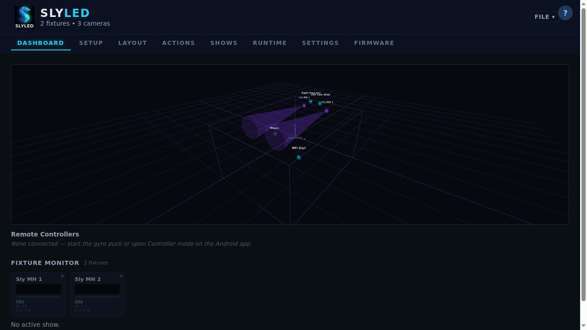

Allez dans l'onglet **Paramètres** → **Projet** → cliquez sur **Nouveau projet**, puis nommez-le (p. ex. « Walkthrough Show »).

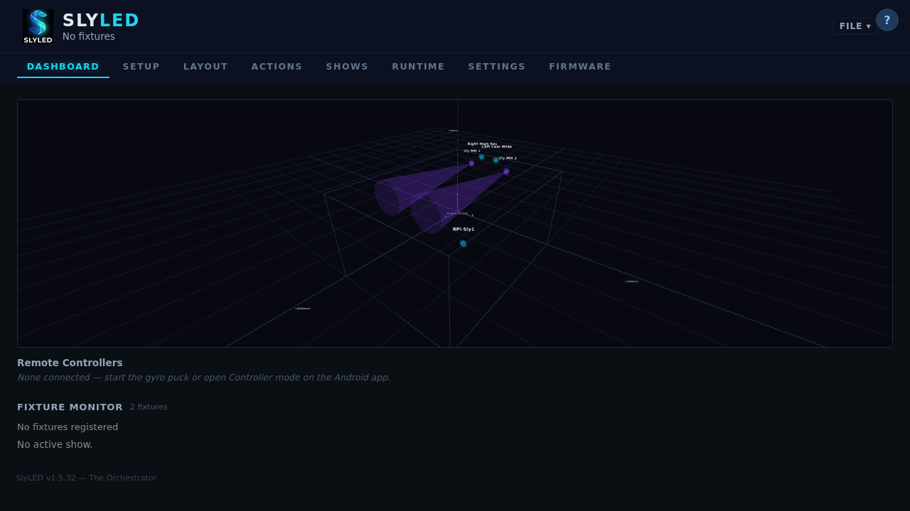

---

### Étape 2 — Définir les dimensions de la scène

Dans **Paramètres** → **Scène**, entrez les dimensions de votre zone de performance :
- Largeur : 6000 mm (6 m)
- Hauteur : 3000 mm (3 m)
- Profondeur : 4000 mm (4 m)

Cliquez sur **Enregistrer**. Le canevas de disposition se redimensionnera pour correspondre à ces dimensions.

---

### Étape 3a — Découvrir le matériel DMX

Allez dans l'onglet **Setup**. Dans la section **DMX Nodes**, cliquez sur **Discover Nodes**. SlyLED diffuse un paquet ArtPoll ; les ponts Art-Net du réseau répondent sous 3 secondes.

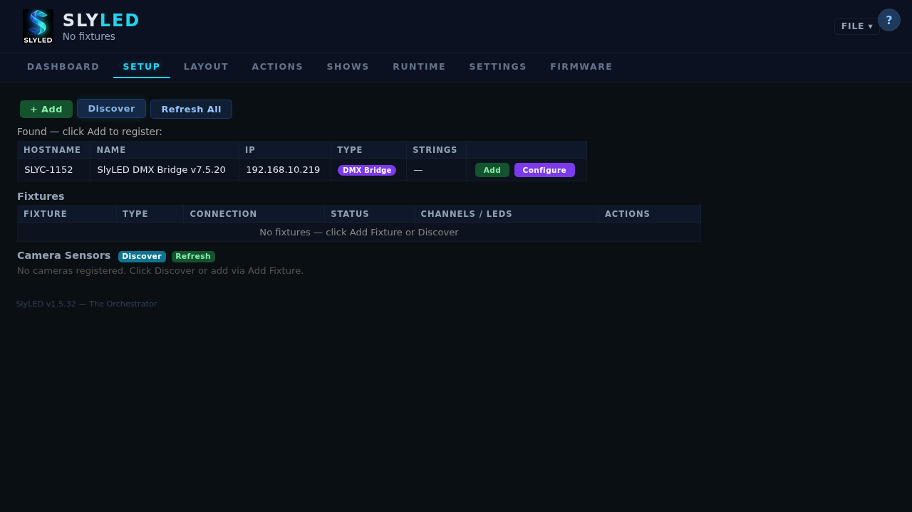

Tous les nœuds découverts apparaissent dans la liste avec leur IP, leur port et leur nombre d'univers. Si votre pont n'est pas trouvé :
- Confirmez qu'il est alimenté et sur le même sous-réseau LAN
- Vérifiez que le port UDP 6454 n'est pas bloqué par un pare-feu local
- Certains ponts exigent que l'IP source Art-Net corresponde à leur sous-réseau configuré

---

### Étape 3b — Configurer et démarrer le moteur DMX

Allez dans **Paramètres** → **DMX** :

1. **Routage des univers :** réglez l'univers 1 → votre IP de nœud Art-Net (ou laissez en diffusion `255.255.255.255` pour atteindre tous les nœuds du sous-réseau).
2. Cliquez sur **Start Engine**. L'indicateur d'état devient vert (« Running »).

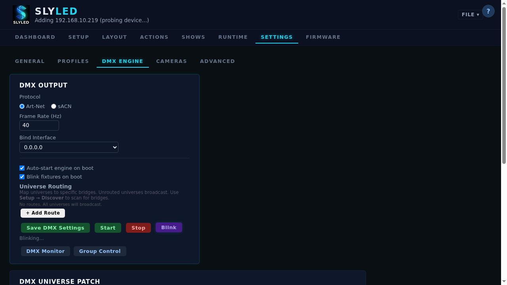
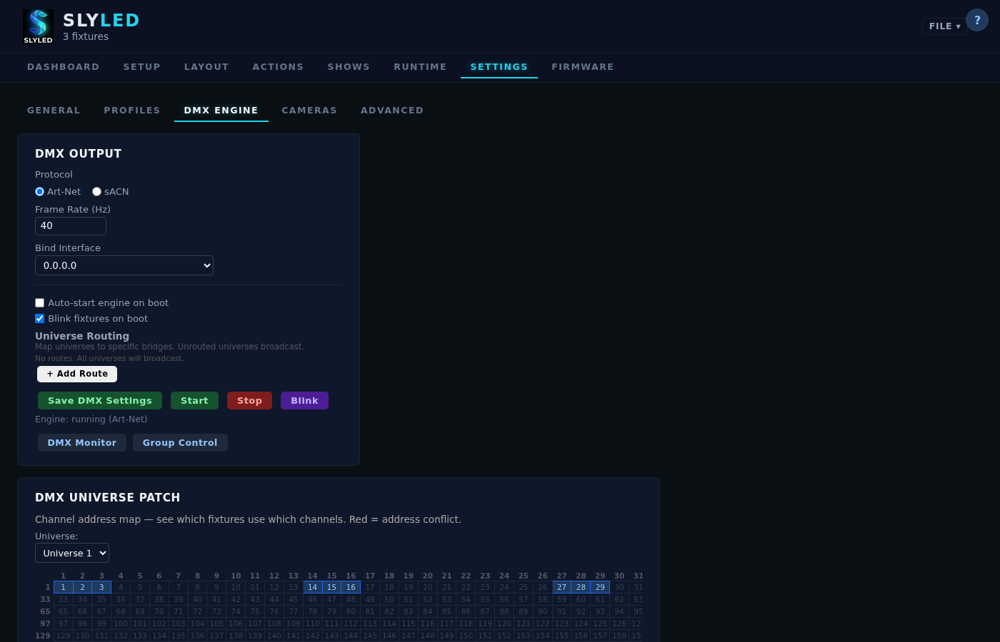

> **Important :** le moteur doit être en marche avant d'ajouter des appareils DMX ou de lancer un étalonnage. Si vous arrêtez et redémarrez l'orchestrateur, redémarrez le moteur ici.

---

### Étape 4 — Ajouter des appareils projecteur motorisé DMX

Allez dans l'onglet **Setup** → cliquez sur **+ DMX Fixture**. L'assistant d'appareil s'ouvre.

**Trouver le bon profil :**
1. Dans le champ **Search**, tapez le nom de votre appareil (p. ex. « Sly Moving Head Super Mini »)
2. Les résultats affichent d'abord les profils locaux, puis communautaires (depuis la bibliothèque partagée), puis OFL (Open Fixture Library)
3. Si un téléchargement de profil communautaire échoue (« imported: 0 »), il peut contenir des types de canaux non pris en charge — repliez-vous sur un profil générique local ou cherchez directement dans OFL
4. Pour un projecteur motorisé 16 canaux générique sans correspondance exacte, cherchez « moving head » dans OFL et importez la correspondance la plus proche

**Appareil 1 (côté cour, stage left) :**
- Nom : `MH1 SL`
- Univers : 1, adresse de départ : 1
- Profil : votre profil de projecteur motorisé
- Cliquez sur **Create Fixture**

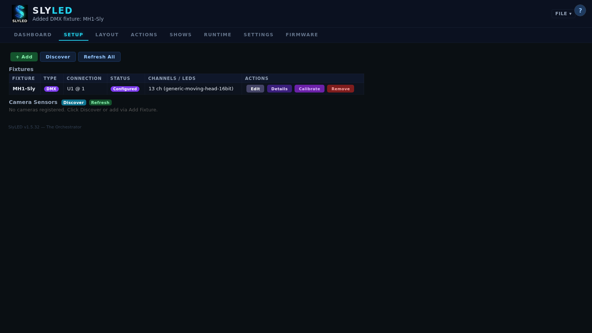

**Appareil 2 (côté jardin, stage right) :**
- Nom : `MH2 SR`
- Univers : 1, adresse de départ : 17
- Profil : même profil
- Cliquez sur **Create Fixture**

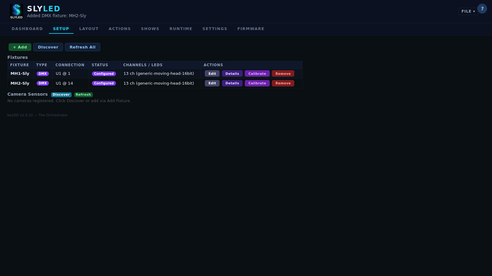

---

### Étape 5 — Ajouter un appareil wash ou spot

Ajoutez tout appareil supplémentaire (p. ex. un spot wash 350 W) :
- Nom : `Spot C`
- Univers : 1, adresse de départ : 33
- Profil : votre profil spot/wash

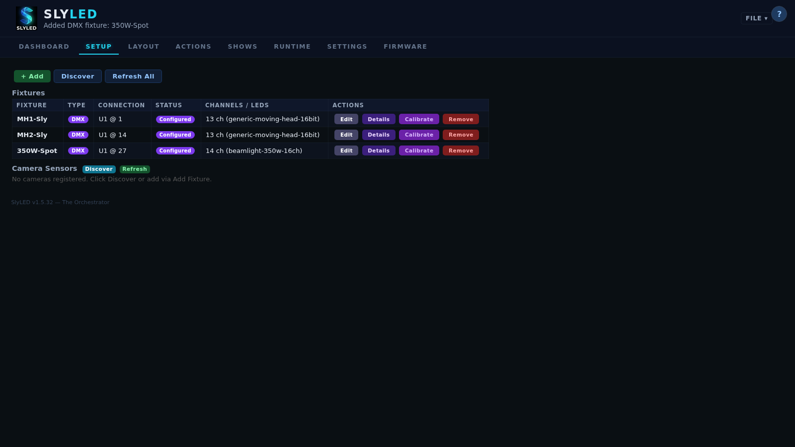

---

### Étape 6 — Enregistrer les nœuds caméra

Toujours sur l'onglet **Setup**, faites défiler jusqu'à la section **Camera Nodes**. Cliquez sur **Discover Cameras**. Les nœuds caméra exécutant `slyled-cam` répondent à la même diffusion UDP que les nœuds exécutants.

Sinon, entrez l'IP de la caméra manuellement et cliquez sur **Add**.

**Caméra 1 (gauche) :**
- IP : l'IP de votre caméra (p. ex. `192.168.10.50`)
- Nom : `Cam Left`

**Caméra 2 (droite) :**
- IP : l'IP de votre seconde caméra
- Nom : `Cam Right`

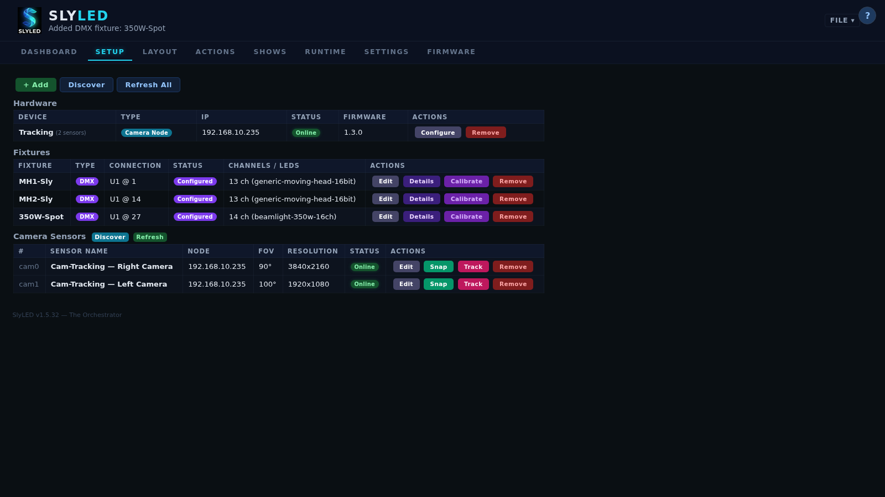

Chaque caméra apparaît avec un statut en ligne/hors ligne. Cliquez sur **Snap** pour vérifier le flux en direct.

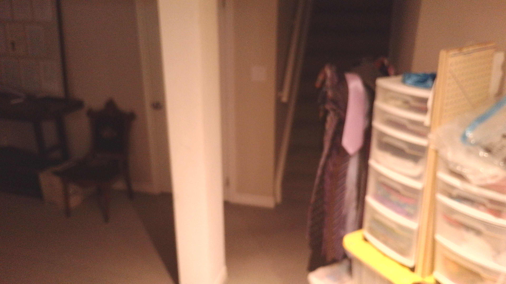

<!-- Les captures gauche/droite par caméra (06-cam1_left_hires / 06-cam2_right)
     exigent un banc réel à deux caméras pour être reprises ; une capture réelle
     d'un nœud caméra est affichée en attendant. -->

> **Remarque :** la découverte caméra renvoie parfois 0 nœud à la première diffusion à cause du timing UDP. Si aucune caméra n'est trouvée, attendez 3 secondes et cliquez de nouveau sur **Discover**. C'est une intermittence connue (#542) en cours de correction dans une prochaine version.

---

### Étape 7 — Positionner tous les appareils sur la disposition

Passez à l'onglet **Layout**. Tous les appareils ajoutés apparaissent dans la barre latérale gauche comme « non placés ».

**Placer et positionner chaque appareil :**

1. Cliquez sur un appareil dans la barre latérale pour le sélectionner
2. Cliquez sur le canevas pour le placer, ou faites-le glisser depuis la barre latérale
3. Double-cliquez sur l'appareil placé pour ouvrir la boîte de dialogue d'édition et entrer des coordonnées exactes

| Appareil | X (mm) | Y (mm) | Z (mm) |
|----------|--------|--------|--------|
| MH1 SL | 1500 | 3000 | 500 |
| MH2 SR | 4500 | 3000 | 500 |
| Spot C | 3000 | 3000 | 500 |
| Cam Left | 0 | 2500 | 0 |
| Cam Right | 6000 | 2500 | 0 |

Cliquez sur **Enregistrer** après avoir entré les coordonnées de chaque appareil.

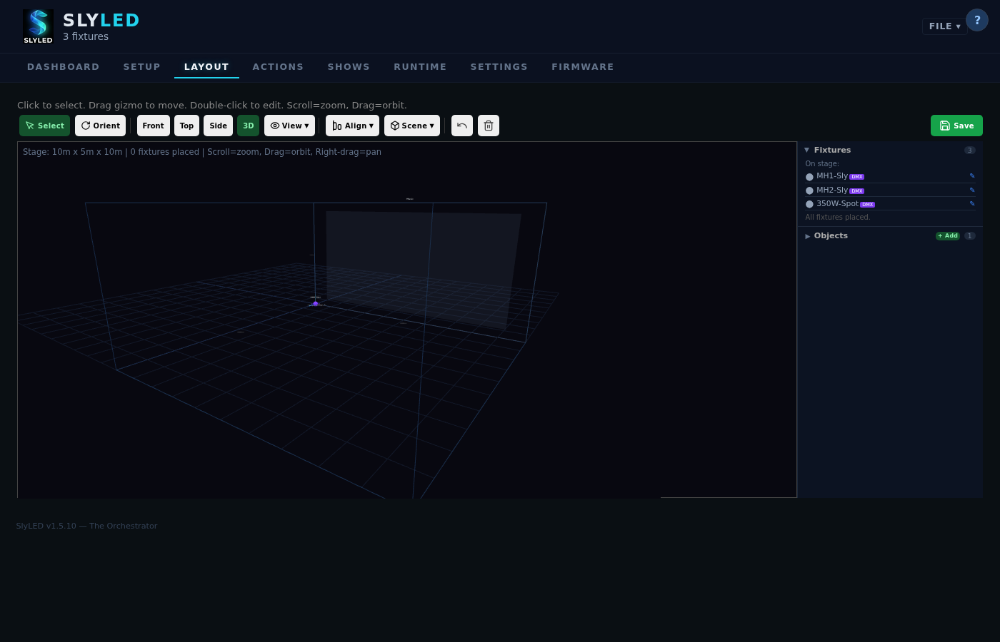
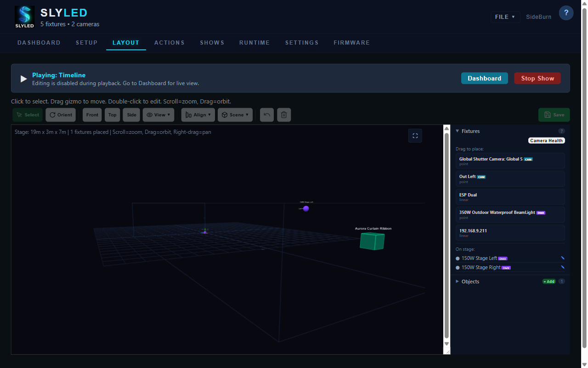
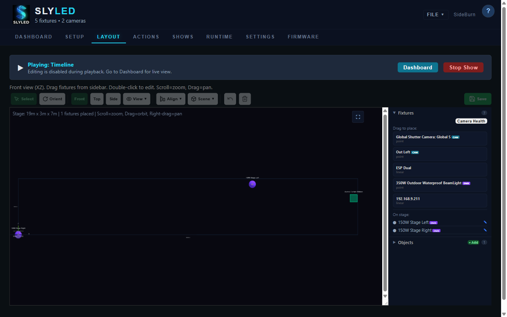

> **Astuce :** utilisez la vue 3D (bascule dans la barre d'outils de disposition) pour vérifier visuellement que les projecteurs motorisés sont élevés sur le pont et dirigés vers le sol de la scène.

---

### Étape 8 — Ajouter un objet de scène

Allez dans l'onglet **Layout** → cliquez sur **+ Object** dans la barre d'outils.

- **Nom :** `Music Stand`
- **Type :** Prop (mobile — peut être suivi par les projecteurs motorisés)
- **Position :** X : 3000, Y : 0, Z : 2000 (centre scène, au niveau du sol, mi-profondeur)
- **Taille :** 300 × 1200 × 300 mm

Cliquez sur **Enregistrer**. L'objet apparaît comme un rectangle étiqueté sur le canevas.

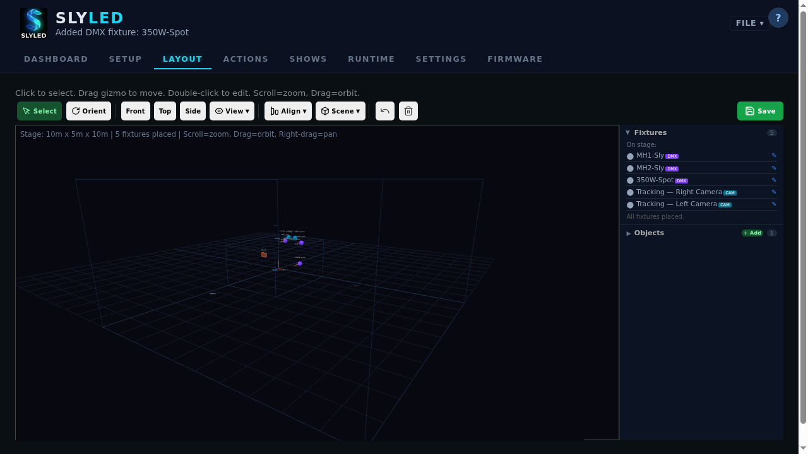

---

### Étape 9 — Lancer l'étalonnage des projecteurs motorisés

Avant que les projecteurs motorisés puissent suivre des positions avec précision, étalonnez chacun. Cette étape exige que les nœuds caméra soient positionnés dans la disposition (étape 7) et que le moteur DMX soit en marche (étape 3b).

Dans l'onglet **Layout**, double-cliquez sur `MH1 SL`. Cliquez sur **Calibrate**.


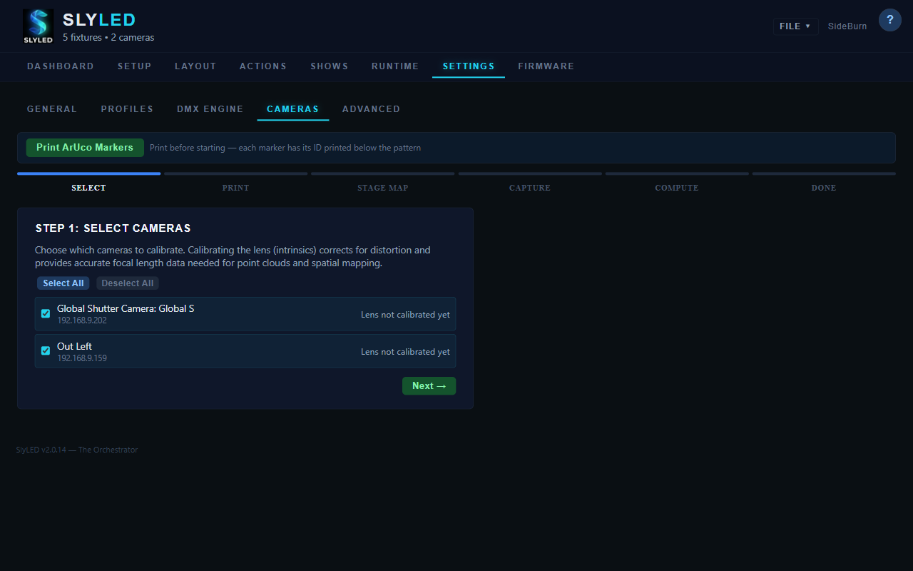

- Sélectionnez **Green** comme couleur de faisceau (bon contraste sur les sols sombres)
- Cliquez sur **Start Calibration**
- L'assistant s'exécute automatiquement à travers huit phases : warmup → découverte → blink-confirm → cartographie/convergence → construction de grille → balayage de vérification → ajustement du modèle → porte paramétrique tenue de côté → sauvegarde
- Répétez pour `MH2 SR`

L'étalonnage prend typiquement de 2 à 4 minutes par projecteur. Pour la référence phase par phase complète — ce que fait chaque phase, combien de temps elle devrait prendre, quels replis existent et quoi vérifier quand une phase cale — voir [Annexe B — Pipeline d'étalonnage de projecteur motorisé](#appendix-b--moving-head-calibration-pipeline-draft).

---

### Étape 10 — Créer des actions

Allez dans l'onglet **Actions**. Vous allez créer deux actions : une visée statique et un balayage en huit.

**Action 1 : Aim Red (spot statique)**
1. Cliquez sur **+ New Action**
2. **Nom :** `Aim Red`
3. **Type :** `DMX Scene`
4. **Couleur :** rouge (255, 0, 0)
5. **Dimmer :** 255
6. Cliquez sur **Save Action**


**Action 2 : Figure Eight (balayage dynamique)**
1. Cliquez sur **+ New Action**
2. **Nom :** `Figure Eight`
3. **Type :** `Track`
4. **Target Objects :** laisser vide (suivre tous les objets mobiles)
5. **Cycle Time :** 4000 ms
6. Cliquez sur **Save Action**

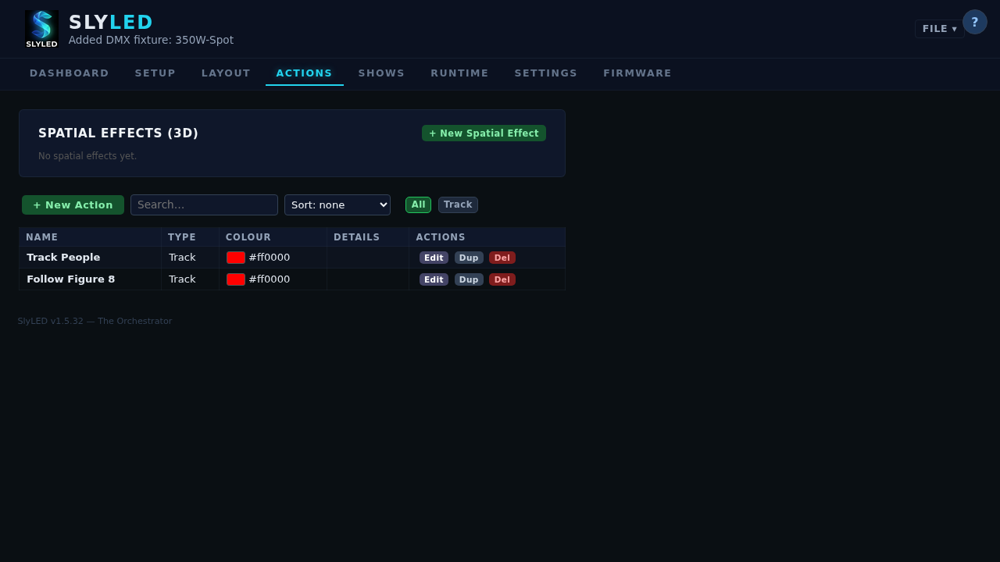

---

### Étape 11 — Construire une chronologie

Allez dans l'onglet **Runtime** (libellé **Shows** dans certaines versions). Cliquez sur **+ New Timeline**.

Une boîte de dialogue demande le nom — entrez `Walkthrough Show`. Une seconde boîte de dialogue demande la durée — entrez `120` (secondes). Cliquez sur OK.

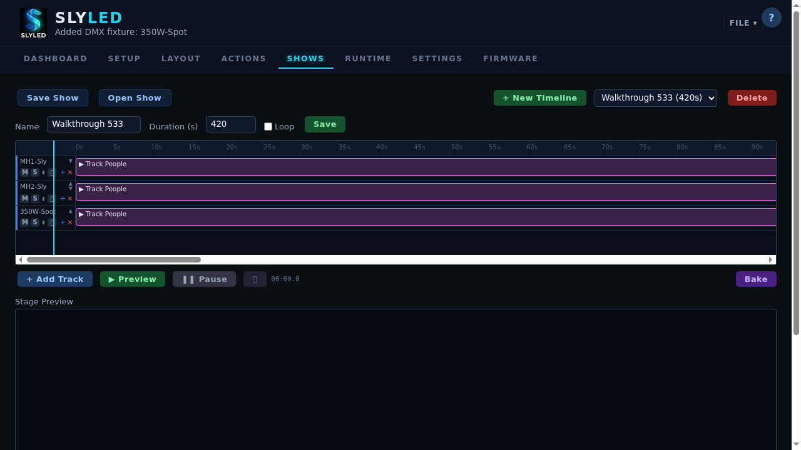

**Ajouter des pistes :**

Pour chaque appareil ou groupe, cliquez sur **+ Add Track** :
- Piste pour `MH1 SL` — ajoutez un clip : `Aim Red` à 0 s, durée 10 s
- Piste pour `MH1 SL` — ajoutez un clip : `Figure Eight` à 10 s, durée 110 s
- Piste pour `MH2 SR` — ajoutez un clip : `Figure Eight` à 0 s, durée 120 s
- Piste pour `All Performers` — ajoutez un clip avec une couleur de wash ambiant

> L'action Track (type 18) s'évalue en temps réel pendant la lecture et n'a pas besoin d'être précalculée image par image — elle lit les positions des objets en direct à 40 Hz.

---

### Étape 12 — Précalculer et démarrer la lecture

1. Cliquez sur **Bake** — le moteur compile la chronologie en séquences d'actions par appareil. La progression affiche le nombre d'images.
2. Cliquez sur **Start** — la lecture synchronisée NTP commence.

Observez la vue **Runtime** :
- Les cônes de faisceau s'animent en 3D au fil de la chronologie
- Le motif en huit se déplace dans l'espace de la scène
- La sortie DMX est envoyée via Art-Net aux appareils physiques

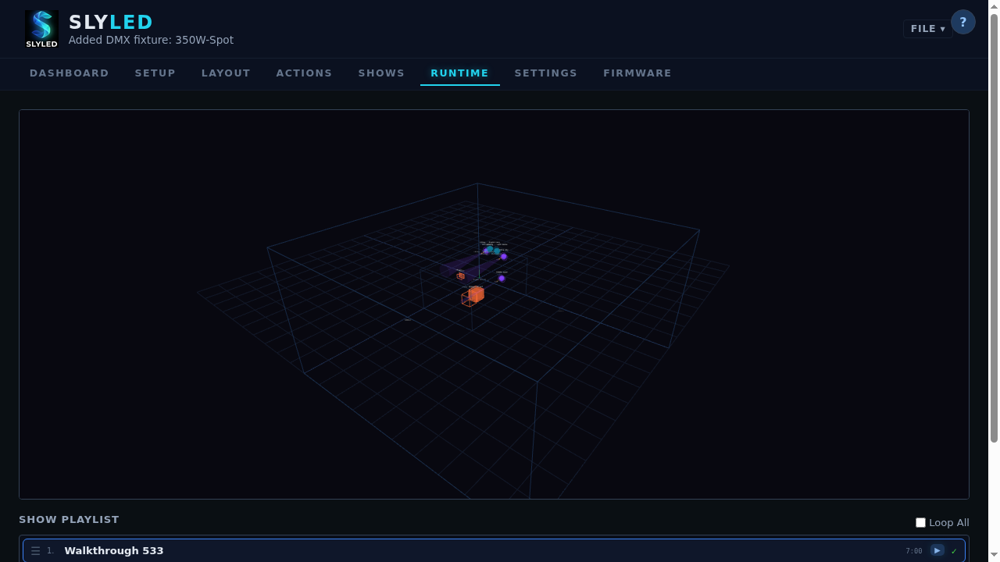

Pour tester un blackout :
- Cliquez sur **Stop**, puis déclenchez une action **Blackout** depuis le panneau Paramètres → Contrôle de groupe

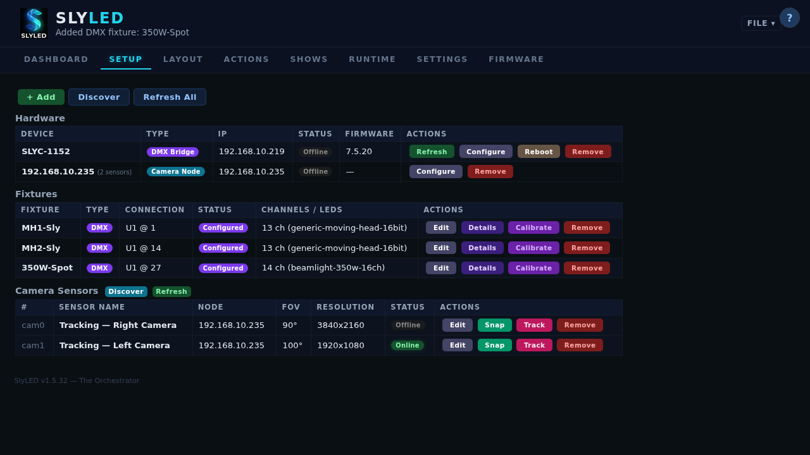

---

### Étape 13 — Enregistrer le projet

Allez dans **Paramètres** → **Projet** → cliquez sur **Export**. Un fichier `.slyshow` est téléchargé contenant tous les appareils, positions de disposition, objets, enregistrements de caméras, données d'étalonnage, actions et chronologies.

Pour recharger : Paramètres → Projet → **Import** → sélectionnez le fichier `.slyshow`.

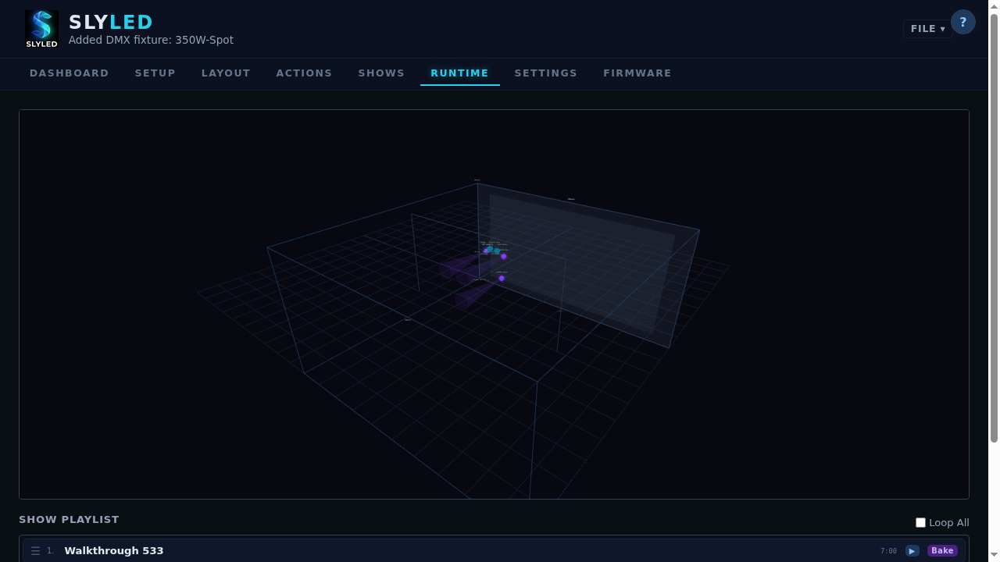

---

### Dépannage du walkthrough

| Problème | Solution |
|----------|----------|
| **Aucun nœud Art-Net découvert** | Confirmez que le pont est sur le même sous-réseau ; port UDP 6454 non bloqué |
| **Le moteur DMX ne démarre pas** | Vérifiez Paramètres → DMX → vérifiez que le routage des univers est configuré |
| **Le téléchargement de profil communautaire échoue** | Le profil a des types de canaux non pris en charge — utilisez un profil local ou OFL à la place |
| **La position de l'appareil se réinitialise à 0,0,0** | Assurez-vous que `saveFixture()` se termine avant de changer d'onglet ; utilisez le bouton Enregistrer de la boîte de dialogue d'édition |
| **La découverte caméra renvoie 0** | Attendez 3 s et réessayez — la première diffusion peut arriver avant que le socket soit lié (#542) |
| **L'étalonnage n'arrive pas à détecter le faisceau** | Tamisez la lumière ambiante, vérifiez que la couleur du faisceau contraste avec le sol, vérifiez que la caméra peut voir le faisceau |
| **Figure Eight ne bouge pas les projecteurs motorisés** | Vérifiez que l'action Track n'a pas de restriction `trackFixtureIds` ; confirmez que le moteur est en marche |
| **Les pistes de chronologie manquent après création** | Ajoutez les pistes manuellement après la création de la chronologie — elles ne sont pas créées automatiquement |

---

<!-- review-status: pending -->
## 2. Guide des plateformes

### Bureau Windows (SPA)
L'interface principale de conception et de contrôle. SPA complète à 7 onglets avec mise en page 2D/3D, éditeur de Timeline, effets spatiaux, profils DMX et gestion du firmware.

**Lancement :** `powershell -File desktop\windows\run.ps1` ou exécutez `SlyLED.exe`
**Installation :** Exécutez `SlyLED-Setup.exe` (inclut l'icône de la barre système)

### Application Android
Outil opérateur en direct pour exécuter des spectacles depuis votre téléphone. Se connecte au serveur de bureau par Wi-Fi. Depuis la version 1.8.1, l'onglet Contrôle est refait en **Surface de commande** — voir #888 / `docs/design/mobile_ui_redesign.md`.

**Installation :** Transférez `slyled-android.apk` sur votre téléphone et installez-le (sideload).
**Connexion :** Numérisez le code QR de l'onglet Paramètres du bureau, ou entrez l'adresse IP du serveur et le port manuellement.

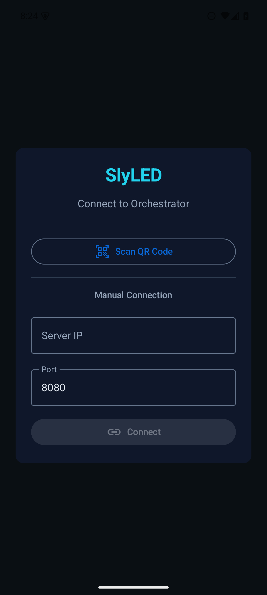

**Barre de navigation inférieure (3 onglets) :** Scène / Contrôle / État. Les Paramètres se trouvent dans l'engrenage ⚙ en haut à droite, pas dans la barre inférieure.

**Gestes de la barre supérieure :**
- **Appui long sur le logo SlyLED** → blackout instantané (master = 0). Double-haptique soutenu. Le seul geste « bouton rouge » ; les autres actions de sécurité vivent comme boutons par page.
- **Pastille de connexion** — point vert = Connecté ; pulsation orange lente = Reconnexion (dégradée) ; pulsation rouge rapide = Hors ligne. Tapez pour réessayer.
- **Engrenage ⚙ Paramètres** — nom du serveur, dimensions de la scène, calibration de la Luminosité automatique, export/import de la configuration, déconnexion.

**Onglet Scène** — viewport en direct affichant tous les projecteurs avec cônes de faisceau, marqueurs d'objets suivis, plancher quadrillé. Pincement pour zoomer + glissement pour panoramiquer.

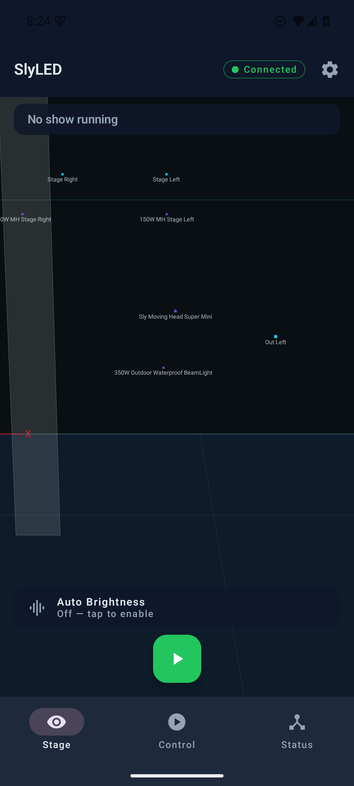

**Onglet Contrôle (refait pour la v1.8.1) :** ancre Now Playing persistante au-dessus d'un pager à 4 pages.

- **Master** *(page par défaut)* — curseur de luminosité global avec pas de ±5 % + halo lors du glissement. Bascule Luminosité automatique (déplacée depuis Paramètres) + sélecteur de source (Micro / Lecture / USB) + indicateur d'enveloppe en direct.

  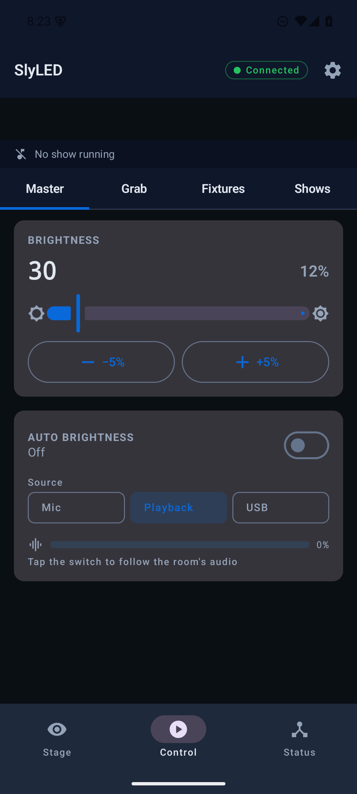

- **Grab** — vignettes de têtes mobiles montrant la couleur courante + flèche de direction pan/tilt. Rangée de favoris en haut (étoilez pour ajouter). Tapez une vignette → Mode contrôleur (pan/tilt piloté par le gyroscope à 20 Hz). Bouton « Tous au repos » en haut à droite pour ramener toutes les têtes.

  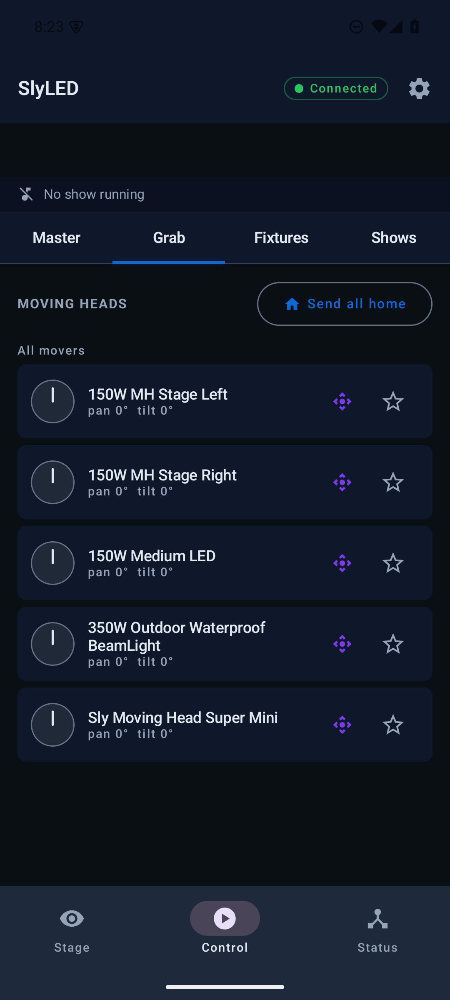

- **Fixtures** — projecteurs DMX non mobiles (machines à bulles, machines à fumée, washes, pars, stroboscopes) avec raccourcis pilotés par profil : 🫧 bulles, 💨 fumée faible/moyenne/forte, 🌀 ventilateur lent/moyen/rapide, 💡 nuanciers de couleurs, 🟣 UV, ⚡ stroboscope momentané, 🧼 maintien-pour-nettoyer. « Plus de contrôles → » ouvre une feuille par canal avec des curseurs de capacité. Bouton « Arrêter tous les effets » en haut à droite tue stroboscopes + bulles/fumée en parallèle.

  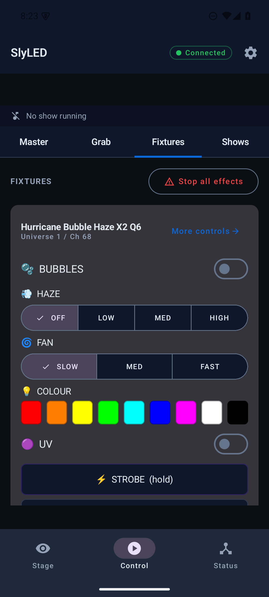

- **Shows** — sections étoilés → récents → tous, classés par dernier lancement. Lancement en un toucher. Appui long pour étoiler.

  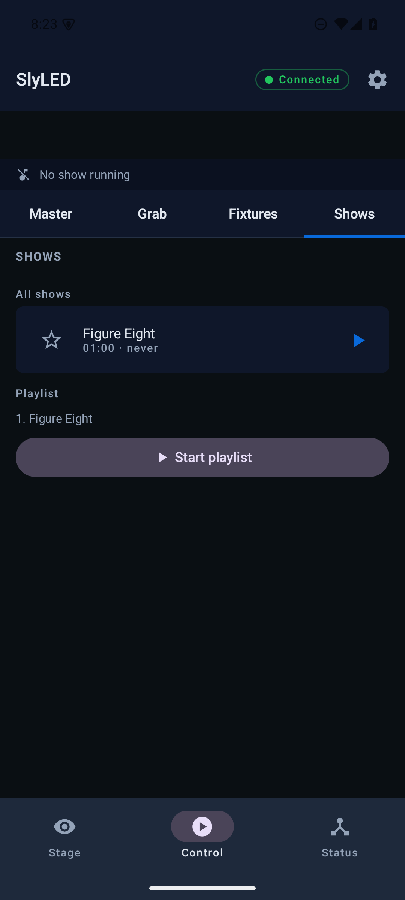

**L'ancre Now Playing** se trouve au-dessus du pager — nom, pastille de boucle, temps écoulé / total, barre de progression, ARRÊT et Suivant.

**Onglet État** — surveillance des appareils (Performers en ligne/hors ligne, RSSI, firmware), nœuds caméra avec bouton Suivre pour démarrer/arrêter le suivi de personne, et état du moteur Art-Net/DMX.

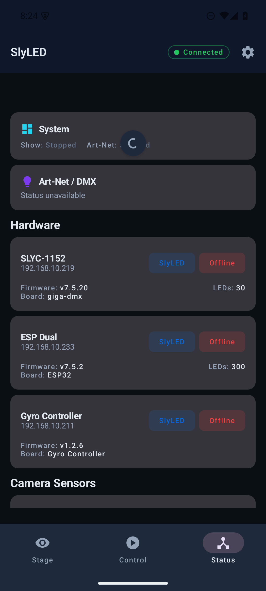

**Feuille Paramètres** (⚙ en haut à droite) — nom du système, unités, dimensions de la scène (L × H × P), mode sombre, journalisation, plus le bloc de configuration de la Luminosité automatique (activation, mode du modèle, curseurs sensibilité/plancher/plafond/attaque/relâchement).

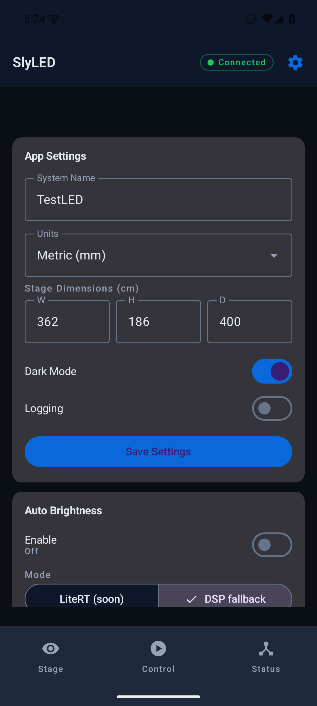

**Mode contrôleur (Grab → tapez une tête mobile) :** Tenez le téléphone et pointez où vous voulez le faisceau — pan/tilt suit l'orientation du téléphone à 20 Hz. Tapez Recentrer pour calibrer, X pour quitter. Démarrage / arrêt par appui protégés par nonce+ACK (#825). À la première utilisation sur un nouveau téléphone, l'assistant d'axe (#869) mesure les axes du repère du téléphone ; environ 10 secondes.

### Configuration du firmware (ESP32/D1 Mini)
Chaque Performer propose une page de configuration à 3 onglets à l'adresse `http://<adresse-ip>/config` :
- **Tableau de bord** — nom d'hôte, version du firmware, statut de l'action active
- **Paramètres** — nom de l'appareil, description, nombre de chaînes
- **Configuration** — nombre de LED par chaîne, longueur, direction, broche GPIO (ESP32)

---

## 3. Configuration des projecteurs

### Que sont les projecteurs ?
Un projecteur est l'entite principale sur la scene. Il encapsule le materiel physique et ajoute des attributs au niveau de la scene :
- **Projecteurs LED** — lies a un Performer enfant, avec des chaines LED
- **Projecteurs DMX** — lies a un univers/adresse DMX, avec un profil et un point de visee

### Ajout de projecteurs LED
1. Allez dans l'onglet **Configuration**, cliquez sur **Decouvrir** pour trouver les Performers
2. Cliquez sur **Ajouter un projecteur** puis selectionnez le type "LED"
3. Liez a un Performer et configurez les chaines (nombre de LED, longueur, direction)

### Ajout de projecteurs DMX (assistant)
Cliquez sur **+ Projecteur DMX** dans l'onglet Configuration pour lancer l'assistant en 3 etapes :
1. **Choisir le projecteur** : Recherchez dans l'Open Fixture Library (700+ projecteurs) ou creez un projecteur personnalise
2. **Definir l'adresse** : Univers, adresse de depart et nom — avec detection de conflits en temps reel
3. **Confirmer** : Verifiez tous les parametres, cliquez sur "Creer le projecteur"

### Moniteur DMX
Parametres puis DMX puis **Moniteur DMX** ouvre une grille en temps reel de 512 canaux par univers. Cliquez sur n'importe quelle cellule pour definir une valeur. Code couleur par intensite.

### Controle de groupe de projecteurs
Parametres puis DMX puis **Controle de groupe** ouvre un panneau de controle pour les groupes de projecteurs. Curseur de variateur principal, curseurs R/V/B, et boutons de preselection rapide des couleurs (Chaud, Froid, Rouge, Eteint).

### Test des canaux DMX
Dans l'onglet Configuration, cliquez sur **Details** sur n'importe quel projecteur DMX pour ouvrir le panneau de test des canaux :
- **Curseurs** pour chaque canal avec sortie DMX en direct
- **Boutons rapides** : Tout allume, Noir, Blanc, Rouge, Vert, Bleu
- **Etiquettes de capacite** indiquant ce que fait chaque plage de valeurs (p. ex. "Stroboscope lent vers rapide")
- Les modifications prennent effet immediatement sur le projecteur physique via Art-Net/sACN

### Types de projecteurs
| Type | Description |
|------|-------------|
| **Lineaire** | Bande LED. Pixels le long d'un chemin. |
| **Point** | Source lumineuse DMX avec cone de faisceau. |
| **Groupe** | Collection de projecteurs cibles comme un seul. |

---

## 5. Disposition du plateau

### Canevas 2D
L'onglet Disposition affiche une vue frontale 2D du plateau. Les dimensions du plateau (largeur × hauteur) sont définies dans les Paramètres.

La barre d'outils de disposition fournit : Enregistrer, bascule 2D/3D (affiche le mode actuel en texte), Recentrer, Vue du dessus, Vue de face, Disposition DMX automatique, Afficher/masquer les chaînes LED. Les bascules actives sont surlignées en vert.

Utilisez le paramètre d'URL `?tab=` pour un lien direct vers n'importe quel onglet (par exemple `?tab=layout`).

| Action | Bureau | Android |
|--------|--------|---------|
| **Placer un appareil** | Glisser depuis la barre latérale | Toucher l'appareil puis toucher le canevas |
| **Déplacer un appareil** | Glisser sur le canevas | Glisser sur le canevas |
| **Retirer un appareil** | Double-clic → Retirer | Toucher → Modifier → Retirer |
| **Zoom** | Molette de la souris | Geste de pincement |
| **Panoramique** | — | Glissement à deux doigts |
| **Modifier les coordonnées** | Double-clic | Toucher l'appareil placé |
| **Modifier un objet** | Double-clic | Toucher l'objet dans la liste |

**Éléments affichés :**
- Lignes de grille à espacement de 1 mètre
- Étiquettes des dimensions du plateau
- **Appareils LED** : nœuds verts avec lignes de chaînes colorées (flèches de direction)
- **Appareils DMX** : nœuds violets avec triangles de cône de faisceau pointant vers le point de visée
- **Objets** : rectangles semi-transparents avec étiquettes de nom (rognés aux limites du plateau)
- **Points de visée** : cercles rouges aux points de visée DMX

### Fenêtre 3D (bureau uniquement)
Basculez en mode 3D pour une scène Three.js interactive :
- Caméra orbitale avec glissement de la souris
- Cônes de faisceau en géométrie 3D
- Sphères de visée déplaçables pour les appareils DMX
- Plans et boîtes d'objets avec transparence

### Mode Déplacer / Pivoter

Le canevas de disposition possède deux modes d'interaction, basculés avec des raccourcis clavier ou le bouton de la barre d'outils (qui affiche **M** ou **R** pour indiquer le mode actif) :

| Touche | Mode | Description |
|--------|------|-------------|
| **M** | Déplacer | Glissez n'importe quel appareil placé pour le repositionner (mode par défaut) |
| **R** | Pivoter | Cliquez sur un appareil DMX ou une caméra pour afficher un anneau-boussole ; glissez autour de l'anneau pour viser l'appareil |

**Détails du mode Pivoter :**
- Un anneau-boussole apparaît autour de l'appareil sélectionné dès que vous entrez en mode Pivoter
- Glissez dans le sens horaire ou anti-horaire pour définir la direction de visée horizontale
- Le cône de faisceau se met à jour en temps réel pendant le glissement
- Dans la fenêtre 3D, le mode Pivoter active les **TransformControls** Three.js en mode rotation — glissez les arcs colorés pour pivoter sur n'importe quel axe
- Appuyez sur **Ctrl+Z** pour annuler le dernier déplacement ou la dernière rotation

**Flux de travail typique :** placez tous les appareils en mode Déplacer, puis passez en mode Pivoter pour viser les projecteurs motorisés DMX et les caméras vers leurs zones de focalisation prévues avant de lancer l'étalonnage.

### Système de coordonnées
- **aimPoint[0]** = X (position horizontale, mm)
- **aimPoint[1]** = Y (hauteur depuis le sol, mm) — utilisé pour l'axe vertical du canevas 2D
- **aimPoint[2]** = Z (profondeur, mm) — utilisé uniquement dans la fenêtre 3D
- **canvasW** = largeur du plateau × 1000 (mm)
- **canvasH** = hauteur du plateau × 1000 (mm)

---

<!-- review-status: pending -->

## 6. Objets de plateau

Les objets représentent les éléments physiques d'un plateau — murs,
sols, ponts d'éclairage, écrans et accessoires ou artistes — et les
« cibles » abstraites que les actions de suivi poursuivent. Tout ce
qu'un projecteur motorisé doit viser vit dans l'onglet Objets.

> L'onglet s'appelait auparavant « Surfaces » ; le renommage en
> **Objets** a été livré avec la v1.7.30. Les anciens fichiers de
> projet s'importent sans problème.

### Types d'objets

| Type | Mobilité par défaut | Description |
| --- | --- | --- |
| **Mur** | Statique | Mur de fond, verrouillé aux dimensions du plateau (largeur × hauteur) |
| **Sol** | Statique | Sol du plateau, verrouillé aux dimensions du plateau (largeur × (profondeur + 1 m)) |
| **Pont** | Statique | Pont d'éclairage |
| **Écran** | Statique | Surface de projection |
| **Accessoire** | Mobile | Artiste, élément de décor ou élément mobile |
| **Personnalisé** | Mobile | Objet défini par l'utilisateur |
| **Cible ruban** | Mobile | Ancre en coordonnées plateau qui voyage, utilisée par le préréglage Aurora Curtain (#839) — un rig coordonné passe par le même point le long de l'axe choisi |

### Objets verrouillés au plateau

Les objets mur et sol peuvent être verrouillés aux dimensions du
plateau. Lorsque vous modifiez la taille du plateau dans
Paramètres → Plateau, les objets verrouillés se redimensionnent
automatiquement.

### Mobilité

- **Statique** — position fixe. Ne peut pas être suivi par les
  projecteurs motorisés.
- **Mobile** — la position peut changer pendant l'exécution.
  Peut être suivi par les projecteurs motorisés DMX via l'action
  de suivi (chapitre 8).

### Patrouille

Les objets mobiles peuvent patrouiller pendant l'exécution. Chaque
patrouille porte un **motif**, un axe ou une forme, un temps de
cycle, et une courbe de lissage facultative. L'évaluateur de
patrouille tourne à 40 Hz dans la boucle de lecture DMX,
immédiatement avant que les actions de suivi ne lisent les
positions des objets ; la pose d'une cible patrouillée a donc
toujours une frame d'avance quand un projecteur motorisé la lit.

#### Motifs

| Motif | Géométrie | Usage |
| --- | --- | --- |
| **Ping-pong** | Va d'un coin de la boîte englobante au coin opposé, puis fait demi-tour | Le trajet prévu d'un artiste de côté de scène |
| **Cercle** | Boucle à rayon constant autour du centre de la boîte | Une plate-forme tournante ou un effet rotatif |
| **Figure-8** | Lemniscate (deux lobes) à l'intérieur de la boîte | Un trajet complexe visitant deux foyers — utile pour les croisements de scène |
| **Carré** | Quatre segments rectilignes le long du bord de la boîte | Un effet « périmètre de patrouille » utilisé dans les thèmes industriels / sécurité |
| **Ruban** *(nouveau en v1.7.83)* | Une ancre voyageuse unique sur l'axe choisi (gauche-droite, avant-arrière, haut-bas, croisé, figure-8) ; plusieurs projecteurs motorisés montent sur le ruban à des décalages de phase, le balayage voyage donc visiblement le rig au lieu que toutes les têtes bougent à l'unisson | L'effet de rideau coordonné du préréglage Aurora Curtain |

#### Vitesse

- **Lent** — cycle de 20 s.
- **Moyen** — cycle de 10 s.
- **Rapide** — cycle de 5 s.
- **Personnalisé** — réglez `cycleS` directement. Le `speedPreset`
  par défaut est `medium` ; les objets de patrouille ruban sont
  livrés avec `speedPreset: "custom"` pour que le `cycleS: 12` du
  préréglage l'emporte sur la valeur medium par défaut.

#### Plage

Pourcentage de la boîte englobante (par défaut 10 %–90 %). La
patrouille reste dans la boîte ; les cibles près d'un mur n'entraînent
pas un projecteur motorisé dans un blocage cardanique de l'IK.

#### Lissage

- **Sinus** — accélération / décélération douce (par défaut).
- **Linéaire** — vitesse constante.

#### `patrolMode`

Les objets de patrouille peuvent être réglés sur :

- `always` *(par défaut)* — la patrouille tourne tant que
  l'orchestrateur est en route. Utile pour « l'accessoire est vivant
  même avant le début du spectacle ».
- `on-demand` — la patrouille est suspendue jusqu'à ce qu'une
  chronologie active référence cet objet via une action de suivi.
  Dès que le clip référençant démarre, la patrouille reprend là où
  elle aurait été si elle avait tourné en continu (l'action de suivi
  qui s'attend à une cible mobile en voit donc une immédiatement,
  pas un accessoire immobile). Les opérateurs sont parfois surpris
  de voir un accessoire de patrouille `on-demand` immobile sur la
  vue plateau — c'est le comportement voulu.

### Objets temporels

Les systèmes externes peuvent créer des objets éphémères via
`POST /api/objects/temporal` :

- Toujours en mémoire ; jamais enregistrés sur disque.
- Nécessitent `ttl > 0` (durée de vie en secondes).
- Expirent automatiquement quand le TTL est écoulé.
- Les mises à jour de position rafraîchissent le TTL.
- Affichés dans le visualiseur d'exécution avec un contour en
  pointillés et un badge de compte à rebours.
- Le suiveur caméra pousse les personnes détectées par cette
  route — chaque détection devient un objet temporel que l'action
  de suivi du préréglage Spotlight Follow Person poursuit.

L'échelle des objets temporels suit l'ordre du moteur de rendu
`[largeur, hauteur (Z), profondeur (Y)]` — les sites d'appel qui
veulent une détection « en forme de personne » doivent envoyer
`[0,6, 1,8, 0,6]` (60 cm de large, 1,8 m de haut, 60 cm de
profondeur), pas `[0,6, 0,6, 1,8]`.

---

## 6. Effets spatiaux

### Effets spatiaux vs actions classiques
- **Actions classiques** (Solide, Chenillard, Arc-en-ciel, etc.) : S'executent localement sur chaque Performer. Motif base sur l'index des pixels. Lorsqu'elles sont assignees a des projecteurs DMX, les actions classiques sont automatiquement converties en segments de scene DMX avec les valeurs par defaut appropriees pour le variateur, le pan/tilt.
- **Actions DMX** : Controlent directement les fonctionnalites specifiques au DMX :
  - **Scene DMX** — Definir des valeurs exactes pour le variateur, pan, tilt, stroboscope, gobo, roue de couleurs, prisme
  - **Mouvement Pan/Tilt** — Animer le pan/tilt d'une position de depart a une position d'arrivee dans le temps
  - **Selection de gobo** — Selectionner une position de la roue de gobos
  - **Roue de couleurs** — Selectionner une position de la roue de couleurs
  - **Track** (Type 18) — Faire suivre les objets mobiles par les lyres en temps reel (voir [Action Track](#7-action-track))
- **Effets spatiaux** : Operent dans l'espace 3D. Une sphere de lumiere balayant la scene illumine differents projecteurs a differents moments.

SlyLED prend en charge 19 types d'actions au total : 14 actions classiques LED plus 5 actions DMX/spatiales (Scene DMX, Mouvement Pan/Tilt, Selection de gobo, Roue de couleurs, Track).

### Creation d'un effet spatial
Naviguez vers l'onglet **Actions** puis **+ Nouvel effet spatial**.

| Champ | Description |
|-------|-------------|
| **Forme** | Sphere, Plan ou Boite |
| **Couleur** | Couleur RGB appliquee aux pixels a l'interieur du champ |
| **Taille** | Rayon (sphere), epaisseur (plan) ou dimensions (boite) |
| **Debut/Fin du mouvement** | Positions 3D en millimetres |
| **Duree** | Temps de deplacement du debut a la fin |
| **Lissage** | Lineaire, acceleration, deceleration, acceleration-deceleration |
| **Melange** | Remplacer, Ajouter, Multiplier, Ecran |

---

<!-- review-status: pending -->

## 8. Action de suivi

L'action de suivi (type 18) est le pont entre l'onglet Objets
(chapitre 6) et le rig de projecteurs motorisés : tant qu'un clip
contenant une action de suivi est en lecture, chaque projecteur
motorisé assigné calcule sa visée pan / tilt à partir de la
position en direct d'une ou plusieurs cibles, à chaque frame
(40 Hz). Quand le clip se termine — ou que le dernier clip
référençant l'action se termine — les projecteurs motorisés assignés
se garent sur leur pose Home (#807).

### Comment se déroule une action de suivi

1. Placez les objets mobiles à poursuivre dans l'onglet
   **Disposition / Objets** (chapitre 6) — accessoires, objets
   personnalisés mobiles, cibles ruban, ou personnes détectées par
   caméra arrivant comme objets temporels.
2. Créez une action de suivi dans l'onglet **Actions**. Définissez
   son nom, sa portée et sa liste de cibles.
3. Déposez un clip sur une piste de la **Chronologie** qui
   référence l'action de suivi.
4. Pendant l'exécution, la boucle DMX 40 Hz lit la position
   actuelle de chaque cible, choisit (ou assigne) un ou plusieurs
   projecteurs motorisés, exécute l'IK canonique du vecteur de
   visée (#806 / #809), et écrit pan / tilt dans le tampon
   d'univers. Le cône de la visualisation 3D est piloté depuis le
   même vecteur de visée — la visualisation correspond donc
   toujours au comportement physique.

### Algorithme d'assignation

L'assignation est recalculée à chaque frame depuis
`trackFixtureIds` (les projecteurs motorisés en portée) et la liste
de cibles résolue :

| Situation | Comportement |
| --- | --- |
| Nombre égal de projecteurs motorisés et d'objets | Correspondance 1 : 1 par index |
| Plus de projecteurs que d'objets, **trackAutoSpread = false** | Chaque objet est poursuivi par exactement un projecteur ; les projecteurs surnuméraires restent inactifs (allumés mais sans cible). |
| Plus de projecteurs que d'objets, **trackAutoSpread = true** | Répartit les projecteurs sur la largeur de chaque objet — utile pour laver une seule cible avec plusieurs projecteurs. |
| Plus d'objets que de projecteurs, défaut | Les projecteurs cyclent à travers les objets ; chacun saute sur une cible différente toutes les `trackCycleMs` (par défaut 2000 ms). |
| Plus d'objets que de projecteurs, **trackFixedAssignment = true** | Chaque projecteur s'accroche à une cible par index ; les surnuméraires sont ignorés jusqu'à ce qu'un projecteur se libère. |

Les décalages par projecteur (`trackFixtureOffsets`) permettent à
des rigs asymétriques de viser chaque projecteur sur un point
légèrement différent de la même cible — par exemple, un projecteur
côté cour vise la tête de l'artiste tandis qu'un projecteur côté
jardin vise les pieds.

### Éditeur d'action — section Avancé (#811)

Les volets DMX Scene de l'éditeur d'action regroupent les champs
simples (nom, portée, RVB, gradateur) en haut, avec une section
extensible **Avancé** en dessous contenant les contrôles fins par
action. Pour les actions de suivi, la section Avancé expose :

| Champ | Ce qu'il contrôle | Plage |
| --- | --- | --- |
| **Cycle Time (ms)** | `trackCycleMs` — utilisé seulement quand il y a plus d'objets que de projecteurs motorisés | 100 – 10 000 ms (borné) |
| **Offset X / Y / Z (mm)** | Décalage de visée global ajouté à chaque cible. Utile pour « viser 30 cm au-dessus du sol où se trouve le marqueur » ou « viser à hauteur de tête plutôt qu'au centre de masse ». | ± 10 000 mm |
| **Auto-spread** | Active `trackAutoSpread` pour le cas plus-de-projecteurs-que-d'objets | — |
| **Fixed assignment** | Active `trackFixedAssignment` — désactive le cyclage et accroche chaque projecteur à une cible | — |
| **Track dimmer** | `trackDimmer` — surcharge le gradateur des projecteurs pendant que l'action de suivi est active. Vaut 255 (plein) par défaut ; les opérateurs le baissent parfois pour que le faisceau suiveur n'écrase pas le reste du rig. | 0 – 255 |

### Sélection des objets cibles

| Champ | Effet |
| --- | --- |
| **`trackObjectIds`** | Liste explicite d'ID d'objets à suivre. L'emporte sur `trackObjectType` quand renseigné. Cherche dans l'**ensemble** des objets mobiles (y compris les accessoires de patrouille) ; un id d'accessoire de patrouille `on-demand` se résout donc proprement ici. |
| **`trackObjectType`** | Filtre les objets mobiles par type — par exemple `"prop"`, `"ribbon-target"`, `"custom"`. Utile quand l'ensemble cible est « toutes les cibles ruban » sans lister les ID. |
| **`trackMode`** | Consulté seulement quand `trackObjectIds` et `trackObjectType` sont tous deux vides. `"camera-moving"` *(défaut)* — suivre seulement les personnes détectées par caméra (objets temporels). `"all-moving"` — suivre les accessoires de patrouille **et** les détections caméra ensemble. |

Si une action de suivi a un `trackObjectIds` explicite mais que tous
les objets listés ont été supprimés, l'action ignore la frame
entièrement plutôt que d'éteindre les projecteurs assignés —
avant le correctif (v1.7.78 et plus anciennes) le cas cible-
manquante mettait à zéro le gradateur de chaque projecteur en
portée.

### Coopération avec les spectacles et les télécommandes (#763 / #835)

Les actions de suivi sont des citoyens à part entière de la
chronologie de spectacle :

- Une action de suivi orpheline (qui vit dans `_actions` mais
  qu'aucun clip de la chronologie en cours ne référence)
  **n'évalue pas** (#835). Cela évite qu'une action préréglée
  laissée éteigne des projecteurs sur des chronologies sans
  rapport.
- Quand une télécommande (téléphone Android ou palet gyro)
  revendique un projecteur via l'arbitre de revendication
  mover-control (chapitre Télécommande), le projecteur revendiqué
  est silencié de l'action de suivi pour la durée de la
  revendication — les gestes opérateur priment sur le spectacle.
  Le relâchement de la revendication remet le projecteur dans le
  spectacle sans précalcul.
- Les actions de suivi écrivent le vecteur de visée canonique via
  le même chemin `_set_canonical_aim_stage` que le reste de
  l'orchestrateur ; un étalonnage en cours pendant un spectacle
  piloté par suivi observe donc la vraie direction du projecteur
  sans aller-retour d'IK inverse.

---

## 8. Construction d'une Timeline

1. Allez dans l'onglet **Execution** puis **+ Nouvelle Timeline**
2. Definissez le nom et la duree
3. **+ Ajouter un Track** pour chaque projecteur (ou "Tous les Performers")
4. **+ Ajouter un clip** pour assigner des effets avec une heure de debut et une duree
5. Les clips peuvent se chevaucher — ils se melangent selon le mode de melange de leur effet

---

## 9. Compilation et lecture

### Compiler
Compile une Timeline en instructions d'action minimales par Performer :
1. Cliquez sur **Compiler** — la progression affiche le nombre d'images et de segments
2. Cliquez sur **Synchroniser** pour envoyer les instructions aux Performers via UDP
3. Cliquez sur **Demarrer** pour une lecture synchronisee par NTP

### Sortie
- **Segments d'action** : Sequences des 19 types d'actions (14 classiques + 5 DMX/spatiales)
- **Fichiers LSQ** : Donnees RGB brutes par pixel a 40 Hz (telechargeables en ZIP)
- **Donnees de previsualisation** : 1 couleur par chaine par seconde pour l'emulateur

---

## 10. Emulateur de previsualisation

Le bureau et Android incluent une previsualisation en temps reel du spectacle :

### Previsualisation du tableau de bord
Lorsqu'un spectacle est en cours, l'onglet Tableau de bord affiche un canevas de previsualisation en direct de la scene a cote du tableau de statut des Performers et de la barre de progression de la lecture.

### SPA de bureau
Le canevas de l'emulateur apparait dans l'onglet Execution sous la Timeline. Affiche :
- **Projecteurs LED** : Points colores le long des chemins de chaines avec effets de halo
- **Projecteurs DMX** : Triangles de cone de faisceau avec couleurs pilotees par la previsualisation
- **Points de visee** : Cercles rouges aux points de visee
- **Etiquettes des projecteurs** : Noms sous chaque noeud
- **Compteur de temps** : MM:SS ecoule / total

### Application Android
La carte `ShowEmulatorCanvas` affiche :
- Les memes points de chaines LED et cones de faisceau DMX que sur le bureau
- Les objets affiches comme rectangles d'arriere-plan
- Les couleurs de previsualisation mises a jour chaque seconde pendant la lecture

### Visualisation des champs spatiaux
Pendant la lecture d'un spectacle, l'emulateur d'execution affiche les effets spatiaux actifs se deplacant a travers la scene :
- **Sphere** : cercle colore translucide se deplacant le long du chemin de mouvement
- **Plan** : bande translucide horizontale ou verticale balayant la scene
- **Boite** : rectangle translucide a la position actuelle de l'effet
- Noms des effets affiches comme etiquettes a leur position actuelle
- Mise a jour a chaque image, synchronisee avec le temps de lecture ecoule

### Installations DMX uniquement
L'emulateur affiche correctement les installations DMX uniquement (sans Performers LED). Les cones de faisceau violets statiques sont toujours visibles, avec des couleurs en direct lorsqu'un spectacle est en cours.

---

## 11. Profils de projecteurs DMX

### Profils integres
| Profil | Canaux | Fonctionnalites |
|--------|--------|-----------------|
| RGB generique | 3 | Rouge, Vert, Bleu |
| RGBW generique | 5 | Rouge, Vert, Bleu, Blanc, Variateur |
| Variateur generique | 1 | Intensite uniquement |
| Lyre 16 bits | 16 | Pan, Tilt, Variateur, Couleur, Gobo, Prisme |

### Editeur de profils — pas a pas (#527)

L'editeur de profils relie un canal DMX a ce qu'il *fait* — ce canal rouge
ici, ce canal pan la — et consigne tout comportement attendu par le
micrologiciel du projecteur sur chaque canal (plages de gobos, courbes
de stroboscope, emplacements de roue de couleurs). Une fois le profil
enregistre, tout l'orchestrateur peut piloter le projecteur par appels
semantiques tels que "regler la couleur sur rouge" ou "viser la scene
(1150, 2100)" au lieu de DMX brut.

#### 1. Ou le trouver

Onglet Parametres puis sous-section **Profils**. La liste affiche tous
les profils integres et personnalises, filtrables par categorie
(par / wash / spot / lyre / laser / effet). Chaque ligne comporte :

- **Modifier** — ouvre l'editeur sur le profil selectionne (desactive
  pour les profils integres ; clonez d'abord si vous voulez diverger).
- **Cloner** — copie un profil integre ou communautaire dans votre
  bibliotheque locale sous un nouvel id ; la copie est modifiable.
- **Partager** — televerse un profil personnalise vers le serveur
  communautaire (necessite Internet, debit limite par IP).
- **Supprimer** — retire un profil personnalise (les profils integres
  ne peuvent pas etre supprimes).

Cliquez sur **Nouveau profil** pour demarrer l'editeur sur un profil
vierge. Vous pouvez aussi atteindre l'editeur depuis la carte d'un
projecteur DMX en cliquant sur le nom du profil sous le bouton
**Modifier le profil**.

#### 2. Champs de haut niveau

- **Nom** — libelle visible par l'operateur affiche sur les cartes de
  projecteur et dans le selecteur de profils.
- **Fabricant** — texte libre ; utilise pour le regroupement dans le
  navigateur communautaire et pour la deduplication.
- **Categorie** — `par`, `wash`, `spot`, `moving-head`, `laser`,
  `effect`, `other`. Pilote le generateur de spectacles predefinis.
- **Nombre de canaux** — total des emplacements DMX utilises.
  Mis a jour automatiquement en ajoutant des canaux ; aussi reglable
  explicitement.
- **Mode couleur** — `rgb`, `cmy`, `rgbw`, `rgba`, `single` (variateur
  monochrome), `color-wheel-only` ou **hybride RVB + roue de
  couleurs**. Pilote la manière dont le moteur résout une couleur
  demandée :

  - **Famille RVB** — l'orchestrateur écrit le triplet R / V / B
    demandé sur les canaux correspondants.
  - **Roue de couleurs uniquement** — l'orchestrateur choisit
    l'emplacement de roue le plus proche de la couleur RVB demandée
    via le résolveur par distance euclidienne décrit sous
    Capacités. Les emplacements sans annotation hexadécimale sont
    ignorés ; un préréglage qui devrait correspondre (par exemple)
    au rouge mais qui ne le fait pas a un attribut `color` manquant
    sur sa capacité WheelSlot rouge.
  - **Hybride RVB + roue** — le préréglage porte À LA FOIS un
    triplet rouge/vert/bleu ET un canal `color-wheel`. Depuis
    v1.7.83 (#842), l'orchestrateur pilote le RVB directement **et**
    gare la roue à l'emplacement 0 (open / blanc) automatiquement,
    pour que l'emplacement par défaut coloré de la roue ne filtre
    pas le faisceau. Avant v1.7.83, les appareils hybrides
    paraissaient souvent « faux » parce que l'emplacement home de
    la roue teintait une couleur pilotée en RVB ; c'est désormais
    géré au plus bas niveau (`set_fixture_rgb`) et chaque chemin de
    rendu en bénéficie.
- **Plage pan** / **Plage tilt** — balayage mecanique maximal en
  degres. Utilise par la calibration des lyres pour normaliser
  DMX vers angle.
- **Largeur du faisceau** — degres du cone de faisceau. Utilise pour
  le rendu 3D du cone et pour la prediction de couverture de
  marqueurs.

#### 3. Canaux

Chaque canal comporte :

- **Offset** — numero de canal 0-indexe au sein de la plage d'adresses
  du projecteur (pas de l'univers). Un projecteur 16 canaux a les
  offsets 0..15.
- **Nom** — libelle visible par l'operateur. Correspond a la
  documentation du projecteur.
- **Type** — le role *semantique*. Types courants :
  `pan`, `pan-fine`, `tilt`, `tilt-fine`, `dimmer`, `red`, `green`,
  `blue`, `white`, `amber`, `uv`, `color-wheel`, `gobo`, `prism`,
  `focus`, `zoom`, `frost`, `strobe`, `macro`, `reset`.
  Le type est ce que le code en aval lit quand il veut controler "le
  variateur" — vous pouvez renommer le canal mais le type est le
  contrat.
- **Bits** — 8 (un emplacement DMX) ou 16 (deux emplacements :
  grossier a cet offset + fin a offset+1). Utilisez 16 bits pour pan
  et tilt si le projecteur le supporte ; le reste est generalement
  8 bits.
- **Par defaut** — valeur que le moteur ecrit lorsqu'aucun effet ne
  remplace le canal. Laissez vide pour "mettre a 0 au repos".
  Utilisez une valeur non nulle pour les canaux que le projecteur
  doit avoir actifs pour fonctionner (par exemple une macro
  d'allumage de lampe, un emplacement shutter-ouvert).

#### 4. Capacites

Chaque canal peut porter une liste de capacites qui decrivent ce que
signifient les plages de valeurs DMX pour le projecteur :

- **WheelSlot** — position de roue de couleurs ou de gobos. Plage
  `[min, max]`, libelle (`"Rouge"`, `"Ouvert"`, `"Motif 3"`) et — pour
  les roues de couleurs — une **hex `color`** optionnelle comme
  `#FF0000`. Le resolveur RGB vers emplacement de l'orchestrateur
  (utilise par la compilation de spectacle et la calibration des
  lyres) choisit l'emplacement le plus proche par distance
  euclidienne en espace RGB ; chaque emplacement etiquete couleur a
  donc besoin que sa hex soit renseignee. Sans la hex, le pipeline
  RGB retombe silencieusement sur l'emplacement 0 (blanc/ouvert),
  ce qui est le piege du #624.
- **WheelRotation** — plage de roue rotative pour les effets de cycle
  (`"Cycle CW rapide-lent"`, `"Cycle CCW lent-rapide"`).
- **WheelShake** — plages de tremblement sur les roues de gobos.
- **ShutterStrobe** — plage avec un `shutterEffect` de `"Open"`,
  `"Closed"` ou `"Strobe"`. L'aide "ouvrir le shutter pendant la
  calibration" de l'orchestrateur parcourt ces capacites pour
  trouver la bonne valeur DMX.
- **Prism**, **PrismRotation**, **Effect**, **NoFunction** — meme
  modele : `range`, libelle, champs specifiques au type optionnels.

Chaque ligne de capacite vous laisse choisir le type dans une liste
deroulante, definir `min`/`max`, ajouter un libelle et (pour
`WheelSlot` sur les roues de couleurs) une pastille hex.

#### 5. Enregistrer et partager

- **Enregistrer** persiste le profil vers
  `desktop/shared/data/dmx_profiles/` (gitignore par installation)
  et met a jour la liste du SPA.
- **Partager avec la communaute** televerse le JSON du profil vers le
  serveur electricrv.ca. Le serveur deduplique par empreinte de
  canaux ; soumettre un profil deja televerse produit une reponse
  "ce projecteur est deja couvert" avec un lien vers l'entree
  existante.
- **Exporter** telecharge tous les profils personnalises en un seul
  bundle JSON. Utilisez ceci pour transferer une bibliotheque de
  profils entre installations sans passer par le serveur
  communautaire.

#### 6. Quand creer le sien vs importer depuis OFL

- **Importer depuis OFL** d'abord — plus de 700 projecteurs s'y
  trouvent deja, et importer est a un clic. Les benevoles de l'Open
  Fixture Library ont passe des annees a curer les listes de
  capacites.
- **Cloner et modifier** si le projecteur est proche d'un profil OFL
  mais qu'un canal ou deux different (mise a jour de micrologiciel,
  variante de mode).
- **Creer de zero** uniquement quand le projecteur n'est
  vraiment ni dans OFL ni dans la communaute. Quand vous avez
  termine, partagez-le pour que personne d'autre n'ait a le refaire.

### Mise à l'échelle de la luminosité globale (#843)

La luminosité maître atteint les appareils DMX par une passe de
mise à l'échelle par frame au moment du rendu, et non par le
précalcul. Cela garde les précalculs valides à travers les
changements de luminosité — l'opérateur peut faire glisser le
curseur pendant un spectacle sans re-précalculer — et laisse le
chemin rapide Auto-luminosité Android piloter le maître à ~20 Hz
avec l'enveloppe en direct du son scénique.

Deux cas :

- **Appareils avec gradateur maître** — quand le préréglage
  expose un canal `dimmer`, l'octet du gradateur est mis à
  l'échelle. La mise à l'échelle est corrigée gamma (LUT γ = 2,2),
  un réglage maître à 50 % se lit donc sur un PAR DMX comme il se
  lit sur un bandeau LED (que FastLED corrige en gamma en
  interne).
- **Appareils RVB seuls** — quand il n'y a pas de canal `dimmer`,
  c'est le triplet RVB qui est mis à l'échelle gamma. Les
  appareils à roue seule retombent sur la mise à l'échelle du
  gradateur (les indices d'emplacement sont catégoriels, pas
  d'intensité).

L'orchestrateur diffuse `CMD_SET_BRIGHTNESS` à chaque nœud LED à
chaque changement, et renvoie la valeur courante à un nœud la
première fois qu'il apparaît dans PONG après un cycle
d'alimentation, pour qu'un nœud fraîchement démarré n'affiche pas sa
première frame de spectacle à pleine intensité.

### Bornage du cône de visée (#803)

Les requêtes de visée sur un projecteur motorisé sont bornées au
cône atteignable de l'appareil, et non rejetées. Si une action de
suivi ou un appel `/api/mover/<fid>/aim` cible un point hors du
balayage pan / tilt, l'orchestrateur fait glisser la visée le long
du bord du cône vers la cible plutôt que de renvoyer une erreur
400. L'opérateur voit la tête atteindre aussi loin qu'elle le peut
mécaniquement ; le cône de la visualisation 3D reflète la visée
bornée, pas celle qui aurait été rejetée. Avant v1.7.30, la route
opérateur direct refusait l'écriture, laissant le rig dans un état
de demi-visée.

### Reference rapide heritee

Onglet Parametres puis **Profils** puis **Nouveau profil** ou **Modifier** :
- Definir les canaux avec nom, type (rouge/vert/bleu/variateur/pan/tilt/etc.), valeur par defaut
- Definir la largeur du faisceau, la plage pan/tilt pour les lyres
- Importer depuis le format JSON Open Fixture Library (OFL)

### Parcourir l'Open Fixture Library
Cliquez sur **Rechercher OFL** dans Parametres puis Profils pour acceder a plus de 700 projecteurs de l'[Open Fixture Library](https://open-fixture-library.org) :

**Recherche** : Tapez un nom de projecteur, un fabricant ou un mot-cle puis les resultats s'affichent avec des boutons d'importation.

**Parcourir par fabricant** : Cliquez sur **Fabricants** pour voir toutes les marques avec le nombre de projecteurs. Cliquez sur un fabricant pour voir tous ses projecteurs. Cliquez sur **Tout importer** pour importer tous les projecteurs de ce fabricant d'un coup.

**Importation en masse** : Depuis les resultats de recherche, cliquez sur **Tout importer** pour importer tous les projecteurs correspondants. Depuis la page d'un fabricant, cliquez sur **Tout importer** pour l'ensemble du catalogue de la marque.

Les projecteurs multi-modes creent automatiquement un profil SlyLED par mode.

### Bibliotheque communautaire de projecteurs
Partagez et decouvrez des profils avec d'autres utilisateurs SlyLED :

1. **Parcourir** : Cliquez sur **Communaute** dans Parametres > Profils pour rechercher, voir les recents ou les populaires
2. **Telecharger** : Cliquez sur Telecharger — importe immediatement dans votre bibliotheque locale
3. **Partager** : Cliquez sur **Partager** sur n'importe quel profil personnalise pour le telecharger vers la communaute
4. **Deduplication** : Le serveur detecte les doublons par empreinte de canaux (memes canaux = meme projecteur)
5. **Recherche unifiee** : Lors de l'ajout d'un projecteur DMX, les requetes de recherche interrogent simultanement Local + Communaute + OFL

Serveur communautaire : https://electricrv.ca/api/profiles/

### Importation/Exportation
- **Communaute** : Partager/telecharger des profils avec d'autres utilisateurs
- **Rechercher OFL** : Parcourir, rechercher et importer en masse depuis l'Open Fixture Library
- **Coller OFL** : Coller du JSON OFL brut pour les projecteurs hors ligne
- **Importer un lot** : Charger un pack de profils precedemment exporte
- **Exporter** : Telecharger tous les profils personnalises en JSON
- **Les profils integres** ne peuvent pas etre modifies ou supprimes

---

<!-- review-status: pending -->

## 13. Spectacles préréglés

Les spectacles préréglés sont une façon de mettre n'importe quel rig
dans une ambiance soignée en un clic — utile pour les balances,
l'ambiance d'avant-spectacle ou une réinitialisation rapide entre
deux cues. Ouvrez-les depuis **Exécution → Charger un spectacle →
Préréglages**.

Le générateur de spectacle inspecte le rig au moment de
l'installation (bandeaux LED, projecteurs motorisés, nœuds caméra)
et adapte chaque thème à ce qui est réellement présent sur le
plateau. Les thèmes incluant une chorégraphie de projecteurs
motorisés auto-classifient tout appareil DMX dont
`panRange > 0` et `tiltRange > 0` comme candidat, puis émettent soit
des balayages coordonnés (mouvement en coordonnées plateau via
`ptStartPos` / `ptEndPos`), soit du suivi de cible en direct via une
action de suivi.

### Thèmes disponibles

| Préréglage | Description | Les projecteurs motorisés font |
| --- | --- | --- |
| **Rainbow Up** | Plan arc-en-ciel montant du sol au plafond | Balayage en coordonnées plateau le long de l'axe Z (#837) |
| **Rainbow Across** | Sphère arc-en-ciel balayant de cour à jardin | Balayage en coordonnées plateau le long de X |
| **Slow Fire** | Effet de feu chaud sur chaque appareil | Faisceau statique, gradateur scintillant |
| **Disco** | Étincelles pastel scintillantes | Course en coordonnées plateau au milieu du plateau |
| **Ocean Wave** | Vague bleue avec teinte sarcelle | Balayage lent avant-arrière |
| **Sunset Glow** | Respiration chaude avec balayage doré | Visée statique, gradateur respirant |
| **Police Lights** | Stroboscope rouge avec flash bleu balayant | Stroboscope + balayage côté lent |
| **Starfield** | Étincelles blanches sur fond sombre | Faisceau statique, gradateur scintillant |
| **Aurora Borealis** | Rideau vert avec miroitement violet | Balayage lent avant-arrière |
| **Aurora Curtain** *(nouveau en v1.7.83)* | Rideau voyageur coordonné — chaque projecteur motorisé monte sur la même cible ruban à un décalage de phase, le rideau voyage donc visiblement le rig au lieu que toutes les têtes bougent à l'unisson. Inclut une couche d'étincelles et des fondus d'entrée / sortie pour que l'effet s'ouvre et se referme proprement. | Suit une cible ruban, ping-pong sur l'axe choisi |
| **Spotlight Follow Person** | Orbe chaud que les personnes détectées par caméra héritent | Action de suivi — les projecteurs poursuivent la personne détectée |
| **Concert Wash** | Inondation magenta + balayage ambre | Balayage en coordonnées plateau, sans suivi |
| **Figure Eight** | Orbes croisés — les projecteurs tracent des chemins en X | Action de suivi — les projecteurs poursuivent des accessoires de patrouille croisés |
| **Thunderstorm** | Éclairs frappant le rig de haut en bas | Éclairs en coordonnées plateau (Z descendant, #837) |
| **Dance Floor** | Spots orbitaux rapides | Course en coordonnées plateau, sans suivi |

### Action de suivi vs balayage

La colonne description vous dit si les projecteurs poursuivent une
cible (« Action de suivi ») ou suivent un trajet de balayage
précalculé (« balayage en coordonnées plateau »). Avant v1.7.83,
plusieurs thèmes promettaient du suivi dans leur description mais
n'émettaient qu'un balayage — corrigé dans #837 et le tableau est
désormais honnête : seuls **Spotlight Follow Person**, **Figure
Eight** et **Aurora Curtain** créent une action de suivi à
l'installation.

### Personnaliser un préréglage installé

L'installation d'un préréglage l'écrit dans l'état régulier
Actions / Chronologie / Objets ; chaque partie est donc éditable
sur place :

- **Recolorier un balayage** — ouvrez l'action sous **Actions**,
  changez RVB. Le précalcul se régénère à la prochaine lecture de
  la chronologie ; pas besoin de réinstaller le préréglage.
- **Limiter une action de suivi à des projecteurs spécifiques** —
  ouvrez la section Avancé de l'action de suivi (chapitre 8),
  réglez `trackFixtureIds` aux projecteurs voulus, laissez vide
  pour la portée tous-projecteurs-motorisés.
- **Ajuster le cycle du suiveur** — Cycle Time (ms) dans la section
  Avancé contrôle la fréquence à laquelle un projecteur saute sur
  une nouvelle cible quand il y en a plus que de projecteurs.
- **Remplacer la cible de patrouille** — pour Aurora Curtain ou
  Figure Eight, l'objet de patrouille sous-jacent est dans
  l'onglet **Disposition / Objets**. Changez son axe, son
  speedPreset ou son motif ; la frame de lecture suivante prend en
  compte le nouveau mouvement.

### Comportement hors lecture

Les spectacles préréglés respectent le même contrat de
comportement au repos que toute autre chronologie (chapitre 17 →
« Comportement au repos ») : le rig se gare en home et la lampe se
ferme à la fin du spectacle, au relâchement de la revendication ou
quand l'opérateur arrête la lecture. L'objet de patrouille de
l'Aurora Curtain s'arrête automatiquement en fin de chronologie
puisque le préréglage l'installe avec
`patrolMode: on-demand` (chapitre 6).

---

## 13. Calibration des projecteurs motorises

**But.** La calibration apprend a SlyLED la realite mecanique de chaque projecteur motorise DMX : comment son support est oriente dans l'espace, ou se trouvent ses axes pan/tilt, et dans quel sens un DMX croissant entraine chaque axe. Une fois calibre, toute visee en coordonnees de scene (depuis une timeline, un gyro controller ou un telephone Android) atteint la bonne combinaison pan/tilt — sans essais-erreurs par projecteur.

### Avant de calibrer
- **Positionnez le projecteur** dans la fenetre 3D (X, Y, Z en mm) et activez `mountedInverted` s'il est suspendu.
- **Definissez le vecteur de visee de repos** en faisant glisser la sphere rouge dans la vue 3D. C'est la position par defaut a l'allumage.
- **Enregistrez une camera** qui voit le faisceau sur le sol. Le flux v2 par cible necessite une calibration par marqueurs ArUco (onglet Camera -> Calibrer).
- **Lancez le moteur Art-Net** — la calibration ecrit directement dans l'univers DMX.
- **Baissez la lumiere de salle.** La detection de faisceau se fait par contraste.

### Lancement de la calibration
Sur la ligne du projecteur DMX, cliquez sur **Calibrer**. L'assistant affiche trois blocs :

**Calibration existante** (si le projecteur est deja calibre) :
- Badge de qualite : **GOOD** (<1,5 deg RMS), **FAIR** (<3 deg RMS), **POOR** (>=3 deg RMS).
- Resume : RMS, maximum, nombre d'echantillons, nombre de conditionnement.
- Resultat du balayage de verification (le cas echeant) : RMS et erreur maximale en pixels sur des points non utilises pour l'ajustement.
- **Recalibrer (rapide, demarrage a chaud)** relance une calibration v2 qui demarre du modele existant — typiquement moins de 10 s contre ~120 s pour une premiere calibration.
- **Voir residus** ouvre le tableau par echantillon (voir "Reprise d'echantillon" plus bas).

**Options** :
- **Couleur de faisceau** — la couleur DMX emise pendant la decouverte et l'echantillonnage. Choisissez ce qui contraste le mieux avec le sol (le vert est generalement sur).
- **Methode** — *Legacy BFS (echantillonnage etendu)* est le flux v1 eprouve. *v2 par cibles* exige une calibration camera ArUco et converge point par point en utilisant le modele parametrique.
- **Chauffage** — balayage optionnel de 30 s a dimmer 0 avant l'echantillonnage. Recommande pour des projecteurs froids : les moteurs, courroies et modules LED derivent thermiquement dans la premiere minute, et calibrer a froid produit un modele qui derive pendant le spectacle.

En cliquant **Start Calibration**, l'assistant passe en vue d'execution :

- **Barre de progression** avec nom de phase (*Chauffage -> Decouverte -> Echantillonnage -> Ajustement -> Verification*).
- **Tableau par cible** (mode v2 uniquement) — chaque cible affiche un point d'etat : en attente (gris) -> convergence (orange) -> converge (vert) ou echoue (rouge). Avec nombre d'iterations et erreur finale en pixels.
- Compter 60 a 120 s pour une premiere calibration, moins de 10 s pour une recalibration a chaud.

### Que signifie un bon ajustement
A la fin vous obtenez le **resume de qualite** :
- **Erreur angulaire RMS** — sous 1 deg c'est excellent, sous 3 deg utilisable, au-dessus de 3 deg quelque chose va mal (mauvais echantillon, mauvaise orientation de support, jeu mecanique).
- **Erreur maximale sur un echantillon** — signale les valeurs aberrantes. Si le max est bien plus grand que le RMS, un seul mauvais echantillon fausse l'ajustement.
- **Nombre de conditionnement** — sous ~20 : sain ; au-dessus de 100 : echantillons geometriquement faibles (colineaires ou groupes). Ecartez les cibles.

Plus la **verification** sur 2-3 points tenus de cote (non vus par le solveur). Bordure verte : generalise bien ; orange/rouge : surajustement possible.

### Reprise d'un mauvais echantillon
Le tableau des residus liste chaque echantillon avec son erreur, colore. Cliquez sur la **X** a cote d'un echantillon pour l'exclure — le serveur reajuste a partir des echantillons restants et rafraichit les metriques. **Afficher les residus en 3D** visualise chaque echantillon comme une courte ligne coloree entre la cible voulue et le point predit au sol.

### Position de repos (#493)
Le vecteur de visee au repos (la sphere rouge en 3D) est maintenant la **position a l'allumage**. Au demarrage du moteur Art-Net, chaque projecteur amorce pan/tilt via `model.inverse(repos)` — les projecteurs s'allument pointes sur quelque chose d'utile, pas ecrases au minimum mecanique.

### Verrou de calibration (#511)
Pendant une calibration, le projecteur est verrouille : timelines, gyros gyro, telephones Android et le panneau de test DMX sont tous bloques. Un retour HTTP 423 *Locked* est renvoye. Le verrou se libere automatiquement en fin, annulation ou erreur, et ne peut jamais fuiter entre redemarrages du serveur.

### Depannage
- **"Beam not found"** — reorientez le projecteur vers la zone visible de la camera au sol et relancez.
- **"No camera homography"** (mode v2) — lancez d'abord la calibration ArUco de la camera.
- **"Only N of M targets converged"** — la camera ne voit pas certains angles. Deplacez-la ou utilisez le mode legacy BFS qui echantillonne toute la zone visible.
- **Badge POOR** — verifiez `mountedInverted`, serrez la mecanique (un etrier lache ajoute une erreur aleatoire), relancez avec chauffage active.

---

## 14. Nœuds caméra

Les nœuds caméra sont des ordinateurs monocartes Orange Pi ou
Raspberry Pi équipés de **caméras USB**. Ils fournissent des
captures d'image en direct et de la détection d'objets par IA pour
la préparation du plateau, l'étalonnage des projecteurs motorisés
et le suivi de personnes en direct via le préréglage Spotlight
Follow Person.

Le firmware caméra de production courant est **v1.6.3** (apparié
avec l'orchestrateur v1.7.83). Les nœuds déjà déployés peuvent
être mis à jour sur place depuis l'onglet Firmware — le chemin de
déploiement SSH récupère le nouveau bundle depuis
`dist/camera-firmware-v1.6.3.zip` et remplace le service caméra
sans redémarrer le SBC.

> **Remarque :** seules les caméras USB sont prises en charge. Les
> caméras à nappe CSI du Pi (p. ex. Pi Camera Module, Freenove
> FNK0056) ne sont pas prises en charge. Utilisez des webcams USB à
> la place. La matrice de compatibilité des SBC et des capteurs USB
> vit dans `docs/SUPPORTED_HARDWARE.md` — Orange Pi 4A est la cible
> principale ; RPi 3B+ / 4 / 5 et Orange Pi Zero 3/5 sont confirmés
> fonctionnels.

### Ajouter un nœud caméra
1. Flashez un Orange Pi avec l'image OS prise en charge
2. Connectez-le au même réseau WiFi que l'orchestrateur
3. Dans l'onglet **Firmware**, configurez les identifiants SSH (par défaut : `root` / `orangepi`)
4. Cliquez sur **Scan for Boards** pour trouver l'appareil sur le réseau
5. Cliquez sur **Install** pour déployer le firmware caméra via SSH+SCP

### Page de configuration de la caméra
Chaque nœud caméra sert une interface web locale à `http://<camera-ip>:5000/config` :
- **Tableau de bord** — informations sur la carte, fiches par caméra avec capture en direct et détection
- **Paramètres** — nom de l'appareil, redémarrage, réinitialisation d'usine

### Captures
Cliquez sur **Capture Frame** sur n'importe quelle fiche caméra pour prendre une capture JPEG. Utilise OpenCV pour une capture rapide, avec fswebcam en solution de repli.

### Détection d'objets
Cliquez sur **Detect Objects** (bouton violet) pour exécuter la détection IA YOLOv8n sur l'image actuelle de la caméra :
- Des cadres englobants avec étiquettes et pourcentages de confiance sont dessinés sur une couche de canevas
- **Curseur de seuil** (0,1–0,9) — filtrer selon la confiance de détection
- **Résolution** (320/640) — plus bas est plus rapide, plus haut est plus précis
- **Case Auto** — détecter en continu toutes les 3 secondes
- Latence typique : ~500 ms de capture + ~500 ms d'inférence sur Orange Pi 4A

La détection nécessite le modèle ONNX YOLOv8n (`models/yolov8n.onnx`, 12 Mo), qui est téléversé automatiquement lors du déploiement du firmware.

### Déploiement caméra
Le processus de déploiement (depuis l'onglet **Firmware**) téléverse tous les fichiers caméra via SCP :
- `camera_server.py`, `detector.py`, `requirements.txt`, `slyled-cam.service`
- `models/yolov8n.onnx` (modèle de détection)
- Installe les paquets système (`python3-opencv`, `python3-numpy`, `v4l-utils`)
- Installe les paquets Python (`flask`, `zeroconf`, `onnxruntime`)
- Configure le service systemd `slyled-cam` pour le démarrage automatique au boot
- Affiche une comparaison de versions et prend en charge la réinstallation forcée

### Prise en charge multi-caméras
Chaque nœud peut héberger plusieurs caméras USB. Le firmware détecte automatiquement les caméras connectées et filtre les nœuds vidéo SoC internes. Chaque caméra obtient sa propre fiche dans la page de configuration avec des contrôles indépendants de capture et de détection.

### Analyse de l'environnement
Le bouton **Scan Environment** dans la barre d'outils Disposition capture un nuage de points 3D de l'espace physique :
1. Chaque caméra positionnée capture une image et exécute une estimation de profondeur
2. Les pixels sont rétroprojetés en 3D à l'aide du FOV de la caméra et de la profondeur
3. Les nuages de points de toutes les caméras sont fusionnés en coordonnées de plateau
4. **L'analyse de surface** identifie sol, murs et obstacles (piliers, mobilier)
5. Les surfaces détectées peuvent être automatiquement créées comme objets de plateau nommés

Le nuage de points peut être visualisé sous forme de points colorés dans la vue 3D (basculer avec le bouton nuage de points). Cela donne une carte visuelle de l'environnement physique que les lumières vont éclairer.

### Appareils par caméra
Chaque capteur de caméra USB sur un nœud caméra s'enregistre comme un **appareil distinct** dans la disposition. Un nœud avec 2 caméras crée 2 appareils, chacun avec :
- Sa propre position sur la scène (plaçable indépendamment)
- Son propre FOV et sa propre résolution
- Son propre vecteur de direction au repos (flèche cyan)

### Configuration du suivi

Chaque appareil caméra dispose de réglages de suivi par caméra accessibles depuis la boîte de dialogue **Edit** de l'onglet Setup. Ceux-ci contrôlent ce que la caméra détecte et comment elle se comporte pendant le suivi en direct.

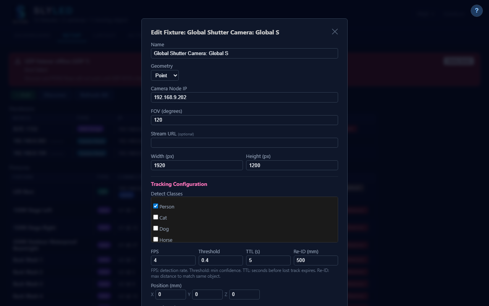

**Detect Classes** — sélection multiple des types d'objets à suivre. Le modèle YOLOv8n prend en charge 80 classes COCO ; 16 classes pertinentes pour la scène sont disponibles :

| Catégorie | Classes |
|-----------|---------|
| Personnes | Person |
| Animaux | Cat, Dog, Horse |
| Accessoires | Chair, Backpack, Suitcase, Sports Ball, Bottle, Cup, Umbrella, Teddy Bear |
| Véhicules | Bicycle, Skateboard, Car, Truck |

Par défaut, seule **Person** est sélectionnée. Ajouter d'autres classes n'a aucun impact sur les performances — YOLO évalue toujours toutes les classes en un seul passage et filtre ensuite.

**Paramètres :**

| Paramètre | Défaut | Plage | Description |
|-----------|--------|-------|-------------|
| FPS | 2 | 0,5–10 | Images de détection par seconde. Plus haut = plus réactif mais plus de CPU sur le nœud caméra. |
| Seuil | 0,4 | 0,1–0,95 | Confiance minimale pour accepter une détection. Plus bas = plus sensible mais plus de faux positifs. |
| TTL (s) | 5 | 1–60 | Secondes avant qu'une piste perdue n'expire et que son marqueur de plateau soit retiré. |
| Re-ID (mm) | 500 | 50–5000 | Distance maximale pour apparier une nouvelle détection à un objet déjà suivi. |

**Démarrer le suivi :** cliquez sur le bouton **Track** dans l'onglet Setup (à côté de Snap) ou dans la boîte de dialogue d'édition d'appareil de l'onglet Layout. Le nœud caméra commence une détection continue selon vos classes et paramètres configurés. Les objets détectés apparaissent comme marqueurs étiquetés dans la vue 3D.

### Étalonnage des projecteurs motorisés

L'assistant d'étalonnage de projecteur motorisé construit une grille d'interpolation qui associe chaque position du plateau aux angles pan/tilt exacts requis pour un projecteur motorisé DMX. Un nœud caméra positionné est requis.

**Prérequis :**
- Au moins un nœud caméra positionné dans l'onglet Layout
- Moteur Art-Net en cours d'exécution (`POST /api/dmx/start`)
- Appareil projecteur motorisé placé sur la disposition avec son profil configuré

**Démarrer l'étalonnage :**
1. Allez dans l'onglet **Layout** et double-cliquez sur un appareil projecteur motorisé DMX
2. Cliquez sur le bouton **Calibrate** dans la boîte de dialogue d'édition d'appareil
3. Choisissez une couleur de faisceau — les options sont vert, magenta, rouge, bleu (choisissez-en une qui contraste avec votre plateau)
4. Cliquez sur **Start Calibration** — l'assistant prend le relais automatiquement

**Ce qui se passe automatiquement :**
1. **Découverte** — le projecteur balaie une grille pan/tilt grossière ; la caméra détecte où le faisceau atterrit sur le sol du plateau
2. **Cartographier la région visible** — la plage pan/tilt qui maintient le faisceau dans le champ de vision de la caméra est identifiée
3. **Construire la grille d'interpolation** — le projecteur échantillonne systématiquement des points à travers la région visible ; à chaque point, la caméra enregistre les coordonnées exactes du plateau

**Progression :** un panneau de progression en temps réel affiche la phase en cours, le pourcentage complet et une vignette en direct depuis la caméra.

**Résultat :** la grille d'interpolation est enregistrée avec l'appareil et utilisée automatiquement par l'action Track et toutes les actions Pan/Tilt Move pour convertir les coordonnées de l'espace scène en valeurs pan/tilt matérielles.

> **Astuce :** lancez l'étalonnage dans un éclairage ambiant tamisé afin que le faisceau soit clairement visible par la caméra. Utilisez l'option **Beam Color** qui donne le plus haut contraste sur la surface de votre sol.

### Test d'orientation d'appareil

Avant de lancer l'étalonnage complet, utilisez le test d'orientation pour confirmer que pan et tilt sont câblés dans les directions attendues. Une orientation incorrecte fait converger l'étalonnage sur de mauvaises positions.

**Lancer le test :**
1. Double-cliquez sur un projecteur motorisé DMX dans l'onglet Layout pour ouvrir la boîte de dialogue d'édition d'appareil
2. Cliquez sur **Orientation Test** (sous la carte des canaux)
3. L'appareil se déplace à travers quatre positions de sonde : pan gauche, pan droite, tilt haut, tilt bas
4. Observez le faisceau physique et comparez-le avec les flèches à l'écran indiquant la direction attendue

**Interpréter les résultats :**
| Observation | Action |
|-------------|--------|
| Le faisceau suit les flèches | L'orientation est correcte — passez à l'étalonnage |
| Pan se déplace dans la direction opposée | Activez **Invert Pan** dans les réglages de l'appareil |
| Tilt se déplace dans la direction opposée | Activez **Invert Tilt** dans les réglages de l'appareil |
| Les axes pan et tilt sont échangés | Activez **Swap Pan/Tilt** dans les réglages de l'appareil |

**Enregistrer :** après avoir ajusté les indicateurs d'orientation, cliquez sur **Save** dans la boîte de dialogue d'édition d'appareil. Les indicateurs sont stockés avec l'appareil et appliqués automatiquement lors de tous les étalonnages et lectures ultérieurs.

---

<!-- review-status: pending -->

## 15. Firmware et mises à jour OTA

L'onglet **Firmware** est la fenêtre unique de l'opérateur sur tous
les périphériques flashables du rig : nœuds exécutants LED, pont
DMX, palet gyro, et nœuds caméra. Chaque périphérique flashable
remonte sa version de micrologiciel courante à l'orchestrateur sur
chaque cycle PING/PONG ; un périphérique périmé apparaît donc comme
« obsolète » dans les secondes qui suivent le démarrage de
l'orchestrateur.

### Versions de production courantes (orchestrateur v1.7.83)

| Périphérique | Piste | Courante | Canal |
| --- | --- | --- | --- |
| Orchestrateur (Windows / macOS) | app | **v1.7.83** | installateur (`SlyLED-Setup.exe`) |
| Application Android opérateur | app | suit la piste de l'orchestrateur | sideload de l'APK depuis `dist/slyled-android.apk` |
| Nœud exécutant LED (ESP32) | `child-led-esp32` | **v7.5.11** | OTA |
| Nœud exécutant LED (D1 Mini) | `child-led-d1mini` | **v7.5.10** | OTA |
| Nœud exécutant LED (Giga enfant) | `child-led-giga` | **v7.5.2** | OTA |
| Pont DMX (ESP32) | `dmx-bridge-esp32` | **v7.5.20** | OTA |
| Pont DMX (Giga R1) | `dmx-bridge-giga` | **v7.5.20** | OTA |
| Firmware parent (Giga R1) | `parent-giga` | **v7.5.24** *(en attente — l'orchestrateur de bureau est l'exécution recommandée)* | USB seulement |
| Contrôleur Gyro (ESP32-S3) | `gyro-esp32s3` | **v1.2.8** | OTA |
| Nœud caméra (Linux SBC) | `camera-node` | **v1.6.3** | déploiement SSH depuis l'onglet Firmware |

L'onglet Firmware interroge `firmware/registry.json` pour connaître
la version « courante » ; ce tableau est donc régénéré
automatiquement à chaque release et l'opérateur n'a jamais à le
garder en tête.

### Flash USB

1. Ouvrez l'onglet **Firmware**.
2. Cliquez sur la carte **Flash USB**. La liste déroulante affiche
   chaque binaire connu du registre pour les cartes flashables par
   USB (LED ESP32 / D1 Mini / Giga enfant / variantes du pont DMX /
   Contrôleur Gyro).
3. Branchez la carte cible et choisissez son port COM dans la
   seconde liste déroulante.
4. Cliquez sur **Flasher** — la progression montre un pourcentage
   et un « vérification OK » final avant que la carte redémarre
   sous le nouveau micrologiciel.

Le Contrôleur Gyro (ESP32-S3) embarque un port série USB-CDC dans
son firmware. Si une compilation défaillante laisse le palet
incapable d'énumérer en USB, maintenez le bouton **BOOT** appuyé en
branchant le câble pour entrer dans le bootloader ROM manuel ;
l'onglet Firmware re-flashe alors via le chemin de récupération
esptool.

### OTA (Over-the-Air)

1. Configurez les identifiants WiFi sur l'onglet Firmware — ils
   sont poussés sur chaque périphérique nouvellement flashé.
2. Cliquez sur **Vérifier les mises à jour**. L'onglet affiche une
   comparaison par périphérique : version remontée → version du
   registre, avec un bouton **Mettre à jour** sur tout ce qui est
   obsolète.
3. Cliquez sur **Mettre à jour** sur tout exécutant obsolète. Le
   statut en cours de flash revient en direct ; le périphérique
   redémarre automatiquement après vérification.
4. Nouveau depuis v1.7.83 : lorsqu'un SHA-256 du registre ne
   correspond pas au binaire sur disque (téléchargement
   interrompu ou registre édité à la main), l'orchestrateur retombe
   sur la release de firmware publiée correspondant au `releaseTag` plutôt que
   de refuser le flash.

Les builds de diagnostic / développement du gyro
(`esp32s3-gyro-test-firmware.bin`) sont volontairement masqués de
l'UI OTA opérateur — l'onglet Firmware ne propose que les builds de
production. Le binaire de diagnostic reste présent dans `dist/` pour
les ingénieurs effectuant un débogage en cartes appairées.

### Registre Firmware

`firmware/registry.json` est la source de vérité unique de la
version que l'orchestrateur croit livrée à chaque release. Chaque
entrée porte :

- `id` et `name` pour le libellé de l'UI OTA.
- `version` (semver 3 segments) — ce que doit exécuter le
  périphérique de l'opérateur.
- `releaseTag` et `releaseAsset` — le tag de release de firmware publiée et le
  nom de fichier de l'asset à l'intérieur, utilisés par le repli
  OTA.
- `sha256` — hachage de vérification que l'orchestrateur valide
  avant et après flashage.

L'édition manuelle de `registry.json` n'est pas recommandée ;
`build_release.ps1` le maintient en synchronisation avec les
empreintes des binaires à chaque release. L'onglet Firmware
rafraîchit le registre depuis le serveur de releases à la demande via le bouton
**Rafraîchir** ; un installateur fraîchement récupéré voit donc
immédiatement les versions correspondant à son tag de release.

---

## 15. Limites du systeme

| Ressource | Teste | Maximum recommande |
|-----------|-------|--------------------|
| Projecteurs DMX | 120 | 500+ |
| Performers LED | 12 | 50 |
| Total des projecteurs | 132 | 500+ |
| Univers | 4 | 32 768 (Art-Net) |
| LED par chaine | 65535 | Adressage uint16 |
| Chaines par enfant | 8 | Constante du protocole |
| Clips de Timeline | 50 | 200+ |
| Spectacles predefinis | 14 | Integres (extensibles) |
| Reponse API (132 projecteurs) | < 1 ms | Sous la milliseconde |
| Memoire (132 projecteurs) | 46 Mo | Mise a l'echelle lineaire |
| Reseau (132 projecteurs) | 221 Ko | Par cycle de test |

Voir `docs/STRESS_TEST.md` pour les donnees de benchmark completes.

---

<!-- review-status: pending -->

## 17. Dépannage

Le tableau ci-dessous couvre les symptômes que les opérateurs
remontent le plus souvent. Chaque ligne pointe vers la version de
l'orchestrateur où le comportement sous-jacent a été modifié pour la
dernière fois ; un opérateur sur une version plus ancienne peut
ainsi décider de mettre à jour ou de contourner.

| Problème | Ce que vous voyez | Correctif ou version |
| --- | --- | --- |
| **Vue d'exécution vide** | L'onglet Exécution 3D affiche le plateau mais aucun appareil. | Vérifiez que les appareils sont positionnés dans l'onglet **Disposition**. Les installations DMX seules s'affichent correctement depuis v1.7.30. |
| **Cône de faisceau dans la mauvaise direction** | Le cône de la visualisation 3D vise le mauvais mur. | La direction du faisceau provient de la `rotation = [rx, ry, rz]` de l'appareil dans l'espace plateau. Z est vers le haut ; rx > 0 vise vers le bas. Voir le chapitre 4 pour la convention complète. |
| **Le cône de la visualisation 3D ne correspond pas au projecteur physique** | Le cône dans la visualisation pointe à gauche du plateau alors que le projecteur motorisé vise à droite. | Corrigé en v1.7.52 (#806/#809) : le vecteur de visée canonique est la source de vérité, et l'IK physique en dérive. Si la divergence persiste sur v1.7.52+, sauvegardez à nouveau les positions Home et Secondaire de l'appareil dans l'assistant Set Home. |
| **Saut de pan à la fin de l'étalonnage** | Au relâchement de l'étalonnage, le projecteur saute vers une pose différente de celle que le palet remontait. | Corrigé en v1.7.52 (#805). Avant le correctif, le repli vers l'IK historique capturait le mauvais vecteur de visée au relâchement. Les opérateurs sur v1.7.52+ qui voient encore un saut doivent le signaler avec la version du firmware du palet gyro (≥ v1.2.4 requis). |
| **L'appui sur Démarrer clignote vers « start » sur le palet** | L'opérateur appuie sur Démarrer après une coupure WiFi, l'UI du palet clignote l'accusé de revendication pendant une frame, puis revient à IDLE pendant que l'orchestrateur conserve une revendication orpheline. | Corrigé en v1.7.83 (#812 / #813 / #825). L'appui sur Démarrer utilise désormais un nonce 16 bits + CLAIM_ACK, avec des battements de cœur HB_REP pour réconcilier les états divergents. Si vous voyez le symptôme sur v1.7.83+, vérifiez que le firmware du palet est ≥ v1.2.7 (le registre vous le signale). |
| **L'auto-luminosité n'a aucun effet sur les lumières** | L'UI Auto-luminosité Android montre le maître qui glisse avec la musique, mais les têtes DMX et les bandeaux LED ne s'estompent pas. | Corrigé en v1.7.83 (#843). Le POST rapide diffuse désormais `CMD_SET_BRIGHTNESS` aux nœuds LED et applique une mise à l'échelle gamma au gradateur DMX / RVB au moment du rendu. Les opérateurs sur d'anciennes versions peuvent se rabattre sur le curseur manuel Paramètres → Luminosité globale en attendant la mise à jour. |
| **La playlist en boucle s'éteint entre chaque itération** | Une playlist mono- ou multi-élément en mode **Loop All** flashe tout à zéro pendant une frame à chaque bouclage. | Corrigé en v1.7.83 (#840). Les boucles mono-élément passent par le chemin de lecture modulo, et les boucles multi-éléments passent `is_final=False` pour supprimer le balayage de blackout de fin naturelle jusqu'à ce que la playlist s'arrête réellement. |
| **L'action de suivi éteint des projecteurs motorisés sur des chronologies sans rapport** | Une chronologie qui ne référence pas une action de suivi voit quand même ses projecteurs s'éteindre dès que l'action existe dans la bibliothèque. | Corrigé en v1.7.83 (#835). Les actions de suivi n'évaluent plus que sur les chronologies qui les référencent ; les actions orphelines restent dormantes. |
| **Un préréglage promet « les têtes suivent X » mais elles ne le font pas** | Une description de thème promet du suivi, mais le rig se contente de balayer. | Corrigé en v1.7.83 (#837). Les descriptions des thèmes correspondent désormais à l'implémentation réelle : seuls Figure Eight et Spotlight Follow Person émettent une action de suivi ; les autres balayent. |
| **Le champ Roue de couleurs apparaît dans l'éditeur d'action DMX Scene** | Les volets DMX Scene / PT-Move / Gobo Select de l'éditeur d'action présentaient un champ « Roue de couleurs » qui ne faisait pas ce que l'opérateur attendait sur les appareils hybrides RVB+roue. | Corrigé en v1.7.83 (#841 / #842). L'emplacement de roue est désormais réservé au type 17 ; le moteur de précalcul / rendu dérive l'emplacement à partir du RVB via `rgb_to_wheel_slot` pour tous les autres types d'action. Une migration unique retire les champs `colorWheel: 0` périmés au premier démarrage de v1.7.83+. |
| **Visualisation 3D ne s'affiche pas** | Canevas noir là où le plateau devrait être. | Utilisez Chrome / Firefox / Edge avec le support WebGL. Vérifiez `chrome://gpu` pour l'accélération matérielle. |
| **Exécutants non synchronisés** | Un nœud enfant apparaît hors-ligne dans Configuration alors qu'il est sous tension. | Vérifiez que l'orchestrateur et le nœud enfant sont sur le même sous-réseau WiFi. Le bouton **Rafraîchir** de l'onglet Configuration relance le scan via mDNS + diffusion UDP. |
| **Canevas de mauvaise taille** | Le canevas Disposition est beaucoup plus petit ou plus grand que la pièce. | Les dimensions du plateau (Paramètres → Plateau) déterminent la taille du canevas : `canvasW = stage.w × 1000`. Ajustez la largeur / hauteur du plateau en mètres plutôt que les pixels du canevas. |
| **Flash OTA refusé pour incohérence de SHA** | L'onglet Firmware refuse la mise à jour avec `sha256 mismatch`. | Corrigé en v1.7.61 (#814). L'orchestrateur retombe désormais sur la release de firmware publiée du `releaseTag` enregistré quand le binaire sur disque diffère du registre. Si vous voyez encore l'erreur, cliquez sur **Rafraîchir** dans l'onglet Firmware pour récupérer `registry.json` depuis le serveur de releases. |
| **Verrou de stale-reason gyro qui ne s'efface pas** | « Connexion perdue » reste affiché sur la ligne de statut d'un palet alors qu'il a repris l'envoi. | Corrigé en v1.7.62 (#821) puis à nouveau en v1.7.63 (#823). L'appui sur Démarrer efface la stale_reason distante ; le cache s'auto-détruit sur un échec de lecture transitoire. |

Si vous rencontrez quelque chose qui n'est pas dans ce tableau, le
journal de l'orchestrateur (Paramètres → Journalisation → activer
le journal fichier) capture chaque envoi UDP et chaque décision de
rendu DMX taggués par numéro d'issue — signalez-le via votre canal de support avec
la section pertinente jointe et une description de ce que faisait
le rig au moment du symptôme.

---

## 18. Exemples

### Exemple A : suivi caméra — les projecteurs motorisés suivent une personne (#376)

Faites que des projecteurs motorisés DMX suivent automatiquement les personnes détectées par une caméra.

**Prérequis :**
- Au moins un nœud caméra en ligne (onglet Firmware → déployer + vérifier)
- Au moins un appareil projecteur motorisé DMX placé dans l'onglet Layout
- Profil de projecteur motorisé configuré avec plage pan/tilt
- Moteur Art-Net/sACN en marche (Settings → DMX → Start)
- Étalonnage de projecteur motorisé terminé (voir Exemple C) pour une visée précise

**Étapes :**

1. **Vérifier le matériel** — ouvrez l'onglet Setup. Confirmez que vos projecteurs motorisés affichent un statut vert et que les nœuds caméra sont en ligne. Si les caméras sont hors ligne, vérifiez le WiFi et déployez le firmware depuis l'onglet Firmware.

2. **Démarrer le suivi caméra** — cliquez sur le bouton **Track** dans l'onglet Setup (à côté de Snap), ou allez dans l'onglet Layout, cliquez sur un appareil caméra et cliquez sur le bouton **Track** dans la modale d'édition. Le nœud caméra commence à exécuter la détection YOLO selon les classes et paramètres configurés dans les réglages de suivi de la caméra (voir [Configuration du suivi](#tracking-configuration)). Les objets détectés apparaissent comme marqueurs étiquetés dans la vue 3D.

3. **Créer une action Track** — allez dans l'onglet Actions. Cliquez sur **+ New Action**.
   - **Nom :** `Person Follow`
   - **Type :** `Track` (dernière option du menu déroulant)
   - **Couleur :** choisissez la couleur du faisceau (p. ex. rouge pour un spot)
   - Laissez **Target Objects** vide — cela signifie « suivre TOUTES les personnes détectées »
   - **Cycle Time :** 2000 ms (à quelle vitesse les projecteurs changent s'il y a cyclage)
   - Cochez **Fixed assignment** si vous voulez un 1:1 strict (projecteur 1 = personne 1, extras ignorés)
   - Cliquez sur **Save Action**

4. **Créer une chronologie** — allez dans l'onglet Shows. Cliquez sur **+ New Timeline**, nommez-la « Person Tracking », définissez la durée à 600 s, activez **Loop**. La chronologie peut être vide — les actions Track s'évaluent globalement pendant toute lecture.

5. **Démarrer la lecture** — cliquez sur **Bake**, puis **Start**. La boucle de lecture DMX à 40 Hz commence. L'action Track lit tous les objets temporels mobiles (personnes détectées), calcule pan/tilt pour chaque projecteur, définit dimmer et couleur, et envoie des paquets Art-Net au pont.

6. **Tester** — marchez devant la caméra. Dans les 2 secondes, un marqueur personne rose apparaît dans la vue 3D. Les projecteurs motorisés devraient s'allumer dans la couleur choisie et viser vers vous.

**Comportement d'assignation :**

| Personnes en vue | Avec 2 projecteurs motorisés |
|------------------|------------------------------|
| 1 personne | Les deux projecteurs visent la même personne |
| 2 personnes | Un projecteur par personne (1:1) |
| 3+ personnes (cyclage) | Les projecteurs cyclent entre les personnes toutes les 2 s |
| 3+ personnes (fixe) | Les 2 premières sont suivies, la 3e est ignorée |

**Dépannage :**

| Problème | Solution |
|----------|----------|
| Aucun marqueur personne en 3D | Vérifiez le statut du nœud caméra — le suivi est-il en marche ? Essayez un Scan manuel pour vérifier que la détection fonctionne. |
| Personne détectée mais les projecteurs ne bougent pas | Vérifiez que le moteur Art-Net est en marche. Vérifiez l'étalonnage du projecteur motorisé. Vérifiez que la lecture de la chronologie est active. |
| Les projecteurs s'allument mais visent la mauvaise position | Exécutez l'étalonnage de projecteur motorisé (Exemple C). Sans étalonnage, le système utilise des estimations géométriques qui peuvent être imprécises. |
| Les projecteurs répondent avec délai | Normal — la détection tourne à 2 fps avec ~1 s de latence de capture. Les objets temporels ont un TTL de 5 s. |

---

### Exemple B : suivi par projecteur motorisé avec effets spatiaux (#379)

Faites que des projecteurs motorisés suivent un objet virtuel balayant la scène — aucune caméra requise. Cet exemple parcourt le flux de travail complet, de la configuration de la scène à l'aperçu 3D en direct avec cônes de faisceau animés.

**Prérequis :**
- Orchestrateur SlyLED en marche (Windows ou Mac)
- Aucun matériel physique requis — cet exemple s'exécute entièrement dans l'émulateur

**Partie 1 — Configuration de la scène et des appareils**

1. **Définir les dimensions de la scène** — ouvrez l'onglet Settings. Sous **Stage**, entrez les dimensions de votre zone de performance :
   - Largeur : 6000 mm (6 m)
   - Hauteur : 3000 mm (3 m)
   - Profondeur : 4000 mm (4 m)
   - Cliquez sur **Save**. La vue 3D se redimensionnera pour correspondre à ces dimensions.

2. **Créer un profil DMX** — allez dans Settings → **Profiles** → cliquez sur **New Profile**. Cela définit la disposition des canaux de votre projecteur motorisé :
   - **Nom :** `Narrow Spot`
   - **Beam Width :** 8 (degrés — faisceau étroit pour un suivi visible)
   - **Pan Range :** 540, **Tilt Range :** 270
   - **Channels :** ajoutez 6 canaux dans cet ordre :
     - Canal 0 : Pan (16 bits) — pan coarse
     - Canal 1 : Pan Fine — pan fine (auto-lié)
     - Canal 2 : Tilt (16 bits) — tilt coarse
     - Canal 3 : Tilt Fine — tilt fine (auto-lié)
     - Canal 4 : Dimmer
     - Canal 5 : Red, Canal 6 : Green, Canal 7 : Blue
   - Cliquez sur **Save Profile**

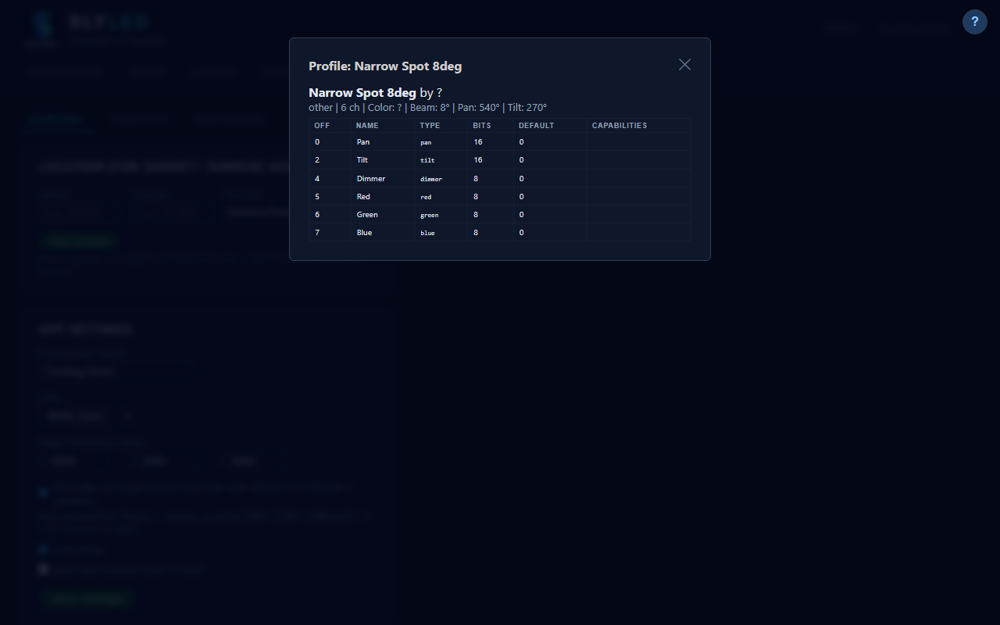

3. **Ajouter deux projecteurs motorisés** — allez dans l'onglet Setup. Cliquez deux fois sur **+ Add Fixture** pour créer deux projecteurs motorisés DMX :
   - **Appareil 1 :** nom : `Mover SL` (Stage Left), Universe : 1, Start Address : 1, Profile : `Narrow Spot`
   - **Appareil 2 :** nom : `Mover SR` (Stage Right), Universe : 1, Start Address : 14, Profile : `Narrow Spot`

   Les deux appareils apparaissent dans le tableau Setup avec des badges « DMX » violets et le nom du profil.

**Partie 2 — Disposition 3D et effet spatial**

4. **Positionner les projecteurs sur le pont** — passez à l'onglet Layout. Dans la barre latérale, vous verrez les deux projecteurs listés comme « non placés ». Faites glisser chacun dans la vue 3D :
   - **Mover SL :** position X : 1500, Y : 0, Z : 2800 (côté cour, sur le pont). Réglez la rotation à tilt : −30, pan : −15.
   - **Mover SR :** position X : 4500, Y : 0, Z : 2800 (côté jardin, sur le pont). Réglez la rotation à tilt : −30, pan : 15.

   Passez en vue 3D pour confirmer que les deux projecteurs sont élevés sur le pont et dirigés vers le sol de la scène. Les cônes de faisceau devraient être visibles comme des triangles translucides.

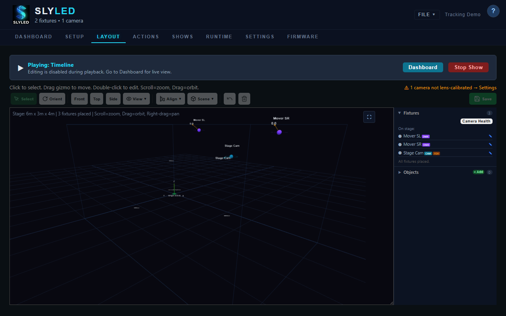

5. **Créer un effet spatial** — allez dans l'onglet Actions. Cliquez sur **+ New Action** :
   - **Nom :** `Sweep Green`
   - **Type :** Spatial Effect
   - **Shape :** Sphere
   - **Radius :** 800 mm
   - **Color :** vert (0, 255, 0)
   - **Motion Start :** X : 1000, Y : 2000, Z : 0 (côté cour, mi-profondeur, niveau du sol)
   - **Motion End :** X : 5000, Y : 2000, Z : 0 (côté jardin, même profondeur et hauteur)
   - **Duration :** 8 secondes
   - **Easing :** Linear
   - Cliquez sur **Save Action**

   Cela crée une sphère verte de lumière qui balaie du côté cour au côté jardin en 8 secondes. Appliquée aux projecteurs motorisés, ils suivront la position centrale de la sphère.

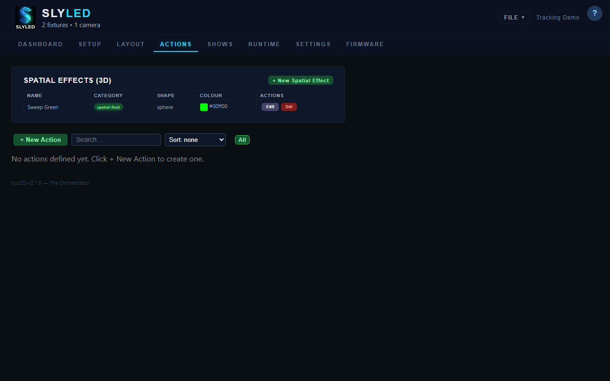

**Partie 3 — Chronologie, précalcul et lecture**

6. **Créer une chronologie** — allez dans l'onglet Shows. Cliquez sur **+ New Timeline** :
   - **Nom :** `Mover Tracking Demo`
   - **Duration :** 20 secondes
   - **Loop :** activé
   - Ajoutez une piste ciblant **All Performers**
   - Ajoutez un clip référençant l'effet `Sweep Green`, commençant à 0 s avec 8 s de durée

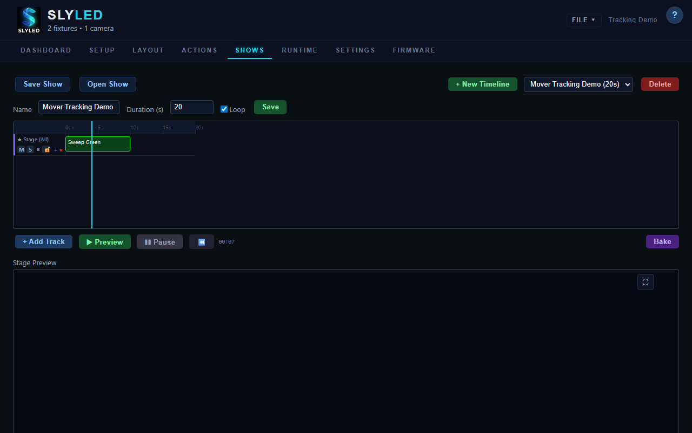

7. **Précalculer la chronologie** — cliquez sur le bouton **Bake**. Le moteur de précalcul calcule les angles pan/tilt par appareil pour chaque tranche de temps :
   - Pour chaque image de 25 ms, il calcule la position de la sphère le long du chemin de mouvement
   - Pour chaque projecteur, il calcule les angles pan/tilt nécessaires pour viser cette position
   - Le dimmer est réglé à 255 et les canaux de couleur sont réglés à vert
   - Attendez la confirmation « Bake complete » (typiquement <1 seconde)

8. **Démarrer la lecture et vérifier** — passez à l'onglet Runtime. Cliquez sur **Start** :
   - La vue 3D montre les deux cônes de faisceau animés en temps réel
   - À T=0 s, les deux faisceaux visent la position de départ (côté cour)
   - Au fur et à mesure que l'effet balaie, les faisceaux suivent la sphère verte à travers la scène
   - À T=8 s, les deux faisceaux ont suivi la sphère jusqu'au côté jardin
   - La chronologie boucle, et le balayage redémarre

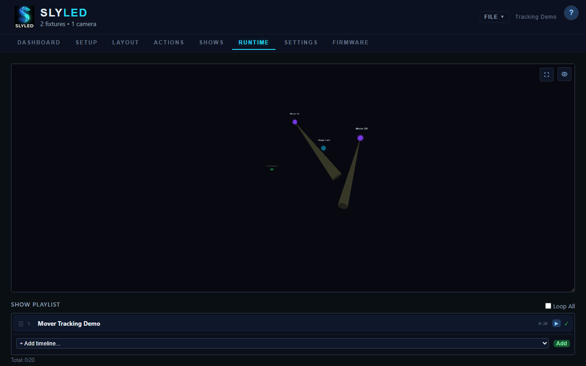
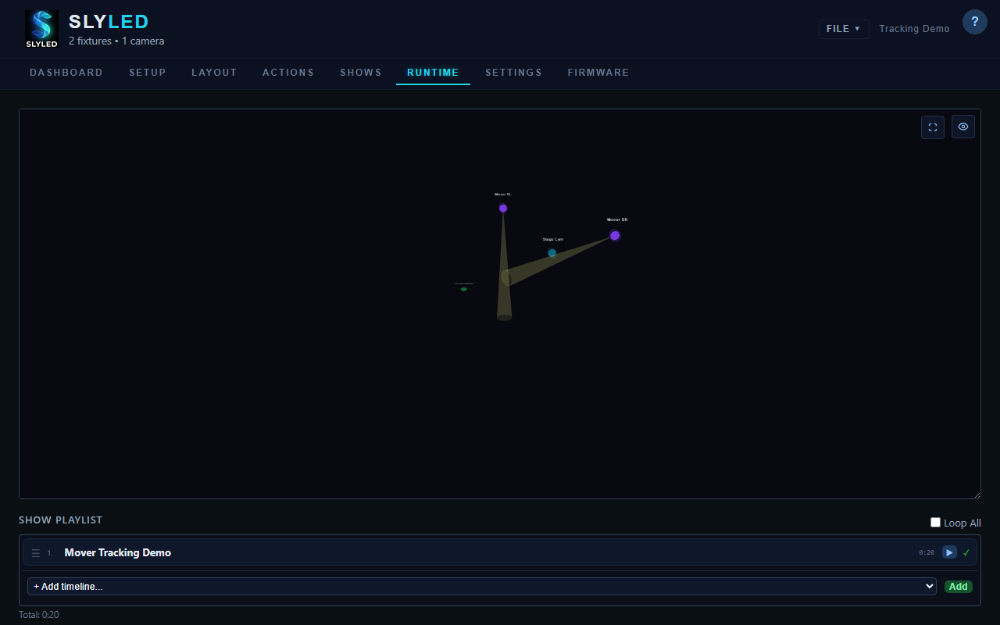
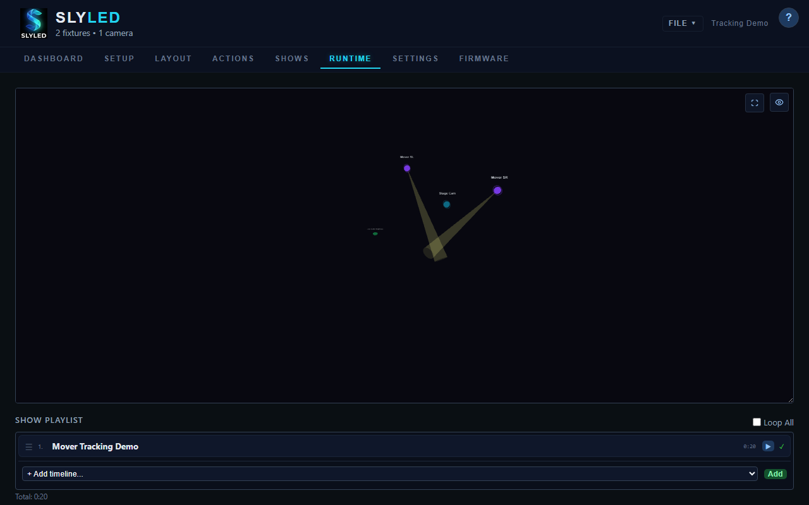

**À quoi faire attention :**
- Les deux cônes de faisceau doivent être verts (correspondant à la couleur de l'effet)
- Les cônes doivent se déplacer en douceur de gauche à droite
- L'intensité du faisceau (opacité) doit être > 0 pendant le balayage, indiquant une sortie active
- Si les cônes de faisceau n'apparaissent pas, assurez-vous que les appareils sont positionnés dans l'onglet Layout et que la chronologie est précalculée

**Variantes :**
- Changez la forme de l'effet spatial en **Plane** pour un mur de lumière qui balaie
- Ajoutez un second effet sur une piste séparée avec un timing différent pour des motifs croisés
- Essayez le spectacle préréglé **Figure Eight** (Runtime → Load Show) pour un motif croisé prêt à l'emploi

---

### Exemple C : étalonnage manuel de projecteur motorisé (#381)

Étalonnez un projecteur motorisé afin que le système sache exactement où atterrit son faisceau pour toute position pan/tilt. Ce processus en deux parties découvre d'abord la plage visible du faisceau (grille pan/tilt) puis construit une carte de lumière qui associe chaque position pan/tilt à des coordonnées de scène réelles.

**Prérequis :**
- Au moins un nœud caméra en ligne et positionné dans l'onglet Layout
- Étalonnage caméra terminé — la caméra doit avoir une carte de scène valide (voir Exemple D)
- Appareil projecteur motorisé ajouté dans Setup et positionné dans l'onglet Layout
- Moteur Art-Net/sACN en marche (Settings → DMX → Start)
- Éclairage ambiant tamisé — le faisceau doit être clairement visible à la caméra sur le sol
- Le faisceau doit être visé sur le sol dans le champ de vision de la caméra, pas directement sur la caméra

**Partie 1 — Découverte pan/tilt et étalonnage de grille**

1. **Ouvrir le panneau d'étalonnage** — allez dans l'onglet Layout. Double-cliquez sur l'appareil projecteur motorisé que vous voulez étalonner. Dans la boîte de dialogue d'édition, cliquez sur le bouton **Calibrate**. L'assistant d'étalonnage s'ouvre en affichant le nom de l'appareil, le statut d'étalonnage actuel (le cas échéant) et les modes d'étalonnage disponibles.

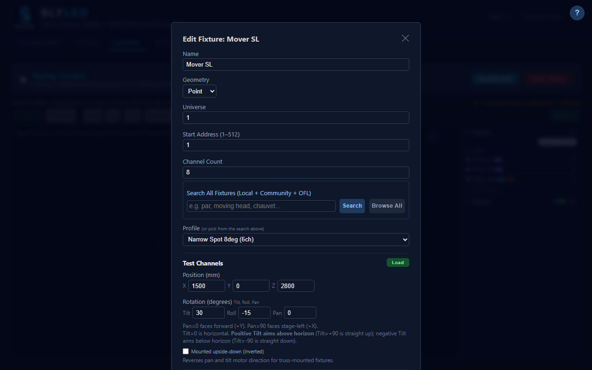

2. **Choisir la couleur du faisceau** — sélectionnez une couleur qui contraste bien avec la surface de votre sol :
   - **Vert** fonctionne mieux sur sols sombres (bois, moquette foncée)
   - **Magenta** fonctionne mieux sur sols clairs (blanc, béton)
   - **Rouge** ou **Bleu** sont des alternatives si les choix par défaut se confondent avec votre environnement
   - La couleur importe parce que la caméra utilise un filtrage colorimétrique pour isoler le faisceau de la lumière ambiante

3. **Lancer la découverte** — cliquez sur **Start Calibration**. Le système exécute une séquence de découverte automatique :
   - **Phase 1 — Balayage de grille grossière :** l'appareil balaie ~40 positions pan/tilt (8 colonnes × 5 rangées) sur toute sa plage. La caméra guette l'apparition du faisceau sur le sol après chaque mouvement.
   - **Phase 2 — Raffinement fin :** une fois le faisceau trouvé, le système spiraler vers l'extérieur depuis cette position pour affiner le centre exact de la région visible.
   - La découverte se termine typiquement en 30–60 secondes. L'indicateur de progression affiche « Discovering... » avec la position de balayage courante.


4. **Cartographie BFS** — après la découverte, le système cartographie automatiquement toute la région visible :
   - Depuis la position de faisceau découverte, il avance dans 4 directions (haut/bas/gauche/droite dans l'espace pan/tilt)
   - À chaque position, la caméra capture une image et détecte le centroïde du faisceau
   - Le système enregistre la position pixel du faisceau et la convertit en millimètres scène à l'aide de l'homographie de la caméra
   - La cartographie s'arrête aux frontières où le faisceau quitte le champ de vision de la caméra ou tombe hors de la scène
   - Collecte jusqu'à 60 positions d'échantillon, typiquement en 2–3 minutes
   - Le système utilise des temps de settle adaptatifs (0,8–2,5 s) par mouvement et une double capture de vérification pour s'assurer que le faisceau s'est arrêté avant d'enregistrer

5. **Construction et revue de grille** — les échantillons collectés sont compilés en une grille d'interpolation bilinéaire :
   - Le résumé d'étalonnage affiche :
     - **Sample count :** nombre de positions détectées avec succès (visez 30+)
     - **Pan range :** plage normalisée (p. ex. 0,15–0,85 signifie que le faisceau est visible sur 70 % de la plage pan)
     - **Tilt range :** plage normalisée
     - **Grid density :** finesse d'échantillonnage de la grille
   - La grille permet une recherche directe rapide : étant donné une valeur (pan, tilt), calculer le (X, Y) scène où atterrit le faisceau


**Partie 2 — Étalonnage de carte de lumière (recherche coordonnées scène vers pan/tilt)**

6. **Construire la carte de lumière** — cliquez sur **Build Light Map**. Cela étend l'étalonnage en balayant une grille systématique 20×15 à travers la région visible découverte :
   - Pour chaque position de grille, l'appareil se déplace à la valeur pan/tilt
   - La caméra détecte le faisceau et enregistre les X/Y/Z scène exacts où il atterrit
   - Cela construit une table de correspondance complète (pan, tilt) → (stageX, stageY, stageZ)
   - La progression affiche « Building light map... N/300 » avec des mises à jour en temps réel
   - Temps de complétion typique : 5–10 minutes pour une grille complète 20×15


7. **Vérifier la recherche inverse** — une fois la carte de lumière construite, utilisez le bouton **Aim** pour tester la correspondance inverse :
   - Entrez une position cible scène (p. ex. centre scène : X=3000, Y=2000, Z=0)
   - Cliquez sur **Aim** — le système utilise une interpolation pondérée par l'inverse des distances des 4 échantillons les plus proches de la carte de lumière pour calculer les valeurs pan/tilt exactes
   - L'appareil se déplace à la position calculée
   - Vérifiez visuellement que le faisceau atterrit sur (ou très près de) le point cible sur la scène
   - Essayez 3–4 cibles différentes à travers la scène pour confirmer la précision
   - Un bon étalonnage devrait placer le faisceau dans les 100–200 mm de la cible à des distances de scène typiques


8. **Enregistrer l'étalonnage** — les données d'étalonnage sont automatiquement enregistrées avec l'appareil. La carte de lumière et les données de grille persistent entre les sessions et sont incluses dans les exports de fichier projet (.slyshow).
   - Les actions Track utilisent la carte de lumière pour viser les personnes détectées
   - Les actions Pan/Tilt Move l'utilisent pour des balayages interpolés fluides
   - La vue 3D l'utilise pour afficher des directions de cône de faisceau précises

**Étalonnage manuel (alternative — aucune caméra requise) :**

Si l'étalonnage automatisé n'est pas disponible (pas de caméra, ou la caméra ne peut pas voir le faisceau), utilisez l'assistant d'étalonnage manuel :

1. Onglet Layout → double-cliquez sur le projecteur motorisé → cliquez sur **Manual Calibrate**
2. **Définir les positions des marqueurs** — ajoutez 4–6 marqueurs physiques à des positions scène connues. Entrez les coordonnées X, Y, Z de chaque marqueur (en mm). Répartissez les marqueurs à travers la scène : avant-gauche, avant-droite, arrière-centre au minimum.
3. **Jog vers chaque marqueur** — pour chaque marqueur, utilisez les curseurs pan/tilt pour viser manuellement le faisceau jusqu'à ce qu'il atterrisse exactement sur le marqueur physique. Cliquez sur **Record** pour enregistrer l'échantillon (pan, tilt) → (stageX, stageY, stageZ).
4. **Ajoutez au moins 4 échantillons** répartis à travers la scène pour un bon ajustement affine. Plus d'échantillons (6+) améliorent la précision, en particulier aux bords de la scène.
5. Cliquez sur **Compute** — le système ajuste une transformation affine 3D à partir de vos échantillons :
   - `pan = a1*stageX + b1*stageY + c1*stageZ + d1`
   - `tilt = a2*stageX + b2*stageY + c2*stageZ + d2`
   - La transformation affine extrapole au-delà des points étalonnés pour une couverture de toute la scène

**Quand ré-étalonner :**
- Appareil physiquement déplacé vers une nouvelle position ou un nouvel angle
- Changement de lieu (différentes dimensions de scène ou surface de sol)
- Après une mise à jour firmware qui change la plage pan/tilt ou le comportement moteur
- Si la précision de visée se dégrade avec le temps (dérive moteur)
- Après changement de l'orientation de montage de l'appareil (droit vs. inversé)

---

### Exemple D : étalonnage caméra avec marqueurs ArUco (#380)

Étalonnez une caméra afin que les coordonnées pixel puissent être associées à des positions scène réelles. C'est un prérequis pour la détection de faisceau, le suivi de personne et l'étalonnage de projecteur motorisé — sans cela, le système ne peut pas convertir ce que la caméra voit en millimètres scène réels.

**Prérequis :**
- Nœud caméra en ligne et joignable sur le réseau (déployez le firmware depuis l'onglet Firmware si nécessaire)
- Appareil caméra enregistré dans le système (onglet Setup → Discover, ou Settings → Cameras → ajouter manuellement)
- Appareil caméra placé dans l'onglet Layout à sa position physique
- Une imprimante pour imprimer la feuille de marqueurs ArUco (papier A4/Letter standard)
- Un mètre ruban pour enregistrer les positions des marqueurs sur la scène
- La caméra doit avoir une vue dégagée du sol de la scène où les marqueurs seront placés

**Partie 1 — Préparer et placer les marqueurs ArUco**

1. **Imprimer les marqueurs ArUco** — allez dans Settings → Cameras. Cliquez sur le bouton **Print ArUco Markers**. Une modale s'ouvre avec 6 marqueurs ArUco 4×4 imprimables (ID 0–5), chacun de 150 mm × 150 mm :
   - Cliquez sur **Download** ou utilisez la boîte de dialogue d'impression du navigateur pour imprimer la feuille de marqueurs
   - Imprimez à 100 % d'échelle (pas de mise à l'échelle/ajustement à la page) — la taille physique doit correspondre aux 150 mm attendus pour un étalonnage précis
   - Les marqueurs peuvent être imprimés sur papier blanc ordinaire, mais le carton est plus durable

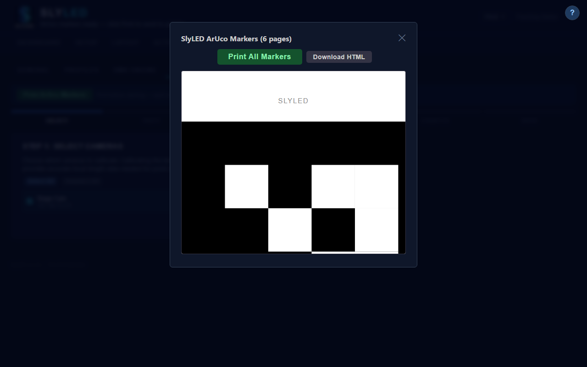

2. **Placer les marqueurs sur le sol de la scène** — positionnez les marqueurs imprimés à des emplacements connus sur la scène :
   - **Minimum :** 3 marqueurs (suffisant pour une homographie de base)
   - **Recommandé :** 4–6 marqueurs pour une meilleure précision
   - **Stratégie de placement :**
     - Répartissez les marqueurs sur tout le champ de vision de la caméra
     - Placez au moins un marqueur près de chaque coin de la zone visible
     - Placez les marqueurs à plat sur le sol — les marqueurs inclinés réduisent la précision
     - Mesurez la position de chaque marqueur depuis l'origine de la scène (coin arrière-droit au niveau du sol) :
       - X = distance depuis la droite de la scène (mm)
       - Y = distance depuis le mur du fond (mm)
       - Z = 0 (niveau du sol)
   - Enregistrez l'ID du marqueur et ses coordonnées (X, Y) — vous les entrerez à l'étape 5

**Partie 2 — Enregistrer et positionner la caméra**

3. **Enregistrer la caméra** — si le nœud caméra n'est pas déjà enregistré :
   - Allez dans l'onglet Setup et cliquez sur **Discover** — les nœuds caméra répondent à la diffusion UDP
   - Ou allez dans Settings → Cameras → entrez l'adresse IP de la caméra manuellement
   - Chaque capteur de caméra USB sur le nœud apparaît comme un appareil séparé
   - Vérifiez que la caméra est en ligne : son statut devrait afficher « Online » avec un indicateur vert

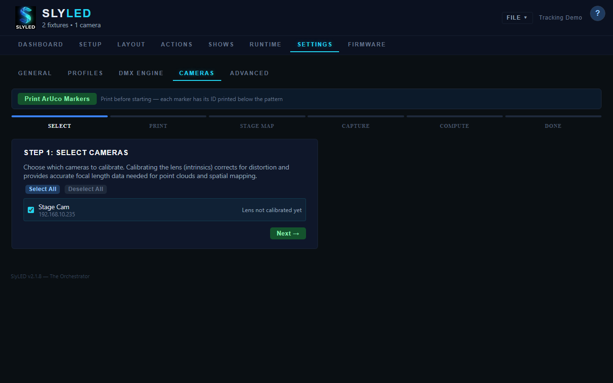

4. **Positionner la caméra en 3D** — passez à l'onglet Layout :
   - Trouvez l'appareil caméra dans la barre latérale (listé comme « non placé » s'il est nouveau)
   - Faites-le glisser dans la vue 3D à la position physique réelle de la caméra
   - Réglez la rotation pour correspondre à la direction de visée réelle de la caméra :
     - Une caméra montée sur un mur à 2 m de hauteur, visée à 30 degrés vers le bas aurait rotation Z=2000, tilt=−30
   - En vue 3D, la caméra apparaît comme un tronc de pyramide (pyramide) montrant son champ de vision
   - Vérifiez que le tronc couvre la zone où vous avez placé les marqueurs ArUco

**Partie 3 — Lancer l'étalonnage et vérifier**

5. **Lancer l'étalonnage ArUco** — dans l'onglet Layout, cliquez sur l'appareil caméra pour le sélectionner. Cliquez sur le bouton **Calibrate** :
   - L'assistant s'ouvre et récupère une capture en direct depuis la caméra
   - Le système détecte automatiquement tous les marqueurs ArUco visibles et les met en évidence avec des superpositions vertes
   - **Pour chaque marqueur détecté :**
     - L'ID du marqueur est affiché sur la superposition
     - Entrez les coordonnées scène réelles du marqueur (X, Y en mm) que vous avez mesurées à l'étape 2
     - Cliquez sur **Record** pour enregistrer la correspondance pixel-vers-scène de ce marqueur
   - Après enregistrement de tous les marqueurs, cliquez sur **Compute** — le système construit une matrice d'homographie qui associe toute coordonnée pixel aux coordonnées sol de la scène


6. **Revoir les résultats d'étalonnage** — le résumé d'étalonnage affiche :
   - **Reprojection error :** à quel point l'homographie calculée correspond aux points enregistrés. Plus bas est mieux :
     - <10 mm : excellent — adapté au suivi de précision
     - 10–20 mm : bon — adéquat pour la plupart des cas d'usage
     - 20–50 mm : correct — envisagez d'ajouter plus de marqueurs ou de re-mesurer les positions
     - >50 mm : médiocre — revérifiez les mesures de marqueurs et réessayez
   - **Reference points :** nombre de marqueurs utilisés (devrait correspondre à ce que vous avez enregistré)
   - **Coverage area :** la zone scène couverte par l'étalonnage (plus grand est mieux)


7. **Enregistrer et appliquer** — cliquez sur **Save** pour persister l'étalonnage :
   - Le badge de l'appareil caméra se met à jour pour afficher une coche verte « Cal »
   - Toutes les fonctionnalités qui dépendent de la conversion pixel-vers-scène utilisent maintenant cet étalonnage :
     - **Suivi de personne :** les cadres englobants détectés sont convertis en positions scène
     - **Détection de faisceau :** les centroïdes de faisceau deviennent des coordonnées scène pour l'étalonnage de projecteur motorisé
     - **Étalonnage de projecteur motorisé :** tout l'assistant d'étalonnage de projecteur motorisé (Exemple C) en dépend
   - Les données d'étalonnage sont incluses dans les exports de fichier projet (.slyshow) pour la portabilité

**Astuces pour un étalonnage précis :**
- **La taille des marqueurs compte :** utilisez les marqueurs de 150 mm à la taille d'impression standard. Les marqueurs plus petits sont plus difficiles à détecter à distance.
- **Le placement à plat est critique :** même une légère inclinaison (marqueur sur une surface froissée) peut décaler le centre détecté de 10–20 mm.
- **Couvrez les bords :** l'homographie est la plus précise à l'intérieur de l'enveloppe convexe de vos marqueurs de référence. Placez les marqueurs aux extrêmes de la vue de la caméra, pas seulement au centre.
- **Conditions d'éclairage :** la détection ArUco fonctionne dans la plupart des éclairages, mais évitez l'éblouissement direct sur les marqueurs imprimés (papier brillant sous des lumières vives).
- **Ré-étalonnez quand :**
  - La caméra est physiquement déplacée (même légèrement)
  - L'objectif de la caméra est changé ou le zoom est ajusté
  - Les dimensions de la scène changent (les marqueurs seraient à des positions différentes)
  - La précision du suivi ou de la détection de faisceau se dégrade

---

### Exemple E : spot suit la personne — préréglage de suivi en direct (#382)

Utilisez le préréglage intégré **Spotlight: Follow Person** pour faire que des projecteurs motorisés suivent automatiquement les personnes détectées par une caméra en temps réel.

**Prérequis :**
- Au moins un nœud caméra en ligne avec détection de personne fonctionnelle (vérifiez d'abord avec un Scan manuel)
- Au moins un appareil projecteur motorisé DMX placé dans l'onglet Layout
- Étalonnage caméra terminé (voir Exemple D) pour un positionnement scène précis
- Étalonnage de projecteur motorisé terminé (voir Exemple C) pour une visée pan/tilt précise
- Moteur Art-Net/sACN en marche

**Étapes :**

1. **Charger le préréglage** — allez dans l'onglet Runtime. Cliquez sur **Load Show** (ou le menu déroulant des préréglages). Sélectionnez **Spotlight: Follow Person** dans la liste des préréglages.
   - Si aucun nœud caméra n'est enregistré, un avertissement apparaît : « No camera node registered — person detection will not work »
   - Si aucun projecteur motorisé n'est configuré, un avertissement apparaît concernant les projecteurs motorisés manquants
   - Le préréglage se charge même avec des avertissements — vous pourrez ajouter le matériel manquant plus tard

2. **Ce qu'il crée** — le préréglage configure automatiquement :
   - Une **action Track** (type 18) sur chaque projecteur motorisé disponible, ciblant `objectType: "person"`
   - Une couleur de spot chaude (255, 240, 200) à dimmer plein pour le faisceau
   - Un wash ambiant bleu tamisé (10, 5, 30) sur tous les appareils LED pour un cadrage atmosphérique
   - Une chronologie bouclée de 10 minutes qui maintient la boucle de lecture DMX en marche

3. **Démarrer le suivi caméra** — cliquez sur le bouton **Track** dans l'onglet Setup ou dans la modale d'édition d'appareil caméra. Le nœud caméra commence à exécuter la détection selon les classes et paramètres de suivi configurés (voir [Configuration du suivi](#tracking-configuration)). Les objets détectés apparaissent comme marqueurs étiquetés dans la vue 3D.

4. **Démarrer la lecture** — cliquez sur **Bake**, puis **Start**. La boucle de lecture DMX à 40 Hz commence. L'action Track lit tous les objets temporels personne et calcule pan/tilt pour chaque projecteur en temps réel.

5. **Marcher sur scène** — dans les 2 secondes suivant votre entrée dans la vue de la caméra, un marqueur personne rose apparaît. Les projecteurs motorisés s'allument avec la couleur chaude de spot et visent vers vous. En vous déplaçant, les faisceaux suivent.

**Comportement avec plusieurs personnes :**
- 1 personne, 2 projecteurs : les deux projecteurs visent la même personne
- 2 personnes, 2 projecteurs : un projecteur par personne (auto-répartition)
- 3+ personnes, 2 projecteurs : les projecteurs cyclent entre les personnes toutes les 2 secondes

**Quand personne n'est détecté :**
- Les projecteurs s'estompent à 0 (blackout) et conservent leur dernière position
- Dès qu'une personne est détectée à nouveau, les projecteurs re-visent et s'allument immédiatement

**Astuces :**
- Utilisez un profil de faisceau étroit (8–15 degrés) pour un effet de spot dramatique
- Assurez-vous que la salle est assez sombre pour que la caméra distingue le faisceau de la lumière ambiante
- Si le suivi semble saccadé, augmentez le FPS de capture de la caméra ou réduisez le seuil de confiance
- L'action Track fonctionne aux côtés d'autres effets de chronologie — vous pouvez ajouter des washs de couleur spatiaux sur des pistes à priorité inférieure

---

## 19. Référence rapide de l'API

### Plateau et disposition
| Méthode | Point de terminaison | Description |
|---------|----------------------|-------------|
| GET/POST | `/api/layout` | Disposition avec appareils et positions |
| GET/POST | `/api/stage` | Dimensions de la scène (l, h, p en mètres) |
| GET/POST | `/api/objects` | Objets de scène (murs, sols, ponts, accessoires) |
| POST | `/api/objects/temporal` | Créer des objets temporels (basés sur TTL) |

### Appareils
| Méthode | Point de terminaison | Description |
|---------|----------------------|-------------|
| GET/POST | `/api/fixtures` | Lister / créer |
| GET/PUT/DELETE | `/api/fixtures/:id` | CRUD |
| PUT | `/api/fixtures/:id/aim` | Définir le point de visée |

### Spectacles et chronologies
| Méthode | Point de terminaison | Description |
|---------|----------------------|-------------|
| GET/POST | `/api/timelines` | Lister / créer |
| POST | `/api/timelines/:id/bake` | Démarrer le précalcul |
| POST | `/api/timelines/:id/start` | Démarrer la lecture |
| GET | `/api/show/presets` | Lister les spectacles préréglés |
| GET/POST | `/api/show/export`, `/api/show/import` | Sauvegarder / charger un fichier de spectacle |

### DMX
| Méthode | Point de terminaison | Description |
|---------|----------------------|-------------|
| GET | `/api/dmx-profiles` | Lister les profils |
| GET | `/api/dmx/patch` | Plan d'adresses des univers |
| POST | `/api/dmx/start`, `/api/dmx/stop` | Contrôle du moteur |

### Caméras
| Méthode | Point de terminaison | Description |
|---------|----------------------|-------------|
| GET | `/api/cameras` | Lister les caméras enregistrées |
| POST | `/api/cameras` | Enregistrer un nœud caméra comme appareil |
| DELETE | `/api/cameras/:id` | Retirer un appareil caméra |
| GET | `/api/cameras/:id/snapshot` | Capture JPEG en relais |
| GET | `/api/cameras/:id/status` | État en direct du nœud caméra |
| POST | `/api/cameras/:id/scan` | Détection d'objets (relais vers le `/scan` du nœud) |
| GET | `/api/cameras/discover` | Découvrir les nœuds caméra sur le réseau |
| GET/POST | `/api/cameras/ssh` | Identifiants SSH pour le déploiement |
| POST | `/api/cameras/deploy` | Déployer le firmware sur un nœud caméra via SSH+SCP |
| GET | `/api/cameras/deploy/status` | Suivre la progression du déploiement |

### API locale des nœuds caméra (port 5000)
| Méthode | Point de terminaison | Description |
|---------|----------------------|-------------|
| GET | `/status` | État du nœud, capacités, liste des caméras |
| GET | `/config` | Page de configuration HTML avec interface de détection |
| GET | `/snapshot?cam=N` | Capture JPEG depuis la caméra N |
| POST | `/scan` | Détection d'objets (JSON : cam, threshold, resolution, classes) |
| GET | `/health` | Vérification de l'état |

---

<a id="glossary"></a>

## 20. Glossaire

SlyLED touche à l'éclairage, au réseau, à la vision par ordinateur et au firmware embarqué — cela fait beaucoup d'acronymes et de jargon. Cette section développe chaque acronyme utilisé ailleurs dans le manuel et définit les termes du domaine qui n'ont pas de développement littéral (« précalcul », « univers », « blink-confirm », etc.).

Les entrées sont classées alphabétiquement sur la colonne **Terme**. Pour les acronymes qui se regroupent autour d'un concept commun (p. ex. `RX` / `RY` / `RZ`), le groupe apparaît sous le premier membre.

| Terme | Développement | Définition en langage clair | Où il apparaît |
|-------|---------------|------------------------------|----------------|
| **API** | Application Programming Interface | L'ensemble des points de terminaison HTTP qu'un programme expose pour que d'autres programmes les appellent. | §19 Référence API ; routes `/api/*` partout. |
| **ARM** | Advanced RISC Machine | Architecture CPU utilisée par la Giga R1, le Raspberry Pi et l'Orange Pi. « Lent sur ARM » dans le manuel désigne ces cartes. | §14 Nœuds caméra (environnements d'estimation de profondeur). |
| **Art-Net** | — | Protocole DMX-sur-Ethernet par Artistic Licence. L'orchestrateur envoie des paquets `ArtDMX` à un pont Art-Net, qui les relaie aux appareils DMX. | §2 Walkthrough étape 3b ; §12 Profils DMX. |
| **ArtDMX** | Paquet DMX Art-Net | Un paquet de données Art-Net de 512 canaux. | §2 Walkthrough étape 3b. |
| **ArtPoll** | Paquet de découverte Art-Net | La diffusion de découverte Art-Net utilisée pour trouver les ponts. | §2 Walkthrough étape 3a. |
| **baking** (précalcul) | — | Compilation d'une chronologie en un flux de scènes DMX pré-calculé afin que la lecture n'ait pas à recalculer les effets à chaque image. | §10 Précalcul et lecture. |
| **battleship search** | — | Stratégie de découverte lors de l'étalonnage qui sonde une grille grossière sur toute la plage pan/tilt avant de raffiner — plus rapide qu'un balayage dense quand la région atteignable du faisceau est petite. | Annexe B §B.3 Découverte. |
| **BFS** | Breadth-First Search | Algorithme de parcours de graphe qui explore vers l'extérieur depuis un point de départ, un anneau à la fois. Utilisé dans l'étalonnage de projecteur motorisé pour cartographier la frontière de la région visible à partir d'une première position de faisceau détectée. | Annexe B §B.3 Cartographie. |
| **blink-confirm** | — | Contrôle de rejet des reflets : après détection d'un pixel candidat de faisceau, nudger légèrement pan et tilt et vérifier que le pixel détecté bouge réellement. Un reflet reste en place ; un vrai faisceau bouge. | Annexe B §B.3 ; issue #658. |
| **CLI** | Command-Line Interface | Interface en ligne de commande (p. ex. `arduino-cli`, `gh`, PowerShell, bash). Le flux de compilation et de flash de l'orchestrateur passe par des outils CLI plutôt que par des IDE. | §15 Firmware ; commandes de compilation CLAUDE.md. |
| **CPU** | Central Processing Unit | Le processeur principal. CPU0 / CPU1 distinguent les deux cœurs sur l'ESP32 (WiFi épinglé sur l'un, FastLED épinglé sur l'autre). | §14 Nœuds caméra ; particularités matérielles CLAUDE.md. |
| **CRGB** | Color RGB | Structure C++ de FastLED pour un seul pixel RGB. | Modules firmware (`GigaLED.h`). |
| **CRUD** | Create, Read, Update, Delete | Raccourci pour « les quatre opérations de base de type base de données ». | §4 Configuration des appareils ; §12 Profils DMX. |
| **CSI** | Camera Serial Interface | Port natif de caméra à nappe du Raspberry Pi (non pris en charge dans SlyLED v1.x — utilisez des caméras USB). | §14 Nœuds caméra. |
| **CV** | Computer Vision | Compréhension algorithmique d'image — la famille qui couvre solvePnP, RANSAC, la détection de faisceau, l'estimation de profondeur et YOLO. L'évaluateur **analyzer** d'auto-tune est l'alternative purement CV à l'évaluateur AI. | Annexe A ; §14 Nœuds caméra ; Annexe D. |
| **dark reference** | — | Capture prise avec tous les faisceaux d'étalonnage éteints, soustraite des images suivantes afin que la détection de faisceau ne soit pas trompée par l'éclairage ambiant. | Annexe A §A.5 ; issue #651. |
| **DFU** | Device Firmware Update | Protocole USB pour flasher le firmware d'un microcontrôleur en mode bootloader. La Giga R1 (USB ID `2341:0366`) requiert l'installation unique du pilote WinUSB via Zadig avant que les uploads DFU ne fonctionnent. | §15 Firmware ; configuration initiale CLAUDE.md. |
| **DHCP** | Dynamic Host Configuration Protocol | Comment les appareils d'un réseau obtiennent une adresse IP. Le nom d'hôte de la carte apparaît dans DHCP afin que les routeurs la listent par nom. | §14 Déploiement des nœuds caméra. |
| **DMX** | Digital Multiplex | Protocole standard de l'industrie pour le contrôle d'éclairage — 512 canaux par univers, transporté sur câble à paire torsadée ou sur Ethernet (Art-Net / sACN). | §2 Walkthrough ; §12 Profils DMX ; annexe B. |
| **DNS** | Domain Name System | La couche de nommage qui résout un nom d'hôte en adresse IP. SlyLED s'appuie sur **mDNS** (DNS sans configuration sur multicast) pour la résolution de noms entre pairs sur le LAN. | §14 Déploiement des nœuds caméra. |
| **DOF** | Degrees of Freedom | Axes indépendants selon lesquels un système peut se déplacer. Le modèle paramétrique de projecteur motorisé de SlyLED a 6 DOF (yaw, pitch, roll, décalage pan, décalage tilt, plus échelle). | Annexe B §B.3 Ajustement du modèle. |
| **EEPROM** | Electrically Erasable Programmable Read-Only Memory | Stockage clé/valeur non volatile adossé à la flash sur le D1 Mini (l'ESP32 utilise NVS à la place). Chaque carte enfant y persiste son nom d'hôte, sa configuration de chaînes et le GPIO/longueur par chaîne. | §4 Configuration des appareils ; limites par carte CLAUDE.md. |
| **ESP32** | — | Famille de microcontrôleurs Espressif utilisée pour les nœuds exécutants LED (WiFi + double-cœur, jusqu'à 8 chaînes LED). | §4 Configuration des appareils ; §15 Firmware. |
| **extrinsic** | — | La pose d'une caméra (position + rotation) dans l'espace scène/monde. La sortie de solvePnP. À apparier avec **intrinsic**. | Annexe A §A.4. |
| **FastLED** | — | Bibliothèque Arduino pour piloter les rubans LED adressables de type WS2812B. Utilisée sur ESP32 et D1 Mini ; **non** fiable sur la Giga R1 (chemin PWM personnalisé à la place). | §15 Firmware ; particularités matérielles CLAUDE.md. |
| **fixture** (appareil) | — | Tout appareil d'éclairage adressable — une bande LED, un wash DMX, un projecteur motorisé ou une caméra (qui s'enregistre comme un « appareil » plaçable pour avoir une position dans la disposition). | §4 Configuration des appareils ; partout. |
| **FOV** | Field of View | La largeur angulaire qu'une caméra ou un objectif voit. Stocké comme `fovDeg` + `fovType` (horizontal/vertical/diagonal). Utilisé comme repli intrinsèque lorsque de vraies intrinsèques étalonnées ne sont pas disponibles. | Annexe A §A.3. |
| **FPS** | Frames Per Second | Fréquence de rafraîchissement pour la lecture en direct ou l'émulation. | §11 Émulateur d'aperçu de spectacle. |
| **FQBN** | Fully Qualified Board Name | L'identifiant arduino-cli pour une cible de carte, p. ex. `arduino:mbed_giga:giga`. | §15 Firmware. |
| **GET / POST / PUT / DELETE** | — | Méthodes HTTP. GET lit, POST crée/déclenche, PUT met à jour, DELETE supprime. | §19 Référence API. |
| **GPIO** | General-Purpose Input/Output | Broche configurable sur un microcontrôleur — utilisée pour les lignes de données LED sur l'ESP32. | §4 Configuration des appareils (ESP32 uniquement). |
| **homography** (homographie) | — | Matrice 3×3 qui associe des points d'un plan à des points d'un autre via transformation projective. SlyLED utilise une homographie pixel↔sol comme alternative rapide aux extrinsèques 3D complètes pendant l'étalonnage. | Annexe A §A.4. |
| **HSV** | Hue, Saturation, Value | Représentation colorimétrique utilisée pour la détection de faisceau par filtre colorimétrique (les bandes de teinte identifient « le faisceau vert » indépendamment de la luminosité). | Annexe A §A.8 Détection de faisceau. |
| **HTML** | HyperText Markup Language | Le balisage dont est fait le SPA. | §3 Guide des plateformes. |
| **HTTP** | HyperText Transfer Protocol | Protocole requête/réponse derrière chaque appel `/api/*` et chaque page de configuration servie par l'orchestrateur, les nœuds exécutants et les nœuds caméra. | §19 Référence API ; partout. |
| **HUD** | Heads-Up Display | Superposition affichant l'état en direct (utilisé dans la vue 3D). | §5 Disposition du plateau. |
| **ID** | Identifier | Toute clé courte qui nomme quelque chose de manière unique (ID d'appareil, ID de marqueur ArUco, etc.). | Partout. |
| **IK** | Inverse Kinematics | Étant donné un point cible, calculer les valeurs pan/tilt qui y visent le faisceau. Le modèle paramétrique de projecteur motorisé fournit l'IK une fois l'étalonnage terminé. | Annexe B §B.3 Ajustement du modèle. |
| **intrinsic** | — | Les paramètres optiques internes d'une caméra : distance focale (`fx`, `fy`), point principal (`cx`, `cy`) et distorsion de l'objectif. Indépendants de l'emplacement de la caméra — cela, c'est l'**extrinsic**. | Annexe A §A.3. |
| **IP** | Internet Protocol | Schéma d'adressage des appareils en réseau (`192.168.x.y`). | §14 Nœuds caméra. |
| **JPEG** | Joint Photographic Experts Group | Format d'image compressé utilisé pour les captures de caméra. | §14 Nœuds caméra. |
| **JSON** | JavaScript Object Notation | Le format texte utilisé pour les corps de requête/réponse API et les fichiers de données persistés. | §19 Référence API. |
| **kinematic model** (modèle cinématique) | — | Modèle mathématique qui décrit comment les moteurs d'un appareil traduisent les valeurs DMX pan/tilt en une direction de visée dans l'espace scène. SlyLED ajuste un modèle cinématique à 6 DOF par projecteur motorisé étalonné. | Annexe B §B.3. |
| **LAN** | Local Area Network | Le réseau physique/WiFi que l'orchestrateur et les nœuds exécutants partagent. | §2 Walkthrough. |
| **LED** | Light-Emitting Diode | Les LED RGB adressables (WS2812B et similaires) sont le type d'appareil principal. | §4 Configuration des appareils. |
| **LM** | Levenberg–Marquardt | Solveur de moindres carrés non linéaires utilisé pour ajuster le modèle paramétrique de projecteur motorisé aux échantillons d'étalonnage. | Annexe B §B.3 Ajustement du modèle. |
| **LSQ** | Least-Squares | La technique d'ajustement que LM raffine. Lorsque l'étalonnage bascule sur un ajustement « basé sur la médiane », c'est parce que LSQ n'a pas convergé. | Annexe A §A.6. |
| **MAC** | Media Access Control | Identifiant matériel unique de 48 bits inscrit dans chaque interface WiFi/Ethernet. Les noms d'hôtes des nœuds exécutants sont dérivés de la MAC (p. ex. `SLYC-XXXX`). | §4 Configuration des appareils ; nommage des nœuds. |
| **Mbed OS** | — | Le système d'exploitation temps réel fonctionnant sur la Giga R1. Explique pourquoi `analogWrite()` et certaines bibliothèques se comportent différemment sur la Giga. | Particularités matérielles CLAUDE.md. |
| **mDNS** | Multicast DNS | DNS sans configuration sur multicast — comment `SLYC-1234.local` se résout sur le LAN sans serveur DNS. | §14 Déploiement des nœuds caméra. |
| **NTP** | Network Time Protocol | Comment les nœuds exécutants synchronisent leurs horloges pour que les heures de démarrage soient coordonnées. | Protocole (`Globals.cpp`). |
| **NVS** | Non-Volatile Storage | Magasin clé/valeur adossé à la flash de l'ESP32. SlyLED utilise l'espace de noms `"slyled"`. Équivalent à l'EEPROM sur le D1 Mini. | §4 Configuration des appareils. |
| **ONNX** | Open Neural Network Exchange | Format portable de fichier de réseau neuronal. YOLOv8n et Depth-Anything-V2 sont livrés comme fichiers ONNX afin d'être exécutés via `onnxruntime` sur ARM. | §14 Nœuds caméra. |
| **OFL** | Open Fixture Library | Base de données communautaire de profils d'appareils DMX. SlyLED peut importer des JSON OFL. | §12 Profils DMX. |
| **orchestrator** (orchestrateur) | — | Le serveur Flask de bureau (Windows/Mac) ou le parent Giga qui héberge le SPA, conçoit les spectacles et pilote les nœuds exécutants et caméras. L'un des trois niveaux. | §1 Premiers pas. |
| **OS** | Operating System | — | Matériel CLAUDE.md. |
| **OTA** | Over-the-Air | Mise à jour firmware poussée par WiFi au lieu d'USB. | §15 Firmware et mises à jour OTA. |
| **PDF** | Portable Document Format | Le format du manuel empaqueté. Généré par `tests/build_manual.py`. | Annexe C. |
| **performer** (nœud exécutant) | — | Un nœud exécutant LED ESP32, D1 Mini ou enfant Giga. L'un des trois niveaux. | §1 Premiers pas. |
| **PnP / solvePnP** | Perspective-n-Point | Algorithme OpenCV qui calcule la pose 3D d'une caméra à partir de ≥3 correspondances 2D↔3D connues. `SOLVEPNP_SQPNP` est le solveur préféré ; `SOLVEPNP_ITERATIVE` est la solution de repli. | Annexe A §A.4. |
| **PNG** | Portable Network Graphics | Format d'image sans perte utilisé pour les captures d'écran. | §2 Walkthrough. |
| **PR** | Pull Request | Flux de travail de contrôle de version — changement proposé sur une branche, relu avant fusion. | Annexe C §C.4. |
| **PWM** | Pulse-Width Modulation | Technique de variation où la LED est allumée et éteinte rapidement. Sur la Giga R1, c'est implémenté en logiciel parce que `analogWrite()` est interdit sur les broches RGB embarquées. | Particularités matérielles CLAUDE.md. |
| **QA** | Quality Assurance | Rôle de test — dans le flux de travail SlyLED, la QA exécute les suites Playwright + tests et ouvre des issues plutôt que de patcher le code source. | Annexe C. |
| **QR** | Quick Response (code) | Code-barres 2D. Pas la même chose qu'un marqueur ArUco — ArUco est conçu pour solvePnP, QR pour les charges utiles de données. | — |
| **RANSAC** | Random Sample Consensus | Algorithme robuste d'ajustement de plan — échantillonne de petits sous-ensembles aléatoires, trouve le modèle avec le plus d'inliers. SlyLED l'utilise pour détecter les plans sol et mur dans des nuages de points bruités. | Annexe A §A.7. |
| **reprojection RMS** | — | Après solvePnP, projeter les points 3D à travers la pose résolue et mesurer la distance en pixels jusqu'aux coins détectés. Rapporté comme la racine quadratique moyenne sur tous les points. <2 px est excellent, 2–5 px est utilisable, >5 px signifie que quelque chose ne va pas. | Annexe A §A.4. |
| **REST** | Representational State Transfer | Style architectural pour les API HTTP — verbes prévisibles (GET/POST/PUT/DELETE) agissant sur des URL en forme de noms. La surface `/api/*` de SlyLED suit les conventions REST. | §19 Référence API. |
| **RGB / RGBW** | Red, Green, Blue [, White] | Modèles colorimétriques LED standard. RGBW ajoute une LED blanche dédiée pour des blancs plus purs. | §4 Configuration des appareils. |
| **RMS** | Root-Mean-Square | Agrégation en moyenne quadratique des erreurs (`sqrt(mean(x²))`). Plus sensible aux valeurs aberrantes qu'une moyenne simple — c'est pourquoi elle est utilisée comme métrique de qualité d'étalonnage. | Annexe A §A.4. |
| **Rodrigues** | — | Conversion mathématique entre un vecteur de rotation (`rvec` issu de solvePnP) et une matrice de rotation 3×3. `cv2.Rodrigues()`. | Annexe A §A.4. |
| **RSSI** | Received Signal Strength Indicator | La puissance du signal WiFi qu'un nœud exécutant entend. Rapportée en dBm ; l'orchestrateur la stocke comme une magnitude non signée, donc « 69 » signifie « −69 dBm ». | Charge utile PONG du protocole UDP. |
| **RTOS** | Real-Time Operating System | Un OS avec des garanties de timing déterministes. Mbed OS sur la Giga est un RTOS. | Matériel CLAUDE.md. |
| **runner** | — | Un séquenceur d'étapes chargé dans un nœud exécutant. Chaque étape est une action (couleur, motif, plage LED) avec une durée ; le runner boucle la liste d'étapes en synchronisation avec l'orchestrateur. | §4 Configuration des appareils ; §13 Spectacles préréglés. |
| **RX / RY / RZ** | — | Rotations autour des axes X, Y, Z du repère de la scène, en degrés. En schéma v2 : `rx` = pitch, `ry` = roll, `rz` = yaw/pan. Ne lisez jamais `rotation[1]` ou `rotation[2]` directement — passez toujours par `rotation_from_layout()`. | Annexe A §A.9. |
| **sACN** | Streaming ACN | Alternative DMX-sur-Ethernet à Art-Net, définie par la RFC 7724. SlyLED parle les deux. | §12 Profils DMX. |
| **SCP** | Secure Copy Protocol | Transfert de fichiers sur SSH. Comment le firmware caméra atteint l'Orange Pi / Raspberry Pi. | §15 Firmware → Déploiement caméra. |
| **solvePnP** | — | Voir **PnP**. | Annexe A §A.4. |
| **SPA** | Single-Page Application | L'interface d'orchestrateur de bureau est une page HTML unique qui charge des modules JavaScript au lieu de naviguer entre pages. | §3 Guide des plateformes. |
| **SQPNP** | — | Une variante spécifique de l'algorithme solvePnP (`cv2.SOLVEPNP_SQPNP`) choisie parce qu'elle tolère moins de correspondances que le solveur itératif. | Annexe A §A.4. |
| **SRAM** | Static Random-Access Memory | La RAM rapide et volatile d'un microcontrôleur. Budget serré sur le D1 Mini — le manuel met en garde contre les objets String et l'allocation sur le tas. | Règles de performance CLAUDE.md. |
| **SSH** | Secure Shell | Protocole de connexion distante chiffré. Comment l'orchestrateur atteint les shells des nœuds caméra pour le déploiement firmware. | §15 Firmware → Déploiement caméra. |
| **SVG** | Scalable Vector Graphics | Format d'image vectoriel utilisé par les exportateurs de diagrammes. | Annexe C. |
| **TCP** | Transmission Control Protocol | Réseau fiable, orienté connexion. Le trafic HTTP (pages de configuration, appels API) circule sur TCP. | Discussion du protocole UDP. |
| **tiling** | — | Détection de style Sliced-Aided Hyper-Inference (SAHI) : découper une grande image en patchs qui se chevauchent, exécuter le détecteur sur chacun, recoudre les résultats. Améliore la précision de détection des petits objets au prix du temps d'exécution. Contrôlé par l'option `tile` de `/scan`. | §14 Nœuds caméra. |
| **TTL** | Time-To-Live | Délai après lequel une ressource (p. ex. une réservation de projecteur motorisé) expire automatiquement. Les réservations de mover-control ont un TTL de 15 s. | Annexe B §B.7. |
| **UDP** | User Datagram Protocol | Réseau sans connexion, au mieux. Utilisé pour tout le trafic orchestrateur↔nœud exécutant (découverte, actions, contrôle de runner) parce qu'il est à faible latence et que le protocole filaire tolère une perte occasionnelle de paquets. | Protocole filaire ; CLAUDE.md §Protocole binaire UDP. |
| **UI** | User Interface | — | Partout. |
| **universe** (univers) | — | Un espace d'adressage DMX — 1–512 canaux. Un spectacle couvre généralement plusieurs univers ; Art-Net les adresse comme `net.subnet.universe`. | §12 Profils DMX. |
| **URL** | Uniform Resource Locator | Adresse web. | §14 Nœuds caméra. |
| **USB** | Universal Serial Bus | — | §15 Flash USB firmware. |
| **V4L2** | Video for Linux 2 | L'API de capture vidéo du noyau utilisée par les nœuds caméra (`cv2.VideoCapture` sur Orange Pi / Raspberry Pi). Les nœuds vidéo SoC ISP comme `sunxi-vin` et `bcm2835-isp` sont filtrés — seules les caméras USB ordinaires s'enregistrent. | §14 Nœuds caméra. |
| **WiFi** | — | Réseau sans fil 802.11. Les nœuds exécutants et les nœuds caméra rejoignent le LAN de l'orchestrateur par WiFi. | §2 Walkthrough. |
| **WLED** | — | Firmware open source populaire pour les contrôleurs LED à base d'ESP32/8266. SlyLED inclut un pont pour que les appareils WLED apparaissent comme des nœuds exécutants. | §4 Configuration des appareils ; `desktop/shared/wled_bridge.py`. |
| **WS2812B** | — | Puce LED RGB adressable courante (alias « NeoPixel »). Le périphérique RMT de l'ESP32 la pilote en matériel ; le D1 Mini la bit-bang en logiciel. | §4 Configuration des appareils. |
| **YOLO** | You Only Look Once | Réseau neuronal de détection d'objets en une seule passe. Les nœuds caméra SlyLED exécutent YOLOv8n via ONNX Runtime pour la détection de personne/objet sur `POST /scan`. | §14 Nœuds caméra. |
| **ZIP** | — | Format de fichier d'archive, utilisé pour le paquet de version. | §15 Registre firmware. |

> **Pas sûr de la signification d'un terme ?** Si un terme apparaît dans le manuel mais n'est pas dans ce tableau, c'est une lacune du glossaire — signalez-le à l'équipe SlyLED pour qu'il y soit ajouté.

---

<a id="appendix-a"></a>

## Annexe A — Pipeline d'étalonnage de caméra (EBAUCHE)

> ⚠ **EBAUCHE — suppose que tout le travail en vol est fusionné.** Cette annexe décrit le pipeline d'étalonnage caméra en supposant que les issues #610, #651–#661 et #357 sont entièrement implémentées. Certaines fonctionnalités documentées ci-dessous sont **partiellement fusionnées** aujourd'hui (notamment l'étalonnage intrinsèque complet de chaque caméra, l'intégration de la référence obscure dans le pipeline des projecteurs motorisés par #651 et le filtre polygonal de vue sol par #659). Voir `docs/DOCS_MAINTENANCE.md` pour le statut de fusion actuel et les critères de retrait de cette bannière. Issue #662.

L'étalonnage caméra s'exécute comme une configuration unique par nœud caméra et doit être répété chaque fois qu'une caméra est physiquement déplacée ou réorientée. Il produit, par caméra : une matrice [intrinsèque](#glossary) **K** (distance focale + point principal + distorsion), une pose [extrinsèque](#glossary) (position + rotation dans l'espace scène) et — pour les scènes qui exécuteront des scans de nuage de points — un ajustement d'ancre de profondeur qui corrige la profondeur monoculaire vers la métrique de la scène.

### A.1 Vue d'ensemble du pipeline

```mermaid
%%{init: {'theme':'neutral'}}%%
flowchart TD
    Start([Register camera node]) --> Deploy[Deploy firmware via SSH+SCP]
    Deploy --> Intrinsic{1 — Intrinsic calibration}
    Intrinsic -->|Checkerboard path| CBCap[Capture 15-30 checkerboard frames<br/>~500ms/frame]
    Intrinsic -->|ArUco path| ArCap[Capture 5-10 ArUco snapshots]
    CBCap --> CBCompute[cv2.calibrateCamera<br/>~2s for 3 frames]
    ArCap --> ArCompute[cv2.calibrateCamera<br/>a few seconds]
    CBCompute --> Saved[Save intrinsic_camN.json on camera]
    ArCompute --> Saved
    Intrinsic -.->|skip| FOV[Fall back to FOV-derived K<br/>intrinsic_source = fov-estimate]

    Saved --> Survey[2 — ArUco marker survey]
    FOV --> Survey
    Survey --> MarkerReg[POST /api/aruco/markers<br/>id, size, x/y/z, rx/ry/rz, label]
    MarkerReg --> Coverage[GET /api/aruco/markers/coverage]
    Coverage --> Enough{>= 3 markers<br/>visible per camera?}
    Enough -->|no| AddMarker[Add marker at<br/>recommendation pin]
    AddMarker --> Coverage
    Enough -->|yes| DarkRef[3 — Dark-reference capture<br/>~100ms/cam]

    DarkRef --> StageMap[4 — Extrinsic solve<br/>~5-10s multi-snapshot]
    StageMap --> PnP[cv2.solvePnP SQPNP<br/>best-per-ID corners]
    PnP --> StoreExt[Store rotation rx/ry/rz + position<br/>rotationSchemaVersion: 2]

    StoreExt --> Scan[5 — Optional: space scan]
    Scan --> PointCloud[/point-cloud per cam<br/>~6.5s/cam metric model]
    PointCloud --> Anchor[Depth anchor fit<br/>scale + offset]
    Anchor --> Merge[space_mapper<br/>cross-cam filter + floor normalize]
    Merge --> Surfaces[surface_analyzer RANSAC<br/>floor + walls + obstacles]
    Surfaces --> Done([Stage geometry ready])

    Scan -.->|skip| Done
    StageMap -.->|RMS > 5px or too few markers| Error[Calibration error]
    PnP -.->|no convergence| Error
    Error --> Retry[Add markers or increase snapshots]
    Retry --> Coverage
```

### A.2 Relevé des marqueurs ArUco

Les marqueurs ArUco physiques montés sur le sol, les murs ou les structures de la scène définissent la géométrie de vérité terrain à laquelle chaque étape d'étalonnage caméra ultérieure fait référence.

**Schéma du registre** — chaque marqueur est stocké avec :

| Champ | Type | Notes |
|-------|------|-------|
| `id` | int (0–49) | ID dans le dictionnaire `CV2_DICT_4X4_50` |
| `size` | float mm (≥1) | Longueur physique du bord ; par défaut 100 mm |
| `x`, `y`, `z` | float mm | Position dans l'espace scène ; habituellement `z=0` pour les marqueurs au sol |
| `rx`, `ry`, `rz` | float deg | Orientation du marqueur — voir §A.9 pour la convention d'axe |
| `label` | string (≤60 caractères) | Annotation opérateur, p. ex. `north-entrance` |

**Points de terminaison**

| Méthode | Chemin | Objet |
|---------|--------|-------|
| GET | `/api/aruco/markers` | Registre complet (`dictId`, `markers[]`) |
| POST | `/api/aruco/markers` | Upsert d'un ou plusieurs marqueurs par ID |
| DELETE | `/api/aruco/markers/<id>` | Retirer un marqueur par ID |
| GET | `/api/aruco/markers/coverage` | Rapport par caméra des ID visibles avec recommandation de placement |

**Pré-vol de couverture** — avant de démarrer la résolution extrinsèque, exécutez `GET /api/aruco/markers/coverage`. La réponse liste quels ID chaque caméra voit actuellement, l'enveloppe dans l'espace scène couverte par les marqueurs enregistrés et un objet `recommendation` indiquant quelle caméra a la couverture la plus faible et où l'opérateur devrait placer le prochain marqueur.

**Timing attendu** — l'enregistrement de marqueur est instantané (écriture JSON). La vérification de couverture prend une capture par caméra enregistrée, typiquement 50–200 ms par caméra.

**Repli** — aucun. Sans marqueurs relevés, il n'y a pas de résolution extrinsèque ; la caméra bascule par défaut sur la rotation identité et la position `(0, 0, 0)`.

### A.3 Étalonnage intrinsèque

L'étalonnage intrinsèque produit la matrice **K** de la caméra (`fx`, `fy`, `cx`, `cy`) et les coefficients de distorsion. C'est une étape par objectif, par résolution et ponctuelle. Deux chemins indépendants sont pris en charge :

**Chemin A — Damier (côté caméra)**

| Méthode | Chemin | Objet |
|---------|--------|-------|
| POST | `/calibrate/intrinsic/capture` | Saisir une image, trouver jusqu'à 10 damiers (par défaut 4×9, carrés de 25 mm), accumuler les coins |
| POST | `/calibrate/intrinsic/compute` | Exécuter `cv2.calibrateCamera` sur les images accumulées ; enregistrer dans `/opt/slyled/calib/intrinsic_camN.json` |
| GET | `/calibrate/intrinsic?cam=N` | Récupérer l'étalonnage enregistré |
| DELETE | `/calibrate/intrinsic` | Supprimer l'étalonnage enregistré |
| POST | `/calibrate/intrinsic/reset` | Effacer les images accumulées (ne touche pas au fichier enregistré) |

**Timing attendu** — ~500 ms par capture d'image, 2–5 s de calcul avec le minimum de trois images. Cibles pour un étalonnage utilisable : 15–30 images, RMS < 0,3 pixel.

**Chemin B — ArUco (côté orchestrateur)**

| Méthode | Chemin | Objet |
|---------|--------|-------|
| POST | `/api/cameras/<fid>/aruco/capture` | Capture + détection ArUco, accumulation des coins par appareil |
| POST | `/api/cameras/<fid>/aruco/compute` | Pooler les coins sur les images, `cv2.calibrateCamera`, POSTer le résultat au nœud caméra pour persistance |
| POST | `/api/cameras/<fid>/aruco/reset` | Effacer les images accumulées |
| GET | `/api/cameras/<fid>/intrinsic` | GET proxy vers le nœud caméra |
| DELETE | `/api/cameras/<fid>/intrinsic` | DELETE proxy vers le nœud caméra |
| POST | `/api/cameras/<fid>/intrinsic/reset` | POST proxy vers le nœud caméra |

**Timing attendu** — 5–10 captures × quelques centaines de ms chacune, calcul en quelques secondes.

**Repli** — si aucun fichier d'étalonnage n'est disponible, l'orchestrateur se replie à la volée sur un K dérivé du FOV : `fx = (w/2) / tan(h_fov/2)`, `fy = fx`, `cx = w/2`, `cy = h/2`, distorsion à zéro. La réponse `/stage-map` rapporte `intrinsic_source: "fov-estimate"` lorsque ce chemin est utilisé. La précision chute à environ ±15 % de la distance focale réelle.

**Persistance** — enregistré sur le nœud caméra dans `/opt/slyled/calib/intrinsic_camN.json` ; survit aux redémarrages.

### A.4 Résolution extrinsèque (solvePnP)

Étant donné des marqueurs relevés dans l'espace scène et leurs coins pixel détectés, l'orchestrateur calcule la pose de chaque caméra via `cv2.solvePnP` (voir [PnP](#glossary) ; [RANSAC](#glossary) n'est **pas** utilisé ici — PnP est une résolution algébrique directe, pas une méthode par consensus).

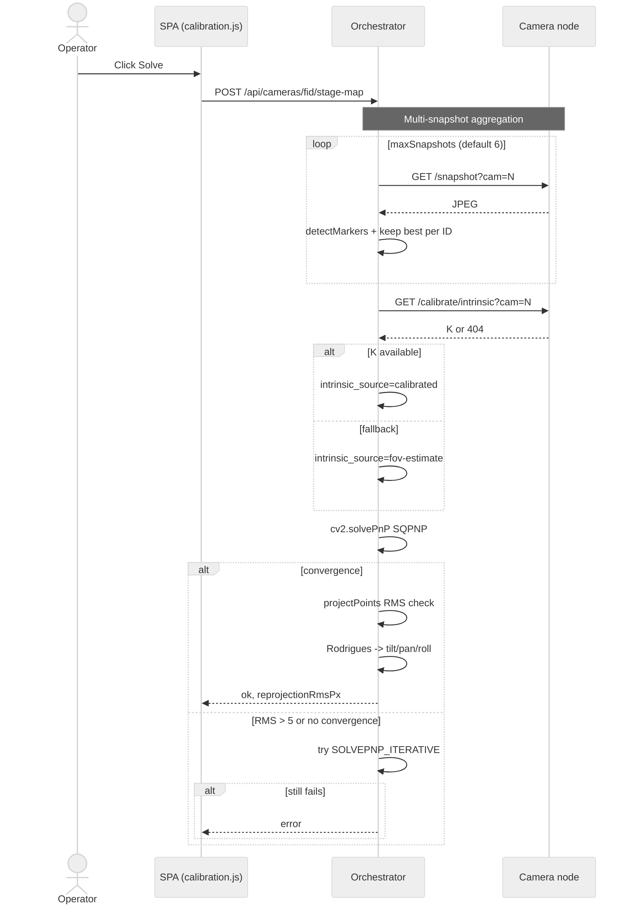
```mermaid
%%{init: {'theme':'neutral'}}%%
sequenceDiagram
    actor Op as Operator
    participant SPA as SPA (calibration.js)
    participant Orch as Orchestrator
    participant Cam as Camera node

    Op->>SPA: Click Solve
    SPA->>Orch: POST /api/cameras/fid/stage-map

    Note over Orch,Cam: Multi-snapshot aggregation
    loop maxSnapshots (default 6)
        Orch->>Cam: GET /snapshot?cam=N
        Cam-->>Orch: JPEG
        Orch->>Orch: detectMarkers + keep best per ID
    end

    Orch->>Cam: GET /calibrate/intrinsic?cam=N
    Cam-->>Orch: K or 404
    alt K available
        Orch->>Orch: intrinsic_source=calibrated
    else fallback
        Orch->>Orch: intrinsic_source=fov-estimate
    end

    Orch->>Orch: cv2.solvePnP SQPNP
    alt convergence
        Orch->>Orch: projectPoints RMS check
        Orch->>Orch: Rodrigues -> tilt/pan/roll
        Orch-->>SPA: ok, reprojectionRmsPx
    else RMS > 5 or no convergence
        Orch->>Orch: try SOLVEPNP_ITERATIVE
        alt still fails
            Orch-->>SPA: error
        end
    end
```

**Point de terminaison** — `POST /api/cameras/<fid>/stage-map` avec `{cam, markers, markerSize, maxSnapshots}`.

**Préconditions** — ≥3 marqueurs relevés enregistrés (ou ≥2 si tous coplanaires au sol), chacun visible dans au moins une capture. L'agrégation multi-capture gère les transitoires image à image ; six captures est un bon défaut.

**Algorithme** — pour chaque capture, l'orchestrateur détecte les marqueurs et conserve, par ID, la seule détection avec le plus grand périmètre (le plus grand = le plus proche = les meilleurs coins sous-pixel). Les correspondances entre chaque coin détecté et le point 3D relevé alimentent `cv2.solvePnP(..., flags=SOLVEPNP_SQPNP)`, avec `SOLVEPNP_ITERATIVE` comme solveur de repli.

**Timing attendu** — une exécution multi-capture : 5–10 s (dominé par la capture d'images).

**Sortie** — `tvec` (mm scène) → position caméra ; `rvec` → Rodrigues → tilt/pan/roll → stocké dans `camera.rotation` en schéma v2 (§A.9). Rapporte aussi `reprojectionRmsPx`.

**Replis**

| Échec | Comportement | Action opérateur |
|-------|--------------|------------------|
| Moins de 3 marqueurs appariés sur toutes les captures | Erreur ; pose non mise à jour | Ajoutez des marqueurs ou repositionnez la caméra |
| SQPNP ne converge pas | Réessai avec `SOLVEPNP_ITERATIVE` | Aucune automatique |
| RMS de reprojection > 5 px | Pose stockée mais signalée | Vérifiez les positions des marqueurs relevés et `markerSize` ; recapturez les intrinsèques |
| Aucune intrinsèque sur la caméra | Repli sur K dérivé du FOV, rapporte `intrinsic_source: "fov-estimate"` | Exécutez §A.3 pour une meilleure précision |

### A.5 Capture de référence obscure (#651)

Une image de référence obscure est une capture prise avec tous les faisceaux d'étalonnage éteints afin que la détection de faisceau dans les étapes d'étalonnage ultérieures puisse soustraire l'éclairage ambiant.

**Point de terminaison** — `POST /dark-reference` sur le nœud caméra, corps `{cam: -1}` (toutes les caméras) ou `{cam: N}`.

**Comportement** — capture une image par caméra, stocke dans le tampon mémoire de `BeamDetector` (non persisté entre redémarrages).

**Timing attendu** — ~100 ms par caméra (capture d'image V4L2).

**Quand cela s'exécute** — automatiquement au début de chaque exécution d'étalonnage de projecteur motorisé (voir annexe B §B.3). Peut aussi être déclenché manuellement avant d'exécuter des appels beam-detect.

**Repli** — si le module de détection de faisceau n'est pas disponible sur le nœud, le point de terminaison renvoie 503 et l'appelant continue sans soustraction de référence obscure. La détection de faisceau fonctionne toujours mais est plus sensible à la lumière ambiante.

### A.6 Nuage de points + fusion multi-caméra

La génération de nuage de points produit une représentation 3D de la scène à partir de la profondeur monoculaire et de la pose caméra. Elle est optionnelle — nécessaire uniquement pour les fonctionnalités qui raisonnent sur les surfaces de la scène (filtrage des cibles d'étalonnage de projecteur motorisé, suivi, effets spatiaux sur une géométrie arbitraire).

**Point de terminaison côté caméra** — `POST /point-cloud` avec `{cam, maxPoints, maxDepthMm}`. Renvoie `{points: [[x,y,z,r,g,b], ...], pointCount, inferenceMs, calibrated, fovDeg}`.

**Modèles de profondeur**

| Modèle | Fichier | Sortie | Inférence typique sur ARM |
|--------|---------|--------|----------------------------|
| Métrique (Depth-Anything-V2 Metric Indoor Small) | `/opt/slyled/models/depth_anything_v2_metric_indoor.onnx` | Profondeur en mm directement | ~6,5 s / image |
| Disparité (Depth-Anything-V2 Small, repli) | `/opt/slyled/models/depth_anything_v2_small.onnx` | Normalisé [0,1] ; l'appelant met à l'échelle par `maxDepthMm` | ~6,5 s / image |

La caméra sélectionne par défaut le modèle métrique ; le modèle de disparité est un repli quand le fichier métrique est absent. Fichier de préférence : `/opt/slyled/models/active_depth_model`.

**Fusion multi-caméra** — `POST /api/space/scan` sur l'orchestrateur exécute, dans l'ordre :

1. Récupérer les nuages de points par caméra (essayer `/point-cloud` sur le nœud ; profondeur côté orchestrateur si le chemin caméra est indisponible).
2. Ancre de profondeur par caméra (#581) — ajustement aux moindres carrés à deux paramètres `scale + offset` afin que la profondeur monoculaire s'accorde avec la géométrie de la scène. Rejet des valeurs aberrantes >2σ, réajustement. Si RMS > 2000 mm, repli sur un ajustement grossier basé sur la médiane.
3. Transformer en coordonnées scène à l'aide de la rotation + position stockées de la caméra.
4. Filtre de cohérence inter-caméras (#582) — si ≥2 caméras sont présentes, rejeter les points qui apparaissent dans la vue d'une seule caméra là où une autre caméra aurait dû les voir (filtre les hallucinations monoculaires).
5. Normalisation du sol — calculer le 5e centile Z par caméra, décaler le nuage pour que le sol moyen tombe à Z=0 ; repli sur détection de sol RANSAC si la méthode ancrée caméra échoue.
6. Alignement sur marqueur Z (#599) — si un marqueur enregistré a `z < 50 mm` et rotation nulle, le traiter comme vérité terrain et décaler le nuage pour que ces marqueurs se situent à Z=0.

**Timing attendu** — 30–60 s de bout en bout pour une configuration typique à deux caméras ; dominé par l'inférence de profondeur par caméra.

**Classification de qualité d'ancre** dans la réponse (`depthAnchor.quality`) : `"ok"` (RMS ≤ 500 mm), `"degraded"` (500–2000 mm), `"fallback"` (>2000 mm, ajustement médian utilisé). Une qualité dégradée ou de repli signifie que les fonctionnalités en aval (ajustement de surface, suivi) peuvent être imprécises.

### A.7 Analyse de surface (RANSAC)

Une fois un nuage de points fusionné disponible, `desktop/shared/surface_analyzer.py` extrait les surfaces structurelles afin que l'orchestrateur puisse raisonner dessus (sélection de cible tenant compte des obstacles, intersection faisceau-surface pour l'étalonnage de projecteur motorisé).

| Surface | Algorithme | Temps d'exécution attendu | Mode d'échec |
|---------|------------|---------------------------|--------------|
| Sol | RANSAC jusqu'à 200 essais, 3 points échantillonnés, ajustement de plan, normale verticale requise (dot-z > 0,95), ≥5 % d'inliers | 100–500 ms | Trop peu d'inliers → aucun sol rapporté |
| Murs | RANSAC sur les points non sol, ajustement de plan vertical à 2 points, ≥50 inliers ou ≥5 %, max 4 murs | 500 ms–2 s total | Silencieux ; moins de murs rapportés |
| Obstacles | Grille XY 300 mm + flood-fill, taille de cluster ≥20 points, classé `pillar` si haut+mince sinon `obstacle` | 100–500 ms | Silencieux ; clusters épars rejetés |

**Intersection par lancer de rayon** — `beam_surface_check()` répond « quelle surface un rayon de faisceau frappe-t-il en premier ? ». Utilisé par l'étalonnage de projecteur motorisé pour interpréter les pixels de faisceau détectés comme des points scène lorsque le faisceau atterrit sur un mur ou un pilier plutôt que sur le sol (voir #585/#260). Temps d'exécution typique 10–50 ms.

### A.8 Détection de faisceau (interface utilisée par l'étalonnage de projecteur motorisé)

La détection de faisceau est documentée ici parce qu'elle est *la manière dont le pipeline caméra alimente l'étalonnage des projecteurs motorisés* (annexe B). Les points de terminaison vivent sur le nœud caméra.

| Méthode | Chemin | Objet | Temps d'exécution typique |
|---------|--------|-------|---------------------------|
| POST | `/beam-detect` | Détection image unique ; filtre colorimétrique + luminosité + saturation + compacité | <100 ms |
| POST | `/beam-detect/flash` | Capture image ON → attendre `offDelayMs` → capture OFF → différence ; immunisé aux variations ambiantes | <100 ms + `offDelayMs` |
| POST | `/beam-detect/center` | Appareil multi-faisceaux : détecte N faisceaux, renvoie le centre du cluster | <150 ms |

Le filtrage colorimétrique utilise les plages de teinte HSV (`beam_detector.py`) : rouge `[0,60] ∪ [168,180]`, vert `[35,85]`, bleu `[100,130]`, magenta `[140,170]` ; le blanc se replie sur la seule luminosité.

**Contrôles de validation par contour :** moyenne-V ≥ 160 (luminosité) ; moyenne-S ≥ 80 pour les faisceaux colorés (saturation) ; aspect ≤ 5 (compacité).

### A.9 Schéma de rotation v2 (convention d'axe)

Les rotations des caméras et des appareils DMX partagent une convention unifiée (issues #586, #600). `fixture.rotation` est une liste `[rx, ry, rz]` en **degrés**, avec correspondance lettre-axe au repère scène Z-vers-le-haut :

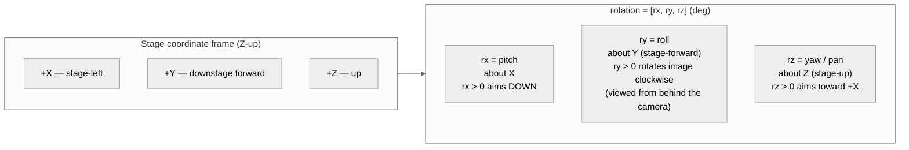
```mermaid
%%{init: {'theme':'neutral'}}%%
flowchart LR
    subgraph Stage["Stage coordinate frame (Z-up)"]
        X["+X — stage-left"]
        Y["+Y — downstage forward"]
        Z["+Z — up"]
    end

    subgraph Rotation["rotation = [rx, ry, rz] (deg)"]
        RX["rx = pitch<br/>about X<br/>rx > 0 aims DOWN"]
        RY["ry = roll<br/>about Y (stage-forward)<br/>ry > 0 rotates image clockwise<br/>(viewed from behind the camera)"]
        RZ["rz = yaw / pan<br/>about Z (stage-up)<br/>rz > 0 aims toward +X"]
    end

    Stage --> Rotation
```

**Chemin de lecture canonique** — passez toujours par :

- Python : `desktop/shared/camera_math.py::rotation_from_layout(rot) → (tilt, pan, roll)`, puis `build_camera_to_stage(tilt, pan, roll)` pour la matrice 3×3.
- SPA : `rotationFromLayout(rot)` dans `spa/js/app.js`.

**Ne lisez jamais `rotation[1]` ou `rotation[2]` directement** — ces indices s'échangent entre les fichiers v1 et v2.

**Migration de schéma** — les fichiers projets importés portant `layout.rotationSchemaVersion < 2` (ou absent) voient `ry` et `rz` échangés au chargement (v1 utilisait `ry=pan, rz=roll` ; v2 utilise `ry=roll, rz=pan`). Les exports actuels écrivent toujours `rotationSchemaVersion: 2`.

### A.10 Modes d'échec et attentes opérateur

| Phase | Symptôme | Cause probable | Action opérateur |
|-------|----------|----------------|------------------|
| Relevé de marqueurs | La recommandation de couverture persiste après ajout de marqueurs | Marqueur hors du FOV de chaque caméra | Déplacez le marqueur vers l'épingle recommandée, ou repositionnez la caméra |
| Capture intrinsèque | « Board not found » | Éclairage trop bas, angle trop oblique, impression gondolée | Aplatissez l'impression, repositionnez, ajoutez de la lumière |
| Calcul intrinsèque | RMS > 1,0 px | Trop peu d'images, faible variété d'angles | Capturez 10+ images supplémentaires sous divers angles |
| Résolution extrinsèque | `markersMatched < 3` | Marqueurs non visibles dans aucune capture | Augmentez `maxSnapshots`, repositionnez la caméra, ajoutez des marqueurs |
| Résolution extrinsèque | `reprojectionRmsPx > 5` | Mauvaises intrinsèques ou `markerSize` incorrect | Exécutez §A.3 ; vérifiez que la taille physique du marqueur correspond au registre |
| Résolution extrinsèque | `intrinsic_source: fov-estimate` | La caméra n'a pas d'étalonnage intrinsèque enregistré | Optionnel : exécutez §A.3 pour ±2–5 px de précision au lieu de ±10–20 px |
| Référence obscure | Réponse 503 | Module de détection de faisceau manquant sur la caméra | Redéployez le firmware depuis l'onglet Firmware |
| Estimation de profondeur | « model unavailable » | Fichier ONNX non déployé | Déployez via Firmware → Camera tab |
| Ajustement d'ancre | `quality: fallback` | La profondeur monoculaire est en fort désaccord avec la géométrie de la scène | Vérifiez les limites de la scène et la pose caméra ; peut être une erreur solvePnP en amont |
| Analyse de surface | Aucun sol rapporté | Nuage trop épars ou bruité, caméra visée trop haut | Ajoutez des caméras, visez plus bas, vérifiez le modèle de profondeur |

### A.11 Emplacements de fichiers et persistance

| Données | Emplacement | Format | Notes |
|---------|-------------|--------|-------|
| Registre ArUco | `desktop/shared/data/aruco_markers.json` | Liste JSON | Persisté à chaque POST/DELETE de marqueur |
| Appareils caméra | `desktop/shared/data/fixtures.json` | Liste JSON | Inclut la pose stockée + rotation |
| Positions de disposition | `desktop/shared/data/layout.json` | JSON | Doit porter `rotationSchemaVersion: 2` |
| Étalonnage intrinsèque (côté caméra) | `/opt/slyled/calib/intrinsic_camN.json` | JSON | `fx, fy, cx, cy, distCoeffs, imageSize, rmsError, frameCount` |
| Cache de nuage de points | `desktop/shared/data/pointcloud.json` | JSON | Depuis le dernier `/api/space/scan` |

---

<a id="appendix-b"></a>

## Annexe B — Pipeline d'étalonnage de projecteur motorisé

> Mis à jour pour l'orchestrateur v1.7.83. Le pipeline décrit ici
> est l'architecture post-#784 : un vecteur de visée canonique
> unique (`aim_stage`, #806) est la source de vérité pour chaque
> projecteur motorisé, le `ParametricFixtureModel` + l'ajustement
> Levenberg–Marquardt (#488) sont l'IK principale, et l'ancien
> pipeline SMART qui pilotait les versions d'étalonnage antérieures
> a été retiré. Le contenu phase par phase ci-dessous a été vérifié
> contre le `mover_calibrator.py` et `parametric_mover.py` actuels.

L'étalonnage de projecteur motorisé s'exécute par appareil projecteur motorisé [DMX](#glossary) après que la/les caméra(s) couvrant sa région atteignable ont été étalonnées (annexe A). Il produit un ensemble d'échantillons + un [modèle cinématique](#glossary) paramétrique à 6 [DOF](#glossary) qui permet à l'orchestrateur de traduire les cibles dans l'espace scène en valeurs DMX pan/tilt exactes, activant l'[IK](#glossary) (cinématique inverse) pour l'action Track et les effets spatiaux.

### B.1 Vue d'ensemble du pipeline

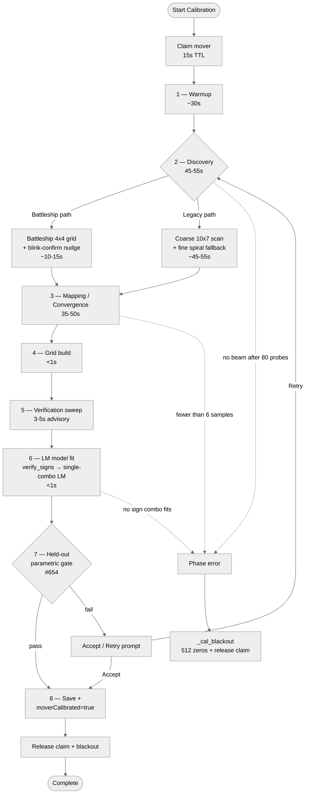
```mermaid
%%{init: {'theme':'neutral'}}%%
flowchart TD
    Start([Start Calibration]) --> Claim[Claim mover<br/>15s TTL]
    Claim --> Warmup[1 — Warmup<br/>~30s]
    Warmup --> Discovery{2 — Discovery<br/>45-55s}
    Discovery -->|Battleship path| BS[Battleship 4x4 grid<br/>+ blink-confirm nudge<br/>~10-15s]
    Discovery -->|Legacy path| Coarse[Coarse 10x7 scan<br/>+ fine spiral fallback<br/>~45-55s]
    BS --> MapConv[3 — Mapping / Convergence<br/>35-50s]
    Coarse --> MapConv
    MapConv --> Grid[4 — Grid build<br/>&lt;1s]
    Grid --> Verify[5 — Verification sweep<br/>3-5s advisory]
    Verify --> Fit[6 — LM model fit<br/>verify_signs → single-combo LM<br/>&lt;1s]
    Fit --> HoldOut{7 — Held-out<br/>parametric gate<br/>#654}
    HoldOut -->|pass| Save[8 — Save +<br/>moverCalibrated=true]
    HoldOut -->|fail| OperatorRetry[Accept / Retry prompt]
    OperatorRetry -->|Retry| Discovery
    OperatorRetry -->|Accept| Save
    Save --> Release[Release claim + blackout]
    Release --> Done([Complete])

    Discovery -.->|no beam after 80 probes| Error
    MapConv -.->|fewer than 6 samples| Error
    Fit -.->|no sign combo fits| Error
    Error[Phase error] --> Blackout[_cal_blackout<br/>512 zeros + release claim]
```

### B.2 Référence des phases

| # | Phase | Chaîne d'état | Durée typique | Progrès % | Repli en cas d'échec |
|---|-------|---------------|----------------|-----------|----------------------|
| 1 | Warmup | `warmup` | 30 s (configurable via `warmupSeconds`) | 2–8 | Journaliser un avertissement, continuer sans warmup |
| 2 | Découverte (legacy) | `discovery` | 45–55 s | 10–30 | Abandonner avec statut `error` après 80 sondes |
| 2′ | Découverte (battleship) | `battleship` → `confirming` | 10–15 s | 10–25 | Abandonner avec `error` ; peut basculer sur la découverte legacy |
| 3 | Cartographie (BFS legacy) | `mapping` | 35–50 s | 35–70 | Abandonner si <6 échantillons |
| 3′ | Convergence (v2) | `sampling` | 30–60 s (N cibles × ~1 s chacune) | 30–70 | Abandonner si la convergence échoue sur plusieurs cibles |
| 4 | Construction de grille | `grid` | <1 s | ~80 | Abandonner si dispersion d'échantillons insuffisante |
| 5 | Balayage de vérification | `verification` | 3–5 s (3 points tenus de côté) | ~90 | **Consultatif seulement** — ne bloque pas la sauvegarde |
| 6 | Ajustement du modèle (LM) | `fitting` | <1 s | 85–95 | verify_signs d'abord → LM à combinaison unique ; repli complet à quatre combinaisons si une sonde de signe rate |
| 7 | Porte paramétrique tenue de côté (#654) | `holdout` | 2–5 s (N cibles non vues) | 95–98 | Présenter une invite Accept/Retry |
| 8 | Sauvegarde | `complete` | <1 s | 100 | Erreur d'écriture journalisée mais n'affecte pas le drapeau moverCalibrated |

Statuts supplémentaires de haut niveau : `cancelled`, `error`, `done`.

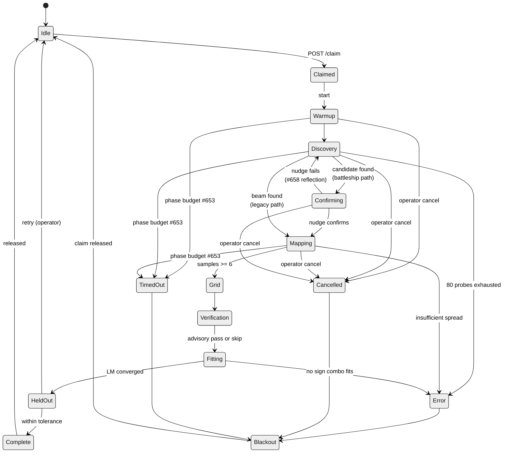
```mermaid
%%{init: {'theme':'neutral'}}%%
stateDiagram-v2
    [*] --> Idle
    Idle --> Claimed: POST /claim
    Claimed --> Warmup: start
    Warmup --> Discovery
    Discovery --> Confirming: candidate found<br/>(battleship path)
    Confirming --> Discovery: nudge fails<br/>(#658 reflection)
    Confirming --> Mapping: nudge confirms
    Discovery --> Mapping: beam found<br/>(legacy path)
    Mapping --> Grid: samples >= 6
    Grid --> Verification
    Verification --> Fitting: advisory pass or skip
    Fitting --> HeldOut: LM converged
    HeldOut --> Complete: within tolerance
    HeldOut --> Idle: retry (operator)
    Complete --> Idle: released

    Discovery --> Error: 80 probes exhausted
    Mapping --> Error: insufficient spread
    Fitting --> Error: no sign combo fits
    Error --> Blackout
    Warmup --> Cancelled: operator cancel
    Discovery --> Cancelled: operator cancel
    Mapping --> Cancelled: operator cancel
    Confirming --> Cancelled: operator cancel
    Cancelled --> Blackout

    Warmup --> TimedOut: phase budget #653
    Discovery --> TimedOut: phase budget #653
    Mapping --> TimedOut: phase budget #653
    TimedOut --> Blackout

    Blackout --> Idle: claim released
```

### B.3 Détail phase par phase

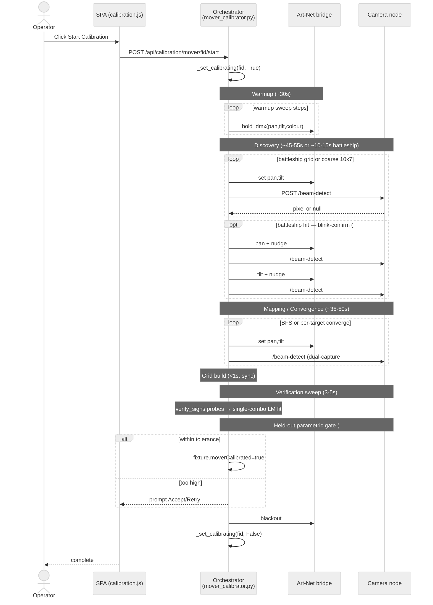
```mermaid
%%{init: {'theme':'neutral'}}%%
sequenceDiagram
    actor Op as Operator
    participant SPA as SPA (calibration.js)
    participant Orch as Orchestrator<br/>(mover_calibrator.py)
    participant DMX as Art-Net bridge
    participant Cam as Camera node

    Op->>SPA: Click Start Calibration
    SPA->>Orch: POST /api/calibration/mover/fid/start
    Orch->>Orch: _set_calibrating(fid, True)

    Note over Orch,DMX: Warmup (~30s)
    loop warmup sweep steps
        Orch->>DMX: _hold_dmx(pan,tilt,colour)
    end

    Note over Orch,Cam: Discovery (~45-55s or ~10-15s battleship)
    loop battleship grid or coarse 10x7
        Orch->>DMX: set pan,tilt
        Orch->>Cam: POST /beam-detect
        Cam-->>Orch: pixel or null
    end
    opt battleship hit — blink-confirm (#658)
        Orch->>DMX: pan + nudge
        Orch->>Cam: /beam-detect
        Orch->>DMX: tilt + nudge
        Orch->>Cam: /beam-detect
    end

    Note over Orch,Cam: Mapping / Convergence (~35-50s)
    loop BFS or per-target converge
        Orch->>DMX: set pan,tilt
        Orch->>Cam: /beam-detect (dual-capture #655)
    end

    Note over Orch: Grid build (<1s, sync)
    Note over Orch,Cam: Verification sweep (3-5s)
    Note over Orch: verify_signs probes → single-combo LM fit
    Note over Orch,Cam: Held-out parametric gate (#654)

    alt within tolerance
        Orch->>Orch: fixture.moverCalibrated=true
    else too high
        Orch-->>SPA: prompt Accept/Retry
    end

    Orch->>DMX: blackout
    Orch->>Orch: _set_calibrating(fid, False)
    SPA-->>Op: complete
```

#### 1. Warmup

- **Objet** — faire cycler l'appareil sur toute la plage pan/tilt pour que les courroies des moteurs soient thermiquement et mécaniquement stabilisées avant que les mesures ne commencent. Réduit les artefacts de jeu dans les premiers échantillons.
- **Préconditions** — profil DMX valide sur l'appareil ; moteur Art-Net en marche ; verrou d'étalonnage engagé.
- **Durée attendue** — 30 s par défaut (paramètre `warmupSeconds`). Six sous-balayages (pan±, tilt±, deux diagonales) × 20 pas chacun, ~0,25 s par pas.
- **Attente opérateur** — le faisceau balaie visiblement la scène ; la barre de progression passe de 2 % à 8 %.
- **Repli** — si le warmup lève une exception, journaliser un avertissement et passer ; l'étalonnage continue.
- **Annulation** — `_check_cancel()` à l'intérieur de chaque boucle `_hold_dmx` lève `CalibrationAborted`.

#### 2. Découverte

Deux chemins de code existent. Le chemin battleship est préféré quand l'homographie caméra est fiable ; le chemin legacy est le repli quand l'homographie est indisponible (p. ex. pas de marqueurs relevés visibles).

**Battleship (préféré, statut `battleship` + `confirming`) :**

- Grille grossière 4×4 aux centres de bin pan/tilt `{0,125, 0,375, 0,625, 0,875}²` — 16 sondes. Par #661, la densité de grille s'adapte à la plage de pan et à la largeur de faisceau attendue ; par défaut 4×4 mais peut se réduire à 3×3 ou s'étendre à 5×5 pour les appareils à large pan.
- Sur le premier candidat pixel détecté, exécuter la routine **blink-confirm** (#658) : nudger pan de `confirm_nudge_delta` (≈ 0,02 de la plage pleine) et vérifier que le pixel détecté bouge ; nudger tilt de même. Si les **deux** deltas pixel dépassent `min_delta`, le candidat est confirmé. Sinon, c'était un reflet et il est rejeté — la découverte reprend.
- **Durée attendue** 10–15 s (16 sondes × 0,6 s de settle, plus 4 nudges × 0,6 s quand un candidat hit).
- **Repli en cas d'échec** — retomber sur le chemin legacy coarse+spiral, ou abandonner à `error`.

**Legacy (statut `discovery`) :**

- Sonde initiale à la visée de démarrage à chaud (prédiction du modèle ou estimation géométrique d'après le FOV caméra).
- Grille grossière 10×7 : bins pan `0,02 + 0,96·i/9`, bins tilt `0,1 + 0,85·j/6` — 70 sondes. Chaque sonde passe par `_wait_settled`, qui réutilise la même machinerie de settle adaptatif (`SETTLE_BASE = 0,4 s` avec escalade `[0,4, 0,8, 1,5] s`) que la phase de cartographie — pas une constante `SETTLE` fixe séparée.
- Si le balayage grossier rate, spiraler vers l'extérieur depuis la visée de démarrage à chaud en coquilles rectangulaires à `STEP = 0,05`, jusqu'à `MAX_PROBES = 80` sondes totales.
- **Durée attendue** — 45–55 s dans le pire cas.
- **Repli en cas d'échec** — abandonner avec `error` ; appeler `_cal_blackout()`.

**Attentes opérateur** — le faisceau balaie à travers une grille visible de positions. Si le faisceau atterrit clairement là où la caméra peut le voir mais que la détection échoue, vérifiez la référence obscure §A.5 et la configuration du filtre colorimétrique §A.8.

#### 3. Cartographie (BFS legacy) / Convergence (v2)

**BFS legacy (statut `mapping`) :**

- BFS depuis la graine découverte `(pan, tilt, pixel)`. Chaque pas détecte le faisceau et, en cas de succès, met en file d'attente quatre voisins (haut/bas/gauche/droite par `STEP`). La perte du faisceau marque la cellule courante comme une frontière de région visible ; les détections obsolètes (où le pixel bouge à peine malgré un grand delta pan/tilt) sont rejetées comme bruit.
- Le settle adaptatif (#655) met à l'échelle le temps de settle par sonde selon la distance de mouvement, avec des niveaux d'escalade `[0,4, 0,8, 1,5] s`. La double capture avec un écart de vérification de 0,2 s et un seuil de dérive de 30 pixels filtre les images en cours de mouvement ; le filtrage médian sur la paire de captures rejette les valeurs aberrantes.
- **Cibles** — `_map_target = 50` échantillons (minimum dur 6 ; borné par `MAX_SAMPLES = 80`).
- **Durée attendue** — 35–50 s.

**Convergence v2 (statut `sampling`) :**

- Pour chaque cible issue de `pick_calibration_targets` (filtrée à travers le polygone de vue sol caméra par #659), faire converger le faisceau sur le pixel cible via `converge_on_target_pixel`.
- **Raffinement par bracket-and-retry (#660)** — `bracket_step = 0,08` initial. Quand le faisceau est perdu, diviser par deux le pas et revenir vers le meilleur offset connu dans la direction de l'erreur. `BRACKET_FLOOR` dépend maintenant du fixture : `1 / (2^pan_bits − 1)` — environ `0,0039` en pan 8 bits et `0,0000153` en 16 bits, donc la boucle s'épuise à la résolution DMX réelle du fixture plutôt qu'à l'ancien plancher `1/255` réservé au 8 bits (#679). Réinitialiser `bracket_step` à 0,08 à la ré-acquisition du faisceau. Convergence typique : 5–10 itérations ; max 25.
- **Durée attendue** — 30–60 s (N cibles × ~1 s chacune).

**Repli** — si moins de 6 échantillons sont collectés, abandonner avec `error`.

#### 4. Construction de grille

- Pur calcul : extraire les valeurs pan/tilt uniques des échantillons, trier, remplissage au plus proche voisin pour les cellules manquantes.
- **Durée attendue** — <100 ms, pas d'I/O.
- **Repli** — si la dispersion d'échantillons est insuffisante pour former une grille, abandonner avec `error`.

#### 5. Balayage de vérification

- Choisir 3 cibles aléatoires dans les limites de la grille, en évitant les échantillons d'ajustement d'une marge ≥0,05 pan/tilt, avec un rétrécissement intérieur de 10 % pour esquiver les bords d'interpolation faibles.
- Pour chacune : prédire le pixel via recherche dans la grille, détecter le faisceau réel, calculer l'erreur pixel.
- **Durée attendue** — 3–5 s (3 × ~1 s settle+détection).
- **Consultatif seulement** — journalise un avertissement si un point échoue ; ne **bloque pas** la sauvegarde.

#### 6. Ajustement du modèle (paramétrique, Levenberg-Marquardt)

- **La vérification de signes (#652 / §8.1) s'exécute AVANT l'ajustement LM.** Juste après que la découverte renvoie `(pan, tilt, pixel)`, le thread émet deux sondes supplémentaires (`pan + 0,02`, `tilt + 0,02`) et appelle `verify_signs` sur les deltas pixel pour calculer `(pan_sign, tilt_sign)`. Ces signes alimentent `fit_model(..., force_signs=(ps, ts))` de sorte que la LM n'effectue **qu'un seul** ajustement au lieu de quatre.
- Repli — si une sonde de signe ne détecte pas de faisceau, `force_signs` reste `None` et `fit_model` exécute la recherche complète à quatre combinaisons et choisit le candidat de plus faible RMS.
- Lorsque les deux meilleurs candidats s'accordent à 0,2° RMS près ET que l'appelant n'a pas fourni `force_signs`, `FitQuality.mirror_ambiguity` est mis à True et exposé par l'endpoint de statut (#679) afin que l'UI puisse marquer la calibration pour un nouvel essai manuel.
- `scipy.optimize.least_squares` avec perte `soft_l1` (`f_scale=0.05`) ajuste cinq paramètres continus (mount yaw/pitch/roll + offsets pan/tilt) ; jusqu'à 120 itérations.
- **Durée attendue** — <1 s au total (verify_signs + ajustement LM unique).
- **Repli** — si les 4 combinaisons ne convergent pas, lever `RuntimeError` ; l'appelant abandonne avec `error`.

#### 7. Porte paramétrique tenue de côté (#654)

- Après ajustement, piloter l'appareil vers 2–3 cibles **non vues** (non utilisées en découverte, cartographie ou vérification) et mesurer le résidu au niveau pixel contre la prédiction du modèle.
- Si le résidu est dans la tolérance, définir `fixture["moverCalibrated"] = True`.
- Si le résidu dépasse la tolérance, renvoyer le résultat au SPA comme invite Accept/Retry : l'opérateur peut accepter (drapeau toujours défini, marqué comme dégradé) ou relancer l'étalonnage depuis la découverte.
- **Durée attendue** — 2–5 s.

#### 8. Sauvegarde + libération

- Persister `samples`, dictionnaire `model`, métriques `fitQuality` et métadonnées par phase dans `desktop/shared/data/fixtures.json`.
- Définir `fixture["moverCalibrated"] = True` (si pas déjà fait).
- Libérer le verrou d'étalonnage via `_set_calibrating(fid, False)` — le moteur mover-follow reprend l'écriture pan/tilt.
- Blackout de l'appareil.

### B.4 Budget de temps + blackout-sur-timeout (#653)

Chaque phase a un budget horloge par phase. S'il est dépassé, la phase lève `PhaseTimeout`, interceptée par le thread d'étalonnage de haut niveau, qui alors :

1. Appelle `_cal_blackout()` — envoie 512 zéros à l'univers de l'appareil pendant 0,3 s.
2. Libère le verrou d'étalonnage.
3. Définit `job["status"] = "error"`, `job["phase"] = "<phase>_timeout"`.
4. Signale `tier-2 handoff` dans le dict de statut afin que le SPA puisse suggérer le niveau de diagnostic suivant.

Budgets par défaut (peuvent être écrasés par appareil via `calibrationBudgets` dans les paramètres) :

| Phase | Budget par défaut |
|-------|-------------------|
| Warmup | 60 s |
| Découverte | 120 s |
| Cartographie / Convergence | 180 s |
| Construction de grille | 10 s |
| Balayage de vérification | 30 s |
| Ajustement du modèle | 15 s |
| Porte tenue de côté | 30 s |

Budget total par défaut : ~7,5 min, bien au-dessus du temps d'exécution typique de 2–4 min.

### B.5 Chemin d'annulation

L'annulation peut provenir de trois sources : opérateur (`POST /api/calibration/mover/<fid>/cancel`), timeout de phase (§B.4) ou exception non gérée. Les trois convergent vers le même nettoyage :

1. **Blackout immédiat au premier plan** (initié par l'opérateur uniquement) : sur la requête `/cancel`, l'orchestrateur met à zéro la fenêtre de canaux de l'appareil sur le tampon du moteur Art-Net en cours d'exécution au premier plan, afin que la prochaine image de 25 ms porte des zéros au pont — l'opérateur voit la lumière s'éteindre immédiatement.
2. **Remontée en arrière-plan** : le thread d'étalonnage définit `_cancel_event`, que `_check_cancel()` à l'intérieur de `_hold_dmx` capte et lève `CalibrationAborted`. L'exception se propage à `_mover_cal_thread`, qui la capture, appelle `_cal_blackout()` (512 zéros + libération), définit `status = "cancelled"`, `phase = "cancelled"`.
3. **Libération du verrou** — `_set_calibrating(fid, False)` est toujours appelé dans le nettoyage, indépendamment du chemin qui a déclenché l'annulation.

### B.6 Modes d'échec et diagnostics opérateur

| Symptôme | Cause probable | Quoi vérifier / essayer |
|----------|----------------|-------------------------|
| La découverte termine 80 sondes sans trouver de faisceau | Faisceau trop faible, la caméra ne le voit pas, mauvaise couleur, projecteur motorisé pas réellement allumé | Vérifiez que l'appareil est alimenté et répond ; augmentez le seuil ; exécutez le Test d'orientation d'appareil (§14) ; vérifiez la configuration colorimétrique §A.8 ; tamisez les lumières de la salle |
| La découverte trouve le faisceau immédiatement mais blink-confirm rejette toujours | Surface réfléchissante (miroir, verre, sol poli) détectée au lieu du faisceau | Ajoutez un matériau diffus sur le réflecteur ; choisissez une autre couleur de faisceau ; éloignez la visée de démarrage à chaud du projecteur du réflecteur |
| Cartographie / convergence abandonne avec « fewer than 6 samples » | La frontière BFS est trop étroite — la caméra ne voit qu'une petite tranche de la plage pan/tilt | Repositionnez la caméra pour voir plus du sol ; augmentez le nombre de caméras ; vérifiez que la position du projecteur motorisé dans la disposition correspond à la réalité |
| Le drapeau `moverCalibrated` ne se définit jamais | La porte tenue de côté échoue | Vérifiez l'invite Accept/Retry ; si un résidu est rapporté, un Accept conserve le drapeau mais le marque dégradé ; un Retry complet redémarre depuis la découverte |
| La vérification de signes journalise une ambiguïté miroir | L'ajustement voit deux combinaisons de signes également bonnes | Vérifiez la direction physique pan/tilt du projecteur motorisé contre le Test d'orientation d'appareil §14 ; il peut être nécessaire de basculer les drapeaux Invert Pan/Tilt ou Swap Pan/Tilt |
| L'étalonnage « se bloque » à une phase | Budget de phase (#653) pas encore déclenché ; ou moteur Art-Net arrêté en cours d'exécution | Attendez jusqu'au budget de phase ; vérifiez que le moteur est en marche (`POST /api/dmx/start` sinon) ; si toujours bloqué, annulez et consultez le log de l'orchestrateur |
| La lumière clignote brièvement puis s'arrête, le statut reste `running` | L'annulation au premier plan s'est produite mais le thread d'arrière-plan se déroule encore | Normal ; le nettoyage d'arrière-plan se termine en 1–2 s |

### B.7 Référence des paramètres de réglage

**Réglable par l'opérateur (#680) — Réglages → Avancé → Délais de calibration.**
Les constantes ci-dessous sont les valeurs par défaut livrées ; l'opérateur
peut les surcharger via le panneau Avancé, qui persiste dans
`desktop/shared/data/settings.json` sous `calibrationTuning`. Les
surcharges sont lues au début de chaque phase, donc un changement prend
effet à la prochaine calibration sans redémarrage du serveur. La
validation est centralisée dans `CAL_TUNING_SPEC`
(`parent_server.py`) ; POST /api/settings rejette les valeurs hors
plage avec un 400. Chaque constante ci-dessous a une entrée
correspondante dans `CAL_TUNING_SPEC` sauf celles marquées « fixe »
(p. ex. `STEP`, `MAX_SAMPLES` est exposé sous `bfsMaxSamples`,
`BRACKET_FLOOR` est dérivé par fixture et non réglable selon #679).

Constantes dans `desktop/shared/mover_calibrator.py` :

| Constante | Défaut | Rôle |
|-----------|--------|------|
| `SETTLE` (legacy) | 0,6 s | Settle par sonde avant détection |
| `SETTLE_BASE` (#655) | 0,4 s | Base de settle adaptatif avant escalade |
| `SETTLE_ESCALATION` | `[0.4, 0.8, 1.5]` s | Niveaux d'escalade sur retry de dérive pixel |
| `SETTLE_VERIFY_GAP` | 0,2 s | Espacement de double capture pour filtre médian |
| `SETTLE_PIXEL_THRESH` | 30 px | Seuil de dérive inter-capture pour « settled » |
| `STEP` | 0,05 | Pas fin de spirale (pan/tilt normalisé) |
| `MAX_SAMPLES` | 80 | Plafond dur sur les échantillons BFS |
| `COARSE_PAN` | 10 | Bins pan de grille grossière legacy |
| `COARSE_TILT` | 7 | Bins tilt de grille grossière legacy |
| `BRACKET_FLOOR` | `1 / (2^pan_bits − 1)` | Plancher de raffinement de convergence — dépend du fixture (8 bits → `≈0,0039`, 16 bits → `≈0,0000153`) (#679) |

Constantes dans `desktop/shared/mover_control.py` :

| Constante | Défaut | Rôle |
|-----------|--------|------|
| Claim TTL (`moverClaimTtlS`, #680) | 15 s | Libération automatique si la réservation n'est pas rafraîchie |

Budgets de temps par phase (depuis `CAL_TUNING_SPEC` dans `desktop/shared/parent_server.py`, #680) :

| Clé | Défaut | Plage | Rôle |
|-----|--------|-------|------|
| `discoveryBattleshipS` | 60 s | 20 – 300 | Budget du scan grille grossière |
| `discoveryColourFallbackS` | 90 s | 30 – 300 | Budget du repli colorimétrique legacy |
| `mappingS` | 120 s | 30 – 600 | Budget de cartographie BFS (plafond souple) |
| `fitS` | 10 s | 5 – 60 | LM + construction de grille |
| `verificationS` | 30 s | 5 – 120 | Vérification grille + paramétrique tenue de côté |
| `warmupSeconds` | 30 s | 0 – 120 | Balayage de chauffe des moteurs avant calibration |
| `bfsMaxSamples` | 80 | 20 – 300 | Plafond dur sur les échantillons BFS |
| `convergeMaxIterations` | 25 | 5 – 100 | Boucle bracket-and-retry par cible |
| `battleshipPan/TiltStepsMin/Max` | 3 / 8 / 3 / 6 | voir spec | Bornes de grille adaptative (#661) |

### B.8 Fonctionnalités associées

- **Contrôle unifié des projecteurs motorisés** — voir CLAUDE.md §« Unified mover control (gyro + Android) ». L'étalonnage doit être complet et `moverCalibrated` doit être défini avant que le mover-control manuel (gyro/téléphone) n'utilise le modèle paramétrique ; sans cela, la couche de contrôle se replie sur le passthrough DMX pan/tilt brut.
- **Test d'orientation d'appareil** — §14 « Fixture Orientation Test ». Exécutez-le d'abord si les axes pan/tilt du projecteur physique ne correspondent pas aux attentes.
- **Action Track** — §8 « Track Action ». Consomme la grille d'interpolation + le modèle paramétrique pour viser des sujets mobiles.

---

<a id="appendix-c"></a>

## Annexe C — Maintenance de la documentation

> Cette annexe décrit le contrat entre les annexes d'étalonnage ci-dessus et le code source qui les implémente. Elle existe pour l'issue #662 et reste volontairement concise — les détails complets se trouvent dans `docs/DOCS_MAINTENANCE.md`.

### C.1 Fichiers faisant autorité

Toute pull request qui modifie le comportement d'étalonnage dans l'un de ces fichiers doit inclure une révision de l'annexe A ou B dans la même PR :

**Étalonnage des projecteurs motorisés :** `desktop/shared/mover_calibrator.py`, `mover_control.py`, `parametric_mover.py`, `desktop/shared/spa/js/calibration.js`, `desktop/shared/parent_server.py` (routes `/api/calibration/mover/*`).

**Étalonnage des caméras :** `firmware/orangepi/camera_server.py`, `beam_detector.py`, `depth_estimator.py`, `desktop/shared/space_mapper.py`, `surface_analyzer.py`, `camera_math.py`, `desktop/shared/parent_server.py` (routes `/api/aruco/markers*`, `/api/cameras/<fid>/stage-map`, `/api/cameras/<fid>/aruco/*`, `/api/cameras/<fid>/intrinsic*`, `/api/cameras/<fid>/beam-detect`, `/api/space/scan`).

### C.2 Liste de contrôle du réviseur (forme abrégée)

Sur une PR qui touche à l'étalonnage, vérifiez que :

- Les noms de phases dans `mover_calibrator.py` correspondent au tableau de l'annexe B §B.2
- Les constantes de temporisation du tableau §B.7 correspondent toujours au code
- Les chemins d'endpoints ainsi que les formes de requête et de réponse de l'annexe A correspondent aux signatures des routes Flask
- Le schéma de rotation v2 (§A.9) correspond toujours à `camera_math.py::rotation_from_layout`
- Les chaînes d'état écrites dans le dictionnaire de statut d'étalonnage correspondent au diagramme de la machine à états

La liste de contrôle complète, y compris la vérification du rendu des diagrammes Mermaid sous `docs/diagrams/` et les critères de retrait de la bannière BROUILLON, se trouve dans `docs/DOCS_MAINTENANCE.md`.

### C.3 Régénérer le manuel

- Source canonique : `docs/USER_MANUAL.md` (ce fichier).
- `docs/SlyLED_User_Manual.docx` et `.pdf` sont **construits séparément** par `tests/build_manual.py`, qui reconstruit le document à partir de zéro plutôt que d'analyser ce markdown. La chaîne docx/PDF n'inclut pas encore ces annexes — travail de suivi.
- Les sources des diagrammes se trouvent dans `docs/diagrams/*.mmd`. Les blocs Mermaid sont intégrés directement dans le markdown afin que les visionneuses Markdown les affichent nativement ; des outils externes comme Kroki peuvent générer des SVG ou PNG à partir des fichiers autonomes pour l'inclusion dans le PDF.

### C.4 Contrôle d'application

Aucun contrôle de dérive automatique n'est en place pour l'instant. Options proposées, par ordre croissant de coût :

1. Case à cocher du modèle de pull-request
2. Grep via CI : échoue les PR qui touchent à la liste source sans toucher à `docs/USER_MANUAL.md`, avec une étiquette de dérogation
3. Agent de dérive planifié (hebdomadaire)

Ces mesures nécessitent des modifications de la configuration CI et sont suivies comme éléments connexes sous #662.

### C.5 Retrait de la bannière BROUILLON

Les bannières BROUILLON sur les annexes A et B devront être retirées une fois que les éléments en cours listés dans `docs/DOCS_MAINTENANCE.md §"When to bump the DRAFT banner"` seront tous confirmés comme fusionnés. Au moment de la rédaction de cette annexe (2026-04-23), les éléments suivants sont connus pour être partiels ou pas encore en code : #653 budgets de temps, #654 porte paramétrique mise de côté, #655 suréchantillonnage médian complet, #658 confirmation par clignotement hors chemin battleship, #659 filtre de cible par polygone de vue du sol, #661 densité battleship adaptative.

<!-- review-status: pending -->

## Annexe D — Comportement au repos

Un rig « solide comme un roc » est un rig où, à tout moment où aucun
spectacle ne joue et aucun opérateur ne pilote activement une tête,
chaque projecteur motorisé se gare sur une pose connue avec la
lampe fermée. Les opérateurs attendent ce contrat parce que
l'alternative — une tête plantée sur la pose que le dernier
écrivain a laissée — paraît cassée même quand rien ne va mal. Cette
annexe est la liste canonique des moments où l'orchestrateur gare,
ne gare pas, et de ce que « garé » signifie en pratique.

### Ce que signifie « garé »

Un projecteur motorisé garé :

- Vise sa pose **Home** (la pose enregistrée dans l'assistant Set
  Home ; repli au centre mécanique en l'absence de Home).
- Tient son **gradateur à 0** pour que la lampe ne bave pas sur le
  rig.
- Ferme le **shutter** si le préréglage porte un canal strobe avec
  une capacité `Closed` — les appareils à shutter mécanique
  bénéficient de la fermeture explicite.
- Libère tout emplacement de roue de couleurs qu'il tenait, en le
  remettant à l'emplacement 0 (open / blanc), pour que la frame de
  spectacle suivante n'hérite pas d'un filtre périmé.

### Quand l'orchestrateur gare une tête

| Déclencheur | Chemin | Notes |
| --- | --- | --- |
| **Démarrage à froid** | Boot orchestrateur | Chaque appareil DMX se gare une fois que le moteur démarre. Évite la surprise « la tête a été laissée pointée vers le mur du fond hier soir ». |
| **Fin naturelle de chronologie** | Sortie de `_dmx_playback_loop` | Les têtes pilotées par le précalcul de la chronologie se garent à la fin du spectacle. Les têtes pilotées par action de suivi se garent aussi (#807) — avant le correctif, seules les têtes pilotées par précalcul se garaient, laissant les projecteurs revendiqués par un suiveur bloqués sur leur dernière pose. |
| **L'opérateur appuie sur Stop** | `_dmx_playback_stop` armé | Identique à la fin naturelle. Le balayage de blackout ne s'applique qu'à l'arrêt ou à la fin de l'itération finale (#840), pas entre les itérations de boucle. |
| **Relâchement de revendication** | Arbitre de revendication mover-control | Quand un téléphone Android ou un palet gyro relâche une revendication, la tête revient au spectacle si un spectacle est en cours, sinon elle se gare. Le relâchement est instantané — pas de lissage en v1.7.83+. |
| **Re-stabilisation après cycle d'alimentation** | Premier PONG d'un nœud après boot | Quand la carte enfant d'un appareil refait un cycle d'alimentation, l'orchestrateur renvoie la luminosité globale courante (#843) et la frame de spectacle suivante écrit une pose connue. Avant v1.7.83, le nœud pouvait apparaître à pleine luminosité pendant une frame ; le renvoi à la réception du PONG ferme cette fenêtre. |

### Ce qui ne déclenche PAS de garage

Ces actions ne garent volontairement pas les têtes — les
opérateurs s'y attendent parfois, mais garer à chaque coup ferait
voler la tête au spectacle.

- **Coups uniques `/api/mover/<fid>/aim`** — ces appels sont des
  pulsations de test opérateur direct ; le rig garde la pose
  écrite par la route jusqu'à la prochaine frame de spectacle.
- **Curseurs de test DMX dans l'onglet Paramètres** — même
  logique. Les curseurs surchargent la sortie du spectacle tant
  que l'opérateur les pilote.
- **Coupures brèves dans une revendication active** — un
  téléphone ou un palet qui perd brièvement le WiFi pendant une
  seconde ne libère pas la revendication. Le TTL de revendication
  est de 15 s ; une tête ne se gare que quand le TTL s'écoule
  sans battement de cœur (#813 §6.3 « silence total des
  communications »).
- **Sondages d'étalonnage** — les balayages de découverte de
  faisceau et de convergence tiennent la tête là où le sondage
  arrive. La session d'étalonnage gare la tête explicitement
  quand elle se termine (succès ou abandon).

### Comment vérifier sur votre rig

1. Garez un projecteur motorisé sur un mur connu (Set Home →
   sauvegarder).
2. Arrêtez tout spectacle en cours.
3. Visez la tête vers le sol avec `/api/mover/<fid>/aim`.
4. Lancez la lecture d'une chronologie blanche de 5 s. La tête NE
   doit PAS bouger (règle 3 : les coups uniques tiennent).
5. Arrêtez la chronologie. La tête doit revenir à Home avec la
   lampe fermée en moins de ~50 ms.

Si l'étape 5 ne se produit pas, vérifiez (a) que l'appareil a une
pose Home enregistrée, (b) que la chronologie s'est terminée
naturellement plutôt que par un crash, (c) qu'aucune revendication
n'est tenue sur l'appareil (l'onglet Configuration affiche l'état
de revendication par appareil).

---

<!-- review-status: pending -->

## Annexe E — Télécommande : téléphone Android et palet gyro

Deux télécommandes peuvent piloter des projecteurs motorisés en
direct en parallèle d'un spectacle en cours : un téléphone Android
exécutant l'application opérateur SlyLED et un palet gyro Waveshare
ESP32-S3 à écran rond. Tous deux passent par le même arbitre de
revendication sur l'orchestrateur, suivent le même protocole de
poignée de main et coopèrent avec la chronologie de spectacle via
l'arbitre de revendication mover-control. Cette annexe décrit le
cycle de vie complet, les gestes, et l'interaction entre arbitrage
de revendication et spectacles préréglés.

### Cycle de vie d'une revendication

La revendication est le verrou « cette télécommande possède
actuellement le projecteur N » de l'orchestrateur. Elle porte un
nonce 16 bits, un TTL et une pose courante, ce qui permet au
système de réconcilier l'état UI du palet avec l'état arbitre de
l'orchestrateur quand l'un ou l'autre redémarre ou perd un paquet.

```
1. IDLE sur la télécommande.
2. L'opérateur appuie sur Démarrer (palet) ou Revendiquer (Android).
3. La télécommande émet CMD_GYRO_START / une requête de
   revendication avec un nouveau nonce 16 bits.
4. L'orchestrateur alloue un projecteur motorisé, répond par un
   CLAIM_ACK avec le nonce + le moverId assigné. La télécommande
   avance l'UI vers ACTIVE seulement sur un ACK correspondant ;
   CLAIM_DENIED revient en arrière ; un timeout d'environ 1,5 s
   revient avec « PAS DE RÉPONSE ».
5. La télécommande envoie des quaternions d'orientation à ~50 Hz ;
   l'orchestrateur les convertit en aim-stage et écrit pan / tilt
   sur la tête.
6. Les deux extrémités échangent des battements de cœur 2 s
   (HB_REP porte uiState + claimNonce + seq) pour réconcilier les
   états divergents.
7. L'opérateur appuie sur Stop / Relâcher ; la télécommande envoie
   le nonce ; l'orchestrateur répond par STOP_ACK et relâche la
   revendication.
```

La spec complète de la machine d'état vit dans
`docs/gyro-claim-lifecycle.md` et fait foi pour toute modification
du protocole.

#### Ce que voit l'opérateur

- **Appui sur Démarrer sur le palet** — la page avance vers
  « ACTIVE » en ~150 ms. Si l'orchestrateur ne peut revendiquer
  aucun projecteur (aucun en ligne, aucun disponible), la page
  revient à IDLE avec une raison de refus.
- **Appui sur Stop sur le palet** — la page revient à IDLE ; la
  tête revient à ce que pilotait le spectacle (ou se gare si
  aucun spectacle ne joue).
- **Étalonnage** — maintenez le bouton **Étalonner** (palet ou
  Android) aussi longtemps que nécessaire ; relâchez pour
  capturer la nouvelle pose de référence. L'écran avance vers la
  page sélecteur de couleurs sur le palet ; l'application
  Android avance vers la page gestes.
- **Connexion perdue** — les deux télécommandes affichent un
  badge stale-reason si l'orchestrateur cesse d'entendre les
  battements de cœur. Le palet s'auto-efface quand il reprend
  l'envoi (#812 / #821 / #823) ; l'opérateur peut aussi forcer
  l'effacement via `POST /api/remotes/<id>/clear-stale`.

### Gestes

Une fois actives, les deux télécommandes pilotent la même
sémantique `aim_stage` — le faisceau de la tête vise un point en
coordonnées plateau calculé à partir de l'orientation de la
télécommande.

#### Téléphone (Android)

- **Pitch** (incliner le téléphone vers l'avant / arrière) — le
  faisceau monte / descend sur la tête.
- **Roll** (incliner le téléphone gauche / droite) — le faisceau
  pan à travers le plateau.
- **Yaw** (tourner le téléphone autour de la verticale) — le
  faisceau pan à travers le plateau.
- **Boutons de volume** — gradateur fin haut / bas (configurable
  dans l'app opérateur Android).
- **Auto-luminosité** (chapitre Luminosité) — l'app peut piloter
  la luminosité maître de l'orchestrateur depuis l'enveloppe du
  micro local à ~20 Hz, avec mise à l'échelle gamma sur le rig
  (#820, #843).

L'axe yaw spécifique au téléphone est inversé par rapport au palet
(#824) parce que l'orientation portrait naturelle du téléphone
place la « gauche » de l'opérateur à 90 ° du repère du palet.
L'opérateur n'a jamais à y penser ; le `_apply_quat` de
l'orchestrateur pour `KIND_PHONE` gère la négation.

#### Palet gyro

- **Pitch** (incliner le palet vers l'avant / arrière) — le
  faisceau monte / descend.
- **Yaw** (tourner autour de l'axe vertical du palet) — le
  faisceau pan.
- **Roll** (incliner gauche / droite) — sélection d'emplacement
  de roue de couleurs sur les préréglages avec roue ; ignoré sur
  les préréglages RVB seuls.
- **Appui sur Démarrer** — revendiquer un projecteur motorisé et
  démarrer l'envoi.
- **Appui sur Stop** — relâcher la revendication.
- **Appui sur Étalonner** — capturer une nouvelle pose de
  référence.

### Arbitrage de revendication avec les spectacles (#763)

Les revendications priment sur la chronologie de spectacle :

- Une tête revendiquée est **silenciée** de
  `_evaluate_track_actions` et des écritures
  `set_fixture_dimmer` / `set_fixture_pan_tilt` pilotées par le
  précalcul. L'écrivain de revendication possède la tête jusqu'au
  relâchement.
- Les autres têtes du rig continuent à jouer le spectacle
  normalement — la revendication n'affecte que le projecteur
  assigné.
- Au relâchement, la tête **rejoint le spectacle en une frame** :
  pas de lissage, pas de fondu. Si le spectacle a avancé, la
  tête saute là où le spectacle est actuellement. C'est un choix
  délibéré de #763 — le lissage en retour sortait l'opérateur du
  moment ; le retour instantané est ce que font les vraies
  consoles.
- Les actions de suivi évaluent à chaque frame ; une tête qui
  était revendiquée pendant un balayage retourne donc là où le
  balayage est **en ce moment**, pas là où il aurait été en cours
  de revendication.

### Couleur et gradateur pendant une revendication (#814)

Une revendication ne reprend pas la couleur ni le gradateur :

- Les gestes de la télécommande pilotent **uniquement pan / tilt**
  (et la roue de couleurs pour l'axe roll du palet sur les
  préréglages qui le supportent).
- Le gradateur et le RVB de la tête restent sous le contrôle du
  spectacle. Si le spectacle est sombre, la tête revendiquée
  reste sombre — l'opérateur choisit pan et tilt ; le spectacle
  peint la couleur et l'intensité.
- C'est valable pour la luminosité globale (#843) de la même
  manière : une revendication pendant l'Auto-luminosité hérite du
  maître piloté en automatique.

### Récupération depuis un état divergent

Les battements de cœur du protocole incluent l'état des deux
extrémités, les combinaisons divergentes sont donc réconciliées :

| UI palet | Orchestrateur | Comportement |
| --- | --- | --- |
| ACTIVE | revendication tenue | Normal — les battements de cœur gardent le TTL en vie. |
| ACTIVE | aucune revendication | L'orchestrateur reconstruit la revendication (chemin de bootstrap après redémarrage de l'orchestrateur). |
| IDLE | revendication tenue | Revendication orpheline — l'orchestrateur la relâche. |
| IDLE | aucune revendication | Repos normal. |

La garde anti-revendication-orpheline se déclenche 1,5 s après
CLAIM_ACK si aucune orientation n'arrive, relâchant la
revendication pour qu'une télécommande figée ne puisse pas
squatter un projecteur motorisé indéfiniment.

---

