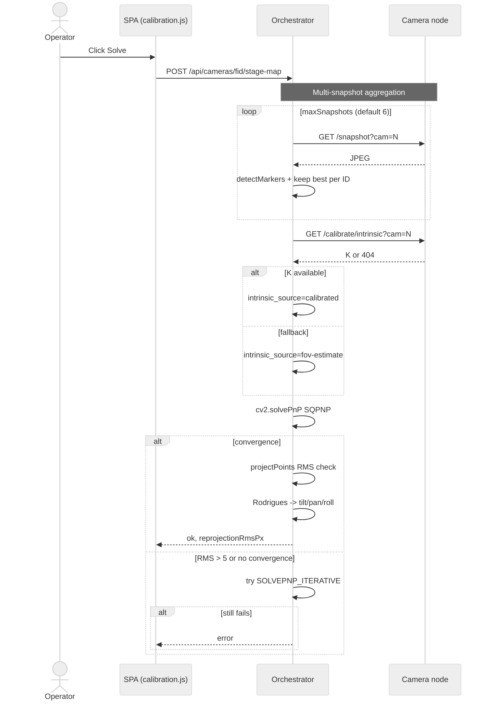
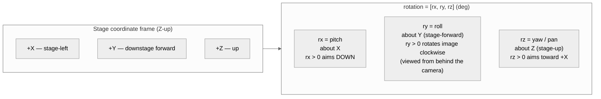

## Appendix A — Camera Calibration Pipeline (DRAFT)

> ⚠ **DRAFT — assumes all in-flight work is merged.** This appendix describes the camera-calibration pipeline under the assumption that issues #610, #651–#661, and #357 are fully implemented. Some features documented below are **partially merged** today (notably full intrinsic calibration of every camera, dark-reference integration into the mover pipeline per #651, and the floor-view polygon target filter per #659). See `docs/DOCS_MAINTENANCE.md` for the current merge status and the criteria for removing this banner. Issue [#662](https://github.com/SlyWombat/SlyLED/issues/662).

Camera calibration runs as a one-time setup per camera node and must be repeated whenever a camera is physically moved or re-aimed. It produces, per camera: an [intrinsic](#glossary) matrix **K** (focal length + principal point + distortion), an [extrinsic](#glossary) pose (stage-space position + rotation), and — for stages that will run point-cloud scans — a depth-anchor fit that corrects monocular depth to stage metric.

### A.1 Pipeline overview

```mermaid
%%{init: {'theme':'neutral'}}%%
flowchart TD
    Start([Register camera node]) --> Deploy[Deploy firmware via SSH+SCP]
    Deploy --> Intrinsic{1 — Intrinsic calibration}
    Intrinsic -->|Checkerboard path| CBCap[Capture 15-30 checkerboard frames<br/>~500ms/frame]
    Intrinsic -->|ArUco path| ArCap[Capture 5-10 ArUco snapshots]
    CBCap --> CBCompute[cv2.calibrateCamera<br/>~2s for 3 frames]
    ArCap --> ArCompute[cv2.calibrateCamera<br/>a few seconds]
    CBCompute --> Saved[Save intrinsic_camN.json on camera]
    ArCompute --> Saved
    Intrinsic -.->|skip| FOV[Fall back to FOV-derived K<br/>intrinsic_source = fov-estimate]

    Saved --> Survey[2 — ArUco marker survey]
    FOV --> Survey
    Survey --> MarkerReg[POST /api/aruco/markers<br/>id, size, x/y/z, rx/ry/rz, label]
    MarkerReg --> Coverage[GET /api/aruco/markers/coverage]
    Coverage --> Enough{>= 3 markers<br/>visible per camera?}
    Enough -->|no| AddMarker[Add marker at<br/>recommendation pin]
    AddMarker --> Coverage
    Enough -->|yes| DarkRef[3 — Dark-reference capture<br/>~100ms/cam]

    DarkRef --> StageMap[4 — Extrinsic solve<br/>~5-10s multi-snapshot]
    StageMap --> PnP[cv2.solvePnP SQPNP<br/>best-per-ID corners]
    PnP --> StoreExt[Store rotation rx/ry/rz + position<br/>rotationSchemaVersion: 2]

    StoreExt --> Scan[5 — Optional: space scan]
    Scan --> PointCloud[/point-cloud per cam<br/>~6.5s/cam metric model]
    PointCloud --> Anchor[Depth anchor fit<br/>scale + offset]
    Anchor --> Merge[space_mapper<br/>cross-cam filter + floor normalize]
    Merge --> Surfaces[surface_analyzer RANSAC<br/>floor + walls + obstacles]
    Surfaces --> Done([Stage geometry ready])

    Scan -.->|skip| Done
    StageMap -.->|RMS > 5px or too few markers| Error[Calibration error]
    PnP -.->|no convergence| Error
    Error --> Retry[Add markers or increase snapshots]
    Retry --> Coverage
```

### A.2 ArUco marker surveying

Physical ArUco markers mounted on the stage floor, walls, or rigging define the ground-truth geometry that every subsequent camera-calibration step references.

**Registry schema** — each marker is stored with:

| Field | Type | Notes |
|-------|------|-------|
| `id` | int (0–49) | ID within the `CV2_DICT_4X4_50` dictionary |
| `size` | float mm (≥1) | Physical edge length; default 100 mm |
| `x`, `y`, `z` | float mm | Stage-space position; usually `z=0` for floor markers |
| `rx`, `ry`, `rz` | float deg | Marker orientation — see §A.9 for axis convention |
| `label` | string (≤60 chars) | Operator annotation, e.g. `north-entrance` |

**Endpoints**

| Method | Path | Purpose |
|--------|------|---------|
| GET | `/api/aruco/markers` | Full registry (`dictId`, `markers[]`) |
| POST | `/api/aruco/markers` | Upsert one or more markers by ID |
| DELETE | `/api/aruco/markers/<id>` | Remove a marker by ID |
| GET | `/api/aruco/markers/coverage` | Per-camera visible-ID report with a placement recommendation |

**Coverage pre-flight** — before starting the extrinsic solve, run `GET /api/aruco/markers/coverage`. The response lists which IDs each camera currently sees, the stage-space hull covered by the registered markers, and a `recommendation` object indicating which camera has the weakest coverage and where the operator should place the next marker.

**Expected timing** — marker registration is instant (JSON write). Coverage check takes one snapshot per registered camera, typically 50–200 ms per camera.

**Fallback** — none. Without surveyed markers there is no extrinsic solve; the camera defaults to identity rotation and `(0, 0, 0)` position.

### A.3 Intrinsic calibration

Intrinsic calibration produces the camera's **K** matrix (`fx`, `fy`, `cx`, `cy`) and distortion coefficients. It is a per-lens, per-resolution, one-time step. Two independent paths are supported:

**Path A — Checkerboard (camera-side)**

| Method | Path | Purpose |
|--------|------|---------|
| POST | `/calibrate/intrinsic/capture` | Grab one frame, find ≤10 checkerboards (4×9, 25 mm squares default), accumulate corners |
| POST | `/calibrate/intrinsic/compute` | Run `cv2.calibrateCamera` on accumulated frames; save to `/opt/slyled/calib/intrinsic_camN.json` |
| GET | `/calibrate/intrinsic?cam=N` | Retrieve the saved calibration |
| DELETE | `/calibrate/intrinsic` | Remove saved calibration |
| POST | `/calibrate/intrinsic/reset` | Clear accumulated frames (does not touch saved file) |

**Expected timing** — ~500 ms per frame capture, 2–5 s compute with the minimum three frames. Targets for a usable calibration: 15–30 frames, RMS < 0.3 pixels.

**Path B — ArUco (orchestrator-side)**

| Method | Path | Purpose |
|--------|------|---------|
| POST | `/api/cameras/<fid>/aruco/capture` | Snapshot + ArUco detection, accumulate per-fixture corners |
| POST | `/api/cameras/<fid>/aruco/compute` | Pool corners across frames, `cv2.calibrateCamera`, POST result to camera node for persistence |
| POST | `/api/cameras/<fid>/aruco/reset` | Clear accumulated frames |
| GET | `/api/cameras/<fid>/intrinsic` | Proxy GET to the camera node |
| DELETE | `/api/cameras/<fid>/intrinsic` | Proxy DELETE to the camera node |
| POST | `/api/cameras/<fid>/intrinsic/reset` | Proxy POST to the camera node |

**Expected timing** — 5–10 captures × a few hundred ms each, compute in a few seconds.

**Fallback** — if no calibration file is available, the orchestrator falls back to an FOV-derived K on the fly: `fx = (w/2) / tan(h_fov/2)`, `fy = fx`, `cx = w/2`, `cy = h/2`, distortion zero. The `/stage-map` response reports `intrinsic_source: "fov-estimate"` when this path is used. Accuracy drops to roughly ±15% of true focal length.

**Persistence** — saved to the camera node at `/opt/slyled/calib/intrinsic_camN.json`; survives reboots.

### A.4 Extrinsic solve (solvePnP)

Given surveyed markers in stage space and their detected pixel corners, the orchestrator computes each camera's pose via `cv2.solvePnP` (see [PnP](#glossary), [RANSAC](#glossary) is **not** used here — PnP is a direct algebraic solve, not a consensus method).



**Endpoint** — `POST /api/cameras/<fid>/stage-map` with `{cam, markers, markerSize, maxSnapshots}`.

**Preconditions** — ≥3 surveyed markers registered (or ≥2 if all floor-coplanar), each visible in at least one snapshot. Multi-snapshot aggregation handles frame-to-frame transients; six snapshots is a good default.

**Algorithm** — for each snapshot, the orchestrator detects markers and keeps the single detection with the largest perimeter per ID (largest = closest = best sub-pixel corners). Correspondences from each detected corner to the surveyed 3D point feed into `cv2.solvePnP(..., flags=SOLVEPNP_SQPNP)`, with `SOLVEPNP_ITERATIVE` as a fallback solver.

**Expected timing** — one multi-snapshot run: 5–10 s (dominated by snapshot capture).

**Output** — `tvec` (stage mm) → camera position; `rvec` → Rodrigues → tilt/pan/roll → stored in `camera.rotation` using schema v2 (§A.9). Also reports `reprojectionRmsPx`.

**Fallbacks**

| Failure | Behaviour | Operator action |
|---------|-----------|-----------------|
| Fewer than 3 markers matched across all snapshots | Error; pose not updated | Add markers or reposition camera |
| SQPNP does not converge | Retry with `SOLVEPNP_ITERATIVE` | None automatic |
| Reprojection RMS > 5 px | Pose stored but flagged | Verify surveyed marker positions and `markerSize`; recapture intrinsics |
| No intrinsics on camera | Fall back to FOV-derived K, report `intrinsic_source: "fov-estimate"` | Run §A.3 for better accuracy |

### A.5 Dark-reference capture (#651)

A dark-reference frame is a snapshot taken with all calibration beams off so that beam detection in subsequent calibration steps can subtract ambient lighting.

**Endpoint** — `POST /dark-reference` on the camera node, body `{cam: -1}` (all cameras) or `{cam: N}`.

**Behaviour** — captures one frame per camera, stores in the `BeamDetector` in-memory buffer (not persisted across reboots).

**Expected timing** — ~100 ms per camera (V4L2 frame grab).

**When it runs** — automatically at the start of each mover calibration run (see Appendix B §B.3). Can also be triggered manually before running beam-detect calls.

**Fallback** — if the beam detector module is not available on the node, the endpoint returns 503 and the caller proceeds without dark-reference subtraction. Beam detection still works but is more sensitive to ambient light.

### A.6 Point cloud + multi-camera merge

Point-cloud generation produces a 3D representation of the stage from monocular depth plus camera pose. It is optional — only needed for features that reason about stage surfaces (mover-calibration target filtering, tracking, spatial effects on arbitrary geometry).

**Camera-side endpoint** — `POST /point-cloud` with `{cam, maxPoints, maxDepthMm}`. Returns `{points: [[x,y,z,r,g,b], ...], pointCount, inferenceMs, calibrated, fovDeg}`.

**Depth models**

| Model | File | Output | Typical inference on ARM |
|-------|------|--------|--------------------------|
| Metric (Depth-Anything-V2 Metric Indoor Small) | `/opt/slyled/models/depth_anything_v2_metric_indoor.onnx` | Depth in mm directly | ~6.5 s / frame |
| Disparity (Depth-Anything-V2 Small, fallback) | `/opt/slyled/models/depth_anything_v2_small.onnx` | Normalized [0,1]; caller scales by `maxDepthMm` | ~6.5 s / frame |

The camera selects the metric model by default; the disparity model is a fallback when the metric file is absent. Preference file: `/opt/slyled/models/active_depth_model`.

**Multi-camera merge** — `POST /api/space/scan` on the orchestrator runs, in order:

1. Fetch per-camera point clouds (try `/point-cloud` on the node; orchestrator-side depth if camera path unavailable).
2. Per-camera depth anchor (#581) — two-parameter `scale + offset` least-squares fit so monocular depth agrees with stage geometry. Reject outliers >2σ, refit. If RMS > 2000 mm, fall back to a median-based coarse fit.
3. Transform to stage coordinates using the camera's stored rotation + position.
4. Cross-camera consistency filter (#582) — if ≥2 cameras are present, reject points that appear in only one camera's view where another camera should have seen them (filters monocular hallucinations).
5. Floor normalization — compute 5th-percentile Z per camera, shift cloud so the average floor lands at Z=0; fall back to RANSAC floor detection if the camera-anchored method fails.
6. Z-marker alignment (#599) — if any registered marker has `z < 50 mm` and zero rotation, treat it as ground truth and shift the cloud so those markers sit at Z=0.

**Expected timing** — 30–60 s end-to-end for a typical two-camera setup; dominated by per-camera depth inference.

**Anchor quality classification** in the response (`depthAnchor.quality`): `"ok"` (RMS ≤ 500 mm), `"degraded"` (500–2000 mm), `"fallback"` (>2000 mm, median fit used). Degraded or fallback quality means downstream features (surface fitting, tracking) may be inaccurate.

### A.7 Surface analysis (RANSAC)

After a merged point cloud is available, `desktop/shared/surface_analyzer.py` extracts structural surfaces so the orchestrator can reason about them (obstacle-aware target picking, beam-surface intersection for mover calibration).

| Surface | Algorithm | Expected runtime | Failure mode |
|---------|-----------|------------------|--------------|
| Floor | RANSAC up to 200 trials, sample 3 points, plane fit, require vertical normal (dot-z > 0.95), ≥5% inlier share | 100–500 ms | Too few inliers → no floor reported |
| Walls | RANSAC on non-floor points, 2-point vertical-plane fit, ≥50 inliers or ≥5%, max 4 walls | 500 ms–2 s total | Silent; fewer walls reported |
| Obstacles | 300 mm XY grid + flood-fill, cluster size ≥20 points, classify as `pillar` if tall+thin else `obstacle` | 100–500 ms | Silent; sparse clusters rejected |

**Ray-cast intersection** — `beam_surface_check()` answers "which surface does a beam ray hit first?" Used by mover calibration to interpret detected-beam pixels as stage points when the beam lands on a wall or pillar rather than the floor (see #585/#260). Typical runtime 10–50 ms.

### A.8 Beam detection (interface used by mover calibration)

Beam detection is documented here because it is *how the camera pipeline feeds moving-head calibration* (Appendix B). The endpoints live on the camera node.

| Method | Path | Purpose | Typical runtime |
|--------|------|---------|-----------------|
| POST | `/beam-detect` | Single-frame detection; color filter + brightness + saturation + compactness | <100 ms |
| POST | `/beam-detect/flash` | Capture ON frame → wait `offDelayMs` → capture OFF → diff; immune to ambient shifts | <100 ms + `offDelayMs` |
| POST | `/beam-detect/center` | Multi-beam fixture: detect N beams, return cluster centre | <150 ms |

Color filtering uses HSV hue ranges (`beam_detector.py`): red `[0,60] ∪ [168,180]`, green `[35,85]`, blue `[100,130]`, magenta `[140,170]`; white falls back to brightness only.

**Validation checks per contour**: mean-V ≥ 160 (brightness); mean-S ≥ 80 for colored beams (saturation); aspect ≤ 5 (compactness).

### A.9 Rotation schema v2 (axis convention)

Camera and DMX fixture rotations share a unified convention (issues #586, #600). `fixture.rotation` is a list `[rx, ry, rz]` in **degrees**, axis-letter-matched to the Z-up stage frame:



**Canonical read path** — always route through:

- Python: `desktop/shared/camera_math.py::rotation_from_layout(rot) → (tilt, pan, roll)`, then `build_camera_to_stage(tilt, pan, roll)` for the 3×3 matrix.
- SPA: `rotationFromLayout(rot)` in `spa/js/app.js`.

**Never read `rotation[1]` or `rotation[2]` directly** — those indices swap between v1 and v2 files.

**Schema migration** — imported project files carrying `layout.rotationSchemaVersion < 2` (or missing) have `ry` and `rz` swapped on load (v1 used `ry=pan, rz=roll`; v2 uses `ry=roll, rz=pan`). Current exports always write `rotationSchemaVersion: 2`.

### A.10 Failure modes & operator expectations

| Phase | Symptom | Probable cause | Operator action |
|-------|---------|----------------|-----------------|
| Marker survey | Coverage recommendation persists after adding markers | Marker outside every camera's FOV | Move marker toward the recommended pin, or reposition camera |
| Intrinsic capture | "Board not found" | Lighting too low, angle too oblique, printout wavy | Flatten print, reposition, add light |
| Intrinsic compute | RMS > 1.0 px | Too few frames, poor angle variety | Capture 10+ more frames from diverse angles |
| Extrinsic solve | `markersMatched < 3` | Markers not visible in any snapshot | Increase `maxSnapshots`, reposition camera, add markers |
| Extrinsic solve | `reprojectionRmsPx > 5` | Bad intrinsics or wrong `markerSize` | Run §A.3; verify physical marker size matches registry |
| Extrinsic solve | `intrinsic_source: fov-estimate` | Camera has no saved intrinsic calibration | Optional: run §A.3 for ±2–5 px accuracy instead of ±10–20 px |
| Dark reference | 503 response | Beam detector module missing on camera | Redeploy firmware from the Firmware tab |
| Depth estimate | "model unavailable" | ONNX file not deployed | Deploy via Firmware → Camera tab |
| Anchor fit | `quality: fallback` | Monocular depth disagrees strongly with stage geometry | Verify stage bounds and camera pose; may be a solvePnP error upstream |
| Surface analysis | No floor reported | Cloud too sparse or noisy, camera aimed too high | Add cameras, aim lower, verify depth model |

### A.11 File locations & persistence

| Data | Location | Format | Notes |
|------|----------|--------|-------|
| ArUco registry | `desktop/shared/data/aruco_markers.json` | JSON list | Persisted on every marker POST/DELETE |
| Camera fixtures | `desktop/shared/data/fixtures.json` | JSON list | Includes stored pose + rotation |
| Layout positions | `desktop/shared/data/layout.json` | JSON | Must carry `rotationSchemaVersion: 2` |
| Intrinsic calibration (camera-side) | `/opt/slyled/calib/intrinsic_camN.json` | JSON | `fx, fy, cx, cy, distCoeffs, imageSize, rmsError, frameCount` |
| Point cloud cache | `desktop/shared/data/pointcloud.json` | JSON | From last `/api/space/scan` run |

---

<a id="appendix-b"></a>

