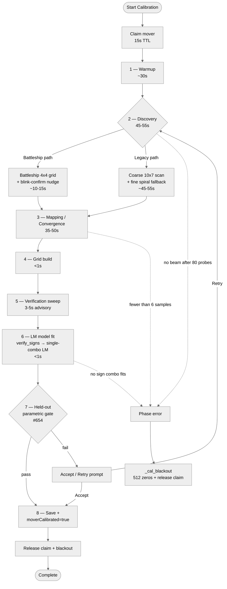
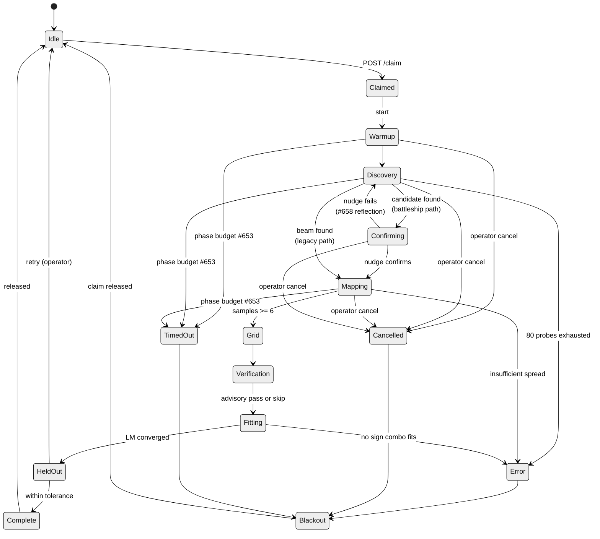
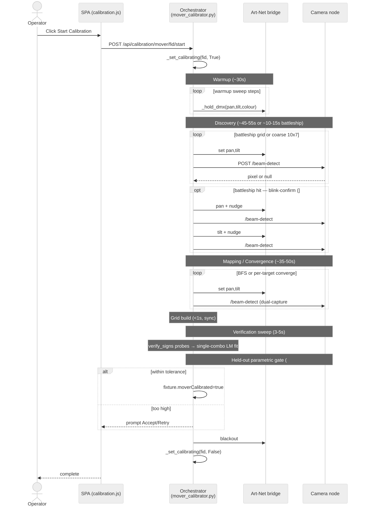

## Appendix B — Moving-Head Calibration Pipeline (DRAFT)

> ⚠ **DRAFT — assumes all in-flight work is merged.** This appendix describes the moving-head-calibration pipeline as if issues #610, #651–#661, #653–#655, #658–#661, and #357 are fully implemented. Some features documented below are **partially merged** today (notably global per-phase time budgets per #653, full held-out parametric gating of the `moverCalibrated` flag per #654, adaptive battleship density scaling per #661, and the floor-view polygon target filter per #659). See `docs/DOCS_MAINTENANCE.md` for the current merge status and the criteria for removing this banner. Issue [#662](https://github.com/SlyWombat/SlyLED/issues/662).

Moving-head calibration runs per [DMX](#glossary) moving-head fixture after the camera(s) covering its reachable region have been calibrated (Appendix A). It produces a sample set + parametric 6-[DOF](#glossary) [kinematic model](#glossary) that lets the orchestrator translate stage-space targets into exact pan/tilt DMX values, enabling [IK](#glossary) (inverse kinematics) for the Track action and spatial effects.

### B.1 Pipeline overview

### B.2 Phase reference

| # | Phase | Status string | Typical duration | Progress % | Fallback on failure |
|---|-------|---------------|------------------|------------|---------------------|
| 1 | Warmup | `warmup` | 30 s (configurable via `warmupSeconds`) | 2–8 | Log warning, continue without warmup |
| 2 | Discovery (legacy) | `discovery` | 45–55 s | 10–30 | Abort with `error` status after 80 probes |
| 2′ | Discovery (battleship) | `battleship` → `confirming` | 10–15 s | 10–25 | Abort with `error`; can fall back to legacy discovery |
| 3 | Mapping (legacy BFS) | `mapping` | 35–50 s | 35–70 | Abort if <6 samples |
| 3′ | Convergence (v2) | `sampling` | 30–60 s (N targets × ~1 s each) | 30–70 | Abort if convergence fails on multiple targets |
| 4 | Grid build | `grid` | <1 s | ~80 | Abort if sample spread insufficient |
| 5 | Verification sweep | `verification` | 3–5 s (3 held-out points) | ~90 | **Advisory only** — does not block save |
| 6 | Model fit (LM) | `fitting` | <1 s | 85–95 | verify_signs first → single-combo LM; full four-combo fallback if a sign probe misses |
| 7 | Held-out parametric gate (#654) | `holdout` | 2–5 s (N unseen targets) | 95–98 | Surface Accept/Retry prompt |
| 8 | Save | `complete` | <1 s | 100 | Write error logged but does not affect moverCalibrated flag |

Additional top-level statuses: `cancelled`, `error`, `done`.

### B.3 Phase-by-phase detail

#### 1. Warmup

- **Purpose** — cycle the fixture through full pan/tilt range so motor belts are thermally and mechanically settled before measurements start. Reduces backlash artifacts in early samples.
- **Preconditions** — valid DMX profile on fixture; Art-Net engine running; calibration lock engaged.
- **Expected duration** — 30 s by default (`warmupSeconds` parameter). Six sub-sweeps (pan±, tilt±, two diagonals) × 20 steps each, ~0.25 s per step.
- **Operator expectation** — beam sweeps visibly across the stage; progress bar creeps from 2% to 8%.
- **Fallback** — if warmup raises an exception, log warning and skip; calibration continues.
- **Cancel** — `_check_cancel()` inside each `_hold_dmx` loop raises `CalibrationAborted`.

#### 2. Discovery

Two code paths exist. The battleship path is preferred when camera homography is reliable; legacy path is the fallback when homography is unavailable (e.g. no surveyed markers visible).

**Battleship (preferred, `battleship` + `confirming` status):**

- Coarse 4×4 grid at pan/tilt bin centres `{0.125, 0.375, 0.625, 0.875}²` — 16 probes. Per #661, grid density scales with pan range and expected beam width; defaults to 4×4 but can reduce to 3×3 or expand to 5×5 for wide-pan fixtures.
- On the first detected pixel candidate, run the **blink-confirm** routine (#658): nudge pan by `confirm_nudge_delta` (≈ 0.02 of full range) and verify the detected pixel moves; nudge tilt likewise. If **both** pixel deltas exceed `min_delta`, the candidate is confirmed. Otherwise it was a reflection and is rejected — discovery resumes.
- **Expected duration** 10–15 s (16 probes × 0.6 s settle, plus 4 nudges × 0.6 s when a candidate hits).
- **Fallback on failure** — fall through to the legacy coarse+spiral path, or abort to `error`.

**Legacy (`discovery` status):**

- Initial probe at the warmstart aim (model prediction or geometric estimate from camera FOV).
- Coarse 10×7 grid: pan bins `0.02 + 0.96·i/9`, tilt bins `0.1 + 0.85·j/6` — 70 probes. Each probe goes through `_wait_settled`, which reuses the same adaptive-settle machinery (`SETTLE_BASE = 0.4 s` with `[0.4, 0.8, 1.5] s` escalation) used in the mapping phase — not a separate fixed `SETTLE` constant.
- If the coarse sweep misses, spiral outward from the warmstart aim in rectangular shells at `STEP = 0.05`, up to `MAX_PROBES = 80` total.
- **Expected duration** — 45–55 s worst-case.
- **Fallback on failure** — abort with `error`; call `_cal_blackout()`.

**Operator expectations** — beam sweeps through a visible grid of positions. If the beam is clearly landing where the camera can see it but detection fails, check §A.5 dark-reference and §A.8 color filter config.

#### 3. Mapping (legacy BFS) / Convergence (v2)

**Legacy BFS (`mapping` status):**

- BFS from the discovered `(pan, tilt, pixel)` seed. Each step detects the beam and, on success, enqueues four neighbours (up/down/left/right by `STEP`). Beam loss marks the current cell as a visible-region boundary; stale detections (where the pixel barely moves despite a large pan/tilt delta) are rejected as noise.
- Adaptive settle (#655) scales per-probe settle time by movement distance, with escalation levels `[0.4, 0.8, 1.5] s`. Dual-capture with a 0.2 s verify gap and a 30-pixel drift threshold filters mid-move frames; median filtering across the capture pair rejects outliers.
- **Targets** — `_map_target = 50` samples (hard minimum 6; bounded by `MAX_SAMPLES = 80`).
- **Expected duration** — 35–50 s.

**v2 Convergence (`sampling` status):**

- For each target from `pick_calibration_targets` (filtered through the camera floor-view polygon per #659), converge the beam on the target pixel via `converge_on_target_pixel`.
- **Bracket-and-retry refine (#660)** — initial `bracket_step = 0.08`. When the beam is lost, halve the step and walk back toward the best-known-good offset in the error direction. `BRACKET_FLOOR` is fixture-dependent: `1 / (2^pan_bits − 1)` — about `0.0039` on 8-bit pan and `0.0000153` on 16-bit, so the loop exhausts to the fixture's actual DMX resolution instead of the old 8-bit-only `1/255` floor (#679). Reset `bracket_step` to 0.08 on beam re-acquisition. Typical convergence: 5–10 iterations; max 25.
- **Expected duration** — 30–60 s (N targets × ~1 s each).

**Fallback** — if fewer than 6 samples are collected, abort with `error`.

#### 4. Grid build

- Pure compute: extract unique pan/tilt values from samples, sort, nearest-neighbour fill for missing cells.
- **Expected duration** — <100 ms, no I/O.
- **Fallback** — if sample spread insufficient to form a grid, abort with `error`.

#### 5. Verification sweep

- Pick 3 random targets inside the grid bounds, avoiding fit samples by ≥0.05 pan/tilt margin, with a 10% interior shrink to dodge weak-interpolation edges.
- For each: predict pixel via grid lookup, detect actual beam, compute pixel error.
- **Expected duration** — 3–5 s (3 × ~1 s settle+detect).
- **Advisory only** — logs a warning if any point fails; does **not** block the save.

#### 6. Model fit (parametric, Levenberg-Marquardt)

- **Sign verification (#652 / §8.1) runs FIRST, before the LM fit.** Right after discovery returns `(pan, tilt, pixel)`, the thread issues two extra probes (`pan + 0.02`, `tilt + 0.02`) and calls `verify_signs` on the pixel deltas to compute `(pan_sign, tilt_sign)`. Those signs flow into `fit_model(..., force_signs=(ps, ts))` so the LM runs **one** solve instead of four.
- Fallback — if any sign probe fails to detect a beam, `force_signs` is left `None` and `fit_model` runs the full four-combo search and picks the lowest-RMS candidate.
- When the top two candidates agree to within 0.2° RMS AND the caller didn't supply `force_signs`, `FitQuality.mirror_ambiguity` is set True and surfaced on the status endpoint (#679) so the UI can flag the calibration for a manual re-run.
- `scipy.optimize.least_squares` with `soft_l1` loss (`f_scale=0.05`) fits five continuous parameters (mount yaw/pitch/roll + pan/tilt offsets); up to 120 iterations.
- **Expected duration** — <1 s total (verify_signs + single LM solve).
- **Fallback** — if all 4 combos fail to converge, raise `RuntimeError`; caller aborts with `error`.

#### 7. Held-out parametric gate (#654)

- After fit, drive the fixture to 2–3 **unseen** targets (not used in discovery, mapping, or verification) and measure pixel-level residual against model prediction.
- If residual is within tolerance, set `fixture["moverCalibrated"] = True`.
- If residual exceeds tolerance, return the result to the SPA as an Accept/Retry prompt: operator may accept (flag still set, marked as degraded) or retry calibration from discovery.
- **Expected duration** — 2–5 s.

#### 8. Save + release

- Persist `samples`, `model` dict, `fitQuality` metrics, and per-phase metadata to `desktop/shared/data/fixtures.json`.
- Set `fixture["moverCalibrated"] = True` (if not already).
- Release the calibration lock via `_set_calibrating(fid, False)` — the mover-follow engine resumes writing pan/tilt.
- Blackout the fixture.

### B.4 Time budget + blackout-on-timeout (#653)

Each phase has a per-phase wall-clock budget. If exceeded, the phase raises `PhaseTimeout`, caught by the top-level calibration thread, which then:

1. Calls `_cal_blackout()` — sends 512 zeros to the fixture's universe for 0.3 s.
2. Releases the calibration lock.
3. Sets `job["status"] = "error"`, `job["phase"] = "<phase>_timeout"`.
4. Flags `tier-2 handoff` in the status dict so the SPA can suggest the next diagnostic tier.

Default budgets (can be overridden per fixture via `calibrationBudgets` in settings):

| Phase | Default budget |
|-------|----------------|
| Warmup | 60 s |
| Discovery | 120 s |
| Mapping / Convergence | 180 s |
| Grid build | 10 s |
| Verification sweep | 30 s |
| Model fit | 15 s |
| Held-out gate | 30 s |

Total default budget: ~7.5 min, well above the typical 2–4 min runtime.

### B.5 Abort path

Cancellation can originate from three sources: operator (`POST /api/calibration/mover/<fid>/cancel`), phase timeout (§B.4), or an unhandled exception. All three converge on the same cleanup:

1. **Foreground immediate blackout** (operator-initiated only): on the `/cancel` request, the orchestrator zeroes the fixture's channel window on the running Art-Net engine buffer in the foreground, so the next 25 ms frame carries zeros to the bridge — the operator sees the light go off immediately.
2. **Background unwind**: the calibration thread sets `_cancel_event`, which `_check_cancel()` inside `_hold_dmx` picks up and raises `CalibrationAborted`. The exception propagates to `_mover_cal_thread`, which catches it, calls `_cal_blackout()` (512 zeros + release), sets `status = "cancelled"`, `phase = "cancelled"`.
3. **Lock release** — `_set_calibrating(fid, False)` is always called in the cleanup, regardless of which path triggered the cancel.

### B.6 Failure modes & operator diagnostics

| Symptom | Probable cause | What to check / try |
|---------|----------------|---------------------|
| Discovery completes 80 probes without finding beam | Beam too dim, camera can't see it, wrong colour, mover not actually on | Verify fixture is powered and responding; increase threshold; run Fixture Orientation Test (§14); check §A.8 colour configuration; dim room lights |
| Discovery finds beam immediately but blink-confirm always rejects | Reflective surface (mirror, glass, polished floor) being detected instead of beam | Add diffuse material over the reflector; pick a different beam colour; move the mover's warmstart aim away from the reflector |
| Mapping / convergence aborts with "fewer than 6 samples" | BFS boundary is too narrow — camera sees only a small slice of the pan/tilt range | Reposition camera to see more of the floor; increase camera count; verify mover's position in layout matches reality |
| `moverCalibrated` flag never sets | Held-out gate is failing | Check the Accept/Retry prompt; if residual is reported, an Accept keeps the flag but marks it degraded; a full Retry restarts from discovery |
| Sign verification logs mirror ambiguity | Fit sees two equally good sign combos | Check physical mover pan/tilt direction against §14 Fixture Orientation Test; may need to toggle Invert Pan/Tilt or Swap Pan/Tilt flags |
| Calibration "hangs" at a phase | Phase budget (#653) not yet triggered; or Art-Net engine stopped mid-run | Wait up to the phase budget; check engine is running (`POST /api/dmx/start` if not); if still stuck, cancel and check orchestrator log |
| Light flashes momentarily then stops, status stays `running` | Foreground cancel happened but background thread is still unwinding | Normal; background cleanup completes within 1–2 s |

### B.7 Tuning-parameter reference

**Operator-tunable (#680) — Settings → Advanced → Calibration Timeouts.**
The constants below are the shipped defaults; operators can override them
via the Advanced panel, which persists into `desktop/shared/data/settings.json`
under `calibrationTuning`. Overrides are read at phase start, so a change
takes effect on the next calibration run without a server restart. Validation
is centralised in `CAL_TUNING_SPEC` (`parent_server.py`); POST /api/settings
rejects out-of-range values with a 400. Every constant below has a matching
entry in `CAL_TUNING_SPEC` except the ones flagged "fixed" (e.g. `STEP`,
`MAX_SAMPLES` is exposed as `bfsMaxSamples`, `BRACKET_FLOOR` is derived per
fixture and not operator-tunable per #679).

Constants in `desktop/shared/mover_calibrator.py`:

| Constant | Default | Role |
|----------|---------|------|
| `SETTLE` (legacy) | 0.6 s | Per-probe settle before detection |
| `SETTLE_BASE` (#655) | 0.4 s | Adaptive-settle base before escalation |
| `SETTLE_ESCALATION` | `[0.4, 0.8, 1.5]` s | Escalation tiers on pixel-drift retry |
| `SETTLE_VERIFY_GAP` | 0.2 s | Dual-capture spacing for median filter |
| `SETTLE_PIXEL_THRESH` | 30 px | Inter-capture drift threshold for "settled" |
| `STEP` | 0.05 | Fine spiral step size (normalized pan/tilt) |
| `MAX_SAMPLES` | 80 | Hard cap on BFS samples |
| `COARSE_PAN` | 10 | Legacy coarse grid pan bins |
| `COARSE_TILT` | 7 | Legacy coarse grid tilt bins |
| `BRACKET_FLOOR` | `1 / (2^pan_bits − 1)` | Convergence refine floor — fixture-dependent (8-bit → `≈0.0039`, 16-bit → `≈0.0000153`) (#679) |

Constants in `desktop/shared/mover_control.py`:

| Constant | Default | Role |
|----------|---------|------|
| Claim TTL (`moverClaimTtlS`, #680) | 15 s | Auto-release if claim not refreshed |

Phase time budgets (from `CAL_TUNING_SPEC` in `desktop/shared/parent_server.py`, #680):

| Key | Default | Clamp | Role |
|-----|---------|-------|------|
| `discoveryBattleshipS` | 60 s | 20 – 300 | Coarse-grid scan budget |
| `discoveryColourFallbackS` | 90 s | 30 – 300 | Legacy colour-filter fallback budget |
| `mappingS` | 120 s | 30 – 600 | BFS mapping budget (soft cap) |
| `fitS` | 10 s | 5 – 60 | LM + grid build |
| `verificationS` | 30 s | 5 – 120 | Grid + parametric held-out verify |
| `warmupSeconds` | 30 s | 0 – 120 | Pre-cal motor warmup sweep |
| `bfsMaxSamples` | 80 | 20 – 300 | Hard cap on BFS samples |
| `convergeMaxIterations` | 25 | 5 – 100 | Per-target bracket-and-retry loop |
| `battleshipPan/TiltStepsMin/Max` | 3 / 8 / 3 / 6 | see spec | Adaptive-grid clamps (#661) |

### B.8 Related features

- **Unified mover control** — see CLAUDE.md §"Unified mover control (gyro + Android)". Calibration must complete and `moverCalibrated` must be set before manual mover-control (gyro/phone) will use the parametric model; without it, the control layer falls back to raw DMX pan/tilt passthrough.
- **Fixture Orientation Test** — §14 "Fixture Orientation Test". Run this first if the pan/tilt axes in the physical fixture don't match expectations.
- **Track Action** — §8 "Track Action". Consumes the interpolation grid + parametric model to aim at moving subjects.

---

