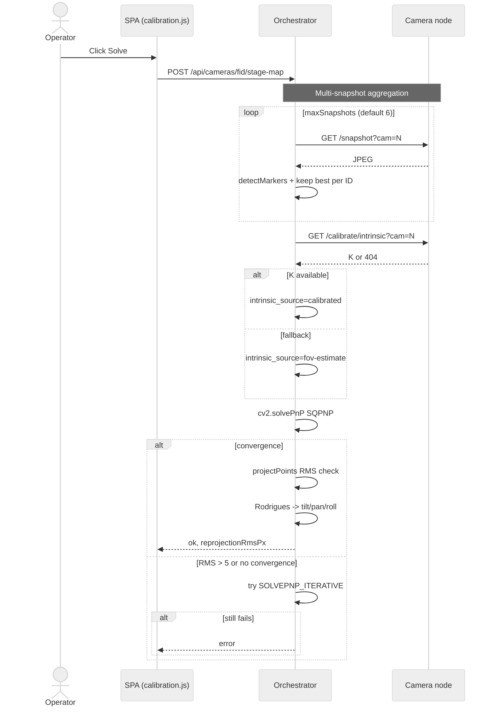
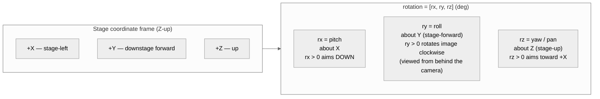

## Annexe A — Pipeline d'étalonnage de caméra (EBAUCHE)

> ⚠ **EBAUCHE — suppose que tout le travail en vol est fusionné.** Cette annexe décrit le pipeline d'étalonnage caméra en supposant que les issues #610, #651–#661 et #357 sont entièrement implémentées. Certaines fonctionnalités documentées ci-dessous sont **partiellement fusionnées** aujourd'hui (notamment l'étalonnage intrinsèque complet de chaque caméra, l'intégration de la référence obscure dans le pipeline des projecteurs motorisés par #651 et le filtre polygonal de vue sol par #659). Voir `docs/DOCS_MAINTENANCE.md` pour le statut de fusion actuel et les critères de retrait de cette bannière. Issue [#662](https://github.com/SlyWombat/SlyLED/issues/662).

L'étalonnage caméra s'exécute comme une configuration unique par nœud caméra et doit être répété chaque fois qu'une caméra est physiquement déplacée ou réorientée. Il produit, par caméra : une matrice [intrinsèque](#glossary) **K** (distance focale + point principal + distorsion), une pose [extrinsèque](#glossary) (position + rotation dans l'espace scène) et — pour les scènes qui exécuteront des scans de nuage de points — un ajustement d'ancre de profondeur qui corrige la profondeur monoculaire vers la métrique de la scène.

### A.1 Vue d'ensemble du pipeline

```mermaid
%%{init: {'theme':'neutral'}}%%
flowchart TD
    Start([Register camera node]) --> Deploy[Deploy firmware via SSH+SCP]
    Deploy --> Intrinsic{1 — Intrinsic calibration}
    Intrinsic -->|Checkerboard path| CBCap[Capture 15-30 checkerboard frames<br/>~500ms/frame]
    Intrinsic -->|ArUco path| ArCap[Capture 5-10 ArUco snapshots]
    CBCap --> CBCompute[cv2.calibrateCamera<br/>~2s for 3 frames]
    ArCap --> ArCompute[cv2.calibrateCamera<br/>a few seconds]
    CBCompute --> Saved[Save intrinsic_camN.json on camera]
    ArCompute --> Saved
    Intrinsic -.->|skip| FOV[Fall back to FOV-derived K<br/>intrinsic_source = fov-estimate]

    Saved --> Survey[2 — ArUco marker survey]
    FOV --> Survey
    Survey --> MarkerReg[POST /api/aruco/markers<br/>id, size, x/y/z, rx/ry/rz, label]
    MarkerReg --> Coverage[GET /api/aruco/markers/coverage]
    Coverage --> Enough{>= 3 markers<br/>visible per camera?}
    Enough -->|no| AddMarker[Add marker at<br/>recommendation pin]
    AddMarker --> Coverage
    Enough -->|yes| DarkRef[3 — Dark-reference capture<br/>~100ms/cam]

    DarkRef --> StageMap[4 — Extrinsic solve<br/>~5-10s multi-snapshot]
    StageMap --> PnP[cv2.solvePnP SQPNP<br/>best-per-ID corners]
    PnP --> StoreExt[Store rotation rx/ry/rz + position<br/>rotationSchemaVersion: 2]

    StoreExt --> Scan[5 — Optional: space scan]
    Scan --> PointCloud[/point-cloud per cam<br/>~6.5s/cam metric model]
    PointCloud --> Anchor[Depth anchor fit<br/>scale + offset]
    Anchor --> Merge[space_mapper<br/>cross-cam filter + floor normalize]
    Merge --> Surfaces[surface_analyzer RANSAC<br/>floor + walls + obstacles]
    Surfaces --> Done([Stage geometry ready])

    Scan -.->|skip| Done
    StageMap -.->|RMS > 5px or too few markers| Error[Calibration error]
    PnP -.->|no convergence| Error
    Error --> Retry[Add markers or increase snapshots]
    Retry --> Coverage
```

### A.2 Relevé des marqueurs ArUco

Les marqueurs ArUco physiques montés sur le sol, les murs ou les structures de la scène définissent la géométrie de vérité terrain à laquelle chaque étape d'étalonnage caméra ultérieure fait référence.

**Schéma du registre** — chaque marqueur est stocké avec :

| Champ | Type | Notes |
|-------|------|-------|
| `id` | int (0–49) | ID dans le dictionnaire `CV2_DICT_4X4_50` |
| `size` | float mm (≥1) | Longueur physique du bord ; par défaut 100 mm |
| `x`, `y`, `z` | float mm | Position dans l'espace scène ; habituellement `z=0` pour les marqueurs au sol |
| `rx`, `ry`, `rz` | float deg | Orientation du marqueur — voir §A.9 pour la convention d'axe |
| `label` | string (≤60 caractères) | Annotation opérateur, p. ex. `north-entrance` |

**Points de terminaison**

| Méthode | Chemin | Objet |
|---------|--------|-------|
| GET | `/api/aruco/markers` | Registre complet (`dictId`, `markers[]`) |
| POST | `/api/aruco/markers` | Upsert d'un ou plusieurs marqueurs par ID |
| DELETE | `/api/aruco/markers/<id>` | Retirer un marqueur par ID |
| GET | `/api/aruco/markers/coverage` | Rapport par caméra des ID visibles avec recommandation de placement |

**Pré-vol de couverture** — avant de démarrer la résolution extrinsèque, exécutez `GET /api/aruco/markers/coverage`. La réponse liste quels ID chaque caméra voit actuellement, l'enveloppe dans l'espace scène couverte par les marqueurs enregistrés et un objet `recommendation` indiquant quelle caméra a la couverture la plus faible et où l'opérateur devrait placer le prochain marqueur.

**Timing attendu** — l'enregistrement de marqueur est instantané (écriture JSON). La vérification de couverture prend une capture par caméra enregistrée, typiquement 50–200 ms par caméra.

**Repli** — aucun. Sans marqueurs relevés, il n'y a pas de résolution extrinsèque ; la caméra bascule par défaut sur la rotation identité et la position `(0, 0, 0)`.

### A.3 Étalonnage intrinsèque

L'étalonnage intrinsèque produit la matrice **K** de la caméra (`fx`, `fy`, `cx`, `cy`) et les coefficients de distorsion. C'est une étape par objectif, par résolution et ponctuelle. Deux chemins indépendants sont pris en charge :

**Chemin A — Damier (côté caméra)**

| Méthode | Chemin | Objet |
|---------|--------|-------|
| POST | `/calibrate/intrinsic/capture` | Saisir une image, trouver jusqu'à 10 damiers (par défaut 4×9, carrés de 25 mm), accumuler les coins |
| POST | `/calibrate/intrinsic/compute` | Exécuter `cv2.calibrateCamera` sur les images accumulées ; enregistrer dans `/opt/slyled/calib/intrinsic_camN.json` |
| GET | `/calibrate/intrinsic?cam=N` | Récupérer l'étalonnage enregistré |
| DELETE | `/calibrate/intrinsic` | Supprimer l'étalonnage enregistré |
| POST | `/calibrate/intrinsic/reset` | Effacer les images accumulées (ne touche pas au fichier enregistré) |

**Timing attendu** — ~500 ms par capture d'image, 2–5 s de calcul avec le minimum de trois images. Cibles pour un étalonnage utilisable : 15–30 images, RMS < 0,3 pixel.

**Chemin B — ArUco (côté orchestrateur)**

| Méthode | Chemin | Objet |
|---------|--------|-------|
| POST | `/api/cameras/<fid>/aruco/capture` | Capture + détection ArUco, accumulation des coins par appareil |
| POST | `/api/cameras/<fid>/aruco/compute` | Pooler les coins sur les images, `cv2.calibrateCamera`, POSTer le résultat au nœud caméra pour persistance |
| POST | `/api/cameras/<fid>/aruco/reset` | Effacer les images accumulées |
| GET | `/api/cameras/<fid>/intrinsic` | GET proxy vers le nœud caméra |
| DELETE | `/api/cameras/<fid>/intrinsic` | DELETE proxy vers le nœud caméra |
| POST | `/api/cameras/<fid>/intrinsic/reset` | POST proxy vers le nœud caméra |

**Timing attendu** — 5–10 captures × quelques centaines de ms chacune, calcul en quelques secondes.

**Repli** — si aucun fichier d'étalonnage n'est disponible, l'orchestrateur se replie à la volée sur un K dérivé du FOV : `fx = (w/2) / tan(h_fov/2)`, `fy = fx`, `cx = w/2`, `cy = h/2`, distorsion à zéro. La réponse `/stage-map` rapporte `intrinsic_source: "fov-estimate"` lorsque ce chemin est utilisé. La précision chute à environ ±15 % de la distance focale réelle.

**Persistance** — enregistré sur le nœud caméra dans `/opt/slyled/calib/intrinsic_camN.json` ; survit aux redémarrages.

### A.4 Résolution extrinsèque (solvePnP)

Étant donné des marqueurs relevés dans l'espace scène et leurs coins pixel détectés, l'orchestrateur calcule la pose de chaque caméra via `cv2.solvePnP` (voir [PnP](#glossary) ; [RANSAC](#glossary) n'est **pas** utilisé ici — PnP est une résolution algébrique directe, pas une méthode par consensus).



**Point de terminaison** — `POST /api/cameras/<fid>/stage-map` avec `{cam, markers, markerSize, maxSnapshots}`.

**Préconditions** — ≥3 marqueurs relevés enregistrés (ou ≥2 si tous coplanaires au sol), chacun visible dans au moins une capture. L'agrégation multi-capture gère les transitoires image à image ; six captures est un bon défaut.

**Algorithme** — pour chaque capture, l'orchestrateur détecte les marqueurs et conserve, par ID, la seule détection avec le plus grand périmètre (le plus grand = le plus proche = les meilleurs coins sous-pixel). Les correspondances entre chaque coin détecté et le point 3D relevé alimentent `cv2.solvePnP(..., flags=SOLVEPNP_SQPNP)`, avec `SOLVEPNP_ITERATIVE` comme solveur de repli.

**Timing attendu** — une exécution multi-capture : 5–10 s (dominé par la capture d'images).

**Sortie** — `tvec` (mm scène) → position caméra ; `rvec` → Rodrigues → tilt/pan/roll → stocké dans `camera.rotation` en schéma v2 (§A.9). Rapporte aussi `reprojectionRmsPx`.

**Replis**

| Échec | Comportement | Action opérateur |
|-------|--------------|------------------|
| Moins de 3 marqueurs appariés sur toutes les captures | Erreur ; pose non mise à jour | Ajoutez des marqueurs ou repositionnez la caméra |
| SQPNP ne converge pas | Réessai avec `SOLVEPNP_ITERATIVE` | Aucune automatique |
| RMS de reprojection > 5 px | Pose stockée mais signalée | Vérifiez les positions des marqueurs relevés et `markerSize` ; recapturez les intrinsèques |
| Aucune intrinsèque sur la caméra | Repli sur K dérivé du FOV, rapporte `intrinsic_source: "fov-estimate"` | Exécutez §A.3 pour une meilleure précision |

### A.5 Capture de référence obscure (#651)

Une image de référence obscure est une capture prise avec tous les faisceaux d'étalonnage éteints afin que la détection de faisceau dans les étapes d'étalonnage ultérieures puisse soustraire l'éclairage ambiant.

**Point de terminaison** — `POST /dark-reference` sur le nœud caméra, corps `{cam: -1}` (toutes les caméras) ou `{cam: N}`.

**Comportement** — capture une image par caméra, stocke dans le tampon mémoire de `BeamDetector` (non persisté entre redémarrages).

**Timing attendu** — ~100 ms par caméra (capture d'image V4L2).

**Quand cela s'exécute** — automatiquement au début de chaque exécution d'étalonnage de projecteur motorisé (voir annexe B §B.3). Peut aussi être déclenché manuellement avant d'exécuter des appels beam-detect.

**Repli** — si le module de détection de faisceau n'est pas disponible sur le nœud, le point de terminaison renvoie 503 et l'appelant continue sans soustraction de référence obscure. La détection de faisceau fonctionne toujours mais est plus sensible à la lumière ambiante.

### A.6 Nuage de points + fusion multi-caméra

La génération de nuage de points produit une représentation 3D de la scène à partir de la profondeur monoculaire et de la pose caméra. Elle est optionnelle — nécessaire uniquement pour les fonctionnalités qui raisonnent sur les surfaces de la scène (filtrage des cibles d'étalonnage de projecteur motorisé, suivi, effets spatiaux sur une géométrie arbitraire).

**Point de terminaison côté caméra** — `POST /point-cloud` avec `{cam, maxPoints, maxDepthMm}`. Renvoie `{points: [[x,y,z,r,g,b], ...], pointCount, inferenceMs, calibrated, fovDeg}`.

**Modèles de profondeur**

| Modèle | Fichier | Sortie | Inférence typique sur ARM |
|--------|---------|--------|----------------------------|
| Métrique (Depth-Anything-V2 Metric Indoor Small) | `/opt/slyled/models/depth_anything_v2_metric_indoor.onnx` | Profondeur en mm directement | ~6,5 s / image |
| Disparité (Depth-Anything-V2 Small, repli) | `/opt/slyled/models/depth_anything_v2_small.onnx` | Normalisé [0,1] ; l'appelant met à l'échelle par `maxDepthMm` | ~6,5 s / image |

La caméra sélectionne par défaut le modèle métrique ; le modèle de disparité est un repli quand le fichier métrique est absent. Fichier de préférence : `/opt/slyled/models/active_depth_model`.

**Fusion multi-caméra** — `POST /api/space/scan` sur l'orchestrateur exécute, dans l'ordre :

1. Récupérer les nuages de points par caméra (essayer `/point-cloud` sur le nœud ; profondeur côté orchestrateur si le chemin caméra est indisponible).
2. Ancre de profondeur par caméra (#581) — ajustement aux moindres carrés à deux paramètres `scale + offset` afin que la profondeur monoculaire s'accorde avec la géométrie de la scène. Rejet des valeurs aberrantes >2σ, réajustement. Si RMS > 2000 mm, repli sur un ajustement grossier basé sur la médiane.
3. Transformer en coordonnées scène à l'aide de la rotation + position stockées de la caméra.
4. Filtre de cohérence inter-caméras (#582) — si ≥2 caméras sont présentes, rejeter les points qui apparaissent dans la vue d'une seule caméra là où une autre caméra aurait dû les voir (filtre les hallucinations monoculaires).
5. Normalisation du sol — calculer le 5e centile Z par caméra, décaler le nuage pour que le sol moyen tombe à Z=0 ; repli sur détection de sol RANSAC si la méthode ancrée caméra échoue.
6. Alignement sur marqueur Z (#599) — si un marqueur enregistré a `z < 50 mm` et rotation nulle, le traiter comme vérité terrain et décaler le nuage pour que ces marqueurs se situent à Z=0.

**Timing attendu** — 30–60 s de bout en bout pour une configuration typique à deux caméras ; dominé par l'inférence de profondeur par caméra.

**Classification de qualité d'ancre** dans la réponse (`depthAnchor.quality`) : `"ok"` (RMS ≤ 500 mm), `"degraded"` (500–2000 mm), `"fallback"` (>2000 mm, ajustement médian utilisé). Une qualité dégradée ou de repli signifie que les fonctionnalités en aval (ajustement de surface, suivi) peuvent être imprécises.

### A.7 Analyse de surface (RANSAC)

Une fois un nuage de points fusionné disponible, `desktop/shared/surface_analyzer.py` extrait les surfaces structurelles afin que l'orchestrateur puisse raisonner dessus (sélection de cible tenant compte des obstacles, intersection faisceau-surface pour l'étalonnage de projecteur motorisé).

| Surface | Algorithme | Temps d'exécution attendu | Mode d'échec |
|---------|------------|---------------------------|--------------|
| Sol | RANSAC jusqu'à 200 essais, 3 points échantillonnés, ajustement de plan, normale verticale requise (dot-z > 0,95), ≥5 % d'inliers | 100–500 ms | Trop peu d'inliers → aucun sol rapporté |
| Murs | RANSAC sur les points non sol, ajustement de plan vertical à 2 points, ≥50 inliers ou ≥5 %, max 4 murs | 500 ms–2 s total | Silencieux ; moins de murs rapportés |
| Obstacles | Grille XY 300 mm + flood-fill, taille de cluster ≥20 points, classé `pillar` si haut+mince sinon `obstacle` | 100–500 ms | Silencieux ; clusters épars rejetés |

**Intersection par lancer de rayon** — `beam_surface_check()` répond « quelle surface un rayon de faisceau frappe-t-il en premier ? ». Utilisé par l'étalonnage de projecteur motorisé pour interpréter les pixels de faisceau détectés comme des points scène lorsque le faisceau atterrit sur un mur ou un pilier plutôt que sur le sol (voir #585/#260). Temps d'exécution typique 10–50 ms.

### A.8 Détection de faisceau (interface utilisée par l'étalonnage de projecteur motorisé)

La détection de faisceau est documentée ici parce qu'elle est *la manière dont le pipeline caméra alimente l'étalonnage des projecteurs motorisés* (annexe B). Les points de terminaison vivent sur le nœud caméra.

| Méthode | Chemin | Objet | Temps d'exécution typique |
|---------|--------|-------|---------------------------|
| POST | `/beam-detect` | Détection image unique ; filtre colorimétrique + luminosité + saturation + compacité | <100 ms |
| POST | `/beam-detect/flash` | Capture image ON → attendre `offDelayMs` → capture OFF → différence ; immunisé aux variations ambiantes | <100 ms + `offDelayMs` |
| POST | `/beam-detect/center` | Appareil multi-faisceaux : détecte N faisceaux, renvoie le centre du cluster | <150 ms |

Le filtrage colorimétrique utilise les plages de teinte HSV (`beam_detector.py`) : rouge `[0,60] ∪ [168,180]`, vert `[35,85]`, bleu `[100,130]`, magenta `[140,170]` ; le blanc se replie sur la seule luminosité.

**Contrôles de validation par contour :** moyenne-V ≥ 160 (luminosité) ; moyenne-S ≥ 80 pour les faisceaux colorés (saturation) ; aspect ≤ 5 (compacité).

### A.9 Schéma de rotation v2 (convention d'axe)

Les rotations des caméras et des appareils DMX partagent une convention unifiée (issues #586, #600). `fixture.rotation` est une liste `[rx, ry, rz]` en **degrés**, avec correspondance lettre-axe au repère scène Z-vers-le-haut :



**Chemin de lecture canonique** — passez toujours par :

- Python : `desktop/shared/camera_math.py::rotation_from_layout(rot) → (tilt, pan, roll)`, puis `build_camera_to_stage(tilt, pan, roll)` pour la matrice 3×3.
- SPA : `rotationFromLayout(rot)` dans `spa/js/app.js`.

**Ne lisez jamais `rotation[1]` ou `rotation[2]` directement** — ces indices s'échangent entre les fichiers v1 et v2.

**Migration de schéma** — les fichiers projets importés portant `layout.rotationSchemaVersion < 2` (ou absent) voient `ry` et `rz` échangés au chargement (v1 utilisait `ry=pan, rz=roll` ; v2 utilise `ry=roll, rz=pan`). Les exports actuels écrivent toujours `rotationSchemaVersion: 2`.

### A.10 Modes d'échec et attentes opérateur

| Phase | Symptôme | Cause probable | Action opérateur |
|-------|----------|----------------|------------------|
| Relevé de marqueurs | La recommandation de couverture persiste après ajout de marqueurs | Marqueur hors du FOV de chaque caméra | Déplacez le marqueur vers l'épingle recommandée, ou repositionnez la caméra |
| Capture intrinsèque | « Board not found » | Éclairage trop bas, angle trop oblique, impression gondolée | Aplatissez l'impression, repositionnez, ajoutez de la lumière |
| Calcul intrinsèque | RMS > 1,0 px | Trop peu d'images, faible variété d'angles | Capturez 10+ images supplémentaires sous divers angles |
| Résolution extrinsèque | `markersMatched < 3` | Marqueurs non visibles dans aucune capture | Augmentez `maxSnapshots`, repositionnez la caméra, ajoutez des marqueurs |
| Résolution extrinsèque | `reprojectionRmsPx > 5` | Mauvaises intrinsèques ou `markerSize` incorrect | Exécutez §A.3 ; vérifiez que la taille physique du marqueur correspond au registre |
| Résolution extrinsèque | `intrinsic_source: fov-estimate` | La caméra n'a pas d'étalonnage intrinsèque enregistré | Optionnel : exécutez §A.3 pour ±2–5 px de précision au lieu de ±10–20 px |
| Référence obscure | Réponse 503 | Module de détection de faisceau manquant sur la caméra | Redéployez le firmware depuis l'onglet Firmware |
| Estimation de profondeur | « model unavailable » | Fichier ONNX non déployé | Déployez via Firmware → Camera tab |
| Ajustement d'ancre | `quality: fallback` | La profondeur monoculaire est en fort désaccord avec la géométrie de la scène | Vérifiez les limites de la scène et la pose caméra ; peut être une erreur solvePnP en amont |
| Analyse de surface | Aucun sol rapporté | Nuage trop épars ou bruité, caméra visée trop haut | Ajoutez des caméras, visez plus bas, vérifiez le modèle de profondeur |

### A.11 Emplacements de fichiers et persistance

| Données | Emplacement | Format | Notes |
|---------|-------------|--------|-------|
| Registre ArUco | `desktop/shared/data/aruco_markers.json` | Liste JSON | Persisté à chaque POST/DELETE de marqueur |
| Appareils caméra | `desktop/shared/data/fixtures.json` | Liste JSON | Inclut la pose stockée + rotation |
| Positions de disposition | `desktop/shared/data/layout.json` | JSON | Doit porter `rotationSchemaVersion: 2` |
| Étalonnage intrinsèque (côté caméra) | `/opt/slyled/calib/intrinsic_camN.json` | JSON | `fx, fy, cx, cy, distCoeffs, imageSize, rmsError, frameCount` |
| Cache de nuage de points | `desktop/shared/data/pointcloud.json` | JSON | Depuis le dernier `/api/space/scan` |

---

<a id="appendix-b"></a>

