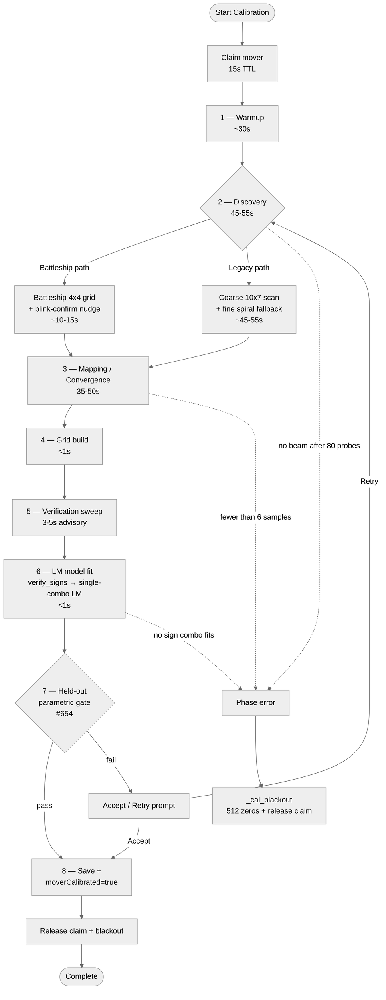
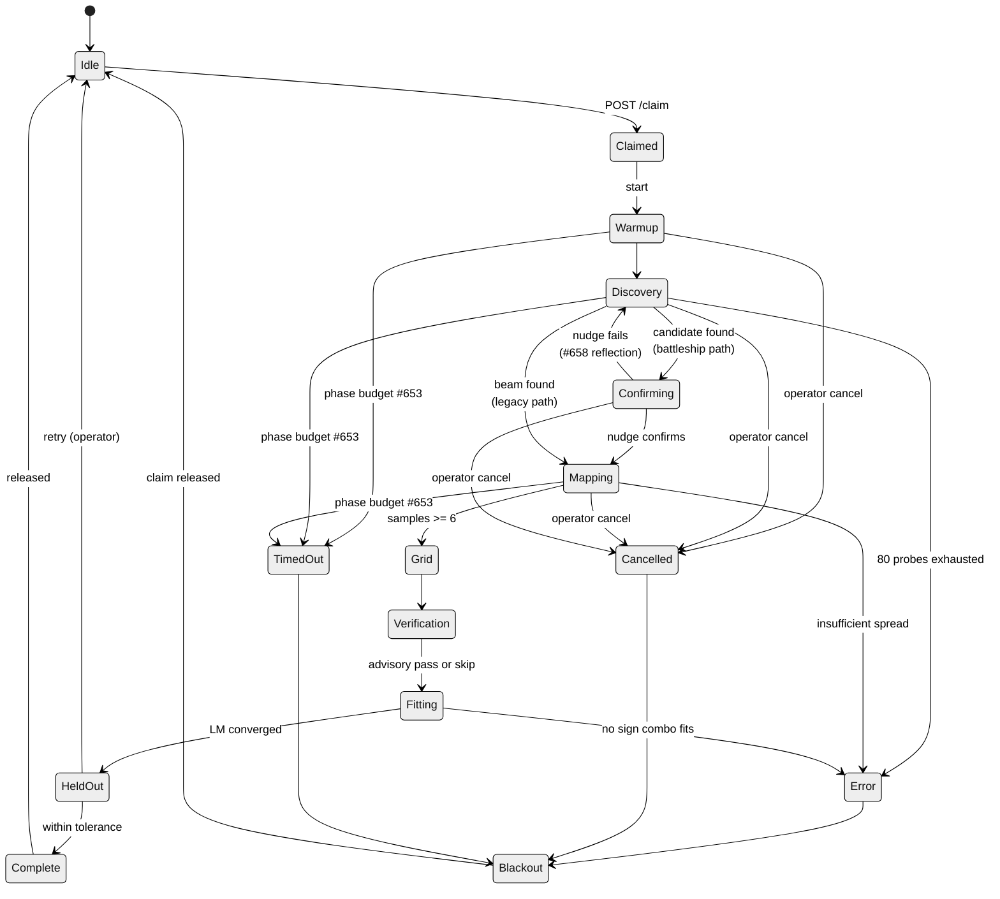
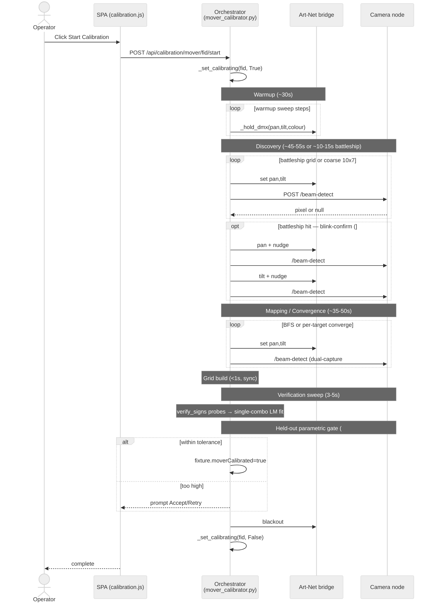

## Annexe B — Pipeline d'étalonnage de projecteur motorisé (EBAUCHE)

> ⚠ **EBAUCHE — suppose que tout le travail en vol est fusionné.** Cette annexe décrit le pipeline d'étalonnage des projecteurs motorisés comme si les issues #610, #651–#661, #653–#655, #658–#661 et #357 étaient entièrement implémentées. Certaines fonctionnalités documentées ci-dessous sont **partiellement fusionnées** aujourd'hui (notamment les budgets globaux de temps par phase par #653, le filtrage paramétrique tenu de côté complet du drapeau `moverCalibrated` par #654, la mise à l'échelle adaptative de densité battleship par #661 et le filtre polygonal de vue sol par #659). Voir `docs/DOCS_MAINTENANCE.md` pour le statut de fusion actuel et les critères de retrait de cette bannière. Issue [#662](https://github.com/SlyWombat/SlyLED/issues/662).

L'étalonnage de projecteur motorisé s'exécute par appareil projecteur motorisé [DMX](#glossary) après que la/les caméra(s) couvrant sa région atteignable ont été étalonnées (annexe A). Il produit un ensemble d'échantillons + un [modèle cinématique](#glossary) paramétrique à 6 [DOF](#glossary) qui permet à l'orchestrateur de traduire les cibles dans l'espace scène en valeurs DMX pan/tilt exactes, activant l'[IK](#glossary) (cinématique inverse) pour l'action Track et les effets spatiaux.

### B.1 Vue d'ensemble du pipeline

### B.2 Référence des phases

| # | Phase | Chaîne d'état | Durée typique | Progrès % | Repli en cas d'échec |
|---|-------|---------------|----------------|-----------|----------------------|
| 1 | Warmup | `warmup` | 30 s (configurable via `warmupSeconds`) | 2–8 | Journaliser un avertissement, continuer sans warmup |
| 2 | Découverte (legacy) | `discovery` | 45–55 s | 10–30 | Abandonner avec statut `error` après 80 sondes |
| 2′ | Découverte (battleship) | `battleship` → `confirming` | 10–15 s | 10–25 | Abandonner avec `error` ; peut basculer sur la découverte legacy |
| 3 | Cartographie (BFS legacy) | `mapping` | 35–50 s | 35–70 | Abandonner si <6 échantillons |
| 3′ | Convergence (v2) | `sampling` | 30–60 s (N cibles × ~1 s chacune) | 30–70 | Abandonner si la convergence échoue sur plusieurs cibles |
| 4 | Construction de grille | `grid` | <1 s | ~80 | Abandonner si dispersion d'échantillons insuffisante |
| 5 | Balayage de vérification | `verification` | 3–5 s (3 points tenus de côté) | ~90 | **Consultatif seulement** — ne bloque pas la sauvegarde |
| 6 | Ajustement du modèle (LM) | `fitting` | <1 s | 85–95 | verify_signs d'abord → LM à combinaison unique ; repli complet à quatre combinaisons si une sonde de signe rate |
| 7 | Porte paramétrique tenue de côté (#654) | `holdout` | 2–5 s (N cibles non vues) | 95–98 | Présenter une invite Accept/Retry |
| 8 | Sauvegarde | `complete` | <1 s | 100 | Erreur d'écriture journalisée mais n'affecte pas le drapeau moverCalibrated |

Statuts supplémentaires de haut niveau : `cancelled`, `error`, `done`.

### B.3 Détail phase par phase

#### 1. Warmup

- **Objet** — faire cycler l'appareil sur toute la plage pan/tilt pour que les courroies des moteurs soient thermiquement et mécaniquement stabilisées avant que les mesures ne commencent. Réduit les artefacts de jeu dans les premiers échantillons.
- **Préconditions** — profil DMX valide sur l'appareil ; moteur Art-Net en marche ; verrou d'étalonnage engagé.
- **Durée attendue** — 30 s par défaut (paramètre `warmupSeconds`). Six sous-balayages (pan±, tilt±, deux diagonales) × 20 pas chacun, ~0,25 s par pas.
- **Attente opérateur** — le faisceau balaie visiblement la scène ; la barre de progression passe de 2 % à 8 %.
- **Repli** — si le warmup lève une exception, journaliser un avertissement et passer ; l'étalonnage continue.
- **Annulation** — `_check_cancel()` à l'intérieur de chaque boucle `_hold_dmx` lève `CalibrationAborted`.

#### 2. Découverte

Deux chemins de code existent. Le chemin battleship est préféré quand l'homographie caméra est fiable ; le chemin legacy est le repli quand l'homographie est indisponible (p. ex. pas de marqueurs relevés visibles).

**Battleship (préféré, statut `battleship` + `confirming`) :**

- Grille grossière 4×4 aux centres de bin pan/tilt `{0,125, 0,375, 0,625, 0,875}²` — 16 sondes. Par #661, la densité de grille s'adapte à la plage de pan et à la largeur de faisceau attendue ; par défaut 4×4 mais peut se réduire à 3×3 ou s'étendre à 5×5 pour les appareils à large pan.
- Sur le premier candidat pixel détecté, exécuter la routine **blink-confirm** (#658) : nudger pan de `confirm_nudge_delta` (≈ 0,02 de la plage pleine) et vérifier que le pixel détecté bouge ; nudger tilt de même. Si les **deux** deltas pixel dépassent `min_delta`, le candidat est confirmé. Sinon, c'était un reflet et il est rejeté — la découverte reprend.
- **Durée attendue** 10–15 s (16 sondes × 0,6 s de settle, plus 4 nudges × 0,6 s quand un candidat hit).
- **Repli en cas d'échec** — retomber sur le chemin legacy coarse+spiral, ou abandonner à `error`.

**Legacy (statut `discovery`) :**

- Sonde initiale à la visée de démarrage à chaud (prédiction du modèle ou estimation géométrique d'après le FOV caméra).
- Grille grossière 10×7 : bins pan `0,02 + 0,96·i/9`, bins tilt `0,1 + 0,85·j/6` — 70 sondes. Chaque sonde passe par `_wait_settled`, qui réutilise la même machinerie de settle adaptatif (`SETTLE_BASE = 0,4 s` avec escalade `[0,4, 0,8, 1,5] s`) que la phase de cartographie — pas une constante `SETTLE` fixe séparée.
- Si le balayage grossier rate, spiraler vers l'extérieur depuis la visée de démarrage à chaud en coquilles rectangulaires à `STEP = 0,05`, jusqu'à `MAX_PROBES = 80` sondes totales.
- **Durée attendue** — 45–55 s dans le pire cas.
- **Repli en cas d'échec** — abandonner avec `error` ; appeler `_cal_blackout()`.

**Attentes opérateur** — le faisceau balaie à travers une grille visible de positions. Si le faisceau atterrit clairement là où la caméra peut le voir mais que la détection échoue, vérifiez la référence obscure §A.5 et la configuration du filtre colorimétrique §A.8.

#### 3. Cartographie (BFS legacy) / Convergence (v2)

**BFS legacy (statut `mapping`) :**

- BFS depuis la graine découverte `(pan, tilt, pixel)`. Chaque pas détecte le faisceau et, en cas de succès, met en file d'attente quatre voisins (haut/bas/gauche/droite par `STEP`). La perte du faisceau marque la cellule courante comme une frontière de région visible ; les détections obsolètes (où le pixel bouge à peine malgré un grand delta pan/tilt) sont rejetées comme bruit.
- Le settle adaptatif (#655) met à l'échelle le temps de settle par sonde selon la distance de mouvement, avec des niveaux d'escalade `[0,4, 0,8, 1,5] s`. La double capture avec un écart de vérification de 0,2 s et un seuil de dérive de 30 pixels filtre les images en cours de mouvement ; le filtrage médian sur la paire de captures rejette les valeurs aberrantes.
- **Cibles** — `_map_target = 50` échantillons (minimum dur 6 ; borné par `MAX_SAMPLES = 80`).
- **Durée attendue** — 35–50 s.

**Convergence v2 (statut `sampling`) :**

- Pour chaque cible issue de `pick_calibration_targets` (filtrée à travers le polygone de vue sol caméra par #659), faire converger le faisceau sur le pixel cible via `converge_on_target_pixel`.
- **Raffinement par bracket-and-retry (#660)** — `bracket_step = 0,08` initial. Quand le faisceau est perdu, diviser par deux le pas et revenir vers le meilleur offset connu dans la direction de l'erreur. `BRACKET_FLOOR` dépend maintenant du fixture : `1 / (2^pan_bits − 1)` — environ `0,0039` en pan 8 bits et `0,0000153` en 16 bits, donc la boucle s'épuise à la résolution DMX réelle du fixture plutôt qu'à l'ancien plancher `1/255` réservé au 8 bits (#679). Réinitialiser `bracket_step` à 0,08 à la ré-acquisition du faisceau. Convergence typique : 5–10 itérations ; max 25.
- **Durée attendue** — 30–60 s (N cibles × ~1 s chacune).

**Repli** — si moins de 6 échantillons sont collectés, abandonner avec `error`.

#### 4. Construction de grille

- Pur calcul : extraire les valeurs pan/tilt uniques des échantillons, trier, remplissage au plus proche voisin pour les cellules manquantes.
- **Durée attendue** — <100 ms, pas d'I/O.
- **Repli** — si la dispersion d'échantillons est insuffisante pour former une grille, abandonner avec `error`.

#### 5. Balayage de vérification

- Choisir 3 cibles aléatoires dans les limites de la grille, en évitant les échantillons d'ajustement d'une marge ≥0,05 pan/tilt, avec un rétrécissement intérieur de 10 % pour esquiver les bords d'interpolation faibles.
- Pour chacune : prédire le pixel via recherche dans la grille, détecter le faisceau réel, calculer l'erreur pixel.
- **Durée attendue** — 3–5 s (3 × ~1 s settle+détection).
- **Consultatif seulement** — journalise un avertissement si un point échoue ; ne **bloque pas** la sauvegarde.

#### 6. Ajustement du modèle (paramétrique, Levenberg-Marquardt)

- **La vérification de signes (#652 / §8.1) s'exécute AVANT l'ajustement LM.** Juste après que la découverte renvoie `(pan, tilt, pixel)`, le thread émet deux sondes supplémentaires (`pan + 0,02`, `tilt + 0,02`) et appelle `verify_signs` sur les deltas pixel pour calculer `(pan_sign, tilt_sign)`. Ces signes alimentent `fit_model(..., force_signs=(ps, ts))` de sorte que la LM n'effectue **qu'un seul** ajustement au lieu de quatre.
- Repli — si une sonde de signe ne détecte pas de faisceau, `force_signs` reste `None` et `fit_model` exécute la recherche complète à quatre combinaisons et choisit le candidat de plus faible RMS.
- Lorsque les deux meilleurs candidats s'accordent à 0,2° RMS près ET que l'appelant n'a pas fourni `force_signs`, `FitQuality.mirror_ambiguity` est mis à True et exposé par l'endpoint de statut (#679) afin que l'UI puisse marquer la calibration pour un nouvel essai manuel.
- `scipy.optimize.least_squares` avec perte `soft_l1` (`f_scale=0.05`) ajuste cinq paramètres continus (mount yaw/pitch/roll + offsets pan/tilt) ; jusqu'à 120 itérations.
- **Durée attendue** — <1 s au total (verify_signs + ajustement LM unique).
- **Repli** — si les 4 combinaisons ne convergent pas, lever `RuntimeError` ; l'appelant abandonne avec `error`.

#### 7. Porte paramétrique tenue de côté (#654)

- Après ajustement, piloter l'appareil vers 2–3 cibles **non vues** (non utilisées en découverte, cartographie ou vérification) et mesurer le résidu au niveau pixel contre la prédiction du modèle.
- Si le résidu est dans la tolérance, définir `fixture["moverCalibrated"] = True`.
- Si le résidu dépasse la tolérance, renvoyer le résultat au SPA comme invite Accept/Retry : l'opérateur peut accepter (drapeau toujours défini, marqué comme dégradé) ou relancer l'étalonnage depuis la découverte.
- **Durée attendue** — 2–5 s.

#### 8. Sauvegarde + libération

- Persister `samples`, dictionnaire `model`, métriques `fitQuality` et métadonnées par phase dans `desktop/shared/data/fixtures.json`.
- Définir `fixture["moverCalibrated"] = True` (si pas déjà fait).
- Libérer le verrou d'étalonnage via `_set_calibrating(fid, False)` — le moteur mover-follow reprend l'écriture pan/tilt.
- Blackout de l'appareil.

### B.4 Budget de temps + blackout-sur-timeout (#653)

Chaque phase a un budget horloge par phase. S'il est dépassé, la phase lève `PhaseTimeout`, interceptée par le thread d'étalonnage de haut niveau, qui alors :

1. Appelle `_cal_blackout()` — envoie 512 zéros à l'univers de l'appareil pendant 0,3 s.
2. Libère le verrou d'étalonnage.
3. Définit `job["status"] = "error"`, `job["phase"] = "<phase>_timeout"`.
4. Signale `tier-2 handoff` dans le dict de statut afin que le SPA puisse suggérer le niveau de diagnostic suivant.

Budgets par défaut (peuvent être écrasés par appareil via `calibrationBudgets` dans les paramètres) :

| Phase | Budget par défaut |
|-------|-------------------|
| Warmup | 60 s |
| Découverte | 120 s |
| Cartographie / Convergence | 180 s |
| Construction de grille | 10 s |
| Balayage de vérification | 30 s |
| Ajustement du modèle | 15 s |
| Porte tenue de côté | 30 s |

Budget total par défaut : ~7,5 min, bien au-dessus du temps d'exécution typique de 2–4 min.

### B.5 Chemin d'annulation

L'annulation peut provenir de trois sources : opérateur (`POST /api/calibration/mover/<fid>/cancel`), timeout de phase (§B.4) ou exception non gérée. Les trois convergent vers le même nettoyage :

1. **Blackout immédiat au premier plan** (initié par l'opérateur uniquement) : sur la requête `/cancel`, l'orchestrateur met à zéro la fenêtre de canaux de l'appareil sur le tampon du moteur Art-Net en cours d'exécution au premier plan, afin que la prochaine image de 25 ms porte des zéros au pont — l'opérateur voit la lumière s'éteindre immédiatement.
2. **Remontée en arrière-plan** : le thread d'étalonnage définit `_cancel_event`, que `_check_cancel()` à l'intérieur de `_hold_dmx` capte et lève `CalibrationAborted`. L'exception se propage à `_mover_cal_thread`, qui la capture, appelle `_cal_blackout()` (512 zéros + libération), définit `status = "cancelled"`, `phase = "cancelled"`.
3. **Libération du verrou** — `_set_calibrating(fid, False)` est toujours appelé dans le nettoyage, indépendamment du chemin qui a déclenché l'annulation.

### B.6 Modes d'échec et diagnostics opérateur

| Symptôme | Cause probable | Quoi vérifier / essayer |
|----------|----------------|-------------------------|
| La découverte termine 80 sondes sans trouver de faisceau | Faisceau trop faible, la caméra ne le voit pas, mauvaise couleur, projecteur motorisé pas réellement allumé | Vérifiez que l'appareil est alimenté et répond ; augmentez le seuil ; exécutez le Test d'orientation d'appareil (§14) ; vérifiez la configuration colorimétrique §A.8 ; tamisez les lumières de la salle |
| La découverte trouve le faisceau immédiatement mais blink-confirm rejette toujours | Surface réfléchissante (miroir, verre, sol poli) détectée au lieu du faisceau | Ajoutez un matériau diffus sur le réflecteur ; choisissez une autre couleur de faisceau ; éloignez la visée de démarrage à chaud du projecteur du réflecteur |
| Cartographie / convergence abandonne avec « fewer than 6 samples » | La frontière BFS est trop étroite — la caméra ne voit qu'une petite tranche de la plage pan/tilt | Repositionnez la caméra pour voir plus du sol ; augmentez le nombre de caméras ; vérifiez que la position du projecteur motorisé dans la disposition correspond à la réalité |
| Le drapeau `moverCalibrated` ne se définit jamais | La porte tenue de côté échoue | Vérifiez l'invite Accept/Retry ; si un résidu est rapporté, un Accept conserve le drapeau mais le marque dégradé ; un Retry complet redémarre depuis la découverte |
| La vérification de signes journalise une ambiguïté miroir | L'ajustement voit deux combinaisons de signes également bonnes | Vérifiez la direction physique pan/tilt du projecteur motorisé contre le Test d'orientation d'appareil §14 ; il peut être nécessaire de basculer les drapeaux Invert Pan/Tilt ou Swap Pan/Tilt |
| L'étalonnage « se bloque » à une phase | Budget de phase (#653) pas encore déclenché ; ou moteur Art-Net arrêté en cours d'exécution | Attendez jusqu'au budget de phase ; vérifiez que le moteur est en marche (`POST /api/dmx/start` sinon) ; si toujours bloqué, annulez et consultez le log de l'orchestrateur |
| La lumière clignote brièvement puis s'arrête, le statut reste `running` | L'annulation au premier plan s'est produite mais le thread d'arrière-plan se déroule encore | Normal ; le nettoyage d'arrière-plan se termine en 1–2 s |

### B.7 Référence des paramètres de réglage

Constantes dans `desktop/shared/mover_calibrator.py` :

| Constante | Défaut | Rôle |
|-----------|--------|------|
| `SETTLE` (legacy) | 0,6 s | Settle par sonde avant détection |
| `SETTLE_BASE` (#655) | 0,4 s | Base de settle adaptatif avant escalade |
| `SETTLE_ESCALATION` | `[0.4, 0.8, 1.5]` s | Niveaux d'escalade sur retry de dérive pixel |
| `SETTLE_VERIFY_GAP` | 0,2 s | Espacement de double capture pour filtre médian |
| `SETTLE_PIXEL_THRESH` | 30 px | Seuil de dérive inter-capture pour « settled » |
| `STEP` | 0,05 | Pas fin de spirale (pan/tilt normalisé) |
| `MAX_SAMPLES` | 80 | Plafond dur sur les échantillons BFS |
| `COARSE_PAN` | 10 | Bins pan de grille grossière legacy |
| `COARSE_TILT` | 7 | Bins tilt de grille grossière legacy |
| `BRACKET_FLOOR` | `1 / (2^pan_bits − 1)` | Plancher de raffinement de convergence — dépend du fixture (8 bits → `≈0,0039`, 16 bits → `≈0,0000153`) (#679) |

Constantes dans `desktop/shared/mover_control.py` :

| Constante | Défaut | Rôle |
|-----------|--------|------|
| Claim TTL | 15 s | Libération automatique si la réservation n'est pas rafraîchie |

### B.8 Fonctionnalités associées

- **Contrôle unifié des projecteurs motorisés** — voir CLAUDE.md §« Unified mover control (gyro + Android) ». L'étalonnage doit être complet et `moverCalibrated` doit être défini avant que le mover-control manuel (gyro/téléphone) n'utilise le modèle paramétrique ; sans cela, la couche de contrôle se replie sur le passthrough DMX pan/tilt brut.
- **Test d'orientation d'appareil** — §14 « Fixture Orientation Test ». Exécutez-le d'abord si les axes pan/tilt du projecteur physique ne correspondent pas aux attentes.
- **Action Track** — §8 « Track Action ». Consomme la grille d'interpolation + le modèle paramétrique pour viser des sujets mobiles.

---

